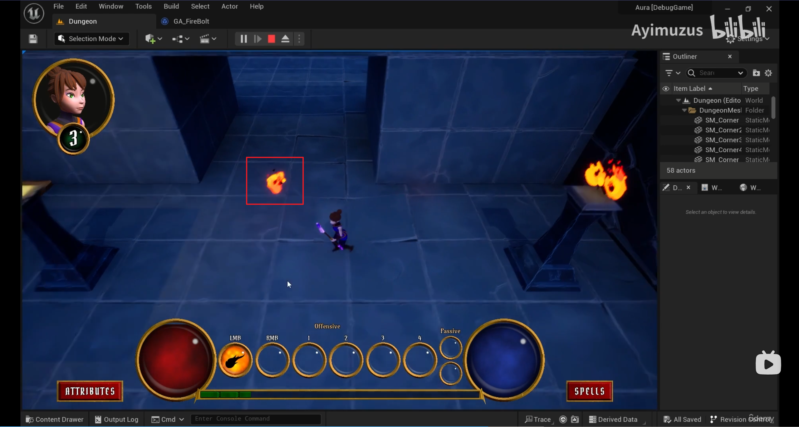

___________________________________________________________________________________________
###### [Go主菜单](../MainMenu.md)
___________________________________________________________________________________________

# GAS 156 敌人死亡时（Mesh开启模拟物理后）将Mesh沿火球方向击飞（结构体和 `Context` 携带击飞方向）；使用GA的Tag打断制作：Debuff不会触发受击GA

___________________________________________________________________________________________

## 处理关键点

1. 当Mesh开启物理模拟后，对Mesh施加一个方向力
    - 在Mesh上调用 `Addlmpulse()`
2. 文件之间的依赖关系？了解下
3. GA中技能之间的相互阻挡和打断配置
4. 授予标签底层源码如何实现？（也就是持续GE应用Tag时添加的Tag在这个容器里）`Inheritable0wnedTagsContainer`

___________________________________________________________________________________________

# 目录

- [GAS 156 敌人死亡时（Mesh开启模拟物理后）将Mesh沿火球方向击飞（结构体和 `Context` 携带击飞方向）；使用GA的Tag打断制作：Debuff不会触发受击GA](#gas-156-敌人死亡时mesh开启模拟物理后将mesh沿火球方向击飞结构体和-context-携带击飞方向使用ga的tag打断制作debuff不会触发受击ga)
  - [处理关键点](#处理关键点)
- [目录](#目录)
    - [Mermaid整体思路梳理](#mermaid整体思路梳理)
    - [当角色死亡时，希望对敌人施加一个方向力，使敌人在死亡时，沿着特定方向被击飞（比如敌人死亡时，被打飞到墙上，然后弹到地面上），实现布娃娃系统](#当角色死亡时希望对敌人施加一个方向力使敌人在死亡时沿着特定方向被击飞比如敌人死亡时被打飞到墙上然后弹到地面上实现布娃娃系统)
      - [GA中创建变量](#ga中创建变量)
      - [火球携带的结构体中，也需要携带](#火球携带的结构体中也需要携带)
      - [为结构体赋值时，也需要设置](#为结构体赋值时也需要设置)
    - [下一节](#下一节)
    - [这一节，我们将在 `Context` 中携带 `击飞力的方向`](#这一节我们将在-context-中携带-击飞力的方向)
      - [`Context` 中创建 `击飞力的方向` 变量](#context-中创建-击飞力的方向-变量)
      - [网络序列化函数中需要设置](#网络序列化函数中需要设置)
        - [`FVector` 网络序列化时 `不用创建智能指针` ，直接调用网络序列化函数即可](#fvector-网络序列化时-不用创建智能指针-直接调用网络序列化函数即可)
    - [当火球与目标重叠后，就会应用GE，这之后就无法改变 `Context` 了](#当火球与目标重叠后就会应用ge这之后就无法改变-context-了)
      - [需要在这里设置结构体，并在下面应用GE时使用结构体中的参数，所以需要结构体携带该变量（击飞力的方向）](#需要在这里设置结构体并在下面应用ge时使用结构体中的参数所以需要结构体携带该变量击飞力的方向)
        - [结构体携带该变量](#结构体携带该变量)
        - [在重叠时，使用火球的 `ForwardVector * 击飞力的大小` 设置结构体中的参数](#在重叠时使用火球的-forwardvector--击飞力的大小-设置结构体中的参数)
    - [接下来，要在AS中使用获取 `Context` 中的 击飞力的方向和大小](#接下来要在as中使用获取-context-中的-击飞力的方向和大小)
      - [我们之前是在 `AuraAbilityTypes` 中创建了 `Get` 和 `Set` 的函数，然后在蓝图函数库中创建静态函数](#我们之前是在-auraabilitytypes-中创建了-get-和-set-的函数然后在蓝图函数库中创建静态函数)
      - [`AuraAbilityTypes` 中创建 `Get` 和 `Set` 的函数](#auraabilitytypes-中创建-get-和-set-的函数)
      - [蓝图函数库中创建](#蓝图函数库中创建)
      - [在使用结构体应用GE的函数中，设置 `击飞力的方向`](#在使用结构体应用ge的函数中设置-击飞力的方向)
        - [这样在应用前，设置结构体的击飞力的方向，然后应用GE时，设置上下文携带的击飞力的方向，然后就可以在AS中拿到了](#这样在应用前设置结构体的击飞力的方向然后应用ge时设置上下文携带的击飞力的方向然后就可以在as中拿到了)
    - [下一节，敌人死亡时获取并设置击飞方向](#下一节敌人死亡时获取并设置击飞方向)
    - [小测试1](#小测试1)
    - [自己尝试一下](#自己尝试一下)
      - [使用接口来做](#使用接口来做)
        - [可以添加一个形参，传入死亡时的击飞力](#可以添加一个形参传入死亡时的击飞力)
        - [所有引用都需要修改](#所有引用都需要修改)
      - [在敌人死亡的 `RPC_Client` 函数中，处理对Mesh的操作，所以给函数加一个形参，传参到 `RPC_Client` 函数中处理会更方便一些](#在敌人死亡的-rpc_client-函数中处理对mesh的操作所以给函数加一个形参传参到-rpc_client-函数中处理会更方便一些)
        - [`RPC_Client` 函数中添加形参](#rpc_client-函数中添加形参)
      - [在敌人死亡时，对Mesh应用击飞力](#在敌人死亡时对mesh应用击飞力)
      - [AS中，死亡时，传递 `Context` 中的击飞力方向](#as中死亡时传递-context-中的击飞力方向)
    - [此时运行测试，结果并不明显](#此时运行测试结果并不明显)
      - [断点测试一下](#断点测试一下)
      - [先暂时关闭Debuff](#先暂时关闭debuff)
    - [运行测试，有力，但是太小了，几乎看不出来](#运行测试有力但是太小了几乎看不出来)
      - [击飞力设为6000测试](#击飞力设为6000测试)
      - [有个问题：武器击飞了，人没有飞](#有个问题武器击飞了人没有飞)
    - [看一下 `Addlmpulse()` 的参数（在施加力的时候可以忽略其质量）](#看一下-addlmpulse-的参数在施加力的时候可以忽略其质量)
    - [运行测试](#运行测试)
      - [不明显设为18000](#不明显设为18000)
      - [测试gif](#测试gif)
    - [武器使用Mesh1/10的力](#武器使用mesh110的力)
    - [测试gif](#测试gif-1)
    - [敌人如果因为Debuff死亡，则不会被击飞（这个项目这么设计），所以恢复敌人正常Debuff概率](#敌人如果因为debuff死亡则不会被击飞这个项目这么设计所以恢复敌人正常debuff概率)
    - [测试，敌人因为Debuff死亡，不会被击飞](#测试敌人因为debuff死亡不会被击飞)
    - [测试过后，将火球的Debuff伤害设置为调低些，不用太高，可以根据等级提升伤害](#测试过后将火球的debuff伤害设置为调低些不用太高可以根据等级提升伤害)
    - [这是有一个bug：敌人死后还有一些NS组件没有停止激活](#这是有一个bug敌人死后还有一些ns组件没有停止激活)
      - [看一下激活的逻辑](#看一下激活的逻辑)
        - [应该在角色没有死亡时才激活，死亡后只可以停止](#应该在角色没有死亡时才激活死亡后只可以停止)
    - [还有一个事情要处理：现在当敌人中了Debuff效果后，会(持续)触发受击技能（无法移动），不想要这样，想让Debuff不触发受击技能](#还有一个事情要处理现在当敌人中了debuff效果后会持续触发受击技能无法移动不想要这样想让debuff不触发受击技能)
    - [可以使用 GAS 的 `GA` 中的 阻挡 `FGameplayTag`](#可以使用-gas-的-ga-中的-阻挡-fgameplaytag)
      - [在受击GA中配置，阻挡火焰的 `DebuffTag`](#在受击ga中配置阻挡火焰的-debufftag)
    - [运行测试gif](#运行测试gif)
    - [授予标签底层源码（也就是持续GE应用Tag时添加的Tag在这个容器里）(现在5.3这里已经修改了)](#授予标签底层源码也就是持续ge应用tag时添加的tag在这个容器里现在53这里已经修改了)

___________________________________________________________________________________________

视频链接

[10. Death Impulse Magnitude_哔哩哔哩_bilibili](https://www.bilibili.com/video/BV1TH4y1L7NP/?p=110&spm_id_from=pageDriver&vd_source=9e1e64122d802b4f7ab37bd325a89e6c)

[11. Death Impulse in the Effect Context_哔哩哔哩_bilibili](https://www.bilibili.com/video/BV1TH4y1L7NP/?p=111&spm_id_from=pageDriver&vd_source=9e1e64122d802b4f7ab37bd325a89e6c)

[12. Handling Death Impulse_哔哩哔哩_bilibili](https://www.bilibili.com/video/BV1TH4y1L7NP/?p=112&spm_id_from=pageDriver&vd_source=9e1e64122d802b4f7ab37bd325a89e6c)

------

___________________________________________________________________________________________

### Mermaid整体思路梳理

Mermaid

___________________________________________________________________________________________

### 当角色死亡时，希望对敌人施加一个方向力，使敌人在死亡时，沿着特定方向被击飞（比如敌人死亡时，被打飞到墙上，然后弹到地面上），实现布娃娃系统

  - 需要在GA中携带：
    - 击飞力的大小

  - 火球携带的结构体中，也需要携带

    - 击飞力的大小

    - 击飞力的方向

  -  `Context` 中需要携带：
    - 击飞力的方向

------

#### GA中创建变量

  - 命名为，`DeathImpulseMagnitude`
>

------

#### 火球携带的结构体中，也需要携带

  - 命名为，`DeathImpulseMagnitude`
>

------

#### 为结构体赋值时，也需要设置
>

------

### 下一节

------

### 这一节，我们将在 `Context` 中携带 `击飞力的方向`

------

####  `Context` 中创建 `击飞力的方向` 变量

  - 命名为，`DeathImpulse`
>

------

#### 网络序列化函数中需要设置
>
>
>

------

##### `FVector` 网络序列化时 `不用创建智能指针` ，直接调用网络序列化函数即可

------

### 当火球与目标重叠后，就会应用GE，这之后就无法改变 `Context` 了
>

------

#### 需要在这里设置结构体，并在下面应用GE时使用结构体中的参数，所以需要结构体携带该变量（击飞力的方向）

------

##### 结构体携带该变量
>

------

##### 在重叠时，使用火球的 `ForwardVector * 击飞力的大小` 设置结构体中的参数
>

------

### 接下来，要在AS中使用获取 `Context` 中的 击飞力的方向和大小

------

#### 我们之前是在 `AuraAbilityTypes` 中创建了 `Get` 和 `Set` 的函数，然后在蓝图函数库中创建静态函数
>

------

####  `AuraAbilityTypes` 中创建 `Get` 和 `Set` 的函数
>

------

#### 蓝图函数库中创建
>
>
>

------

#### 在使用结构体应用GE的函数中，设置 `击飞力的方向`
>

------

##### 这样在应用前，设置结构体的击飞力的方向，然后应用GE时，设置上下文携带的击飞力的方向，然后就可以在AS中拿到了

------

### 下一节，敌人死亡时获取并设置击飞方向
>

------

### 小测试1

  - 在死亡时，对敌人施加击飞力

  - 小提示：可以在敌人的Mesh上调用 `Addlmpulse()`

  - 不要在不应该存在的地方建立不必要的依赖关系!不希望所说的属性依赖于基本字符或类似的东西,
>

------

### 自己尝试一下

------

#### 使用接口来做

- 之前有一个死亡的函数
>

------

##### 可以添加一个形参，传入死亡时的击飞力
>

------

##### 所有引用都需要修改

------

#### 在敌人死亡的 `RPC_Client` 函数中，处理对Mesh的操作，所以给函数加一个形参，传参到 `RPC_Client` 函数中处理会更方便一些
>

------

#####  `RPC_Client` 函数中添加形参
>

------

#### 在敌人死亡时，对Mesh应用击飞力
>

------

#### AS中，死亡时，传递 `Context` 中的击飞力方向
>

------

### 此时运行测试，结果并不明显

------

#### 断点测试一下
>

- 发现，当敌人死于Debuff伤害时，不会触发击飞

------

#### 先暂时关闭Debuff
>

------

### 运行测试，有力，但是太小了，几乎看不出来

------

#### 击飞力设为6000测试
>

------

#### 有个问题：武器击飞了，人没有飞
>

------

### 看一下 `Addlmpulse()` 的参数（在施加力的时候可以忽略其质量）
>

------

### 运行测试
------

#### 不明显设为18000
>

------

#### 测试gif
>

------

### 武器使用Mesh1/10的力
>

------

### 测试gif
>

------

### 敌人如果因为Debuff死亡，则不会被击飞（这个项目这么设计），所以恢复敌人正常Debuff概率
>

------

### 测试，敌人因为Debuff死亡，不会被击飞
>- 临时测试用参数（别忘了改回来！）
>
>
>
>

------

### 测试过后，将火球的Debuff伤害设置为调低些，不用太高，可以根据等级提升伤害
>

------

### 这是有一个bug：敌人死后还有一些NS组件没有停止激活
>

- 应该是在不该被激活的时候激活了

------

#### 看一下激活的逻辑
>

------

##### 应该在角色没有死亡时才激活，死亡后只可以停止
>

------

### 还有一个事情要处理：现在当敌人中了Debuff效果后，会(持续)触发受击技能（无法移动），不想要这样，想让Debuff不触发受击技能

------

### 可以使用 GAS 的 `GA` 中的 阻挡 `FGameplayTag`

------

#### 在受击GA中配置，阻挡火焰的 `DebuffTag`
>

------

### 运行测试gif
>

------

### 授予标签底层源码（也就是持续GE应用Tag时添加的Tag在这个容器里）(现在5.3这里已经修改了)
>
>
___________________________________________________________________________________________

[返回最上面](#Go主菜单)

___________________________________________________________________________________________