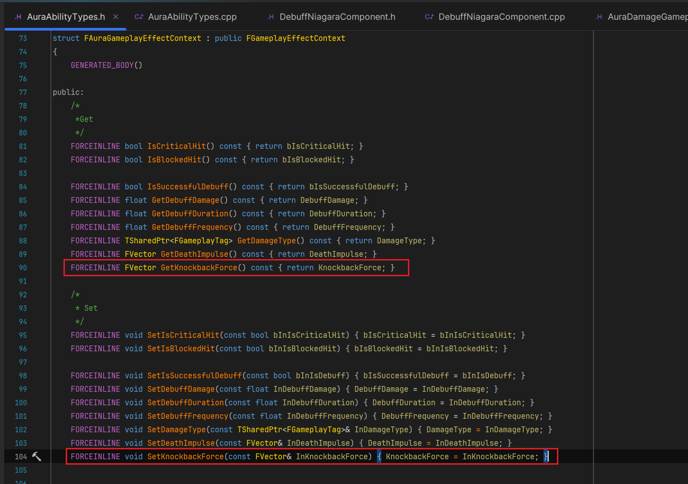
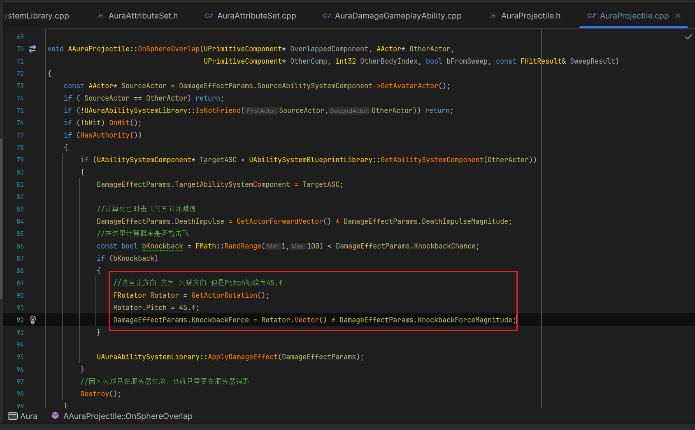
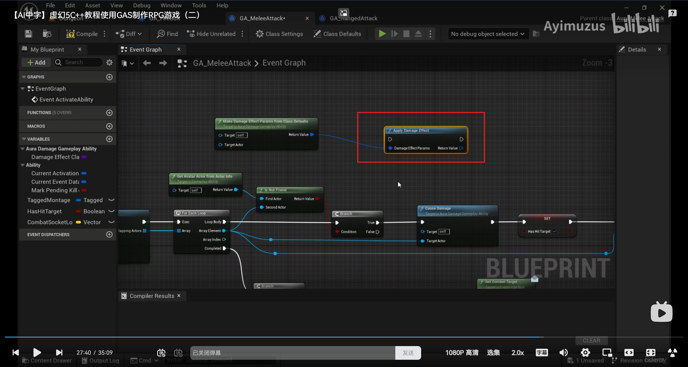
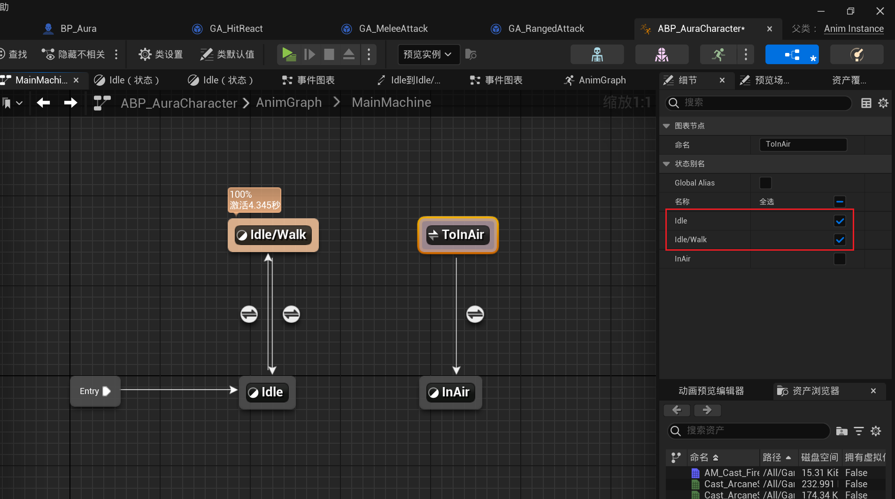

___________________________________________________________________________________________
###### [Go主菜单](../MainMenu.md)
___________________________________________________________________________________________

# GAS 157 为Aura和敌人创建攻击时击飞的攻击特效；为角色添加滞空动画；场景增加空气墙

___________________________________________________________________________________________

## 处理关键点

1. 角色动画蓝图中可以使用节点 `AddStateAlias` 整合多个连接
2. 想让没开启物理模拟的角色产生位移，要使用 `LaunchCharacter()` 而不是 `Addlmpulse()`
3. GA配置的参数，从GA到结构体到Context到AS的实现流程（GA通过Context传参到AS）

___________________________________________________________________________________________

# 目录


- [GAS 157 为Aura和敌人创建攻击时击飞的攻击特效；为角色添加滞空动画；场景增加空气墙](#gas-157-为aura和敌人创建攻击时击飞的攻击特效为角色添加滞空动画场景增加空气墙)
  - [处理关键点](#处理关键点)
- [目录](#目录)
    - [Mermaid整体思路梳理](#mermaid整体思路梳理)
    - [小测试1](#小测试1)
    - [自己尝试一下](#自己尝试一下)
      - [GA中创建可配置的参数](#ga中创建可配置的参数)
      - [结构体中创建三个变量](#结构体中创建三个变量)
      - [Context中，携带击退力的方向](#context中携带击退力的方向)
        - [设置网络序列化](#设置网络序列化)
        - [创建 `Get` 和 `Set` 的函数](#创建-get-和-set-的函数)
      - [蓝图函数库中创建 `Get` 和 `Set` 的函数](#蓝图函数库中创建-get-和-set-的函数)
      - [初始化结构体的函数中，设置参数](#初始化结构体的函数中设置参数)
      - [在重叠开始时，计算方向（角色的ForwardVector）设置参数](#在重叠开始时计算方向角色的forwardvector设置参数)
      - [应用GE 时，设置Context的击退力的方向](#应用ge-时设置context的击退力的方向)
      - [最后在AS中当击中且目标未死亡时，这个时候准备击飞，需要先判断下，力的大小是否大于1](#最后在as中当击中且目标未死亡时这个时候准备击飞需要先判断下力的大小是否大于1)
      - [到目前为止，只是同一水平面上的击退，如果想向上加一点击退角度](#到目前为止只是同一水平面上的击退如果想向上加一点击退角度)
        - [需要在设置角度，也就是重叠时，增加 `Pitch轴` 偏移](#需要在设置角度也就是重叠时增加-pitch轴-偏移)
      - [GA蓝图中概率调成100%测试一下](#ga蓝图中概率调成100测试一下)
    - [运行测试gif](#运行测试gif)
    - [这个时候有个问题：可以把敌人打飞，也就是说可以把敌人从某些边缘打下地图，所以需要空气墙BlockBox](#这个时候有个问题可以把敌人打飞也就是说可以把敌人从某些边缘打下地图所以需要空气墙blockbox)
    - [设置敌人的GA的击退力和概率](#设置敌人的ga的击退力和概率)
    - [此时运行测试，敌人并没有把玩家打飞](#此时运行测试敌人并没有把玩家打飞)
      - [因为，敌人调用的函数没有使用击退力](#因为敌人调用的函数没有使用击退力)
        - [看一下函数体，和现在使用结构体应用GE的函数比起来没太大差别](#看一下函数体和现在使用结构体应用ge的函数比起来没太大差别)
    - [需要将 `MakeDamageEffectParamsFromClassDefaults` 函数改成蓝图可调用，这样就能蓝图调用初始化参数的函数](#需要将-makedamageeffectparamsfromclassdefaults-函数改成蓝图可调用这样就能蓝图调用初始化参数的函数)
      - [除此之外，如果蓝图想修改参数，结构体中的参数也需要调整为蓝图可编辑](#除此之外如果蓝图想修改参数结构体中的参数也需要调整为蓝图可编辑)
    - [在初始化结构体的函数中，根据传入的Target是否有效，还可以计算目标的死亡击飞方向和普通攻击击飞方向](#在初始化结构体的函数中根据传入的target是否有效还可以计算目标的死亡击飞方向和普通攻击击飞方向)
    - [ApplyDamageEffect 本身就是蓝图可调用](#applydamageeffect-本身就是蓝图可调用)
    - [替换旧的逻辑](#替换旧的逻辑)
    - [运行测试gif](#运行测试gif-1)
    - [远程敌人应该也可以击飞玩家](#远程敌人应该也可以击飞玩家)
      - [gif](#gif)
    - [为Aura添加滞空动画](#为aura添加滞空动画)
      - [这里有一个知识点：动画蓝图中A和B都需要与C双向链接，这样看起来就会很乱](#这里有一个知识点动画蓝图中a和b都需要与c双向链接这样看起来就会很乱)
        - [可以使用节点 `AddStateAlias`](#可以使用节点-addstatealias)
    - [运行测试gif](#运行测试gif-2)
    - [实际上，对于游戏来说，大多数敌人的击退几率都是零](#实际上对于游戏来说大多数敌人的击退几率都是零)
    - [最后一件事，创建空气墙](#最后一件事创建空气墙)


___________________________________________________________________________________________

<details>
<summary>视频链接</summary>

[13. Knockback_哔哩哔哩_bilibili](https://www.bilibili.com/video/BV1TH4y1L7NP/?p=113&spm_id_from=pageDriver&vd_source=9e1e64122d802b4f7ab37bd325a89e6c)

------

</details>

___________________________________________________________________________________________

### Mermaid整体思路梳理

Mermaid

___________________________________________________________________________________________

### 小测试1

  - 模拟需求：
    - 项目经理走过来和你说：“希望你在敌人受击但是没有死亡时，触发一个击飞的效果，要击飞到空中，有一定的角度，关于击飞的概率是一个参数”

  - 提示：使用 `LaunchCharacter()` 而不是 `Addlmpulse()`
    - 因为这样无需开启模拟物理
>

------

### 自己尝试一下


------

#### GA中创建可配置的参数

  - 击退力的大小
    - `KnockbackForceMagnitude`

  - 击退概率
    - `KnockbackChance`
>

------

#### 结构体中创建三个变量

  - `KnockbackForceMagnitude`

  - `KnockbackChance`

  - `KnockbackForce`
>

------

#### Context中，携带击退力的方向

  - `KnockbackForce`
>

------

##### 设置网络序列化
>
>

------

##### 创建 `Get` 和 `Set` 的函数
>

------

#### 蓝图函数库中创建 `Get` 和 `Set` 的函数
>
>

------

#### 初始化结构体的函数中，设置参数
>

------

#### 在重叠开始时，计算方向（角色的ForwardVector）设置参数
>

------

#### 应用GE 时，设置Context的击退力的方向
>

------

#### 最后在AS中当击中且目标未死亡时，这个时候准备击飞，需要先判断下，力的大小是否大于1
>

------

#### 到目前为止，只是同一水平面上的击退，如果想向上加一点击退角度


------

##### 需要在设置角度，也就是重叠时，增加 `Pitch轴` 偏移
>

------

#### GA蓝图中概率调成100%测试一下
>

------

### 运行测试gif
>

------

### 这个时候有个问题：可以把敌人打飞，也就是说可以把敌人从某些边缘打下地图，所以需要空气墙BlockBox
>

------

### 设置敌人的GA的击退力和概率
>
>

------

### 此时运行测试，敌人并没有把玩家打飞


------

#### 因为，敌人调用的函数没有使用击退力
>

------

##### 看一下函数体，和现在使用结构体应用GE的函数比起来没太大差别
>
>

------

### 需要将 `MakeDamageEffectParamsFromClassDefaults` 函数改成蓝图可调用，这样就能蓝图调用初始化参数的函数
>

------

#### 除此之外，如果蓝图想修改参数，结构体中的参数也需要调整为蓝图可编辑
>

------

### 在初始化结构体的函数中，根据传入的Target是否有效，还可以计算目标的死亡击飞方向和普通攻击击飞方向
>```cpp
>if (IsValid(TargetActor))
>{
>    FRotator Rotation = ( TargetActor->GetActorLocation() - GetAvatarActorFromActorInfo()->GetActorLocation() ).Rotation();
>    Rotation.Pitch = 45.f;
>    const FVector ToTarget = Rotation.Vector();
>    Params.DeathImpulse = ToTarget * DeathImpulseMagnitude;
>    Params.KnockbackForce = ToTarget * KnockbackForceMagnitude;
>}
>```
>
>

------

### ApplyDamageEffect 本身就是蓝图可调用
>

------

### 替换旧的逻辑
>
>
>

------

### 运行测试gif

  - 敌人可以击飞玩家了
------

### 远程敌人应该也可以击飞玩家
>

------

#### gif
>

- 当玩家在空中时，没有动画


------

### 为Aura添加滞空动画
>

------

#### 这里有一个知识点：动画蓝图中A和B都需要与C双向链接，这样看起来就会很乱
>

------

##### 可以使用节点 `AddStateAlias`
>
>
>
>
>
>
>

------

### 运行测试gif
>

------

### 实际上，对于游戏来说，大多数敌人的击退几率都是零

  - 所以别忘了，恢复敌人的击退概率
>
>

  - Aura的比敌人稍微多一些
>

------

### 最后一件事，创建空气墙
>
>
>
___________________________________________________________________________________________

[返回最上面](#Go主菜单)

___________________________________________________________________________________________