___________________________________________________________________________________________
###### [Go主菜单](../MainMenu.md)
___________________________________________________________________________________________

# GAS 158 在火球子类上重构生成火球逻辑；设计根据技能范围和火球数量计算生成角度

___________________________________________________________________________________________

# 目录


[TOC]


___________________________________________________________________________________________

<details>
<summary>视频链接</summary>

[1. FireBolt Projectile Spread_哔哩哔哩_bilibili](https://www.bilibili.com/video/BV1TH4y1L7NP?p=114&vd_source=9e1e64122d802b4f7ab37bd325a89e6c)

------

</details>

___________________________________________________________________________________________

### Mermaid整体思路梳理

Mermaid

___________________________________________________________________________________________

### 这一节，我们需要修改火球技能，在子类上重构，适配更多的技能扩展（比如升级技能后，出现更多的火球攻击敌人，火球可以简单追踪敌人，并且有重力下坠效果）
>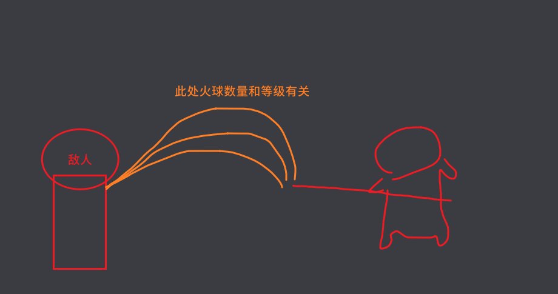
>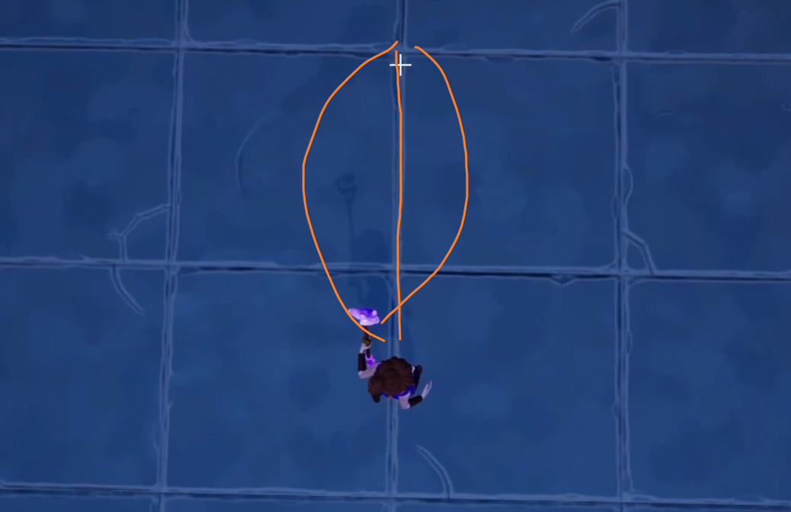


------

### 首先需要计算火球发射时的角度

- 之前在 `AuraProjectileSpell` 中为创建火球制作了函数，有三个参数分别是：

  - 1.目标位置（终点）

  - 2.插槽Tag（起点）

  - 3.Pitch角度偏移

- 这一点我和视频中的不太一样，视频中是四个
>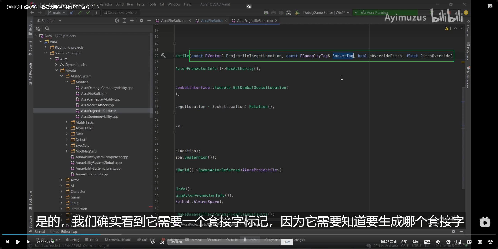
>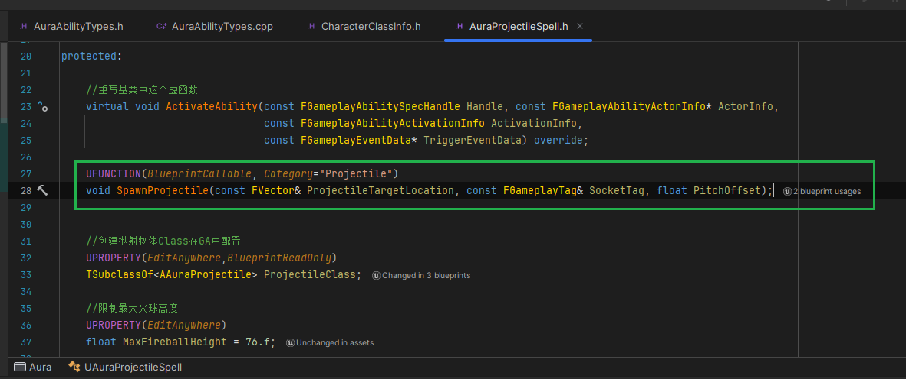

- 因为我们新增的火球术，需要在后半段追踪敌人，所以需要增加一个 `敌人指针` 的参数 `HomingTarget`


------

### 在火球中创建函数 `SpawnProiectiles`

  - 不用继承的原因是：参数变多了，没法用继承

>```cpp
>public:
>    UFUNCTION(BlueprintCallable)
>    void SpawnProjectiles(const FVector& ProjectileTargetLocation, const FGameplayTag& SocketTag, bool bOverridePitch, float PitchOverride, AActor* HomingTarget);
>```
>
>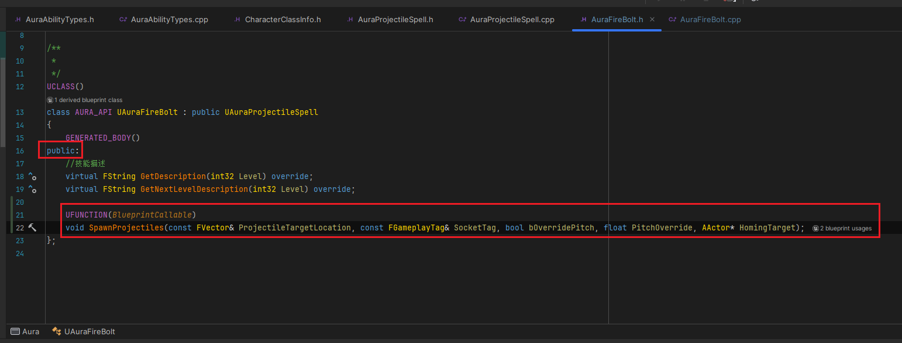


------

#### 逻辑方面，先看一下，之前的生成火球函数中有哪些可以复用的部分
>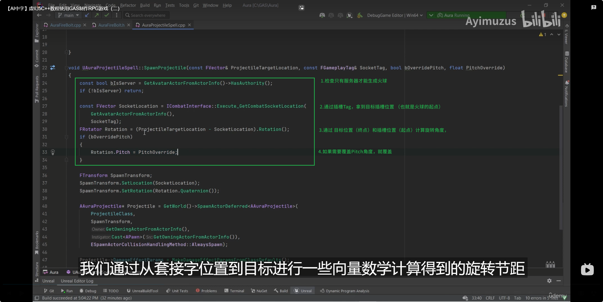


------

#### 拷贝过来可复用的逻辑后，生成Debug箭头
>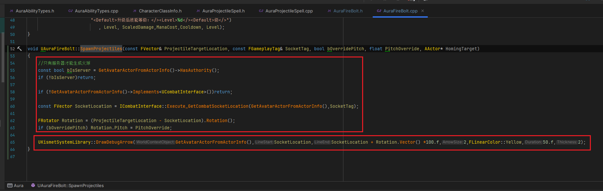
>
>```cpp
>void UAuraFireBolt::SpawnProjectiles(const FVector& ProjectileTargetLocation, const FGameplayTag& SocketTag, bool bOverridePitch, float PitchOverride, AActor* HomingTarget)
>{
>    //只有服务器才能生成火球
>    const bool bIsServer = GetAvatarActorFromActorInfo()->HasAuthority();
>    if (!bIsServer)return;
>    
>    if (!GetAvatarActorFromActorInfo()->Implements<UCombatInterface>())return;
>    
>    const FVector SocketLocation = ICombatInterface::Execute_GetCombatSocketLocation(GetAvatarActorFromActorInfo(),SocketTag);
>    
>    FRotator Rotation = (ProjectileTargetLocation - SocketLocation).Rotation();
>    if (bOverridePitch) Rotation.Pitch = PitchOverride;
>
>    UKismetSystemLibrary::DrawDebugArrow(GetAvatarActorFromActorInfo(),SocketLocation,SocketLocation + Rotation.Vector() *100.f,2,FLinearColor::Yellow,50.f,2);
>}
>```


------

#### 蓝图逻辑中使用新创建的节点
>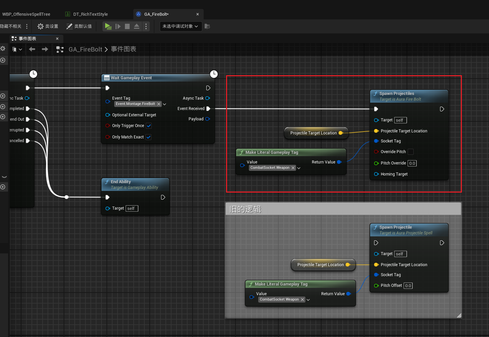


------

#### 运行可以看到箭头
>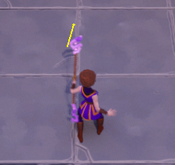


------

### 因为我们要制作，基于等级生成更多的火球，需要一个可扩散的角度和火球数量（这个可以配置）

  - 技能扩散的角度
    - `ProjectileSpread`

  - 生成火球最大数量
    - `MaxNumProjectiles`


创建变量

>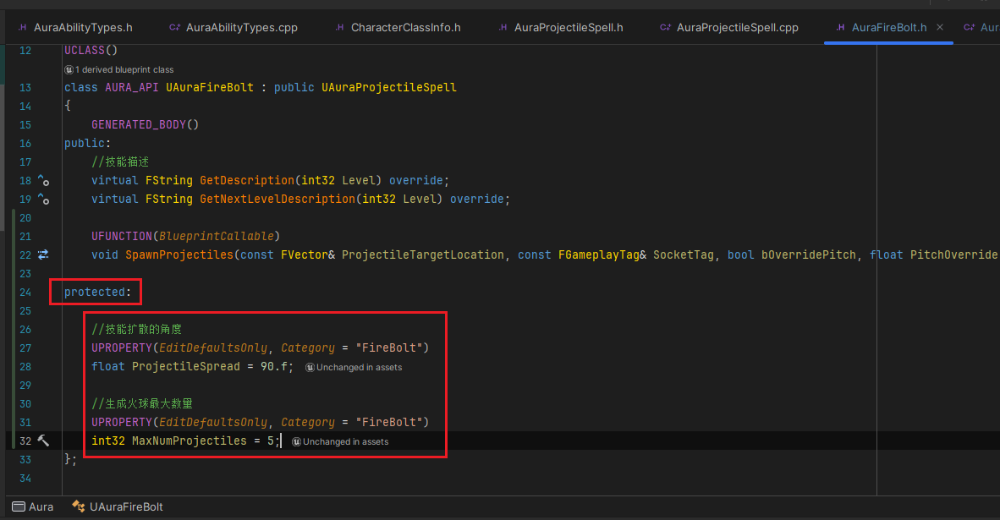
>
>```cpp
>protected:
>
>    //技能扩散的角度
>    UPROPERTY(EditDefaultsOnly, Category = "FireBolt")
>    float ProjectileSpread = 90.f;
>    
>    //生成火球最大数量
>    UPROPERTY(EditDefaultsOnly, Category = "FireBolt")
>    int32 MaxNumProjectiles = 5;
>```


------

### 所以释放技能的角度应该是，左右分别 +- （ `ProjectileSpread` 可扩散的角度 / 2）
>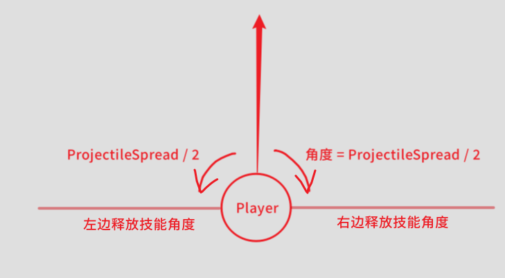

- 对应代码为：
>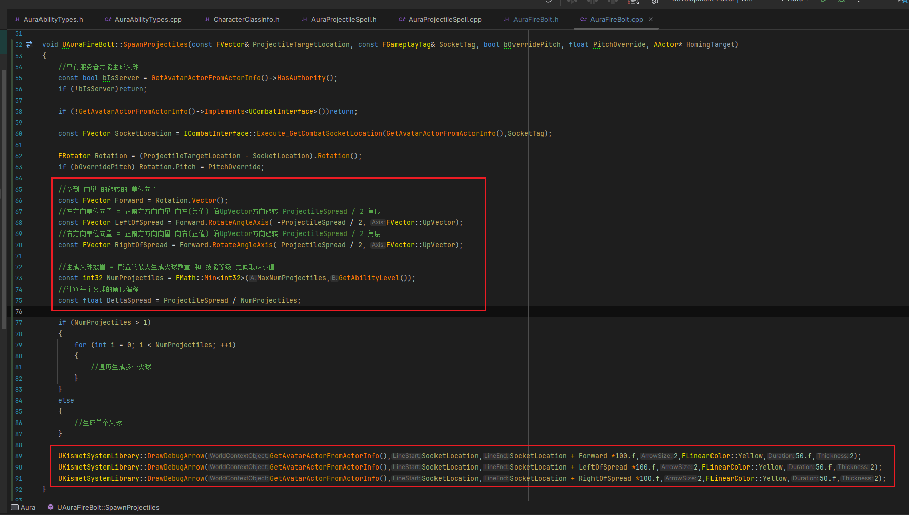
>
>```cpp
>void UAuraFireBolt::SpawnProjectiles(const FVector& ProjectileTargetLocation, const FGameplayTag& SocketTag, bool bOverridePitch, float PitchOverride, AActor* HomingTarget)
>{
>    //只有服务器才能生成火球
>    const bool bIsServer = GetAvatarActorFromActorInfo()->HasAuthority();
>    if (!bIsServer)return;
>    
>    if (!GetAvatarActorFromActorInfo()->Implements<UCombatInterface>())return;
>    
>    const FVector SocketLocation = ICombatInterface::Execute_GetCombatSocketLocation(GetAvatarActorFromActorInfo(),SocketTag);
>    
>    FRotator Rotation = (ProjectileTargetLocation - SocketLocation).Rotation();
>    if (bOverridePitch) Rotation.Pitch = PitchOverride;
>
>    //拿到 向量 的旋转的 单位向量
>    const FVector Forward = Rotation.Vector();
>    //左方向单位向量 = 正前方方向向量 向左(负值) 沿UpVector方向旋转 ProjectileSpread / 2 角度
>    const FVector LeftOfSpread = Forward.RotateAngleAxis( -ProjectileSpread / 2, FVector::UpVector);
>    //右方向单位向量 = 正前方方向向量 向右(正值) 沿UpVector方向旋转 ProjectileSpread / 2 角度
>    const FVector RightOfSpread = Forward.RotateAngleAxis( ProjectileSpread / 2, FVector::UpVector);
>
>    //生成火球数量 = 配置的最大生成火球数量 和 技能等级 之间取最小值
>    const int32 NumProjectiles = FMath::Min<int32>(MaxNumProjectiles,GetAbilityLevel());
>    //计算每个火球的角度偏移
>    const float DeltaSpread = ProjectileSpread / NumProjectiles;
>
>    if (NumProjectiles > 1)
>    {
>       for (int i = 0; i < NumProjectiles; ++i)
>       {
>          //遍历生成多个火球
>       }
>    }
>    else
>    {
>       //生成单个火球
>    }
>    
>    UKismetSystemLibrary::DrawDebugArrow(GetAvatarActorFromActorInfo(),SocketLocation,SocketLocation + Forward *100.f,2,FLinearColor::Yellow,50.f,2);
>    UKismetSystemLibrary::DrawDebugArrow(GetAvatarActorFromActorInfo(),SocketLocation,SocketLocation + LeftOfSpread *100.f,2,FLinearColor::Yellow,50.f,2);
>    UKismetSystemLibrary::DrawDebugArrow(GetAvatarActorFromActorInfo(),SocketLocation,SocketLocation + RightOfSpread *100.f,2,FLinearColor::Yellow,50.f,2);
>}
>```
>
>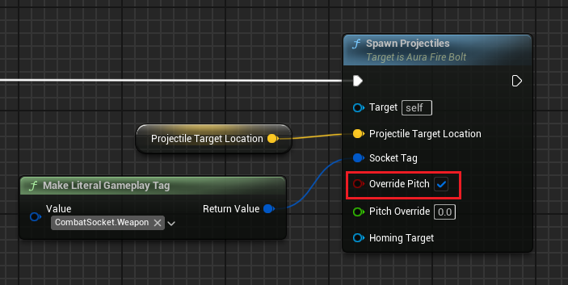

- 生成测试
>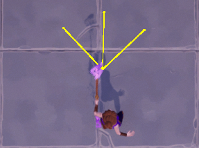


------

### 现在生成火球角度还有一些问题

  - 现在想象一下，如果每一个的旋转角度为 `DeltaSpread`，假设有两个火球，`ProjectileSpread` 可扩散角度为90，那 `DeltaSpread = 45` ，第一个和正前方的重合，另一个和右侧角度重合，最左侧没有火球生成


------

### 生成火球角度部分，分成两种情况处理：

  - 数量大于1时
    - 从最左侧开始：角度 = 最左侧角度 + i * DeltaSpread

  - 小于等于1时
    - 朝正前方正常射出火球

  - 火球数量  = 要生成的火球数量 - 1（因为要使用fori循环，所以使用最大数量 - 1）
>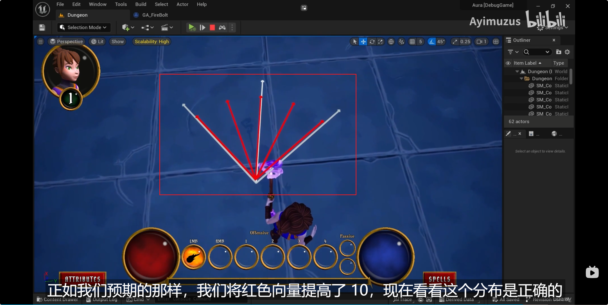
>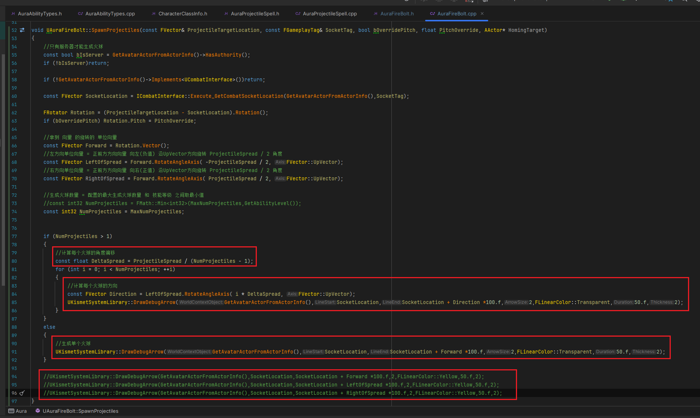
>
>```cpp
>void UAuraFireBolt::SpawnProjectiles(const FVector& ProjectileTargetLocation, const FGameplayTag& SocketTag, bool bOverridePitch, float PitchOverride, AActor* HomingTarget)
>{
>    //只有服务器才能生成火球
>    const bool bIsServer = GetAvatarActorFromActorInfo()->HasAuthority();
>    if (!bIsServer)return;
>    
>    if (!GetAvatarActorFromActorInfo()->Implements<UCombatInterface>())return;
>    
>    const FVector SocketLocation = ICombatInterface::Execute_GetCombatSocketLocation(GetAvatarActorFromActorInfo(),SocketTag);
>    
>    FRotator Rotation = (ProjectileTargetLocation - SocketLocation).Rotation();
>    if (bOverridePitch) Rotation.Pitch = PitchOverride;
>
>    //拿到 向量 的旋转的 单位向量
>    const FVector Forward = Rotation.Vector();
>    //左方向单位向量 = 正前方方向向量 向左(负值) 沿UpVector方向旋转 ProjectileSpread / 2 角度
>    const FVector LeftOfSpread = Forward.RotateAngleAxis( -ProjectileSpread / 2, FVector::UpVector);
>    //右方向单位向量 = 正前方方向向量 向右(正值) 沿UpVector方向旋转 ProjectileSpread / 2 角度
>    const FVector RightOfSpread = Forward.RotateAngleAxis( ProjectileSpread / 2, FVector::UpVector);
>
>    //生成火球数量 = 配置的最大生成火球数量 和 技能等级 之间取最小值
>    //const int32 NumProjectiles = FMath::Min<int32>(MaxNumProjectiles,GetAbilityLevel());
>    const int32 NumProjectiles = MaxNumProjectiles;
>    
>
>    if (NumProjectiles > 1)
>    {
>       //计算每个火球的角度偏移
>       const float DeltaSpread = ProjectileSpread / (NumProjectiles - 1);
>       for (int i = 0; i < NumProjectiles; ++i)
>       {
>          //计算每个火球的方向
>          const FVector Direction = LeftOfSpread.RotateAngleAxis( i * DeltaSpread, FVector::UpVector);
>          UKismetSystemLibrary::DrawDebugArrow(GetAvatarActorFromActorInfo(),SocketLocation,SocketLocation + Direction *100.f,2,FLinearColor::Transparent,50.f,2);
>       }
>    }
>    else
>    {
>       //生成单个火球
>       UKismetSystemLibrary::DrawDebugArrow(GetAvatarActorFromActorInfo(),SocketLocation,SocketLocation + Forward *100.f,2,FLinearColor::Transparent,50.f,2);
>    }
>    
>    //UKismetSystemLibrary::DrawDebugArrow(GetAvatarActorFromActorInfo(),SocketLocation,SocketLocation + Forward *100.f,2,FLinearColor::Yellow,50.f,2);
>    //UKismetSystemLibrary::DrawDebugArrow(GetAvatarActorFromActorInfo(),SocketLocation,SocketLocation + LeftOfSpread *100.f,2,FLinearColor::Yellow,50.f,2);
>    //UKismetSystemLibrary::DrawDebugArrow(GetAvatarActorFromActorInfo(),SocketLocation,SocketLocation + RightOfSpread *100.f,2,FLinearColor::Yellow,50.f,2);
>}
>```


------

### 通过设置蓝图中的参数，校验生成角度的结果时否正确
>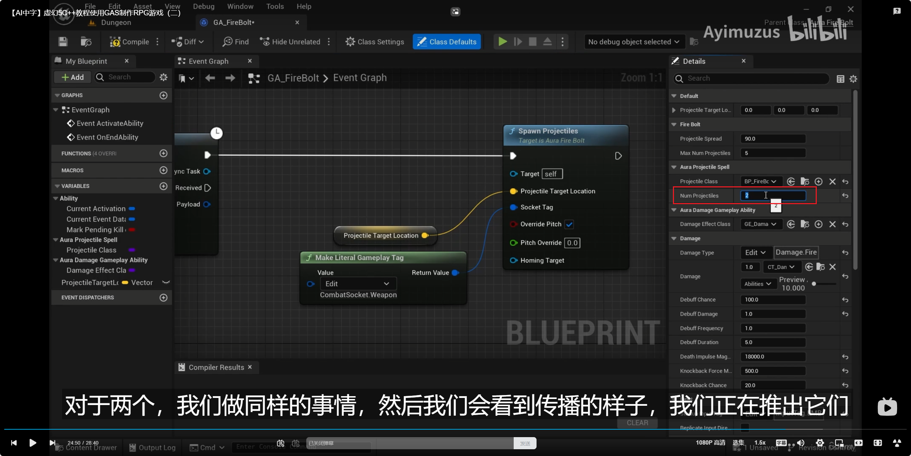


------

#### 测试结果
>| 角度                                           | 几个 | 图示                                                         |
>| ---------------------------------------------- | ---- | ------------------------------------------------------------ |
>| 90                                             | 5    | 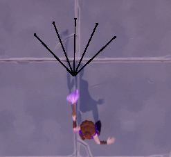 |
>| 90                                             | 2    | 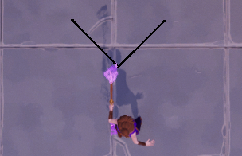 |
>| 180                                            | 3    | 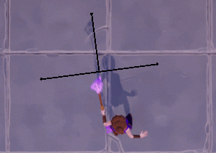 |
>| 300                                            | 4    | 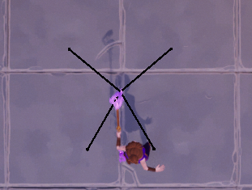 |
>| 360°左右会重合，有点问题，打死你hi应该不用360° | 4    | 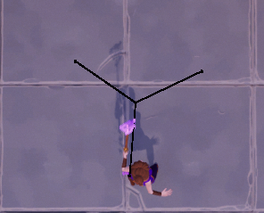 |
>| 180                                            | 10   | 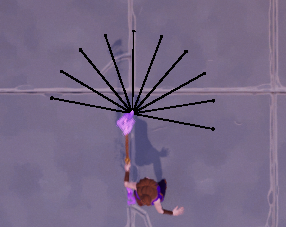 |

___________________________________________________________________________________________

[返回最上面](#Go主菜单)

___________________________________________________________________________________________