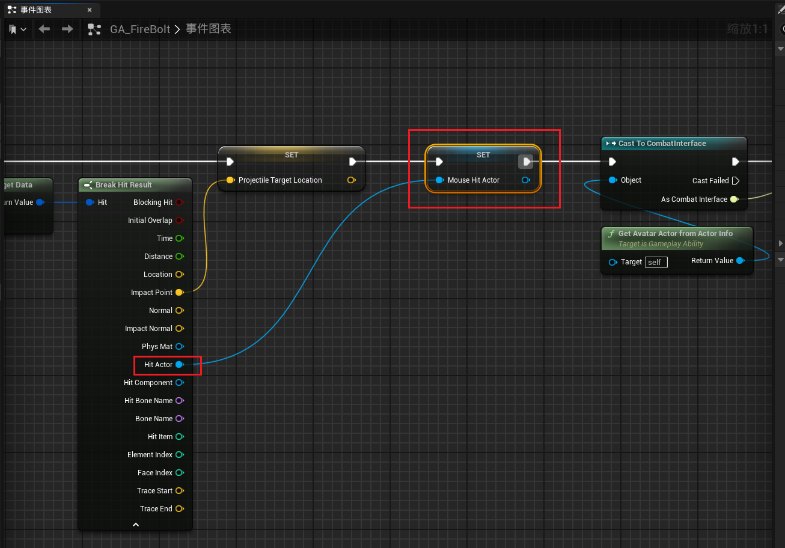
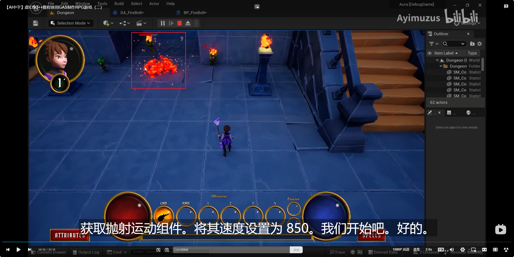
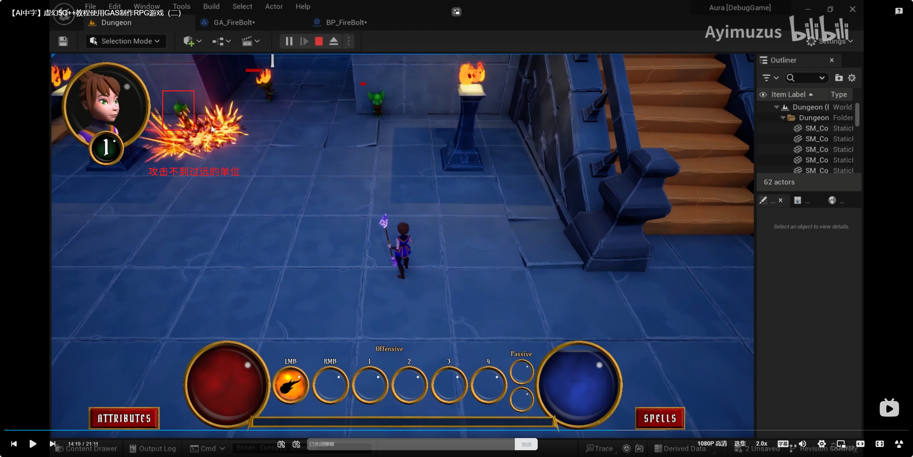

___________________________________________________________________________________________
###### [Go主菜单](../MainMenu.md)
___________________________________________________________________________________________

# GAS 159 计算部分抽象静态函数；为火球添加重力；使用抛射物组件的追踪导航组件

___________________________________________________________________________________________

## 处理关键点

1. 使用抛射物组件上的追踪导航组件
    - 制作技能追踪敌人效果 ： `在 `ProjectileMovement` 组件上，有一个寻敌组件 `HomingTargetComponent` 是一个 `U类的弱指针组件` ，可以保存敌人的根组件的弱引用
    - 在 `ProjectileMovement` 组件上，使用 `追踪敌人` 类型的步骤：
      - 先判断目标是否有 `SceneComponent` 
        - 若有目标有，直接设置 `HomingTargetComponent = SceneComponent`
        - 若没有 `SceneComponent` ，需要New一个（注意GC），并设置new出来的 `SceneComponent` 的位置
      - 设置归航加速度， `HomingAccelerationMagnitude` （可以设为随机值）
2. 使用 `NewObject` 生成组件
    - 直接生成的不用注册
    - 生成后Attach到Actor上需要注册
    - 使用 `new` 时需要注意 GC

___________________________________________________________________________________________

# 目录


- [GAS 159 计算部分抽象静态函数；为火球添加重力；使用抛射物组件的追踪导航组件](#gas-159-计算部分抽象静态函数为火球添加重力使用抛射物组件的追踪导航组件)
  - [处理关键点](#处理关键点)
- [目录](#目录)
    - [Mermaid整体思路梳理](#mermaid整体思路梳理)
    - [上一节我们制作了生成火球角度的计算函数，但是这只是角度的计算部分，放在生成里面会比较冗余，打算放到蓝图函数库中，做成一个 `静态函数` ，这样也方便别的地方使用](#上一节我们制作了生成火球角度的计算函数但是这只是角度的计算部分放在生成里面会比较冗余打算放到蓝图函数库中做成一个-静态函数-这样也方便别的地方使用)
    - [蓝图函数库中创建两个静态函数，一个返回 `FRotator` 数组，一个返回 `FVector` 数组（一个角度版，一个向量版）方便使用](#蓝图函数库中创建两个静态函数一个返回-frotator-数组一个返回-fvector-数组一个角度版一个向量版方便使用)
    - [这样我们在原来的位置只需要调用这个静态函数，传参，就可以获得一个向量的数组](#这样我们在原来的位置只需要调用这个静态函数传参就可以获得一个向量的数组)
      - [接下来遍历这个向量数组，做和原来一样的事](#接下来遍历这个向量数组做和原来一样的事)
    - [也可以使用 `FRotator` 的版本](#也可以使用-frotator-的版本)
    - [运行测试结果](#运行测试结果)
    - [接下来参考之前生成火球的函数，只是用 `FRotator` 数组遍历，然后生成火球](#接下来参考之前生成火球的函数只是用-frotator-数组遍历然后生成火球)
    - [运行测试gif：会生成多个火球](#运行测试gif会生成多个火球)
    - [后续会使用角度覆盖原角度，然后为火球添加重力，并且添加寻敌的导弹效果](#后续会使用角度覆盖原角度然后为火球添加重力并且添加寻敌的导弹效果)
    - [下一节](#下一节)
    - [可以为火球添加重力效果](#可以为火球添加重力效果)
    - [加上覆盖俯仰轴Pitch，就可以有抛物线了（但是问题是有一点近）](#加上覆盖俯仰轴pitch就可以有抛物线了但是问题是有一点近)
    - [稍微增加火球的移速和初速度，就可以让火球打得更远](#稍微增加火球的移速和初速度就可以让火球打得更远)
    - [但是这就带来了一个问题，我们如果站得远，点击敌人就无法攻击到敌人](#但是这就带来了一个问题我们如果站得远点击敌人就无法攻击到敌人)
      - [换言之，现在想要制作寻敌效果了（当火球发射出去后会寻找敌人并动态调整自己的位置）](#换言之现在想要制作寻敌效果了当火球发射出去后会寻找敌人并动态调整自己的位置)
    - [我们先将击中后拿到的敌人的指针存为变量，然后将指针数据，作为实参传入函数](#我们先将击中后拿到的敌人的指针存为变量然后将指针数据作为实参传入函数)
    - [在 `ProjectileMovement` 组件上，使用 `追踪敌人` 类型的步骤：](#在-projectilemovement-组件上使用-追踪敌人-类型的步骤)
      - [在 `ProjectileMovement` 组件上，有一个寻敌组件 `HomingTargetComponent` 是一个 `U类的弱指针组件` ，可以保存敌人的根组件的弱引用](#在-projectilemovement-组件上有一个寻敌组件-homingtargetcomponent-是一个-u类的弱指针组件-可以保存敌人的根组件的弱引用)
      - [但是有一个问题，如果击中的是敌人，可以判断该目标是否实现了接口，来获取目标的根组件，但假如，我们是按shift使用技能，没有目标，怎么办？](#但是有一个问题如果击中的是敌人可以判断该目标是否实现了接口来获取目标的根组件但假如我们是按shift使用技能没有目标怎么办)
      - [但是创建场景组件会带来一个新的问题，就是这个 `NewObject` 创建出来的组件，不会被回收和GC，何时回收？怎么回收？](#但是创建场景组件会带来一个新的问题就是这个-newobject-创建出来的组件不会被回收和gc何时回收怎么回收)
        - [火球Actor上，创建组件指针，保存创建出来的 `SceneComponent`](#火球actor上创建组件指针保存创建出来的-scenecomponent)
      - [当没有目标时， `NewObject` 一个新的 `SceneComponent` ，保存在 `火球Actor` 上，然后 `ProjectileMovement` 组件上的寻敌组件 `HomingTargetComponent` 的 `U类的弱指针组件` 指向自身的 `SceneComponent`](#当没有目标时-newobject-一个新的-scenecomponent-保存在-火球actor-上然后-projectilemovement-组件上的寻敌组件-homingtargetcomponent-的-u类的弱指针组件-指向自身的-scenecomponent)
      - [接下来，我们来设置火球的归航速度，也就是 `ProjectileMovement` 组件上的 归航加速度大小 `HomingAccelerationMagnitude`](#接下来我们来设置火球的归航速度也就是-projectilemovement-组件上的-归航加速度大小-homingaccelerationmagnitude)
        - [在GA上创建两个参数，分别是归航的最大加速度和最小加速度](#在ga上创建两个参数分别是归航的最大加速度和最小加速度)
        - [设置归航速度](#设置归航速度)
      - [最后我们需要设置 `ProjectileMovement` 组件类型为 `寻敌类型` ，这样就完成了设置](#最后我们需要设置-projectilemovement-组件类型为-寻敌类型-这样就完成了设置)
    - [可以在火球GA上创建一个bool类型变量标注生成的火球的类型为 `追踪敌人` 类型](#可以在火球ga上创建一个bool类型变量标注生成的火球的类型为-追踪敌人-类型)
    - [运行测试](#运行测试)
    - [看下代码](#看下代码)
      - [在生成组件后，设置组件的位置](#在生成组件后设置组件的位置)
    - [运行测试gif](#运行测试gif)
    - [设为更快的速度](#设为更快的速度)
    - [运行测试gif：可以击中敌人了，攻击不到过远的单位](#运行测试gif可以击中敌人了攻击不到过远的单位)
    - [如果关闭重力之后，肯定可以击中，但是攻击范围就变为无限远了](#如果关闭重力之后肯定可以击中但是攻击范围就变为无限远了)
    - [将速度调为正常的范围（这个其实影响的就是攻击距离）](#将速度调为正常的范围这个其实影响的就是攻击距离)
    - [目前测试完成，真正释放火球的技能时，技能肯定是和技能等级挂钩，所以需要改一下逻辑](#目前测试完成真正释放火球的技能时技能肯定是和技能等级挂钩所以需要改一下逻辑)
    - [之前接口对象判断错了](#之前接口对象判断错了)
    - [运行测试gif](#运行测试gif-1)
    - [我们之前为了测试1级火球的效果，降低了1级火球的MP消耗，2级消耗的有点多，所以需要修改下曲线表格](#我们之前为了测试1级火球的效果降低了1级火球的mp消耗2级消耗的有点多所以需要修改下曲线表格)
    - [有一个小挑战，有时间的话可以搞一下，火球术的技能描述，让它变得更贴切](#有一个小挑战有时间的话可以搞一下火球术的技能描述让它变得更贴切)
    - [这里有一个bug现在：当我们 点击 空气墙时，会崩溃](#这里有一个bug现在当我们-点击-空气墙时会崩溃)
    - [需要为这个目标，判断空指针](#需要为这个目标判断空指针)
    - [火球对于太近的敌人难以击中；且会漂浮在空中（导致音频一直触发），以下是来自后面的修复GAS\_161](#火球对于太近的敌人难以击中且会漂浮在空中导致音频一直触发以下是来自后面的修复gas_161)


___________________________________________________________________________________________

<details>
<summary>视频链接</summary>

[2. Spawning Multiple Projectiles_哔哩哔哩_bilibili](https://www.bilibili.com/video/BV1TH4y1L7NP/?p=115&spm_id_from=pageDriver&vd_source=9e1e64122d802b4f7ab37bd325a89e6c)

[3. Homing Projectiles_哔哩哔哩_bilibili](https://www.bilibili.com/video/BV1TH4y1L7NP/?p=116&spm_id_from=pageDriver&vd_source=9e1e64122d802b4f7ab37bd325a89e6c)

------

</details>

___________________________________________________________________________________________

### Mermaid整体思路梳理

Mermaid

___________________________________________________________________________________________

### 上一节我们制作了生成火球角度的计算函数，但是这只是角度的计算部分，放在生成里面会比较冗余，打算放到蓝图函数库中，做成一个 `静态函数` ，这样也方便别的地方使用


------

### 蓝图函数库中创建两个静态函数，一个返回 `FRotator` 数组，一个返回 `FVector` 数组（一个角度版，一个向量版）方便使用

  - 函数分别命名为：`EvenlySpacedRotators` 和 `EvenlyRotatedVectors`

  - 包含四个变量：

    - 一个正前方的向量

    - 一个是轴

    - 一个是技能范围角度

    - 一个是生成火球的数量

>```cpp
>//生成火球角度的计算
>UFUNCTION(BlueprintCallable, Category = "AuraAbilitySystemLibrary|GameplayMechanics")
>static TArray<FRotator> EvenlySpacedRotators(const FVector& Forward, const FVector& Axis, float Spread, int32 NumRotators);
>
>//生成火球角度的计算
>UFUNCTION(BlueprintCallable, Category = "AuraAbilitySystemLibrary|GameplayMechanics")
>static TArray<FVector> EvenlySpacedVectors(const FVector& Forward, const FVector& Axis, float Spread, int32 NumVectors);
>```
>
>
>
>
>
>
>
>
>```cpp
>TArray<FRotator> UAuraAbilitySystemLibrary::EvenlySpacedRotators(const FVector& Forward, const FVector& Axis, float Spread, int32 NumRotators)
>{
>	TArray<FRotator> Rotators;
>
>	//左方向单位向量 = 正前方方向向量 向左(负值) 沿UpVector方向旋转 ProjectileSpread / 2 角度
>	const FVector LeftOfSpread = Forward.RotateAngleAxis( -Spread / 2, FVector::UpVector);
>	//右方向单位向量 = 正前方方向向量 向右(正值) 沿UpVector方向旋转 ProjectileSpread / 2 角度
>	const FVector RightOfSpread = Forward.RotateAngleAxis( Spread / 2, FVector::UpVector);
>
>	//生成火球数量 = 配置的最大生成火球数量 和 技能等级 之间取最小值
>	//const int32 NumProjectiles = FMath::Min<int32>(MaxNumProjectiles,GetAbilityLevel());
>	const int32 NumProjectiles = NumRotators;
>	
>
>	if (NumProjectiles > 1)
>	{
>		//计算每个火球的角度偏移
>		const float DeltaSpread = Spread / (NumProjectiles - 1);
>		for (int i = 0; i < NumProjectiles; ++i)
>		{
>			//计算每个火球的方向
>			const FVector Direction = LeftOfSpread.RotateAngleAxis( i * DeltaSpread, FVector::UpVector);
>			Rotators.Add(Direction.Rotation());
>		}
>	}
>	else
>	{
>		//生成单个火球
>		Rotators.Add(Forward.Rotation());
>	}
>	
>	return Rotators;
>}
>
>TArray<FVector> UAuraAbilitySystemLibrary::EvenlySpacedVectors(const FVector& Forward, const FVector& Axis, float Spread, int32 NumVectors)
>{
>	TArray<FVector> Vectors;
>
>	//左方向单位向量 = 正前方方向向量 向左(负值) 沿UpVector方向旋转 ProjectileSpread / 2 角度
>	const FVector LeftOfSpread = Forward.RotateAngleAxis( -Spread / 2, FVector::UpVector);
>	//右方向单位向量 = 正前方方向向量 向右(正值) 沿UpVector方向旋转 ProjectileSpread / 2 角度
>	const FVector RightOfSpread = Forward.RotateAngleAxis( Spread / 2, FVector::UpVector);
>	
>	if (NumVectors > 1)
>	{
>		//计算每个火球的角度偏移
>		const float DeltaSpread = Spread / (NumVectors - 1);
>		for (int i = 0; i < NumVectors; ++i)
>		{
>			//计算每个火球的方向
>			const FVector Direction = LeftOfSpread.RotateAngleAxis( i * DeltaSpread, FVector::UpVector);
>			Vectors.Add(Direction);
>		}
>	}
>	else
>	{
>		//生成单个火球
>		Vectors.Add(Forward);
>	}
>
>	return Vectors;
>}
>```


------

### 这样我们在原来的位置只需要调用这个静态函数，传参，就可以获得一个向量的数组
>```CPP
>void UAuraFireBolt::SpawnProjectiles(const FVector& ProjectileTargetLocation, const FGameplayTag& SocketTag, bool bOverridePitch, float PitchOverride, AActor* HomingTarget)
>{
>	//只有服务器才能生成火球
>	const bool bIsServer = GetAvatarActorFromActorInfo()->HasAuthority();
>	if (!bIsServer)return;
>	
>	if (!GetAvatarActorFromActorInfo()->Implements<UCombatInterface>())return;
>	
>	const FVector SocketLocation = ICombatInterface::Execute_GetCombatSocketLocation(GetAvatarActorFromActorInfo(),SocketTag);
>	
>	FRotator Rotation = (ProjectileTargetLocation - SocketLocation).Rotation();
>	if (bOverridePitch) Rotation.Pitch = PitchOverride;
>
>	//拿到 向量 的旋转的 单位向量
>	const FVector Forward = Rotation.Vector();
>	//const int32 NumProjectiles = FMath::Min<int32>(MaxNumProjectiles,GetAbilityLevel());
>	const int32 NumProjectiles = MaxNumProjectiles;
>	
>	TArray<FVector> Vectors = UAuraAbilitySystemLibrary::EvenlySpacedVectors(Forward,FVector::UpVector,ProjectileSpread,NumProjectiles);
>	TArray<FRotator> Rotators = UAuraAbilitySystemLibrary::EvenlySpacedRotators(Forward,FVector::UpVector,ProjectileSpread,NumProjectiles);
>	//Vector版本
>	for (const FVector Vector : Vectors)
>	{
>		const FVector End =  SocketLocation + Vector * 100.f;
>		UKismetSystemLibrary::DrawDebugArrow(GetAvatarActorFromActorInfo(),SocketLocation, End,2.f,FLinearColor::Transparent,50.f,2.f);
>	}
>	//Rotator版本
>	for (const FRotator Rotator : Rotators)
>	{
>		const FVector End =  SocketLocation + Rotator.Vector() * 100.f + FVector(0,0,10.f);
>		UKismetSystemLibrary::DrawDebugArrow(GetAvatarActorFromActorInfo(),SocketLocation, End,2.f,FLinearColor::Red,50.f,2.f);
>	}
>}
>```


------

#### 接下来遍历这个向量数组，做和原来一样的事
>


------

### 也可以使用 `FRotator` 的版本
>


------

### 运行测试结果
>


------

### 接下来参考之前生成火球的函数，只是用 `FRotator` 数组遍历，然后生成火球
>
>
>```cpp
>void UAuraFireBolt::SpawnProjectiles(const FVector& ProjectileTargetLocation, const FGameplayTag& SocketTag, bool bOverridePitch, float PitchOverride, AActor* HomingTarget)
>{
>    //只有服务器才能生成火球
>    const bool bIsServer = GetAvatarActorFromActorInfo()->HasAuthority();
>    if (!bIsServer)return;
>    
>    if (!GetAvatarActorFromActorInfo()->Implements<UCombatInterface>())return;
>    
>    const FVector SocketLocation = ICombatInterface::Execute_GetCombatSocketLocation(GetAvatarActorFromActorInfo(),SocketTag);
>    
>    FRotator Rotation = (ProjectileTargetLocation - SocketLocation).Rotation();
>    if (bOverridePitch) Rotation.Pitch = PitchOverride;
>
>    //拿到 向量 的旋转的 单位向量
>    const FVector Forward = Rotation.Vector();
>    //const int32 NumProjectiles = FMath::Min<int32>(MaxNumProjectiles,GetAbilityLevel());
>    const int32 NumProjectiles = MaxNumProjectiles;
>    
>    TArray<FRotator> Rotators = UAuraAbilitySystemLibrary::EvenlySpacedRotators(Forward,FVector::UpVector,ProjectileSpread,NumProjectiles);
>    FTransform SpawnTransform;
>    for (const FRotator Rotator : Rotators)
>    {
>       SpawnTransform.SetLocation(SocketLocation);
>       SpawnTransform.SetRotation(Rotator.Quaternion());
>       //延迟生成 actor
>       AAuraProjectile* AuraProjectile = GetWorld()->SpawnActorDeferred<AAuraProjectile>(
>          ProjectileClass,
>          SpawnTransform,
>          GetOwningActorFromActorInfo(),
>          Cast<APawn>(GetOwningActorFromActorInfo()),
>          ESpawnActorCollisionHandlingMethod::AlwaysSpawn);
>
>       //返回的结构体参数在 上下文中读取参数配置; TargetASC还没配置!!!
>       AuraProjectile->DamageEffectParams = MakeDamageEffectParamsFromClassDefaults();
>       AuraProjectile->FinishSpawning(SpawnTransform);
>    }
>}
>```


------

### 运行测试gif：会生成多个火球
>


------

### 后续会使用角度覆盖原角度，然后为火球添加重力，并且添加寻敌的导弹效果
>覆盖 `Pitch` 为45
>
>
>


------

### 下一节


------

### 可以为火球添加重力效果
>
>


------

### 加上覆盖俯仰轴Pitch，就可以有抛物线了（但是问题是有一点近）
>
>


------

### 稍微增加火球的移速和初速度，就可以让火球打得更远
>
>


------

### 但是这就带来了一个问题，我们如果站得远，点击敌人就无法攻击到敌人
>


------

#### 换言之，现在想要制作寻敌效果了（当火球发射出去后会寻找敌人并动态调整自己的位置）
>


------

### 我们先将击中后拿到的敌人的指针存为变量，然后将指针数据，作为实参传入函数
>
>


------

### 在 `ProjectileMovement` 组件上，使用 `追踪敌人` 类型的步骤：


------

#### 在 `ProjectileMovement` 组件上，有一个寻敌组件 `HomingTargetComponent` 是一个 `U类的弱指针组件` ，可以保存敌人的根组件的弱引用

>
>


------

#### 但是有一个问题，如果击中的是敌人，可以判断该目标是否实现了接口，来获取目标的根组件，但假如，我们是按shift使用技能，没有目标，怎么办？

  - 我们可以使用 `NewObject` 在目标地点创建一个新的根场景组件
>


------

#### 但是创建场景组件会带来一个新的问题，就是这个 `NewObject` 创建出来的组件，不会被回收和GC，何时回收？怎么回收？

  - 我们可以在火球Actor上创建一个 `SceneComponent` 组件的指针来指向它，这样它就有 `owner` 了，可以GC


------

##### 火球Actor上，创建组件指针，保存创建出来的 `SceneComponent`

  - 命名为，`HomingTargetSceneComponent`

>


------

#### 当没有目标时， `NewObject` 一个新的 `SceneComponent` ，保存在 `火球Actor` 上，然后 `ProjectileMovement` 组件上的寻敌组件 `HomingTargetComponent` 的 `U类的弱指针组件` 指向自身的 `SceneComponent`
>


------

#### 接下来，我们来设置火球的归航速度，也就是 `ProjectileMovement` 组件上的 归航加速度大小 `HomingAccelerationMagnitude`

  - 我们给归航加速度一个随机值


------

##### 在GA上创建两个参数，分别是归航的最大加速度和最小加速度

  - 命名为：`HomingAccelerationMin` 和 `HomingAccelerationMax`

>


------

##### 设置归航速度
>


------

#### 最后我们需要设置 `ProjectileMovement` 组件类型为 `寻敌类型` ，这样就完成了设置
>


------

### 可以在火球GA上创建一个bool类型变量标注生成的火球的类型为 `追踪敌人` 类型

  - 命名为：`bLaunchHomingProjectiles`

>
>
>
>```cpp
>void UAuraFireBolt::SpawnProjectiles(const FVector& ProjectileTargetLocation, const FGameplayTag& SocketTag, bool bOverridePitch, float PitchOverride, AActor* HomingTarget)
>{
>    //只有服务器才能生成火球
>    const bool bIsServer = GetAvatarActorFromActorInfo()->HasAuthority();
>    if (!bIsServer)return;
>    
>    
>    
>    const FVector SocketLocation = ICombatInterface::Execute_GetCombatSocketLocation(GetAvatarActorFromActorInfo(),SocketTag);
>    
>    FRotator Rotation = (ProjectileTargetLocation - SocketLocation).Rotation();
>    if (bOverridePitch) Rotation.Pitch = PitchOverride;
>
>    //拿到 向量 的旋转的 单位向量
>    const FVector Forward = Rotation.Vector();
>    //const int32 NumProjectiles = FMath::Min<int32>(MaxNumProjectiles,GetAbilityLevel());
>    const int32 NumProjectiles = MaxNumProjectiles;
>    
>    TArray<FRotator> Rotators = UAuraAbilitySystemLibrary::EvenlySpacedRotators(Forward,FVector::UpVector,ProjectileSpread,NumProjectiles);
>    FTransform SpawnTransform;
>    for (const FRotator Rotator : Rotators)
>    {
>       SpawnTransform.SetLocation(SocketLocation);
>       SpawnTransform.SetRotation(Rotator.Quaternion());
>       //延迟生成 actor
>       AAuraProjectile* AuraProjectile = GetWorld()->SpawnActorDeferred<AAuraProjectile>(
>          ProjectileClass,
>          SpawnTransform,
>          GetOwningActorFromActorInfo(),
>          Cast<APawn>(GetOwningActorFromActorInfo()),
>          ESpawnActorCollisionHandlingMethod::AlwaysSpawn);
>
>       //返回的结构体参数在 上下文中读取参数配置; TargetASC还没配置!!!
>       AuraProjectile->DamageEffectParams = MakeDamageEffectParamsFromClassDefaults();
>
>       if (GetAvatarActorFromActorInfo()->Implements<UCombatInterface>())
>       {
>          AuraProjectile->ProjectileMovementComponent->HomingTargetComponent = HomingTarget->GetRootComponent();
>       }
>       else
>       {
>          AuraProjectile->HomingTargetSceneComponent = NewObject<USceneComponent>(USceneComponent::StaticClass());
>          AuraProjectile->ProjectileMovementComponent->HomingTargetComponent = AuraProjectile->HomingTargetSceneComponent;
>       }
>       
>       AuraProjectile->ProjectileMovementComponent->HomingAccelerationMagnitude = FMath::RandRange(HomingAccelerationMin,HomingAccelerationMax);
>       AuraProjectile->ProjectileMovementComponent->bIsHomingProjectile = bLaunchHomingProjectiles;
>       
>       AuraProjectile->FinishSpawning(SpawnTransform);
>    }
>}
>```


------

### 运行测试

- 有点问题

  - 瞄准敌人时：

    - 如果敌人离得过近，就无法击中敌人

    - 如果敌人离得太远，就无法打到敌人

  - 不瞄准敌人时，方向不对


------

### 看下代码
>

- 我们生成了组件，但是不瞄准敌人时，并没有设置该组件的位置


------

#### 在生成组件后，设置组件的位置
>


------

### 运行测试gif
>

- 无法击中过远的敌人（这个是重力和速度不够导致的）


------

### 设为更快的速度
>


------

### 运行测试gif：可以击中敌人了，攻击不到过远的单位
>
>


------

### 如果关闭重力之后，肯定可以击中，但是攻击范围就变为无限远了


------

### 将速度调为正常的范围（这个其实影响的就是攻击距离）


------

### 目前测试完成，真正释放火球的技能时，技能肯定是和技能等级挂钩，所以需要改一下逻辑
>


------

### 之前接口对象判断错了

> ## 应该判断被打的敌人，不是玩家自身！
>
> 

------

### 运行测试gif

  - 一级1火球；二级2火球

>


------

### 我们之前为了测试1级火球的效果，降低了1级火球的MP消耗，2级消耗的有点多，所以需要修改下曲线表格
>


------

### 有一个小挑战，有时间的话可以搞一下，火球术的技能描述，让它变得更贴切


------

### 这里有一个bug现在：当我们 点击 空气墙时，会崩溃
>
>


------

### 需要为这个目标，判断空指针
>


------

### 火球对于太近的敌人难以击中；且会漂浮在空中（导致音频一直触发），以下是来自后面的修复GAS_161

<details>
<summary>视频链接</summary>

[5. Invoke Replicated Event_哔哩哔哩_bilibili](https://www.bilibili.com/video/BV1TH4y1L7NP/?p=118&spm_id_from=pageDriver&vd_source=9e1e64122d802b4f7ab37bd325a89e6c)

------

</details>

- 音频问题的修复：
>

- 敌人太近难以击中的修复：
>现在有点难以击中敌人gif：
>
>
>
>

- 测试gif
>

- 当攻击空气墙时，不会朝目标发射火球

  - 因为空气墙的碰撞通道的问题
    - 没有检测Visibility

>

  - 设置碰撞通道
>

- 当点击空气墙时，会漂浮在这里

>

  - 这个原因是：攻击基于Visibility，Overlap则不是，所以就卡在了这里

- 顺便检查声音是否消失

- 可以单独设置，摄像机面朝的这一堵墙的位置，或者将这一堵墙碰撞检测通道Visibility改为忽略
>
>

- 可以放到一个文件夹里
>

___________________________________________________________________________________________

[返回最上面](#Go主菜单)

___________________________________________________________________________________________