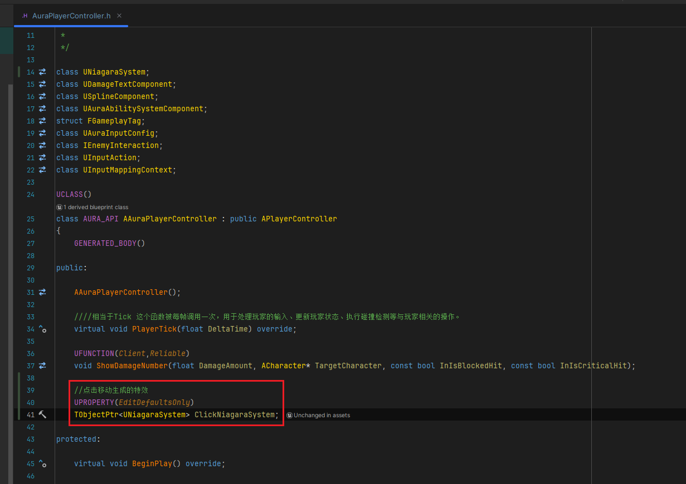
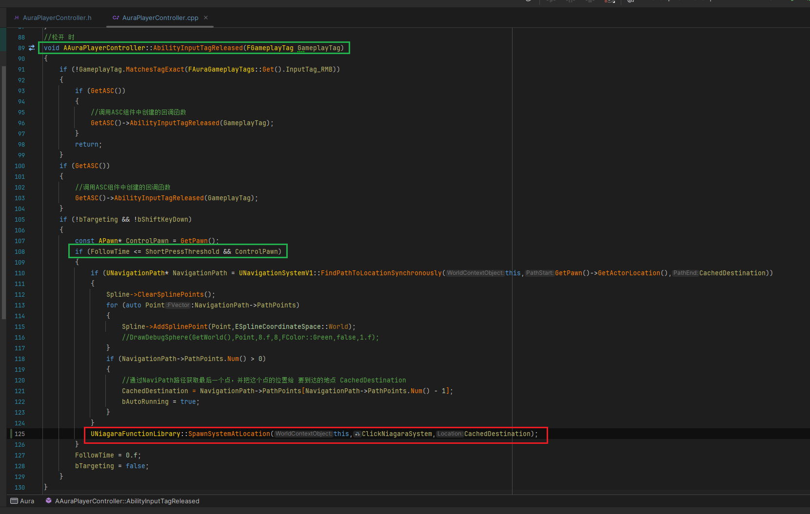
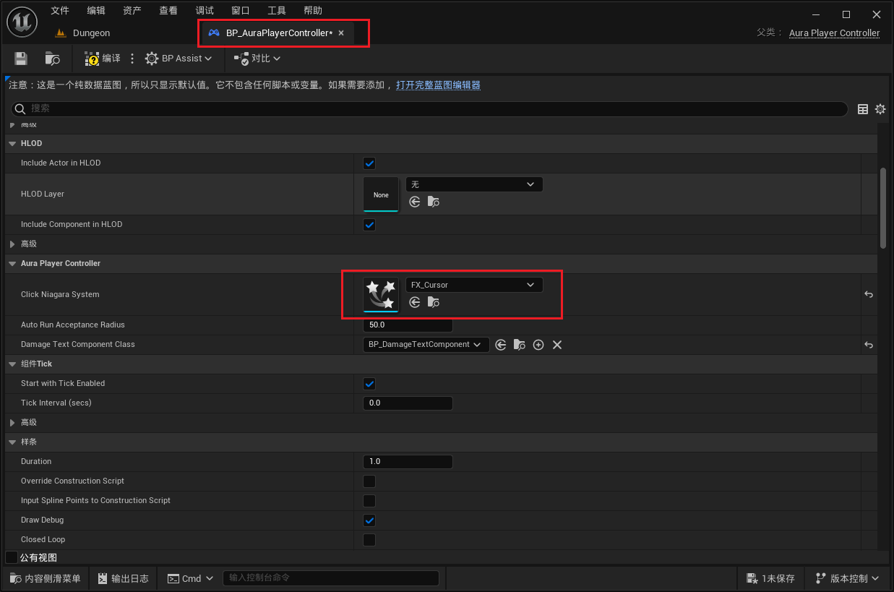

___________________________________________________________________________________________
###### [Go主菜单](../MainMenu.md)
___________________________________________________________________________________________

# GAS 160 制作点击地面移动时，目标地点的NS特效
___________________________________________________________________________________________

# 目录


- [GAS 160 制作点击地面移动时，目标地点的NS特效](#gas-160-制作点击地面移动时目标地点的ns特效)
- [目录](#目录)
    - [Mermaid整体思路梳理](#mermaid整体思路梳理)
    - [这一节，我们将制作，当角色点击地面移动时，生成的NS特效](#这一节我们将制作当角色点击地面移动时生成的ns特效)
    - [在PC上创建指针，保存NS](#在pc上创建指针保存ns)
    - [所以在松开鼠标时，并且检测到移动后生成](#所以在松开鼠标时并且检测到移动后生成)
    - [PC中配置](#pc中配置)
    - [测试gif](#测试gif)


___________________________________________________________________________________________

<details>
<summary>视频链接</summary>

[4. Click Niagara System_哔哩哔哩_bilibili](https://www.bilibili.com/video/BV1TH4y1L7NP/?p=117&spm_id_from=pageDriver&vd_source=9e1e64122d802b4f7ab37bd325a89e6c)

------

</details>

___________________________________________________________________________________________

### Mermaid整体思路梳理

Mermaid

___________________________________________________________________________________________

### 这一节，我们将制作，当角色点击地面移动时，生成的NS特效

  - 当我们持续按下鼠标时，肯定是不能生成，因为这时会持续调用

  - 需要在单次点击时才生成


------

### 在PC上创建指针，保存NS

  - 命名为：`ClickNiagaraSystem`

>```cpp
>public:
>
>    //点击移动生成的特效
>    UPROPERTY(EditDefaultsOnly)
>    TObjectPtr<UNiagaraSystem> ClickNiagaraSystem;
>    
>```
>
>


------

### 所以在松开鼠标时，并且检测到移动后生成
>


------

### PC中配置
>


------

### 测试gif
>

___________________________________________________________________________________________

[返回最上面](#Go主菜单)

___________________________________________________________________________________________