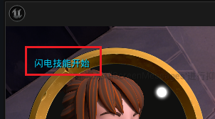
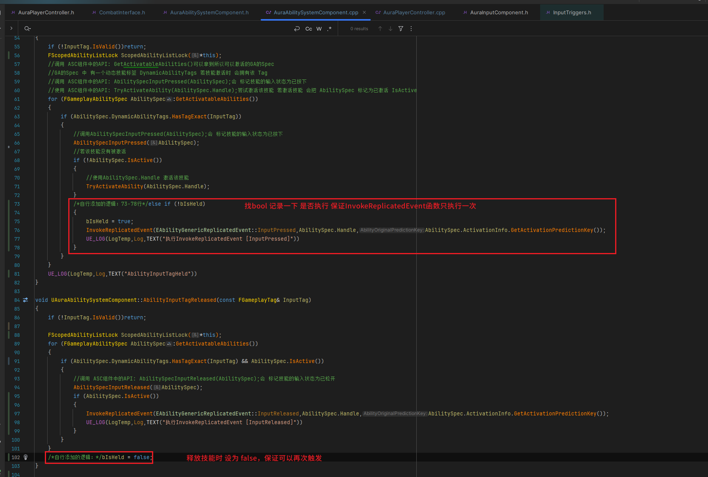

___________________________________________________________________________________________
###### [Go主菜单](../MainMenu.md)
___________________________________________________________________________________________

# GAS 161 GA中使用GAS异步节点  `WaitInputPress` 等 监听输入按键状态（需要在源码中将事件和按键同步服务器）

___________________________________________________________________________________________

## 处理关键点

1. GA中有异步函数可以监听鼠标 `按下` `松开` 的状态
2. 当我在GA开始时调用 `WaitInputRelease` ,收不到监听，但是在GA激活时可以打印，是因为我激活技能时调用的 `AbilitySpecInputReleased(AbilitySpec);` ，没有调用 `InvokeReplicatedEvent`
    - 所以但如果要监听，需要获取技能状态，需要通过服务器
    - 当一个技能在客户端被激活时，通过 `Spec.IsActive()`  知道该技能正在被激活后，调用函数 `InvokeReplicatedEvent` 将这个消息同步并由服务器进行验证，或者广播给其他客户端。
3. 释放持续引导类技能 制作思路：
    - 施法前摇使用 `蒙太奇` 制作
    - 后半段持续施法使用 `状态机` 制作
    - 如果涉及网络，同步数据需要使用 `属性复制` ！

___________________________________________________________________________________________

# 目录


- [GAS 161 GA中使用GAS异步节点  `WaitInputPress` 等 监听输入按键状态（需要在源码中将事件和按键同步服务器）](#gas-161-ga中使用gas异步节点--waitinputpress-等-监听输入按键状态需要在源码中将事件和按键同步服务器)
  - [处理关键点](#处理关键点)
- [目录](#目录)
    - [Mermaid整体思路梳理](#mermaid整体思路梳理)
    - [接下来我们将开始着手制作我们的 `闪电技能`](#接下来我们将开始着手制作我们的-闪电技能)
    - [***BP\_Aura*** 中创建bool 变量](#bp_aura-中创建bool-变量)
    - [ABP中创建一样的bool变量](#abp中创建一样的bool变量)
    - [ABP中设置过渡状态](#abp中设置过渡状态)
    - [接口 `ICombatInterface` 中创建接口函数，设置bool（因为变量是蓝图中的，需要蓝图实现这个函数）](#接口-icombatinterface-中创建接口函数设置bool因为变量是蓝图中的需要蓝图实现这个函数)
    - [GA中有异步函数可以监听鼠标 `按下` `松开` 的状态](#ga中有异步函数可以监听鼠标-按下-松开-的状态)
    - [为了方便测试，我们在 ***BP\_Aura*** 中添加闪电技能为初始技能，并在GA中设置初始输入Tag为 `RMB`](#为了方便测试我们在-bp_aura-中添加闪电技能为初始技能并在ga中设置初始输入tag为-rmb)
    - [测试是否可以收到监听](#测试是否可以收到监听)
      - [应该是收不到消息，只能收到前面这个打印](#应该是收不到消息只能收到前面这个打印)
    - [必须确保重量输入释放有效，所以我们必须这样做](#必须确保重量输入释放有效所以我们必须这样做)
      - [首先在ASC组件 的松开按键的函数中，需要检查，技能是否为激活状态](#首先在asc组件-的松开按键的函数中需要检查技能是否为激活状态)
        - [ASC组件中 `AbilitySpec.IsActive()` 这个激活是什么意思？是已经学习的技能吗](#asc组件中-abilityspecisactive-这个激活是什么意思是已经学习的技能吗)
      - [然后调用函数 `InvokeReplicatedEvent`](#然后调用函数-invokereplicatedevent)
        - [使用场景：当玩家在客户端触发了一项游戏能力，这个函数可以确保该能力事件被正确同步到服务器，并由服务器进行验证或广播给其他客户端。](#使用场景当玩家在客户端触发了一项游戏能力这个函数可以确保该能力事件被正确同步到服务器并由服务器进行验证或广播给其他客户端)
    - [所以综上所述，当一个技能在客户端被激活时，通过 `Spec.IsActive()`  知道该技能正在被激活后，调用函数 `InvokeReplicatedEvent` 将这个消息同步并由服务器进行验证，或者广播给其他客户端。](#所以综上所述当一个技能在客户端被激活时通过-specisactive--知道该技能正在被激活后调用函数-invokereplicatedevent-将这个消息同步并由服务器进行验证或者广播给其他客户端)
    - [打算在ASC中制作一个函数供PC中的 `AbilityInputTagPressed` 来调用，避免多次触发](#打算在asc中制作一个函数供pc中的-abilityinputtagpressed-来调用避免多次触发)
      - [复制 `AbilityInputTagHeld` 逻辑到 `AbilityInputTagPressed` 中](#复制-abilityinputtagheld-逻辑到-abilityinputtagpressed-中)
      - [区别是，这次是检查技能是否激活，激活的话，调用函数 `InvokeReplicatedEvent` 同步服务器](#区别是这次是检查技能是否激活激活的话调用函数-invokereplicatedevent-同步服务器)
      - [然后PC的 `AbilityInputTagPressed` 函数中调用ASC的同名函数](#然后pc的-abilityinputtagpressed-函数中调用asc的同名函数)
    - [测试一下，我们会在松开按键后，触发监听了](#测试一下我们会在松开按键后触发监听了)
    - [监听按键按下](#监听按键按下)
    - [运行测试](#运行测试)
    - [ASC组件的Pressed函数中断点测试，是否只执行一次](#asc组件的pressed函数中断点测试是否只执行一次)
    - ~~[我自己在执行时有些问题：是按键事件触发顺序的问题](#我自己在执行时有些问题是按键事件触发顺序的问题)~~
    - ~~[因为现在的逻辑是：先执行 `AbilityInputTagPressed` 然后判断是否激活（没激活)若激活向服务器同步，然后触发 `AbilityInputTagHeld` 检查到没激活技能，执行激活技能，所以这个向服务器同步激活的事件 `InvokeReplicatedEvent` 无法被调用](#因为现在的逻辑是先执行-abilityinputtagpressed-然后判断是否激活没激活若激活向服务器同步然后触发-abilityinputtagheld-检查到没激活技能执行激活技能所以这个向服务器同步激活的事件-invokereplicatedevent-无法被调用)~~
      - ~~[而 `InvokeReplicatedEvent` 又不能被触发多次，所以需要在客户端上记录是否激活的状态](#而-invokereplicatedevent-又不能被触发多次所以需要在客户端上记录是否激活的状态)~~
      - ~~[正常了](#正常了)~~
    - [最后是对于 GAS\_159 中问题的修复](#最后是对于-gas_159-中问题的修复)


___________________________________________________________________________________________

<details>
<summary>视频链接</summary>

[5. Invoke Replicated Event_哔哩哔哩_bilibili](https://www.bilibili.com/video/BV1TH4y1L7NP/?p=118&spm_id_from=pageDriver&vd_source=9e1e64122d802b4f7ab37bd325a89e6c)

------

</details>

___________________________________________________________________________________________

### Mermaid整体思路梳理

Mermaid

___________________________________________________________________________________________

### 接下来我们将开始着手制作我们的 `闪电技能`

  - 这个技能释放后我们会处于一个持续施法的状态，当我们松开按键后，停止施法

- 我们会使用这个NS特效
>

- 使用这个动画
>


------

### ***BP_Aura*** 中创建bool 变量

  - 命名为：`InShockLoop`

>


------

### ABP中创建一样的bool变量
>


------

### ABP中设置过渡状态
>


------

### 接口 `ICombatInterface` 中创建接口函数，设置bool（因为变量是蓝图中的，需要蓝图实现这个函数）

  - 函数命名为：`SetInShockLoop`

>


------

### GA中有异步函数可以监听鼠标 `按下` `松开` 的状态
>


------

### 为了方便测试，我们在 ***BP_Aura*** 中添加闪电技能为初始技能，并在GA中设置初始输入Tag为 `RMB`
>
>


------

### 测试是否可以收到监听
>


------

#### 应该是收不到消息，只能收到前面这个打印




------

### 必须确保重量输入释放有效，所以我们必须这样做


------

#### 首先在ASC组件 的松开按键的函数中，需要检查，技能是否为激活状态
>


------

##### ASC组件中 `AbilitySpec.IsActive()` 这个激活是什么意思？是已经学习的技能吗
>


------

#### 然后调用函数 `InvokeReplicatedEvent`
>```cpp
>InvokeReplicatedEvent(EAbilityGenericReplicatedEvent::InputReleased,AbilitySpec.Handle,AbilitySpec.ActivationInfo.GetActivationPredictionKey());
>```
>
>


------

##### 使用场景：当玩家在客户端触发了一项游戏能力，这个函数可以确保该能力事件被正确同步到服务器，并由服务器进行验证或广播给其他客户端。
>


------

### 所以综上所述，当一个技能在客户端被激活时，通过 `Spec.IsActive()`  知道该技能正在被激活后，调用函数 `InvokeReplicatedEvent` 将这个消息同步并由服务器进行验证，或者广播给其他客户端。
>


------

### 打算在ASC中制作一个函数供PC中的 `AbilityInputTagPressed` 来调用，避免多次触发

  - 创建函数命名为：`AbilityInputTagPressed`

>
>
>


------

#### 复制 `AbilityInputTagHeld` 逻辑到 `AbilityInputTagPressed` 中
>


------

#### 区别是，这次是检查技能是否激活，激活的话，调用函数 `InvokeReplicatedEvent` 同步服务器
>
>
>```cpp
>void UAuraAbilitySystemComponent::AbilityInputTagPressed(const FGameplayTag& InputTag)
>{
>	if (!InputTag.IsValid())return;
>	
>	for (FGameplayAbilitySpec AbilitySpec:GetActivatableAbilities())
>	{
>		if (AbilitySpec.DynamicAbilityTags.HasTagExact(InputTag))
>		{
>			//调用 ASC组件中的API: AbilitySpecInputReleased(AbilitySpec);会 标记技能的输入状态为已松开
>			AbilitySpecInputPressed(AbilitySpec);
>			if (AbilitySpec.IsActive())
>			{
>				InvokeReplicatedEvent(EAbilityGenericReplicatedEvent::InputPressed,AbilitySpec.Handle,AbilitySpec.ActivationInfo.GetActivationPredictionKey());
>			}
>		}
>	}
>}
>```


------

#### 然后PC的 `AbilityInputTagPressed` 函数中调用ASC的同名函数
>


------

### 测试一下，我们会在松开按键后，触发监听了
>


------

### 监听按键按下
>


------

### 运行测试
>


------

### ASC组件的Pressed函数中断点测试，是否只执行一次
>

------

### 我自己在执行时有些问题：是按键事件触发顺序的问题

> 会先融发 `Start` 然后触发 `Triggered`
>
> 项目中映射的名字有点不同：
>
> | ETriggerEvent类型 | 对应事件名字            |
> | ----------------- | ----------------------- |
> | Started           | AbilityInputTagPressed  |
> | Triggered         | AbilityInputTagHeld     |
> | Completed         | AbilityInputTagReleased |
>
> - 下面是源码
>
>   
>
> 我打印测试如下位置：
>
> 
>
> 按下按键持续一小会儿后释放按键，打印结果：
>
> 
>
> 我们在触发Trigger时也就是打印的第3个函数中学习了技能：
>
> 
>
> ## 所以当走到第一个函数中时，技能没有激活，永远无法向服务器同步（因为需要一个预测密钥，而预测密钥必须激活技能后才会生成在GA的Spec中）
>
> 

### 因为现在的逻辑是：先执行 `AbilityInputTagPressed` 然后判断是否激活（没激活)若激活向服务器同步，然后触发 `AbilityInputTagHeld` 检查到没激活技能，执行激活技能，所以这个向服务器同步激活的事件 `InvokeReplicatedEvent` 无法被调用

#### 而 `InvokeReplicatedEvent` 又不能被触发多次，所以需要在客户端上记录是否激活的状态

> 

#### 正常了

> 


------

### 最后是对于 GAS_159 中问题的修复

___________________________________________________________________________________________

[返回最上面](#Go主菜单)

___________________________________________________________________________________________