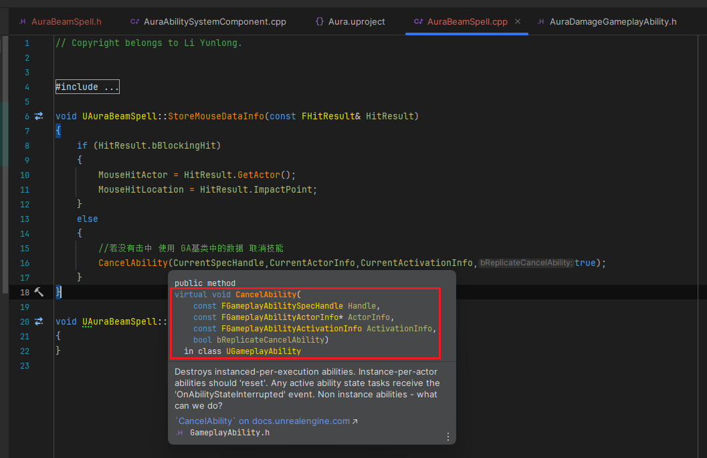
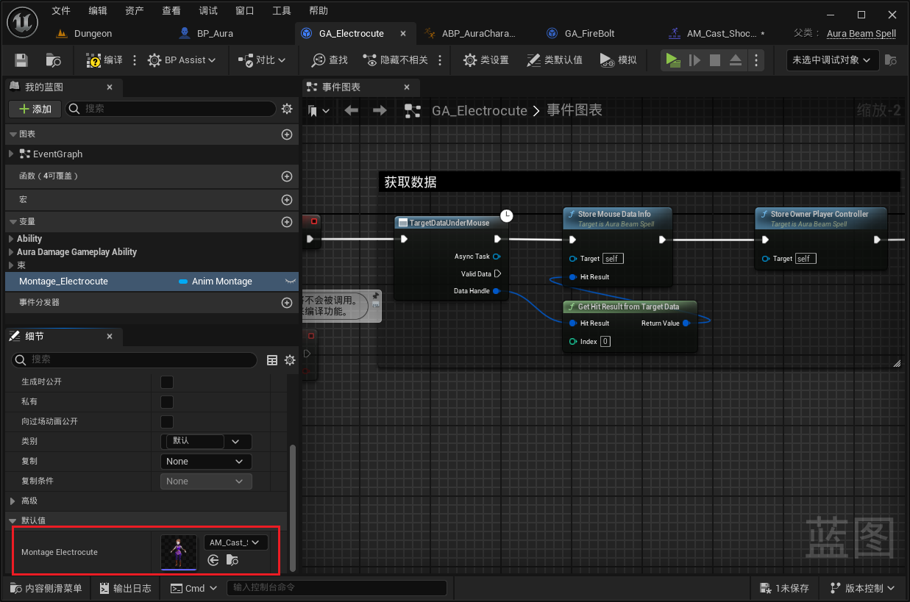
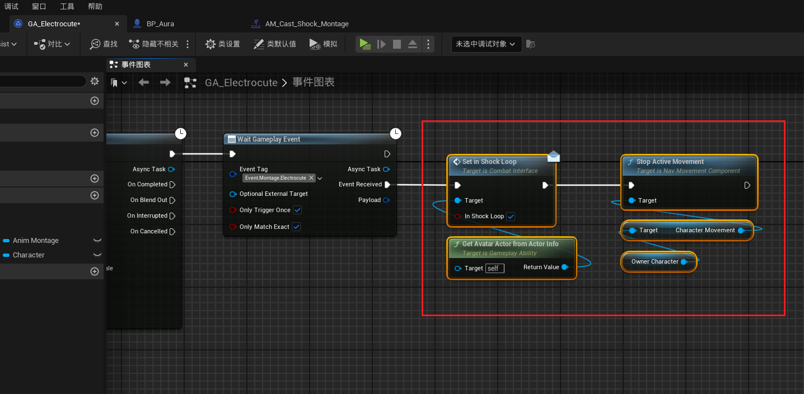

___________________________________________________________________________________________
###### [Go主菜单](../MainMenu.md)
___________________________________________________________________________________________

# GAS 162 创建闪电技能C++类；创建并使用释放技能蒙太奇；处理释放持续引导类技能时，禁用角色移动

___________________________________________________________________________________________

## 处理关键点

1. 取消技能API： `CancelAbility();`
2. 通过角色移动组件 `CharacterMovementComponent` ： `启用` / `禁用` 移动的方式
3. 关于使用蒙太奇，有两种框架设计上处理的方式
   - 项目中可能使用的：
     - 创建接口函数：可以通过接口来实现这种功能。接口可以用于定义一个函数，专门用来获取触电蒙太奇。所有角色类都可以实现这个接口，确保每个角色都有触电蒙太奇的动画设置。
   - 个人简化版本：
     - 简化的实现方式：如果不想为每个角色类都创建接口，可以在**电击游戏能力（Electrocute Ability）**中直接设置一个变量，用来存储触电蒙太奇。

___________________________________________________________________________________________

# 目录


- [GAS 162 创建闪电技能C++类；创建并使用释放技能蒙太奇；处理释放持续引导类技能时，禁用角色移动](#gas-162-创建闪电技能c类创建并使用释放技能蒙太奇处理释放持续引导类技能时禁用角色移动)
  - [处理关键点](#处理关键点)
- [目录](#目录)
    - [Mermaid整体思路梳理](#mermaid整体思路梳理)
    - [需要创建一个闪电技能的C++类，因为会涉及到一些计算，调用蓝图可调用函数的性能更高](#需要创建一个闪电技能的c类因为会涉及到一些计算调用蓝图可调用函数的性能更高)
    - [创建闪电技能的C++类继承自 `AuraDamageGameplayAbility`](#创建闪电技能的c类继承自-auradamagegameplayability)
    - [修改蓝图父类](#修改蓝图父类)
    - [当我们点击时，需要获取目标地点的数据。可以使用之前的异步节点 `TargetDataUnderMouse`](#当我们点击时需要获取目标地点的数据可以使用之前的异步节点-targetdataundermouse)
    - [在C++中创建蓝图调用函数，传参到C++，需要几个参数：](#在c中创建蓝图调用函数传参到c需要几个参数)
      - [`StoreMouseDataInfo` 函数中，如果 `HitResult` 击中了目标，设置两个变量，如果没击中，需要取消技能，使用API：`CancelAbility();`](#storemousedatainfo-函数中如果-hitresult-击中了目标设置两个变量如果没击中需要取消技能使用apicancelability)
      - [`StoreOwnerPlayerController` 函数中，需要设置PC可以使用 `CurrentActorInfo` 中的PC的弱指针设置](#storeownerplayercontroller-函数中需要设置pc可以使用-currentactorinfo-中的pc的弱指针设置)
      - [蓝图中调用](#蓝图中调用)
        - [加上备注：这里是获取数据部分](#加上备注这里是获取数据部分)
    - [执行完后，就获取到了PC，此时可以处理显示/隐藏鼠标的逻辑](#执行完后就获取到了pc此时可以处理显示隐藏鼠标的逻辑)
    - [测试一下，应该正常](#测试一下应该正常)
    - [关于使用蒙太奇，有两种框架设计上处理的方式](#关于使用蒙太奇有两种框架设计上处理的方式)
      - [这里使用个人简化版本。创建蒙太奇变量，用于播放蒙太奇](#这里使用个人简化版本创建蒙太奇变量用于播放蒙太奇)
    - [下一节，我们将制作播放蒙太奇](#下一节我们将制作播放蒙太奇)
    - [需要先制作蒙太奇动画，并配置，然后配置变量](#需要先制作蒙太奇动画并配置然后配置变量)
      - [创建蒙太奇，命名为：`AM_Cast_Electrocute`](#创建蒙太奇命名为am_cast_electrocute)
        - [使用的动画素材](#使用的动画素材)
        - [要使用 `MotionWarping` 所以记得把 `攻击开始` 的动画设置为开启 `根运动`](#要使用-motionwarping-所以记得把-攻击开始-的动画设置为开启-根运动)
        - [配置 `MotionWarping` 和EventTag，但是没有闪电技能的Tag，需要添加一个 `EventTag`](#配置-motionwarping-和eventtag但是没有闪电技能的tag需要添加一个-eventtag)
          - [添加 闪电技能的 `EventTag` 并配置](#添加-闪电技能的-eventtag-并配置)
      - [蓝图中配置蒙太奇](#蓝图中配置蒙太奇)
      - [现在还需要更新 `MotionWarping` 的 `WarpingTarget`](#现在还需要更新-motionwarping-的-warpingtarget)
        - [但是，我们已经在代码里更新了接口函数，蓝图中，不用判断目标是否实现接口，修改这里的使用方式](#但是我们已经在代码里更新了接口函数蓝图中不用判断目标是否实现接口修改这里的使用方式)
      - [然后播放蒙太奇](#然后播放蒙太奇)
    - [运行测试，但是人物鬼畜gif](#运行测试但是人物鬼畜gif)
      - [看下原因，是因为动画太短了，被混入混出的时间覆盖，设置一下，缩短混入混出时间尝试](#看下原因是因为动画太短了被混入混出的时间覆盖设置一下缩短混入混出时间尝试)
    - [运行测试：这次可以了](#运行测试这次可以了)
    - [闪电技能GA中需要先判断是否实现了 `ICombatInterface` 接口，可以折叠成一个函数](#闪电技能ga中需要先判断是否实现了-icombatinterface-接口可以折叠成一个函数)
    - [我们现在需要设置角色身上的持续释放技能的bool，当然不能直接拿，之前我们创建了接口函数，但是还没有蓝图实现](#我们现在需要设置角色身上的持续释放技能的bool当然不能直接拿之前我们创建了接口函数但是还没有蓝图实现)
    - [当播放蒙太奇后，立即设置状态](#当播放蒙太奇后立即设置状态)
    - [但是现在有一个问题，我们释放技能的时候可以移动](#但是现在有一个问题我们释放技能的时候可以移动)
      - [需要在释放技能后禁用移动](#需要在释放技能后禁用移动)
        - [可以使用移动组件禁用](#可以使用移动组件禁用)
      - [在松开按键后也需要 启用移动组件，但是没有启动的API，只有设置移动模式的API](#在松开按键后也需要-启用移动组件但是没有启动的api只有设置移动模式的api)
    - [测试一下](#测试一下)
      - [有一个问题：我们在关闭之后再开启，没有启用 `MotionWarping`](#有一个问题我们在关闭之后再开启没有启用-motionwarping)
    - [我们使用 `WaitGameplayEvent` 来触发操作](#我们使用-waitgameplayevent-来触发操作)
    - [运行测试gif：使用技能后，再使用，依旧会触发 `MotionWarping`](#运行测试gif使用技能后再使用依旧会触发-motionwarping)
    - [下面是整理成函数](#下面是整理成函数)
      - [将结束的部分整理成一个节点](#将结束的部分整理成一个节点)
      - [开始的部分也整理成函数](#开始的部分也整理成函数)
      - [设置 `FacingTarget` 的部分也是](#设置-facingtarget-的部分也是)
    - [运行测试，释放技能期间禁用移动，释放按键后正常移动](#运行测试释放技能期间禁用移动释放按键后正常移动)


___________________________________________________________________________________________

<details>
<summary>视频链接</summary>

[6. Aura Beam Spell_哔哩哔哩_bilibili](https://www.bilibili.com/video/BV1TH4y1L7NP/?p=119&spm_id_from=pageDriver&vd_source=9e1e64122d802b4f7ab37bd325a89e6c)

[7. Electrocute Montage_哔哩哔哩_bilibili](https://www.bilibili.com/video/BV1TH4y1L7NP?p=120&vd_source=9e1e64122d802b4f7ab37bd325a89e6c)

------

</details>

___________________________________________________________________________________________

### Mermaid整体思路梳理

Mermaid

___________________________________________________________________________________________


------

### 需要创建一个闪电技能的C++类，因为会涉及到一些计算，调用蓝图可调用函数的性能更高


------

### 创建闪电技能的C++类继承自 `AuraDamageGameplayAbility`

  - 命名为：`AuraBeamSpell`

>


------

### 修改蓝图父类
>


------

### 当我们点击时，需要获取目标地点的数据。可以使用之前的异步节点 `TargetDataUnderMouse`
>


------

### 在C++中创建蓝图调用函数，传参到C++，需要几个参数：

  - PC(用于隐藏/显示鼠标)

    - 函数命名为：`StoreOwnerPlayerController`

    - 变量命名为：`OwnerPlayerController`

  - 可以使用FHitResult设置 FVector 和 AActor*

    - 鼠标点击的敌人指针
      - 变量命名为：`MouseHitActor`

    - 鼠标点击地点
      - 变量命名为：`MouseHitLocation`

    - 函数命名为：`StoreMouseDataInfo`

>
>
>- ### 下面是 `AuraBeamSpell` 头文件：
>
>```cpp
>// Copyright belongs to Li Yunlong.
>
>#pragma once
>
>#include "CoreMinimal.h"
>#include "AbilitySystem/Abilities/AuraDamageGameplayAbility.h"
>#include "AuraBeamSpell.generated.h"
>
>/**
> * 
> */
>UCLASS()
>class AURA_API UAuraBeamSpell : public UAuraDamageGameplayAbility
>{
>	GENERATED_BODY()
>public:
>	
>	UFUNCTION(BlueprintCallable)
>	void StoreMouseDataInfo(const FHitResult& HitResult);
>	
>	UFUNCTION(BlueprintCallable)
>	void StoreOwnerPlayerController();
>	
>protected:
>
>	//鼠标点击的敌人指针
>	UPROPERTY(BlueprintReadWrite, Category = "Beam")
>	TObjectPtr<AActor> MouseHitActor;
>	//鼠标点击地点
>	UPROPERTY(BlueprintReadWrite, Category = "Beam")
>	FVector MouseHitLocation = FVector::ZeroVector;
>	
>	//PC(用于隐藏/显示鼠标)
>	UPROPERTY(BlueprintReadWrite, Category = "Beam")
>	TObjectPtr<APlayerController> OwnerPlayerController;
>	
>private:
>	
>};
>```


------

#### `StoreMouseDataInfo` 函数中，如果 `HitResult` 击中了目标，设置两个变量，如果没击中，需要取消技能，使用API：`CancelAbility();`

  - 需要传几个参数

>
>
>```cpp
>void UAuraBeamSpell::StoreMouseDataInfo(const FHitResult& HitResult)
>{
>    if (HitResult.bBlockingHit)
>    {
>       MouseHitActor = HitResult.GetActor();
>       MouseHitLocation = HitResult.ImpactPoint;
>    }
>    else
>    {
>       //若没有击中 使用 GA基类中的数据 取消技能
>       CancelAbility(CurrentSpecHandle,CurrentActorInfo,CurrentActivationInfo,true);
>    }
>}
>```
>
>


------

#### `StoreOwnerPlayerController` 函数中，需要设置PC可以使用 `CurrentActorInfo` 中的PC的弱指针设置
>
>
>```cpp
>void UAuraBeamSpell::StoreOwnerPlayerController()
>{
>    if (CurrentActorInfo && CurrentActorInfo->PlayerController.IsValid())
>    {
>       OwnerPlayerController = CurrentActorInfo->PlayerController.Get();
>    }
>}
>```


------

#### 蓝图中调用
>


------

##### 加上备注：这里是获取数据部分
>


------

### 执行完后，就获取到了PC，此时可以处理显示/隐藏鼠标的逻辑

  - 当释放按键时，重新显示鼠标，并结束技能

>


------

### 测试一下，应该正常


------

### 关于使用蒙太奇，有两种框架设计上处理的方式

  - 项目中可能使用的：

    - 创建接口函数：可以通过接口来实现这种功能。接口可以用于定义一个函数，专门用来获取触电蒙太奇。所有角色类都可以实现这个接口，确保每个角色都有触电蒙太奇的动画设置。
      - 例如，如果你有一个元素师接口（Elementalist Interface），你可以为它创建一个函数来返回触电时播放的蒙太奇。

    - 大型项目的专门化：在大型项目中，可能需要对不同角色进行专门化设计，即每个角色类可以有自己的接口，这样每个类都有适合自己的动画蒙太奇。这个设计有助于项目结构的清晰性和扩展性。

  - 个人简化版本：
    - 简化的实现方式：如果不想为每个角色类都创建接口，可以在**电击游戏能力（Electrocute Ability）**中直接设置一个变量，用来存储触电蒙太奇。
      - 通过这种方式，如果你为不同的敌人派生了不同的触电游戏能力类（Electrocute Ability），你可以在派生类中为每个敌人设置不同的蒙太奇动画。这种方法更灵活，可以针对不同敌人定制化触电动画。


------

#### 这里使用个人简化版本。创建蒙太奇变量，用于播放蒙太奇

  - 变量命名为：`Montage_Electrocute`

>


------

### 下一节，我们将制作播放蒙太奇


------

### 需要先制作蒙太奇动画，并配置，然后配置变量


------

#### 创建蒙太奇，命名为：`AM_Cast_Electrocute` 


------

##### 使用的动画素材
>


------

##### 要使用 `MotionWarping` 所以记得把 `攻击开始` 的动画设置为开启 `根运动`
>


------

##### 配置 `MotionWarping` 和EventTag，但是没有闪电技能的Tag，需要添加一个 `EventTag` 
>
>


------

###### 添加 闪电技能的 `EventTag` 并配置

- 直接在项目设置里添加了
>`Event.Montage.Electrocute`
>
>

- 配置 `EventTag` 
>


------

#### 蓝图中配置蒙太奇
>


------

#### 现在还需要更新 `MotionWarping` 的 `WarpingTarget`

- 我们之前在火球技能里面是这么实现的
>

- 沿用一下
>


------

##### 但是，我们已经在代码里更新了接口函数，蓝图中，不用判断目标是否实现接口，修改这里的使用方式
>


------

#### 然后播放蒙太奇
>


------

### 运行测试，但是人物鬼畜gif

> 


------

#### 看下原因，是因为动画太短了，被混入混出的时间覆盖，设置一下，缩短混入混出时间尝试
>


------

### 运行测试：这次可以了

------

### 闪电技能GA中需要先判断是否实现了 `ICombatInterface` 接口，可以折叠成一个函数

  - 折叠的函数命名为：`EnforcelmplementsCombatInterface`

>


------

### 我们现在需要设置角色身上的持续释放技能的bool，当然不能直接拿，之前我们创建了接口函数，但是还没有蓝图实现

- 之前在这里创建
>

- 蓝图实现
>


------

### 当播放蒙太奇后，立即设置状态
>
>
>上图这样是不行的，因为会先播放蒙太奇，再切换状态，会导致动画鬼畜
>
>- 需要先切换状态
>
>


------

### 但是现在有一个问题，我们释放技能的时候可以移动

> 


------

#### 需要在释放技能后禁用移动


------

##### 可以使用移动组件禁用
>


------

#### 在松开按键后也需要 启用移动组件，但是没有启动的API，只有设置移动模式的API
>
>
>
>
>## 上图禁用移动的节点用错了，用成了 `StopActiveMoveMent`，应该用 `DisableMovement`


------

### 测试一下

------

#### 有一个问题：我们在关闭之后再开启，没有启用 `MotionWarping`

  - 因为还没有接收到 `MotionWarping` 时，就已经触发了后面的逻辑，然后再接收的话，已经不起作用了
>


------

### 我们使用 `WaitGameplayEvent` 来触发操作
>
>
>
>
>## 上图禁用移动的节点用错了，用成了 `StopActiveMoveMent`，应该用 `DisableMovement`


------

### 运行测试gif：使用技能后，再使用，依旧会触发 `MotionWarping`
>终于没啥问题了


------

### 下面是整理成函数


------

#### 将结束的部分整理成一个节点 

  - 函数命名为：`PrepareToEndAbility`

>


------

#### 开始的部分也整理成函数

  - 函数命名为：`InShockLoop`

>
>
>## 上图禁用移动的节点用错了，用成了 `StopActiveMoveMent`，应该用 `DisableMovement`


------

#### 设置 `FacingTarget` 的部分也是

  - 函数命名为：`UpdateFacingTarget`

>

------

### 运行测试，释放技能期间禁用移动，释放按键后正常移动

___________________________________________________________________________________________

[返回最上面](#Go主菜单)

___________________________________________________________________________________________