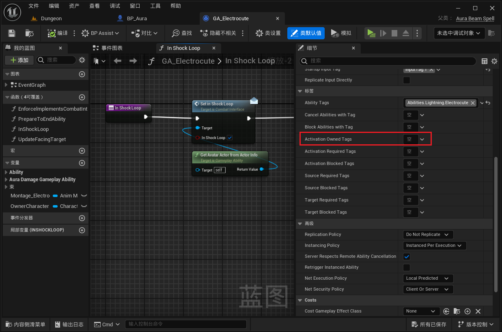
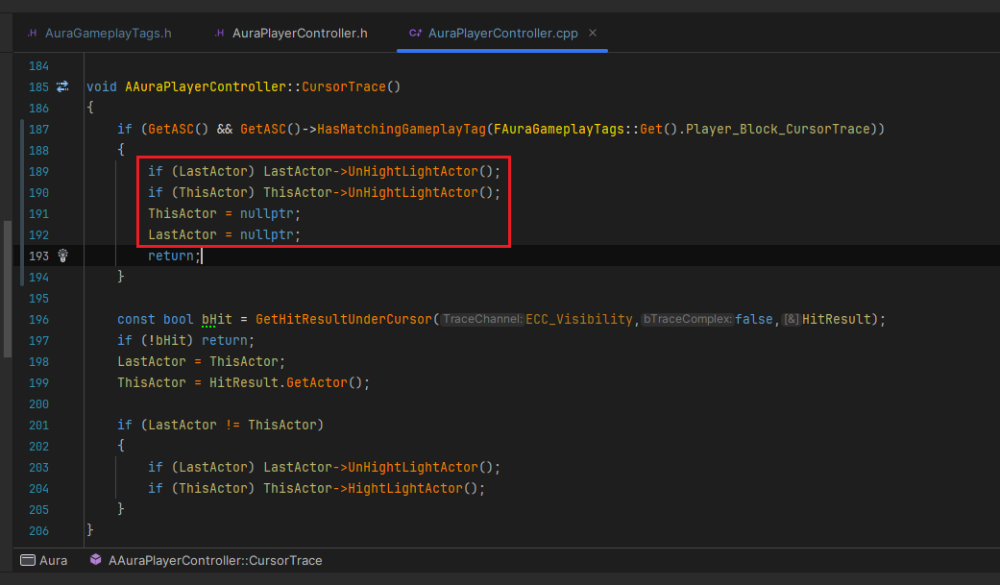

___________________________________________________________________________________________
###### [Go主菜单](../MainMenu.md)
___________________________________________________________________________________________

# GAS 163 创建阻挡按键Tag在释放技能阶段阻止某些按键状态

___________________________________________________________________________________________

## 处理关键点

1. 使用自定义逻辑判断，制作释放技能时阻止某些按键状态
2. GA中的 `ActivationOwnedTags` 可以让技能在激活时，为ASC组件添加指定Tag标签，技能结束时自动移除

___________________________________________________________________________________________

# 目录


- [GAS 163 创建阻挡按键Tag在释放技能阶段阻止某些按键状态](#gas-163-创建阻挡按键tag在释放技能阶段阻止某些按键状态)
  - [处理关键点](#处理关键点)
- [目录](#目录)
    - [Mermaid整体思路梳理](#mermaid整体思路梳理)
    - [现在有一个bug：当我们正在释放闪电技能（持续施法中）时，按下火球技能的按键，会生成火球。（也就是技能之间没有互相阻挡和打断）](#现在有一个bug当我们正在释放闪电技能持续施法中时按下火球技能的按键会生成火球也就是技能之间没有互相阻挡和打断)
    - [打算使用Tag来阻挡技能](#打算使用tag来阻挡技能)
      - [创建四个Tag，用于阻挡 `玩家输入类型` 和 `点击时的射线检测`](#创建四个tag用于阻挡-玩家输入类型-和-点击时的射线检测)
    - [在PC的 `CursorTrace` 函数中，检查如果包含了  `阻挡点击时的射线检测` 标签，就返回，并将数据归零](#在pc的-cursortrace-函数中检查如果包含了--阻挡点击时的射线检测-标签就返回并将数据归零)
    - [同理，其他三个Tag也需要设置阻挡](#同理其他三个tag也需要设置阻挡)
      - [除此之外，移动函数也需要做限制](#除此之外移动函数也需要做限制)
      - [但是目前没有在任何地方设置阻挡标签](#但是目前没有在任何地方设置阻挡标签)
    - [为技能添加 阻挡标签](#为技能添加-阻挡标签)
    - [测试运行测试gif：可以看到左键点击生成的NS，但是无法移动了](#测试运行测试gif可以看到左键点击生成的ns但是无法移动了)
    - [如果没有 `阻挡按下按键` 可以生成NS](#如果没有-阻挡按下按键-可以生成ns)
    - [再运行，就解决了，按键时彼此的冲突问题](#再运行就解决了按键时彼此的冲突问题)


___________________________________________________________________________________________

<details>
<summary>视频链接</summary>

[8. Player Block Tags_哔哩哔哩_bilibili](https://www.bilibili.com/video/BV1TH4y1L7NP/?p=121&spm_id_from=pageDriver)

------

</details>

___________________________________________________________________________________________

### Mermaid整体思路梳理

Mermaid

___________________________________________________________________________________________

### 现在有一个bug：当我们正在释放闪电技能（持续施法中）时，按下火球技能的按键，会生成火球。（也就是技能之间没有互相阻挡和打断）
>


------

### 打算使用Tag来阻挡技能

  - `ActivationOwnedTags` 应用于所有者的标签。

    - 因此，如果此功能处于活动状态，我们可以给出一个或两个或三个标签，或者我们想要的任意多个标签，到能力系统组件

    - 现在这非常有用，因为我们的玩家控制器可以检查我们的能力系统组件，看看它是否有任何标签。

    - 所以我想创建一些标签专门用于禁用某些功能，例如输入按下，输入释放，输入保持，然后我们可以将任意数量的这些标签添加到我们的能力中系统组件，当我们处于这种触电能力时，当它处于活动状态时。

>


------

#### 创建四个Tag，用于阻挡 `玩家输入类型` 和 `点击时的射线检测`

  - 属于玩家标签下，因为是基于玩家操作的

>```cpp
>/*
> * 阻挡按键输入的Tag
> */
>//阻挡 按下
>FGameplayTag Player_Block_InputPressed;
>//阻挡 长按
>FGameplayTag Player_Block_InputHeld;
>//阻挡 松开
>FGameplayTag Player_Block_InputReleased;
>//阻挡 射线检测
>FGameplayTag Player_Block_CursorTrace;
>```
>
>

>
>
>```CPP
>/*
> * 阻挡按键输入的Tag
> */
>GameplayTags.Player_Block_InputPressed = UGameplayTagsManager::Get().AddNativeGameplayTag(
>    FName("Player.Block.InputPressed"),
>    FString("Player Block InputPressed"));
>
>GameplayTags.Player_Block_InputHeld = UGameplayTagsManager::Get().AddNativeGameplayTag(
>    FName("Player.Block.InputHeld"),
>    FString("Player Block InputHeld"));
>
>GameplayTags.Player_Block_InputReleased = UGameplayTagsManager::Get().AddNativeGameplayTag(
>    FName("Player.Block.InputReleased"),
>    FString("Player Block InputReleased"));
>
>GameplayTags.Player_Block_CursorTrace = UGameplayTagsManager::Get().AddNativeGameplayTag(
>    FName("Player.Block.CursorTrace"),
>    FString("Player Block CursorTrace"));
>```


------

### 在PC的 `CursorTrace` 函数中，检查如果包含了  `阻挡点击时的射线检测` 标签，就返回，并将数据归零
>

- 将数据归零
>


------

### 同理，其他三个Tag也需要设置阻挡
>
>


------

#### 除此之外，移动函数也需要做限制
>


------

#### 但是目前没有在任何地方设置阻挡标签

------

### 为技能添加 阻挡标签

  - 不阻挡 `鼠标下射线检测标签`
    - 因为要选中敌人

  - 不阻挡 `释放按键标签`
    - 因为要取消技能

>


------

### 测试运行测试gif：可以看到左键点击生成的NS，但是无法移动了
>


------

### 如果没有 `阻挡按下按键` 可以生成NS
>


------

### 再运行，就解决了，按键时彼此的冲突问题

___________________________________________________________________________________________

[返回最上面](#Go主菜单)

___________________________________________________________________________________________