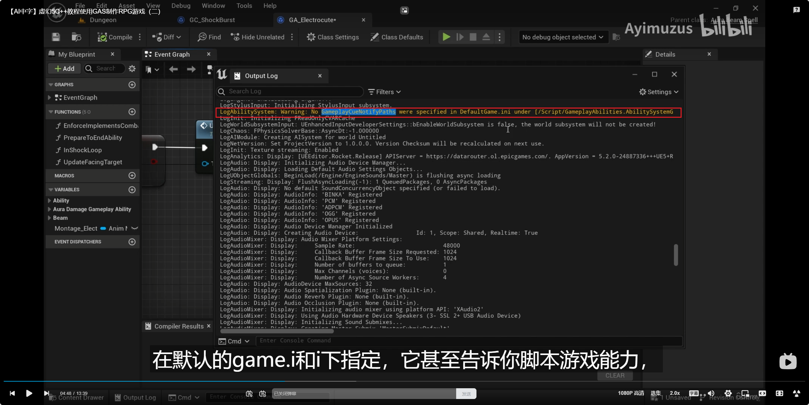

___________________________________________________________________________________________
###### [Go主菜单](../MainMenu.md)
___________________________________________________________________________________________

# GAS 164 创建 `cue Static` 项目中索引优化cue的路径，在心情文件中并配置；参考lyra在配置文件中修改，RPC最大通信数量为10

___________________________________________________________________________________________

## 处理关键点

1. 在 `DefaultGame.ini` 中手动设置cue的索引路径对大型项目的优化
2. cue激活需要重写的函数和流程
3. 参考 `Lyra` 设置 `最大RPC数量`

___________________________________________________________________________________________

# 目录


- [GAS 164 创建 `cue Static` 项目中索引优化cue的路径，在心情文件中并配置；参考lyra在配置文件中修改，RPC最大通信数量为10](#gas-164-创建-cue-static-项目中索引优化cue的路径在心情文件中并配置参考lyra在配置文件中修改rpc最大通信数量为10)
  - [处理关键点](#处理关键点)
- [目录](#目录)
    - [Mermaid整体思路梳理](#mermaid整体思路梳理)
    - [这一节，我们将着手为技能制作提示（比如生成特效）](#这一节我们将着手为技能制作提示比如生成特效)
    - [创建一个 `GameplayCueNotify_Static`](#创建一个-gameplaycuenotify_static)
    - [重写 `OnExecute` ，并在角色的位置播放音效](#重写-onexecute-并在角色的位置播放音效)
      - [但是缺少一个 `CueTag` 来触发，所以需要创建一个](#但是缺少一个-cuetag-来触发所以需要创建一个)
      - [项目设置中创建一个，并配置](#项目设置中创建一个并配置)
    - [在激活技能后，触发蒙太奇前，可以调用 `ExecuteGameplaycueOnOwner` 函数来通知 `Cue`](#在激活技能后触发蒙太奇前可以调用-executegameplaycueonowner-函数来通知-cue)
      - [这个函数的Context即使不设置，在触发 `cue` 后 会根据上下文和使用者 `AvatarActor` 设置 `cue` 的 `Owner`](#这个函数的context即使不设置在触发-cue-后-会根据上下文和使用者-avataractor-设置-cue-的-owner)
    - [运行游戏后会受到一个警告](#运行游戏后会受到一个警告)
      - [意思是，当游戏运行时，我们会从整个项目中查找 `GameplayCue` 的 `蓝图类文件` ，大型项目比较费时，建议整合一个大文件夹来单独处理（优化）](#意思是当游戏运行时我们会从整个项目中查找-gameplaycue-的-蓝图类文件-大型项目比较费时建议整合一个大文件夹来单独处理优化)
    - [创建 `Cue` 的文件夹](#创建-cue-的文件夹)
      - [将用到的 `Cue` 挪到这个文件夹中](#将用到的-cue-挪到这个文件夹中)
      - [在 `DefaultGame.ini` 中指定路径](#在-defaultgameini-中指定路径)
    - [下面需要检查并修改 `最大RPC更新数量`](#下面需要检查并修改-最大rpc更新数量)
      - [全局索引 `MaxRPCPerNetUpdate`](#全局索引-maxrpcpernetupdate)
      - [在这里断点，检查运行时， `MaxRPCPerNetUpdate` 这个值被设置为多少(不是源码版引擎断点不了引擎源码！)](#在这里断点检查运行时-maxrpcpernetupdate-这个值被设置为多少不是源码版引擎断点不了引擎源码)
      - [`DefaultEngine.ini` 中修改 `最大RPC更新数量` 为 `10`（参考Lyra设置的，建议不要超过10！）](#defaultengineini-中修改-最大rpc更新数量-为-10参考lyra设置的建议不要超过10)
      - [在运行就会发现 这个修改为了 `10`](#在运行就会发现-这个修改为了-10)
    - [我们每秒可以接收 60 到 100 次网络更新，取决于带宽和游戏中发生的情况。所以，你知道，你不需要超过10个！！](#我们每秒可以接收-60-到-100-次网络更新取决于带宽和游戏中发生的情况所以你知道你不需要超过10个)
    - [接下来，可以设置将开始释放闪电的动画调慢一些，混入也慢一些，配合音效](#接下来可以设置将开始释放闪电的动画调慢一些混入也慢一些配合音效)


___________________________________________________________________________________________

<details>
<summary>视频链接</summary>

[9. GameplayCue Notify Paths_哔哩哔哩_bilibili](https://www.bilibili.com/video/BV1TH4y1L7NP/?p=122&spm_id_from=pageDriver&vd_source=9e1e64122d802b4f7ab37bd325a89e6c)

------

</details>

___________________________________________________________________________________________

### Mermaid整体思路梳理

Mermaid

___________________________________________________________________________________________

### 这一节，我们将着手为技能制作提示（比如生成特效）


------

### 创建一个 `GameplayCueNotify_Static`

  - 在这个技能路径下
>

  - 命名为：***GC_ShockBurst***


------

### 重写 `OnExecute` ，并在角色的位置播放音效

  - 可以使用这个音效
>

>


------

#### 但是缺少一个 `CueTag` 来触发，所以需要创建一个
>


------

#### 项目设置中创建一个，并配置
>`GameplayCue.ShockBurst`
>
>
>


------

### 在激活技能后，触发蒙太奇前，可以调用 `ExecuteGameplaycueOnOwner` 函数来通知 `Cue`
>
>
>


------

#### 这个函数的Context即使不设置，在触发 `cue` 后 会根据上下文和使用者 `AvatarActor` 设置 `cue` 的 `Owner`
>
>


------

### 运行游戏后会受到一个警告
>我没有收到这个警告不知道是不是5.3修复了
>
>


------

#### 意思是，当游戏运行时，我们会从整个项目中查找 `GameplayCue` 的 `蓝图类文件` ，大型项目比较费时，建议整合一个大文件夹来单独处理（优化）


------

### 创建 `Cue` 的文件夹

- 在这个路径下
>`GameplayCueNotifies`
>
>


------

#### 将用到的 `Cue` 挪到这个文件夹中
>


------

#### 在 `DefaultGame.ini` 中指定路径
>
>

```ini
+GameplayCueNotifyPaths=/Game/BP/Abilitysystem/GameplayCueNotifies
```

- 这里的Game就相当于项目中的Content文件夹
- 也可以指定多个路径，复制这一行然后修改路径即可：`+GameplayCueNotifyPaths=/Game/BP/Abilitysystem/GameplayCueNotifies`


------

### 下面需要检查并修改 `最大RPC更新数量`

  - 每次网络更新可以发送的数量是有限的。我想看看这个限制是多少


------

#### 全局索引 `MaxRPCPerNetUpdate`
>


------

#### 在这里断点，检查运行时， `MaxRPCPerNetUpdate` 这个值被设置为多少(不是源码版引擎断点不了引擎源码！)
>

- 可以看到最大数量限制是 `2`，这是 `可以发送的 RPC 数量` ，每次网络更新可以发送的数量。
>

- 有点低。我们可以增加到大约 10。lyra 游戏项目将其设置为 10.


------

#### `DefaultEngine.ini` 中修改 `最大RPC更新数量` 为 `10`（参考Lyra设置的，建议不要超过10！）
>
>
>
>
>```ini
>[ConsoleVariables]
>net.MaxRPCPerNetUpdate=10
>```


------

#### 在运行就会发现 这个修改为了 `10`
>


------

### 我们每秒可以接收 60 到 100 次网络更新，取决于带宽和游戏中发生的情况。所以，你知道，你不需要超过10个！！


------

### 接下来，可以设置将开始释放闪电的动画调慢一些，混入也慢一些，配合音效
>

___________________________________________________________________________________________

[返回最上面](#Go主菜单)

___________________________________________________________________________________________