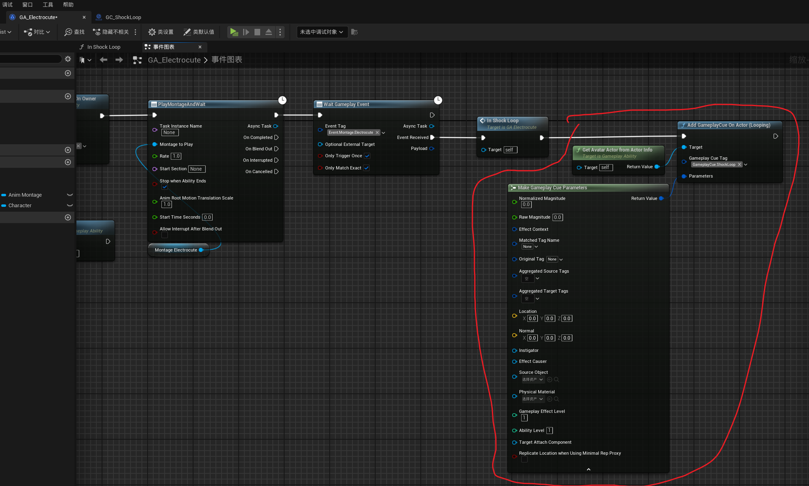
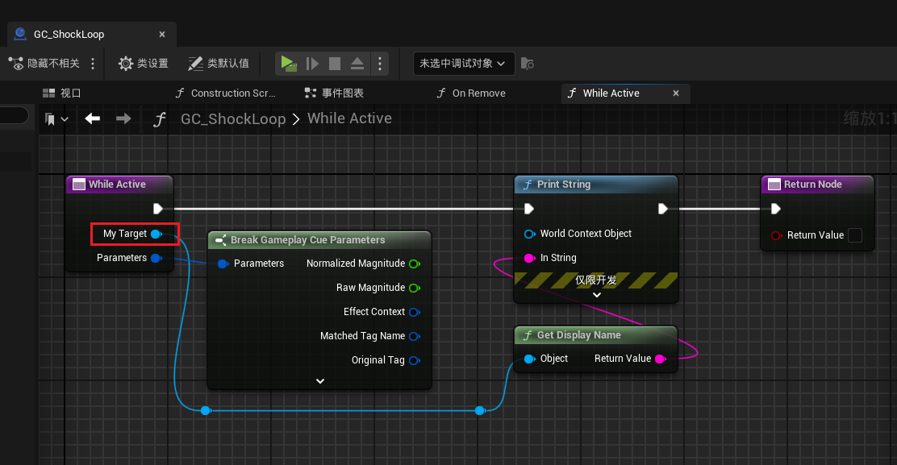

___________________________________________________________________________________________
###### [Go主菜单](../MainMenu.md)
___________________________________________________________________________________________

# GAS 165 创建和使用 `GameplayCueNotify_Actor` 生成绑定特效和音效；给NS传参

___________________________________________________________________________________________

## 处理关键点

1. `GameplayCueNotify_Actor` 的重写函数中 `OnActive` 和 `WhileActive`  的区别？
2. `GameplayCueNotify_Static` 和 `GameplayCueNotify_Actor`的区别？

___________________________________________________________________________________________

# 目录

- [GAS 165 创建和使用 `GameplayCueNotify_Actor` 生成绑定特效和音效；给NS传参](#gas-165-创建和使用-gameplaycuenotify_actor-生成绑定特效和音效给ns传参)
  - [处理关键点](#处理关键点)
- [目录](#目录)
    - [Mermaid整体思路梳理](#mermaid整体思路梳理)
    - [上一节，我们给Cue制定了路径位置](#上一节我们给cue制定了路径位置)
    - [关于 `GameplayCueNotify_Static` 是不实例化的，被视为静态函数库上的静态函数调用。](#关于-gameplaycuenotify_static-是不实例化的被视为静态函数库上的静态函数调用)
    - [先介绍下：我们要创建另一种Cue，在调用时，会创建该类的实例，也就是 `GameplayCueNotify_Actor`](#先介绍下我们要创建另一种cue在调用时会创建该类的实例也就是-gameplaycuenotify_actor)
    - [添加新的Loop使用的Tag](#添加新的loop使用的tag)
    - [创建 `GameplayCueNotify_Actor`](#创建-gameplaycuenotify_actor)
      - [设置，当Remove时自动销毁，否则，如果它没有被销毁，后续执行此游戏提示的调用将无法工作](#设置当remove时自动销毁否则如果它没有被销毁后续执行此游戏提示的调用将无法工作)
    - [重写 `WhileActive` 函数](#重写-whileactive-函数)
    - [在开始闪电技能Loop后，调用 `AddGameplayCueOnActor(Looping)` 函数传参](#在开始闪电技能loop后调用-addgameplaycueonactorlooping-函数传参)
      - [但是问题是只可以触发一次打印](#但是问题是只可以触发一次打印)
      - [技能结束时，移除该 `CueTag`](#技能结束时移除该-cuetag)
    - [运行测试，这下可以重复打印了](#运行测试这下可以重复打印了)
    - [重写函数 `OnRemove`](#重写函数-onremove)
    - [这里有一个问题：第一次按下然后松开技能正常，第二次没有打印OnRemove函数中的字符串](#这里有一个问题第一次按下然后松开技能正常第二次没有打印onremove函数中的字符串)
    - [接下来想看到，闪电的电束](#接下来想看到闪电的电束)
      - [移除打印节点，使用节点 `SpawnSystemAttached` 但是需要一个绑定到的组件，需要传递参数进来](#移除打印节点使用节点-spawnsystemattached-但是需要一个绑定到的组件需要传递参数进来)
      - [我们需要在接口中创建一个函数，返回武器的组件（因为需要从武器的插槽发射射线，所以需要武器组件）](#我们需要在接口中创建一个函数返回武器的组件因为需要从武器的插槽发射射线所以需要武器组件)
        - [接口中，创建获取武器组件的函数](#接口中创建获取武器组件的函数)
        - [角色基类中重写](#角色基类中重写)
      - [在蓝图中调用接口函数，然后给 `Cue` `Actor` 传参](#在蓝图中调用接口函数然后给-cue-actor-传参)
      - [要使用武器的插槽](#要使用武器的插槽)
      - [但是会有一个问题，这个组件需要GC，所以需要手动释放](#但是会有一个问题这个组件需要gc所以需要手动释放)
        - [蓝图中创建变量记录NS组件然后在移除Cue时销毁这个组件](#蓝图中创建变量记录ns组件然后在移除cue时销毁这个组件)
      - [而且这个NS需要传参](#而且这个ns需要传参)
    - [运行测试gif](#运行测试gif)

___________________________________________________________________________________________

视频链接

[10. Gameplay Cue Notify Actor_哔哩哔哩_bilibili](https://www.bilibili.com/video/BV1TH4y1L7NP/?p=123&spm_id_from=pageDriver&vd_source=9e1e64122d802b4f7ab37bd325a89e6c)

------

___________________________________________________________________________________________

### Mermaid整体思路梳理

Mermaid

___________________________________________________________________________________________

### 上一节，我们给Cue制定了路径位置
>

------

### 关于 `GameplayCueNotify_Static` 是不实例化的，被视为静态函数库上的静态函数调用。

  - 例如，游戏提示静态通知是对类默认对象进行操作的 `GameplayCueNotify_Static` 。因此，当我们执行 `GameplayCueNotify_Static` 时，不会生成任何实例

------

### 先介绍下：我们要创建另一种Cue，在调用时，会创建该类的实例，也就是 `GameplayCueNotify_Actor`

  - 如果需要某种循环声音或者需要保留的尼亚加拉系统时使用

  - 类似于 `Actor` ，也有构造，和事件

  - 在类默认设置中，有一个 `CueTag` 可以配置
>

  - 可以设置，当Remove时自动销毁，否则，如果它没有被销毁，后续执行此游戏提示的调用将无法工作
>

  - 这个类中有两个可供重写的方便函数 `OnActive` 和 `WhileActive` 

    - `OnActive`
      - 只有当客户端 `见证` 激活时才生效

    - `WhileActive`
      - 客户端 `见不见证` 激活时都生效

    - 这两个函数
>

- 区别的场景举例：比如A释放两个技能一个 `OnActive` 一个 `WhileActive` ，此时B加入游戏，B没有看到激活的瞬间，那么B只能看到 `WhileActive` 的技能

-  `OnRemove` 函数，当移除时触发

>

  - 可以通过调用传递参数（不传递没参数！）
>

------

### 添加新的Loop使用的Tag
>`GameplayCue.ShockLoop`
>
>

------

### 创建 `GameplayCueNotify_Actor`

  - 命名为：`GC_ShockLoop`

>

------

#### 设置，当Remove时自动销毁，否则，如果它没有被销毁，后续执行此游戏提示的调用将无法工作
>

------

### 重写 `WhileActive` 函数
>

------

### 在开始闪电技能Loop后，调用 `AddGameplayCueOnActor(Looping)` 函数传参
>- 别忘了配置CueTag
>
>
>
>
>
>
>
>
>

------

#### 但是问题是只可以触发一次打印

  - 因为没有移除该 `CueTag`

------

#### 技能结束时，移除该 `CueTag`
>

------

### 运行测试，这下可以重复打印了

> 

------

### 重写函数 `OnRemove`
>

------

### 这里有一个问题：第一次按下然后松开技能正常，第二次没有打印OnRemove函数中的字符串

  - 因为没有勾选自动销毁，这样就会占用之前的Tag名额，导致无法再次调用

>

------

### 接下来想看到，闪电的电束

------

#### 移除打印节点，使用节点 `SpawnSystemAttached` 但是需要一个绑定到的组件，需要传递参数进来
>
>

------

#### 我们需要在接口中创建一个函数，返回武器的组件（因为需要从武器的插槽发射射线，所以需要武器组件）

------

##### 接口中，创建获取武器组件的函数
>

------

##### 角色基类中重写
>
>

------

#### 在蓝图中调用接口函数，然后给 `Cue` `Actor` 传参
>

------

#### 要使用武器的插槽
>
>

------

#### 但是会有一个问题，这个组件需要GC，所以需要手动释放

------

##### 蓝图中创建变量记录NS组件然后在移除Cue时销毁这个组件
>`BeamSystem`
>
>
>
>
>
>

------

#### 而且这个NS需要传参
>
>
>
>`MouseHitLocation`这个变量在代码中设置了：
>
>
>
>
>
>

------

### 运行测试gif
>

- 有一个问题是当我们点击墙之类的，会穿过墙，这个后面处理

___________________________________________________________________________________________

[返回最上面](#Go主菜单)

___________________________________________________________________________________________