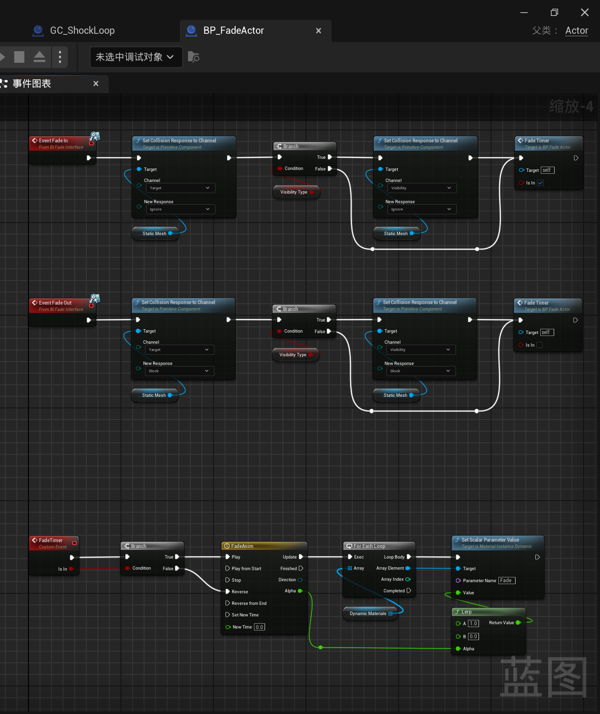

___________________________________________________________________________________________
###### [Go主菜单](../MainMenu.md)
___________________________________________________________________________________________

# GAS 167 创建并使用自定义碰撞通道，修复攻击目标的穿透问题

___________________________________________________________________________________________

# 目录


- [GAS 167 创建并使用自定义碰撞通道，修复攻击目标的穿透问题](#gas-167-创建并使用自定义碰撞通道修复攻击目标的穿透问题)
- [目录](#目录)
    - [Mermaid整体思路梳理](#mermaid整体思路梳理)
    - [这一节我们来处理，当我们点击墙的时候，攻击会无视墙穿过的问题（其实就是把攻击的通道检测和移动检测的Visibility分开）](#这一节我们来处理当我们点击墙的时候攻击会无视墙穿过的问题其实就是把攻击的通道检测和移动检测的visibility分开)
    - [为攻击创建检测通道](#为攻击创建检测通道)
      - [创建新碰撞通道 `Target`](#创建新碰撞通道-target)
      - [代码中使用刚创建的新碰撞通道 `Target`](#代码中使用刚创建的新碰撞通道-target)
    - [在之前写的异步节点获取鼠标点击点射线检测结果中，修改碰撞通道](#在之前写的异步节点获取鼠标点击点射线检测结果中修改碰撞通道)
    - [运行测试](#运行测试)
      - [但是现在因为全是Block，会有一些问题，需要把要忽略的找出设置一下来，比如：](#但是现在因为全是block会有一些问题需要把要忽略的找出设置一下来比如)
    - [还有一个问题，当我们的视角在这个砖的SM的边缘频繁进进出出时，会出现闪烁的鬼畜，是因为，这个SM开启的复杂碰撞，而它又是多个SM拼起来合成的一个](#还有一个问题当我们的视角在这个砖的sm的边缘频繁进进出出时会出现闪烁的鬼畜是因为这个sm开启的复杂碰撞而它又是多个sm拼起来合成的一个)
    - [然后就好了，修复完成](#然后就好了修复完成)
    - [运行测试gif](#运行测试gif)


___________________________________________________________________________________________

<details>
<summary>视频链接</summary>

[12. Target Trace Channel_哔哩哔哩_bilibili](https://www.bilibili.com/video/BV1TH4y1L7NP/?p=125&spm_id_from=pageDriver&vd_source=9e1e64122d802b4f7ab37bd325a89e6c)

------

</details>

___________________________________________________________________________________________

### Mermaid整体思路梳理

Mermaid

___________________________________________________________________________________________

### 这一节我们来处理，当我们点击墙的时候，攻击会无视墙穿过的问题（其实就是把攻击的通道检测和移动检测的Visibility分开）

  - 需要为攻击创建自己的 `检测通道` 


------

### 为攻击创建检测通道


------

#### 创建新碰撞通道 `Target` 
>
>
>


------

#### 代码中使用刚创建的新碰撞通道 `Target` 

- 我们之前在项目的 `.h文件` 中声明了宏实用了自定义通道1
>

- 创建新的通道 宏
>
>
>```cpp
>#define ECC_Target ECC_GameTraceChannel2
>```


------

### 在之前写的异步节点获取鼠标点击点射线检测结果中，修改碰撞通道
>


------

### 运行测试

------

#### 但是现在因为全是Block，会有一些问题，需要把要忽略的找出设置一下来，比如：

>

- 面前这一堵空气墙
>

- 角色和相机之间的 `检测Box` 
>

- 当我们使用材质隐藏这个盒子时，鼠标点击，依然会被阻挡，这个也需要设置一下
>
>


------

### 还有一个问题，当我们的视角在这个砖的SM的边缘频繁进进出出时，会出现闪烁的鬼畜，是因为，这个SM开启的复杂碰撞，而它又是多个SM拼起来合成的一个

>

  - 所以要使用简单碰撞

>


------

### 然后就好了，修复完成
>

### 运行测试gif

> 

___________________________________________________________________________________________

[返回最上面](#Go主菜单)

___________________________________________________________________________________________