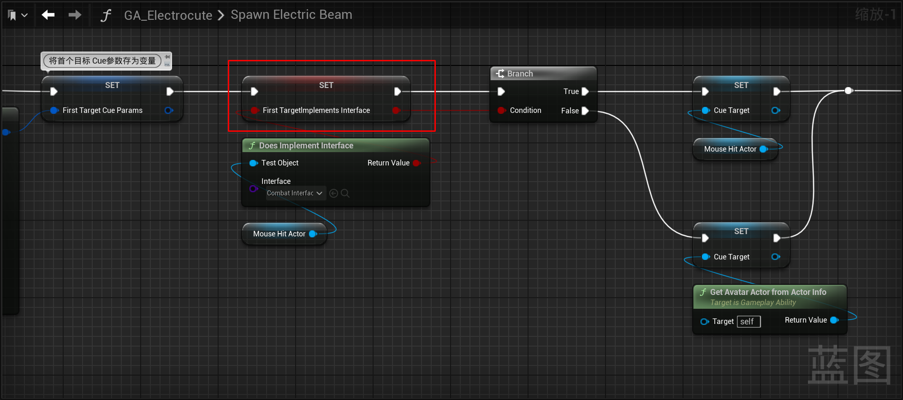

___________________________________________________________________________________________
###### [Go主菜单](../MainMenu.md)
___________________________________________________________________________________________

# GAS 168 处理闪电技能链式伤害的首个目标，射线检测阻挡的目标，播放声音，释放技能后取消目标选择

___________________________________________________________________________________________

## 处理关键点

1. 代码中使用射线检测

___________________________________________________________________________________________

# 目录


- [GAS 168 处理闪电技能链式伤害的首个目标，射线检测阻挡的目标，播放声音，释放技能后取消目标选择](#gas-168-处理闪电技能链式伤害的首个目标射线检测阻挡的目标播放声音释放技能后取消目标选择)
  - [处理关键点](#处理关键点)
- [目录](#目录)
    - [Mermaid整体思路梳理](#mermaid整体思路梳理)
    - [下面想处理一种技能情况：当释放技能后，假如，技能路线上有别的敌人，闪电技能应该会被挡住，然后击中前面被挡住的单位（需要射线检测）](#下面想处理一种技能情况当释放技能后假如技能路线上有别的敌人闪电技能应该会被挡住然后击中前面被挡住的单位需要射线检测)
    - [除此之外，当我们对一个目标释放技能时，希望根据技能等级，链接附近的多个单位，造成链式伤害](#除此之外当我们对一个目标释放技能时希望根据技能等级链接附近的多个单位造成链式伤害)
    - [我们需要记录一下，我们要攻击的首个目标（需要在代码中完成）](#我们需要记录一下我们要攻击的首个目标需要在代码中完成)
      - [创建函数，蓝图中调用](#创建函数蓝图中调用)
      - [函数体中使用单目标胶囊体检测 `SphereTraceSingle`](#函数体中使用单目标胶囊体检测-spheretracesingle)
      - [蓝图中调用 `TraceFirstTarget`](#蓝图中调用-tracefirsttarget)
      - [因为之前使用的这个 `MouseHitLocation` ，这里修改变量后，会影响到 `生成闪电到目标` 的逻辑](#因为之前使用的这个-mousehitlocation-这里修改变量后会影响到-生成闪电到目标-的逻辑)
        - [运行测试](#运行测试)
      - [测试完关闭Debug调试](#测试完关闭debug调试)
        - [运行测试](#运行测试-1)
    - [接下来我们需要创建一个 函数（作为队列） 来操作对目标对象生成闪电Cue](#接下来我们需要创建一个-函数作为队列-来操作对目标对象生成闪电cue)
      - [在设置了第一个目标之后来处理 `队列`](#在设置了第一个目标之后来处理-队列)
      - [需要为每一个目标配置这些参数，同时将要传递给Cue的参数保存为变量](#需要为每一个目标配置这些参数同时将要传递给cue的参数保存为变量)
      - [接下来需要查看，集中的目标是否实现了战斗接口](#接下来需要查看集中的目标是否实现了战斗接口)
      - [将Cue的目标设为变量](#将cue的目标设为变量)
      - [如果目标实现了接口，就可以以目标为圆心链接到别的敌人，所以使用目标为Target，如果没有，（说明不是攻击敌人）就使用玩家作为Target添加Cue](#如果目标实现了接口就可以以目标为圆心链接到别的敌人所以使用目标为target如果没有说明不是攻击敌人就使用玩家作为target添加cue)
      - [***GC\_ShockLoop*** 中，因为参数中有传递 `SoureObject` 所以，需要判断类型](#gc_shockloop-中因为参数中有传递-soureobject-所以需要判断类型)
      - [因为我们之前时使用 MouseHitActor 作为 SourceObject 传入，所以可以通过在 `Cue` 中判断目标是否实现战斗接口，来判断是否攻击到敌人](#因为我们之前时使用-mousehitactor-作为-sourceobject-传入所以可以通过在-cue-中判断目标是否实现战斗接口来判断是否攻击到敌人)
        - [生成NS之后，判断，如果为false，说明打的不是敌人，是墙面，这个时候直接设置NS参数即可](#生成ns之后判断如果为false说明打的不是敌人是墙面这个时候直接设置ns参数即可)
        - [如果为true说明打的是敌人，需要使用敌人的位置传入NS](#如果为true说明打的是敌人需要使用敌人的位置传入ns)
      - [最后播放声音](#最后播放声音)
    - [我们之前只是添加了目标，还没有移除](#我们之前只是添加了目标还没有移除)
      - [结束技能时移除](#结束技能时移除)
        - [需要 `记录` 目标是否实现了接口，如果实现了就需要移除目标](#需要-记录-目标是否实现了接口如果实现了就需要移除目标)
        - [结束技能时根据目标是否实现了接口，执行不同移除策略](#结束技能时根据目标是否实现了接口执行不同移除策略)
    - [运行测试gif：打完a打b，可以取消a](#运行测试gif打完a打b可以取消a)
    - [下一节，计算 要 链式攻击的相邻目标](#下一节计算-要-链式攻击的相邻目标)


___________________________________________________________________________________________

<details>
<summary>视频链接</summary>
[13. First Trace Target_哔哩哔哩_bilibili](https://www.bilibili.com/video/BV1TH4y1L7NP?spm_id_from=333.788.videopod.episodes&vd_source=9e1e64122d802b4f7ab37bd325a89e6c&p=126)

------

</details>

___________________________________________________________________________________________

### Mermaid整体思路梳理

Mermaid

___________________________________________________________________________________________

### 下面想处理一种技能情况：当释放技能后，假如，技能路线上有别的敌人，闪电技能应该会被挡住，然后击中前面被挡住的单位（需要射线检测）
>

- 现在不会被挡住
>


------

### 除此之外，当我们对一个目标释放技能时，希望根据技能等级，链接附近的多个单位，造成链式伤害


------

### 我们需要记录一下，我们要攻击的首个目标（需要在代码中完成）


------

#### 创建函数，蓝图中调用

  - `TraceFirstTarget`

>```cpp
>public:
>	UFUNCTION(BlueprintCallable)
>	void TraceFirstTarget(const FVector& BeamTargetLocation);
>```
>
>


------

#### 函数体中使用单目标胶囊体检测 `SphereTraceSingle`

>
>
>```cpp
>void UAuraBeamSpell::TraceFirstTarget(const FVector& BeamTargetLocation)
>{
>    check(OwnerCharacter)
>    if (OwnerCharacter->Implements<UCombatInterface>())
>    {
>       //射线检测
>       const USkeletalMeshComponent* Weapon = ICombatInterface::Execute_GetWeapon(OwnerCharacter);
>       TArray<AActor*> ActorsToIgnore;
>       ActorsToIgnore.Add(OwnerCharacter);
>       FHitResult OutHit;
>       UKismetSystemLibrary::SphereTraceSingle(OwnerCharacter,
>          Weapon->GetSocketLocation(FName("TipSocket")),
>          MouseHitLocation,10.f,
>          TraceTypeQuery1,
>          false,
>          ActorsToIgnore,EDrawDebugTrace::ForDuration,
>          OutHit,true);
>       
>    }
>}
>```

  - 如果命中了检测，设置 `Actor` 和 `Location` 
>
>
>```CPP
>void UAuraBeamSpell::TraceFirstTarget(const FVector& BeamTargetLocation)
>{
>	check(OwnerCharacter)
>	if (OwnerCharacter->Implements<UCombatInterface>())
>	{
>		//射线检测
>		const USkeletalMeshComponent* Weapon = ICombatInterface::Execute_GetWeapon(OwnerCharacter);
>		TArray<AActor*> ActorsToIgnore;
>		ActorsToIgnore.Add(OwnerCharacter);
>		FHitResult OutHit;
>		UKismetSystemLibrary::SphereTraceSingle(OwnerCharacter,
>			Weapon->GetSocketLocation(FName("TipSocket")),
>			BeamTargetLocation,10.f,
>			TraceTypeQuery1,
>			false,
>			ActorsToIgnore,EDrawDebugTrace::ForDuration,
>			OutHit,true);
>		if (OutHit.bBlockingHit)
>		{
>			MouseHitLocation = OutHit.ImpactPoint;
>			MouseHitActor = OutHit.GetActor();
>		}
>	}
>}
>```


------

#### 蓝图中调用 `TraceFirstTarget`
>
>
>
>
>`SpawnElectricBeam`
>
>
>
>


------

#### 因为之前使用的这个 `MouseHitLocation` ，这里修改变量后，会影响到 `生成闪电到目标` 的逻辑
>


------

##### 运行测试
>


------

#### 测试完关闭Debug调试
>


------

##### 运行测试
>


------

### 接下来我们需要创建一个 函数（作为队列） 来操作对目标对象生成闪电Cue


------

#### 在设置了第一个目标之后来处理 `队列`


------

#### 需要为每一个目标配置这些参数，同时将要传递给Cue的参数保存为变量
>

- 将要传递给Cue的参数保存为变量
>`FirstTargetCueParams`
>
>


------

#### 接下来需要查看，集中的目标是否实现了战斗接口
>


------

#### 将Cue的目标设为变量
>


------

#### 如果目标实现了接口，就可以以目标为圆心链接到别的敌人，所以使用目标为Target，如果没有，（说明不是攻击敌人）就使用玩家作为Target添加Cue
>


------

#### ***GC_ShockLoop*** 中，因为参数中有传递 `SoureObject` 所以，需要判断类型

- 存为变量
>


------

#### 因为我们之前时使用 MouseHitActor 作为 SourceObject 传入，所以可以通过在 `Cue` 中判断目标是否实现战斗接口，来判断是否攻击到敌人
>


------

##### 生成NS之后，判断，如果为false，说明打的不是敌人，是墙面，这个时候直接设置NS参数即可
>


------

##### 如果为true说明打的是敌人，需要使用敌人的位置传入NS
>


------

#### 最后播放声音
>


------

### 我们之前只是添加了目标，还没有移除
>


------

#### 结束技能时移除


------

##### 需要 `记录` 目标是否实现了接口，如果实现了就需要移除目标
>记录bool变量
>
>- `FirstTargetlmplementsInterface`
>
>


------

##### 结束技能时根据目标是否实现了接口，执行不同移除策略
>


------

### 运行测试gif：打完a打b，可以取消a
>


------

### 下一节，计算 要 链式攻击的相邻目标


___________________________________________________________________________________________

[返回最上面](#Go主菜单)

___________________________________________________________________________________________