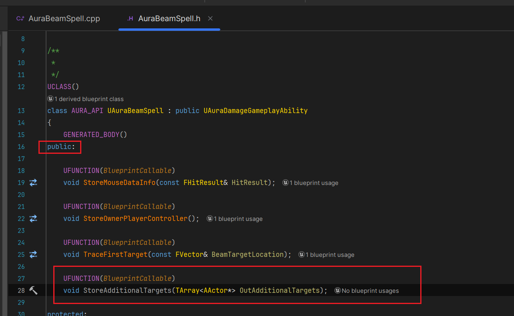
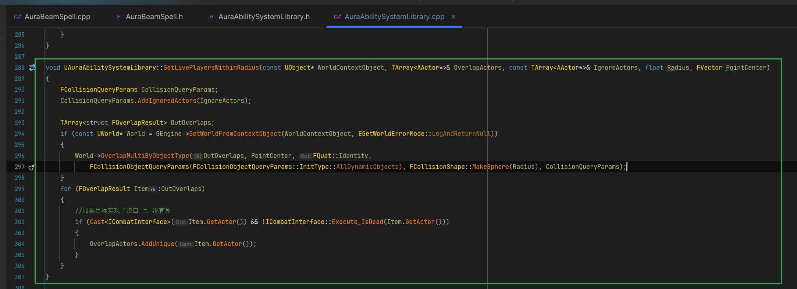
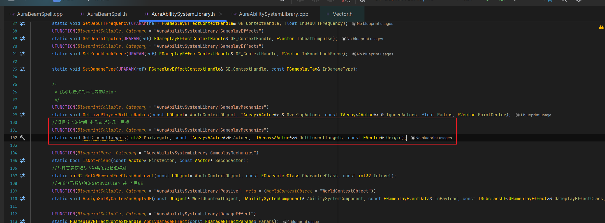
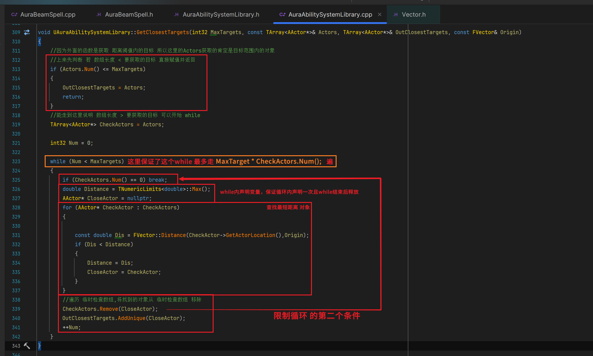
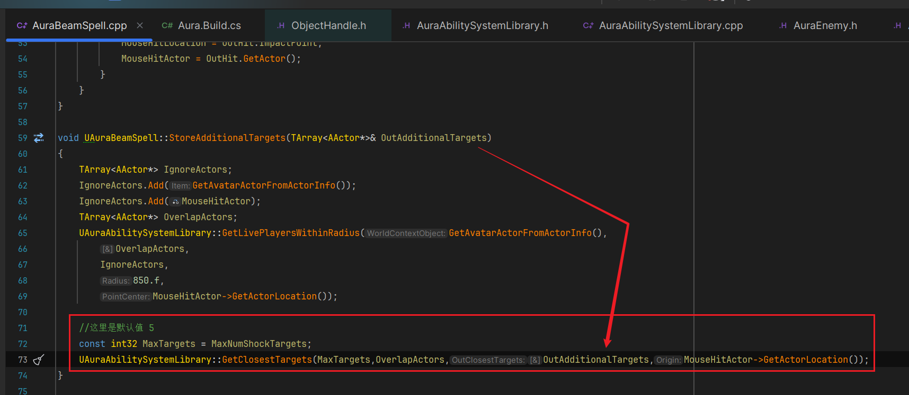
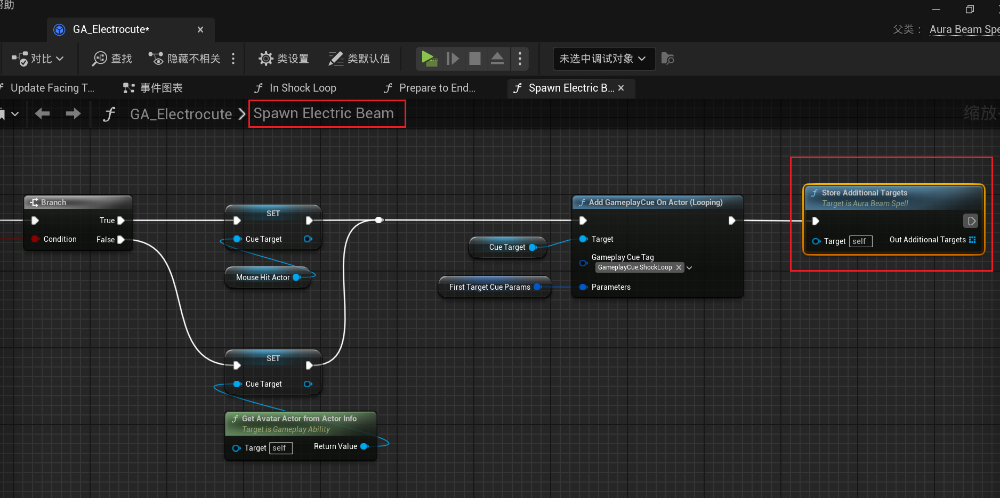
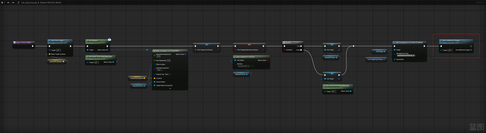
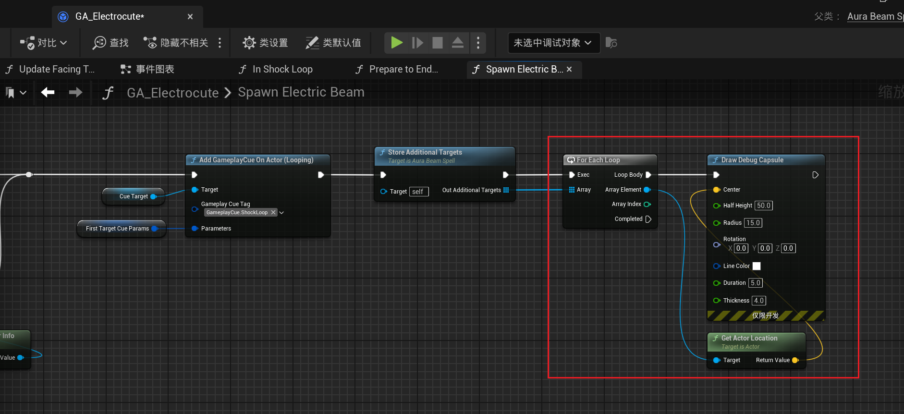
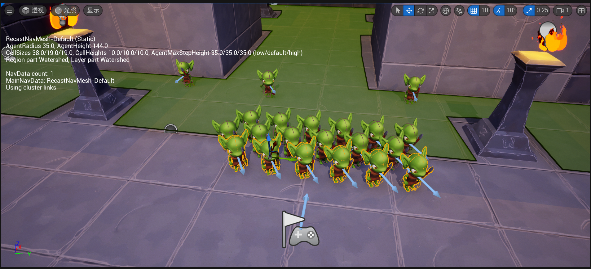
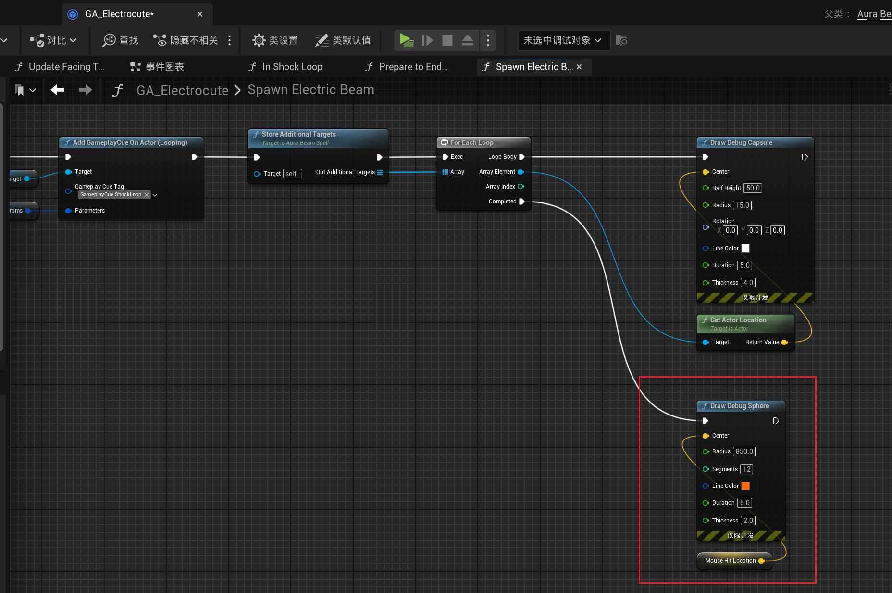

___________________________________________________________________________________________
###### [Go主菜单](../MainMenu.md)
___________________________________________________________________________________________

# GAS 169 处理闪电技能链式伤害的后续添加目标逻辑，获取首个目标附近最近的N个单位

___________________________________________________________________________________________

## 处理关键点

1. 使用 `TNumericLimits<double>::Max();` 获取无穷大的变量
1. 使用 `while` 循环 处理添加最近目标的逻辑思路（防止无限循环！）

___________________________________________________________________________________________

# 目录


- [GAS 169 处理闪电技能链式伤害的后续添加目标逻辑，获取首个目标附近最近的N个单位](#gas-169-处理闪电技能链式伤害的后续添加目标逻辑获取首个目标附近最近的n个单位)
  - [处理关键点](#处理关键点)
- [目录](#目录)
    - [Mermaid整体思路梳理](#mermaid整体思路梳理)
    - [上一节，我们处理了，击中第一个目标之后处理的关于这个目标的逻辑，这一节我们需要根据这个目标的位置（或者传入的位置）获取目标地点的所有对象，切根据距离，筛选最近的N（和技能等级相关）个对象](#上一节我们处理了击中第一个目标之后处理的关于这个目标的逻辑这一节我们需要根据这个目标的位置或者传入的位置获取目标地点的所有对象切根据距离筛选最近的n和技能等级相关个对象)
      - [创建获取目标范围内多个对象的函数](#创建获取目标范围内多个对象的函数)
        - [我们之前在蓝图函数库创建过一个类似的功能](#我们之前在蓝图函数库创建过一个类似的功能)
      - [我们还需要像火球技能的 `生成火球最大数量` 一样，搞一个闪电技能的 `最大链接目标数量`](#我们还需要像火球技能的-生成火球最大数量-一样搞一个闪电技能的-最大链接目标数量)
      - [`StoreAdditionalTargets` 函数体中，可以拿到目标地点为半径的圆中的角色](#storeadditionaltargets-函数体中可以拿到目标地点为半径的圆中的角色)
      - [但是现在还需要根据距离拿到最近的 `N` 个角色](#但是现在还需要根据距离拿到最近的-n-个角色)
        - [`创建根据TArray<Actor*>，返回最近的N个角色` 的函数](#创建根据tarrayactor返回最近的n个角色-的函数)
      - [`GetClosestTargets` 函数体内，添加](#getclosesttargets-函数体内添加)
      - [`StoreAdditionalTargets` 函数中调用，获取最近的几个Actor\*的数组](#storeadditionaltargets-函数中调用获取最近的几个actor的数组)
      - [蓝图中调用，生成debug测试](#蓝图中调用生成debug测试)
        - [场景中多摆放几个敌人](#场景中多摆放几个敌人)
        - [测试结果gif](#测试结果gif)
        - [在结束循环后debug整个技能范围](#在结束循环后debug整个技能范围)


___________________________________________________________________________________________

<details>
<summary>视频链接</summary>

[14. Additional Targets_哔哩哔哩_bilibili](https://www.bilibili.com/video/BV1TH4y1L7NP?spm_id_from=333.788.player.switch&vd_source=9e1e64122d802b4f7ab37bd325a89e6c&p=127)

------

</details>

___________________________________________________________________________________________

### Mermaid整体思路梳理

Mermaid

___________________________________________________________________________________________

### 上一节，我们处理了，击中第一个目标之后处理的关于这个目标的逻辑，这一节我们需要根据这个目标的位置（或者传入的位置）获取目标地点的所有对象，切根据距离，筛选最近的N（和技能等级相关）个对象

  - 因为计算比较复杂这部分逻辑放在cpp中，通过蓝图调用节点，节省了开销


------

#### 创建获取目标范围内多个对象的函数

  - `StoreAdditionalTargets`

>```CPP
>public:
>    UFUNCTION(BlueprintCallable)
>    void StoreAdditionalTargets(TArray<AActor*> OutAdditionalTargets);
>```
>
>


------

##### 我们之前在蓝图函数库创建过一个类似的功能
>


------

#### 我们还需要像火球技能的 `生成火球最大数量` 一样，搞一个闪电技能的 `最大链接目标数量`

  - `MaxNumShockTargets`

>```cpp
>protected:
>    //最大链接目标数量
>    UPROPERTY(EditDefaultsOnly, Category = "Beam")
>    int32 MaxNumShockTargets = 5.f;
>```


------

#### `StoreAdditionalTargets` 函数体中，可以拿到目标地点为半径的圆中的角色
>```cpp
>void UAuraBeamSpell::StoreAdditionalTargets(TArray<AActor*> OutAdditionalTargets)
>{
>    TArray<AActor*> IgnoreActors;
>    IgnoreActors.Add(GetAvatarActorFromActorInfo());
>    IgnoreActors.Add(MouseHitActor);
>    TArray<AActor*> OverlapActors;
>    UAuraAbilitySystemLibrary::GetLivePlayersWithinRadius(GetAvatarActorFromActorInfo(),
>       OverlapActors,
>       IgnoreActors,
>       850.f/*距离这里暂定850.f*/,
>       MouseHitActor->GetActorLocation());
>}
>```


------

#### 但是现在还需要根据距离拿到最近的 `N` 个角色

  - 需要在蓝图函数库中创建对应函数


------

##### `创建根据TArray<Actor*>，返回最近的N个角色` 的函数

  - `GetClosestTargets`

  - 需要几个参数

    - 最大数量

    - 所有角色的数组

    - 输出的数组

    - 计算原点位置

>
>
>```cpp
>//根据传入的数组 获取最近的几个目标
>UFUNCTION(BlueprintCallable, Category = "AuraAbilitySystemLibrary|GameplayMechanics")
>static void GetClosestTargets(int32 MaxTargets, const TArray<AActor*>& Actors,  TArray<AActor*>& OutClosestTargets, const FVector& Origin);
>```


------

#### `GetClosestTargets` 函数体内，添加

  - 逐个添加最近的Actor

  - 使用 `TNumericLimits<double>::Max();` 获取 `无穷大的变量`

    ```CPP
    float Distance = TNumericLimits<double>::Max();
    ```

>
>
>- 这里注意一下，因为涉及到while，要多考虑几种情况，不要无限循环!
>
>  比如西面是一个错误示范:
>
>  ```CPP
>  //因为外面的函数是获取 距离阈值内的目标 所以这里的Actors获取的肯定是目标范围内的对象
>  TArray<AActor*> OutTargets;
>  if (Actors.Num() <= 0) return;
>  float Distance = TNumericLimits<double>::Max();
>  int32 Num = 0;
>  AActor* Target = nullptr;
>  //假设 传入数组num == 1 且 MaxTargets == 2 就会无限循环！
>  while (OutTargets.Num() < MaxTargets)
>  {
>      for (AActor* OutTarget : OutTargets)
>      {
>         const float Dis = FVector::Distance(OutTarget->GetActorLocation(),Origin);
>         if (Distance < Dis)
>         {
>            Target = OutTarget;
>         }
>      }
>      if (!OutTargets.Contains(Target))
>      {
>         OutTargets.Add(Target);
>      }
>  }
>  OutClosestTargets = OutTargets;
>  ```
>
># 正确版本:
>
>```cpp
>void UAuraAbilitySystemLibrary::GetClosestTargets(int32 MaxTargets, const TArray<AActor*>& Actors, TArray<AActor*>& OutClosestTargets, const FVector& Origin)
>{
>    //因为外面的函数是获取 距离阈值内的目标 所以这里的Actors获取的肯定是目标范围内的对象 
>    //上来先判断 若 数组长度 < 要获取的目标 直接赋值并返回
>    if (Actors.Num() <= MaxTargets)
>    {
>       OutClosestTargets = Actors;
>       return;
>    }
>    //能走到这里说明 数组长度 > 要获取的目标 可以开始 while
>    TArray<AActor*> CheckActors = Actors;
>    
>    int32 Num = 0;
>    
>    while (Num < MaxTargets)
>    {
>       if (CheckActors.Num() == 0) break;
>       double Distance = TNumericLimits<double>::Max();
>       AActor* CloseActor = nullptr;
>       for (AActor* CheckActor : CheckActors)
>       {
>       
>          const double Dis = FVector::Distance(CheckActor->GetActorLocation(),Origin);
>          if (Dis < Distance)
>          {
>             Distance = Dis;
>             CloseActor = CheckActor;
>          }
>       }
>       //遍历 临时检查数组,将找到的对象从 临时检查数组 移除
>       CheckActors.Remove(CloseActor);
>       OutClosestTargets.AddUnique(CloseActor);
>       ++Num;
>    }
>}
>```
>
>


------

#### `StoreAdditionalTargets` 函数中调用，获取最近的几个Actor*的数组
>我这个参数忘加引用了（因为想当返回值）
>
>
>
>```cpp
>void UAuraBeamSpell::StoreAdditionalTargets(TArray<AActor*>& OutAdditionalTargets)
>{
>	TArray<AActor*> IgnoreActors;
>	IgnoreActors.Add(GetAvatarActorFromActorInfo());
>	IgnoreActors.Add(MouseHitActor);
>	TArray<AActor*> OverlapActors;
>	UAuraAbilitySystemLibrary::GetLivePlayersWithinRadius(GetAvatarActorFromActorInfo(),
>		OverlapActors,
>		IgnoreActors,
>		850.f,
>		MouseHitActor->GetActorLocation());
>
>	//这里是默认值 5
>	const int32 MaxTargets = MaxNumShockTargets;
>	UAuraAbilitySystemLibrary::GetClosestTargets(MaxTargets,OverlapActors,OutAdditionalTargets,MouseHitActor->GetActorLocation());
>}
>```


------

#### 蓝图中调用，生成debug测试
>
>
>
>


------

##### 场景中多摆放几个敌人
>


------

##### 测试结果gif
>


------

##### 在结束循环后debug整个技能范围
>
>
>
>可以看到范围还是挺大的（球形半径大约8.5米）


___________________________________________________________________________________________

[返回最上面](#Go主菜单)

___________________________________________________________________________________________