___________________________________________________________________________________________
###### [Go主菜单](../MainMenu.md)
___________________________________________________________________________________________

# GAS 170 制作闪电链视觉效果，为目标配置Cue的Param，结束技能后移除

___________________________________________________________________________________________

## 处理关键点

1. 蓝图中使用TMap(无法遍历)
    - 想办法：还需要额外搞一个TArray

___________________________________________________________________________________________

# 目录

- [GAS 170 制作闪电链视觉效果，为目标配置Cue的Param，结束技能后移除](#gas-170-制作闪电链视觉效果为目标配置cue的param结束技能后移除)
  - [处理关键点](#处理关键点)
- [目录](#目录)
    - [Mermaid整体思路梳理](#mermaid整体思路梳理)
    - [上一节我们找到并遍历了最近的角色（敌人），这一节，在受到影响的敌人身上生成Cue](#上一节我们找到并遍历了最近的角色敌人这一节在受到影响的敌人身上生成cue)
      - [在设置完首个角色后，遍历](#在设置完首个角色后遍历)
      - [释放技能时就可以看到](#释放技能时就可以看到)
    - [在这里批量处理Actor的一些逻辑](#在这里批量处理actor的一些逻辑)
      - [创建函数](#创建函数)
      - [接下来需要一个\<Actor\*,CueParam\>的映射表](#接下来需要一个actorcueparam的映射表)
        - [添加元素，并为目标添加CueLoop](#添加元素并为目标添加cueloop)
      - [移除时，也需要根据TMap表来移除，但是蓝图并不支持遍历TMap](#移除时也需要根据tmap表来移除但是蓝图并不支持遍历tmap)
        - [所以创建数组遍历,移除目标的CueLoop](#所以创建数组遍历移除目标的cueloop)
          - [折叠为函数](#折叠为函数)
          - [使用临时变量记录](#使用临时变量记录)
      - [生成时，遍历添加CueLoop](#生成时遍历添加cueloop)
    - [运行测试gif](#运行测试gif)
    - [有一个bug，点击地面释放技能时，因为射线被敌人挡住，会触发闪电链，但是因为点击地面，没有实现接口，所以导致bool为false，取消技能时，没有移除对象身上的cueLoop](#有一个bug点击地面释放技能时因为射线被敌人挡住会触发闪电链但是因为点击地面没有实现接口所以导致bool为false取消技能时没有移除对象身上的cueloop)
      - [所以，链式反应时，需要检查是否实现了接口，如果没有，不会触发连锁反应](#所以链式反应时需要检查是否实现了接口如果没有不会触发连锁反应)
      - [在运行测试就正常了gif](#在运行测试就正常了gif)
    - [下一节开始处理扣血的逻辑](#下一节开始处理扣血的逻辑)

___________________________________________________________________________________________

视频链接

[15. Shock Loop Cues on Additional Targets_哔哩哔哩_bilibili](https://www.bilibili.com/video/BV1TH4y1L7NP?spm_id_from=333.788.player.switch&vd_source=9e1e64122d802b4f7ab37bd325a89e6c&p=128)

------

___________________________________________________________________________________________

### Mermaid整体思路梳理

Mermaid

___________________________________________________________________________________________

### 上一节我们找到并遍历了最近的角色（敌人），这一节，在受到影响的敌人身上生成Cue

#### 在设置完首个角色后，遍历
>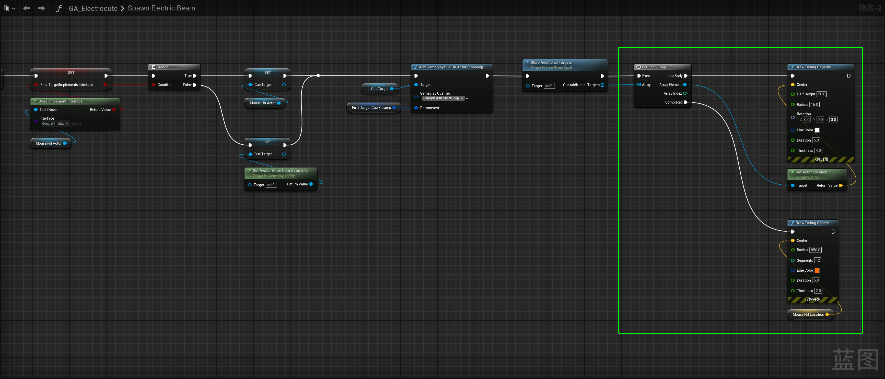

------

#### 释放技能时就可以看到
>

------

### 在这里批量处理Actor的一些逻辑
>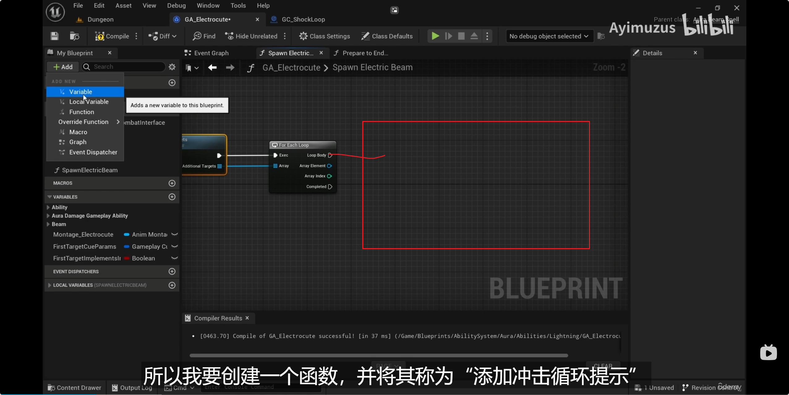

------

#### 创建函数

  - `AddShockLoopCueToAdditionalTarget`

>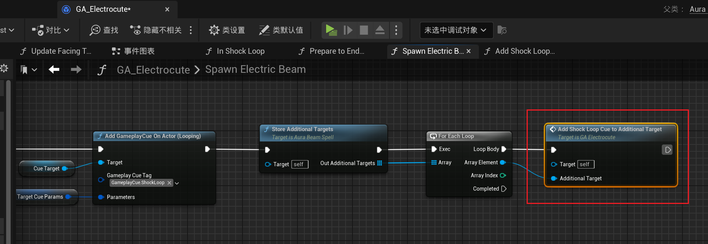
>
>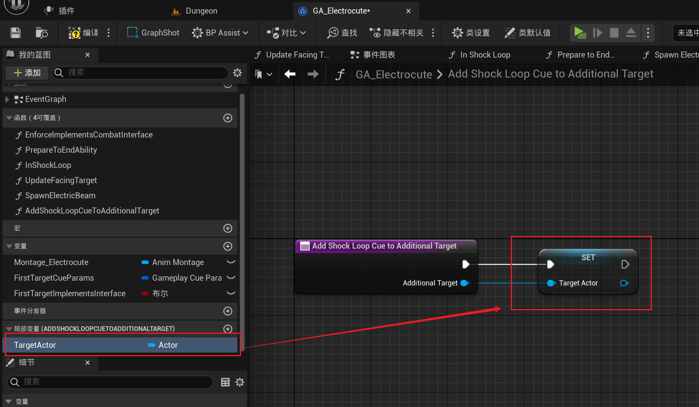

------

#### 接下来需要一个<Actor*,CueParam>的映射表

  - 蓝图中创建变量
    - `AdditionalActorsToCueParams`

>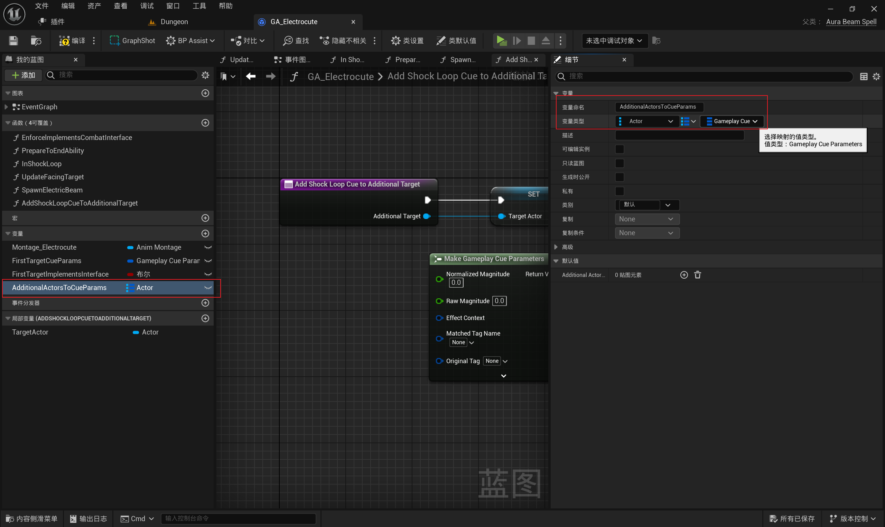

------

##### 添加元素，并为目标添加CueLoop
>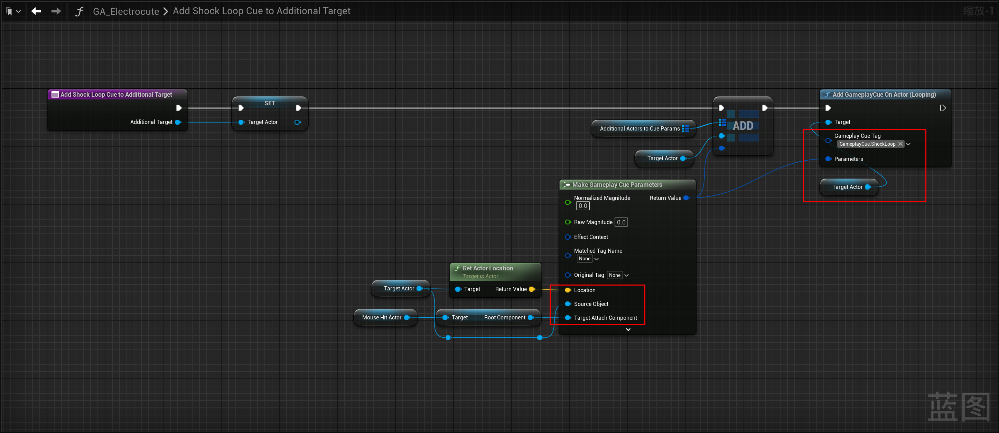

------

#### 移除时，也需要根据TMap表来移除，但是蓝图并不支持遍历TMap
>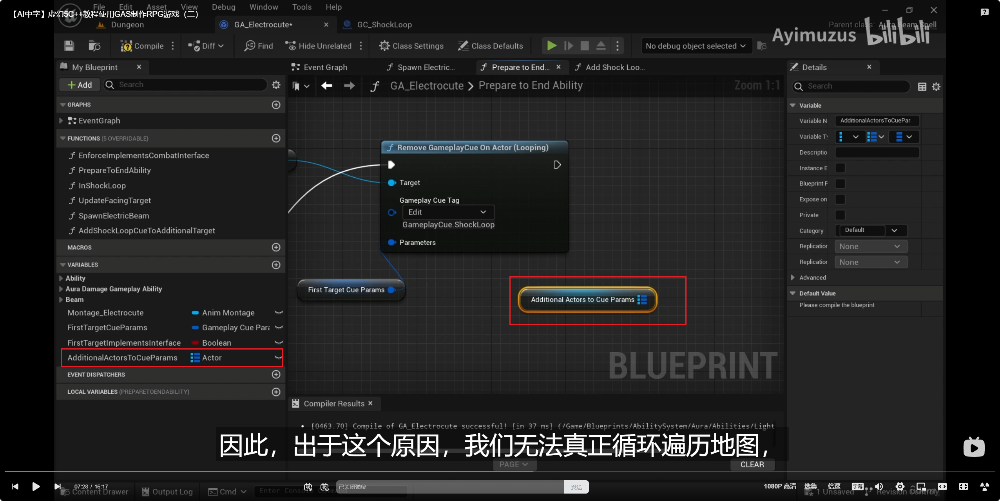

------

##### 所以创建数组遍历,移除目标的CueLoop

  - `AdditionalTargets`

>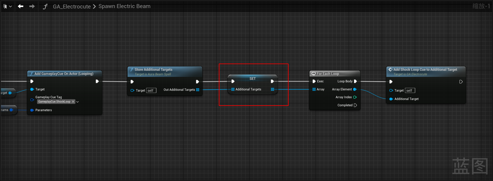
>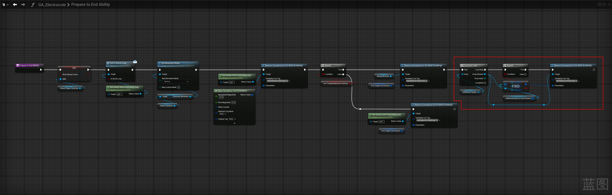
>
>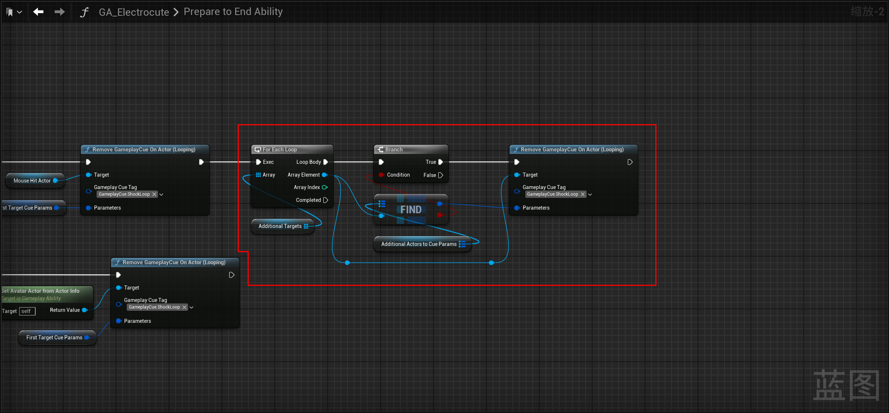

------

###### 折叠为函数

  - `RemoveShockLoopCueFromAdditionalTarget`

>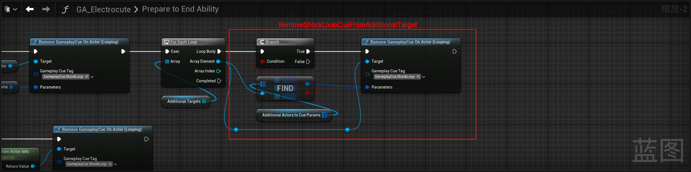

------

###### 使用临时变量记录
>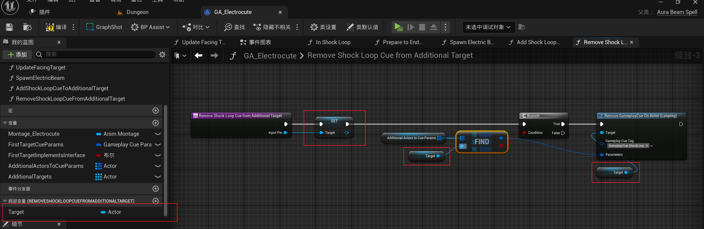

------

#### 生成时，遍历添加CueLoop
>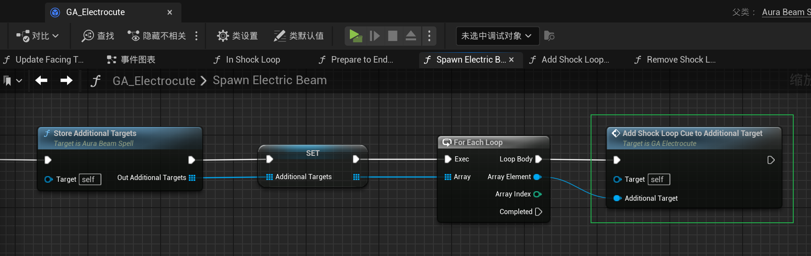

------

### 运行测试gif
>

------

### 有一个bug，点击地面释放技能时，因为射线被敌人挡住，会触发闪电链，但是因为点击地面，没有实现接口，所以导致bool为false，取消技能时，没有移除对象身上的cueLoop
>
>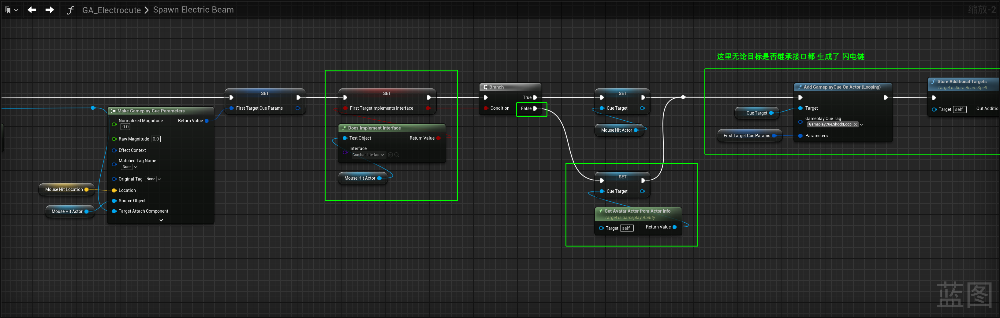

------

#### 所以，链式反应时，需要检查是否实现了接口，如果没有，不会触发连锁反应
>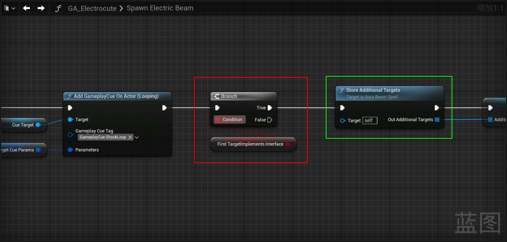

------

#### 在运行测试就正常了gif
>
>
># DS模式下：
>
>

------

### 下一节开始处理扣血的逻辑

___________________________________________________________________________________________

[返回最上面](#Go主菜单)

___________________________________________________________________________________________