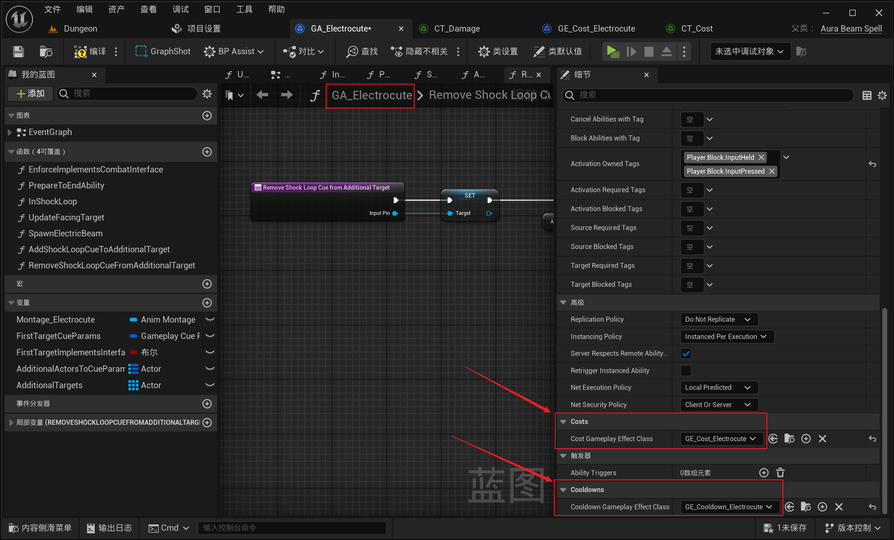
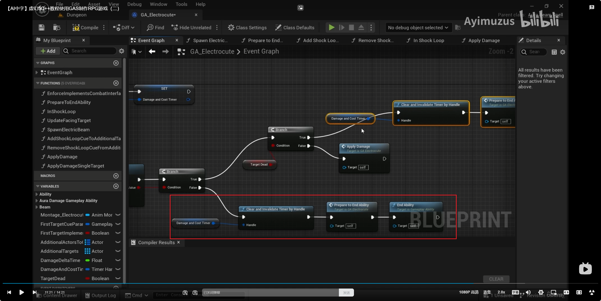

___________________________________________________________________________________________
###### [Go主菜单](../MainMenu.md)
___________________________________________________________________________________________

# GAS 171 使用Timer为闪电链制作掉血逻辑，并在首个目标死亡后结束技能

___________________________________________________________________________________________

## 处理关键点

1. 使用计时器做持续伤害处理

___________________________________________________________________________________________

# 目录


- [GAS 171 使用Timer为闪电链制作掉血逻辑，并在首个目标死亡后结束技能](#gas-171-使用timer为闪电链制作掉血逻辑并在首个目标死亡后结束技能)
  - [处理关键点](#处理关键点)
- [目录](#目录)
    - [Mermaid整体思路梳理](#mermaid整体思路梳理)
    - [现在我们需要让技能有伤害，需要配置](#现在我们需要让技能有伤害需要配置)
      - [`DamageEffectClass`](#damageeffectclass)
      - [伤害曲线](#伤害曲线)
      - [先暂时不触发Debuff，并且因为是持续类技能，不想让目标被击飞](#先暂时不触发debuff并且因为是持续类技能不想让目标被击飞)
      - [接下来，创建CD和Cost，并配置](#接下来创建cd和cost并配置)
    - [现在还没有伤害，下一节，处理循环伤害](#现在还没有伤害下一节处理循环伤害)
    - [使用计时器做伤害处理，和MP扣除](#使用计时器做伤害处理和mp扣除)
    - [创建参数，多久扣除一次MP](#创建参数多久扣除一次mp)
      - [计时器](#计时器)
      - [运行测试gif可以掉MP了](#运行测试gif可以掉mp了)
      - [可以扣除消耗时，应用伤害](#可以扣除消耗时应用伤害)
        - [创建函数](#创建函数)
        - [使用 `Spec` 绑定 `SetBuCaller`](#使用-spec-绑定-setbucaller)
        - [需要使用Damage，但是没有对应的函数，需要创建一个](#需要使用damage但是没有对应的函数需要创建一个)
          - [创建函数](#创建函数-1)
      - [最后应用GE](#最后应用ge)
      - [整合成一个函数](#整合成一个函数)
      - [遍历 调用](#遍历-调用)
      - [可以扣除消耗时调用](#可以扣除消耗时调用)
    - [但是现在会无限调用，所以需要创建bool记录敌人是否死亡，死亡则技能停止](#但是现在会无限调用所以需要创建bool记录敌人是否死亡死亡则技能停止)
      - [死亡时停止需要结束技能，结束这部分也需要整合成一个函数](#死亡时停止需要结束技能结束这部分也需要整合成一个函数)
    - [运行测试gif](#运行测试gif)
      - [有一个问题，敌人死亡后没有断开连接](#有一个问题敌人死亡后没有断开连接)
    - [下一节，处理](#下一节处理)


___________________________________________________________________________________________

<details>
<summary>视频链接</summary>

[16. Electrocute Cost Cooldown and Damage_哔哩哔哩_bilibili](https://www.bilibili.com/video/BV1TH4y1L7NP?spm_id_from=333.788.player.switch&vd_source=9e1e64122d802b4f7ab37bd325a89e6c&p=129)

[17. Applying Electrocute Cost and Damage_哔哩哔哩_bilibili](https://www.bilibili.com/video/BV1TH4y1L7NP?spm_id_from=333.788.player.switch&vd_source=9e1e64122d802b4f7ab37bd325a89e6c&p=130)

------

</details>

___________________________________________________________________________________________

### Mermaid整体思路梳理

Mermaid

___________________________________________________________________________________________

### 现在我们需要让技能有伤害，需要配置

  - `DamageEffectClass`

  - 伤害曲线

  - 配置 触发Debuff 和 击飞 概率

  - 创建CD和Cost，并配置


------

#### `DamageEffectClass`
>


------

#### 伤害曲线
>
>

- 伤害值比较低是因为这是个每0.1s触发一次的伤害，频率比较高

> 


------

#### 先暂时不触发Debuff，并且因为是持续类技能，不想让目标被击飞
>


------

#### 接下来，创建CD和Cost，并配置

  - Cost
>

  - 还缺少曲线
>
>
>我用的是曲线：
>
>
>
># 注意一下是 `-1` ！
>
>

  - CD
>

  - CD还需要配置一个CD的Tag（5.3这里有变动）
>
>
>`Cooldown.Lightning.Electrocute`
>
>
>
>

  - 配置
>


------

### 现在还没有伤害，下一节，处理循环伤害


------

### 使用计时器做伤害处理，和MP扣除


------

### 创建参数，多久扣除一次MP

  - `DamageDeltaTime`

  - 先使用0.1
>


------

#### 计时器
>
>


------

#### 运行测试gif可以掉MP了
>


------

#### 可以扣除消耗时，应用伤害


------

##### 创建函数

  - `ApplyDamage`

>


------

##### 使用 `Spec` 绑定 `SetBuCaller` 
>


------

##### 需要使用Damage，但是没有对应的函数，需要创建一个
>


------

###### 创建函数

  - `GetDamageAtLevel`

>

  - 其实就是之前这里的逻辑
>

>```cpp
>public:
>    UFUNCTION(BlueprintPure)
>    float GetDamageAtLevel () const;
>```
>
>```cpp
>float UAuraDamageGameplayAbility::GetDamageAtLevel() const
>{
>    return  Damage.GetValueAtLevel(GetAbilityLevel());
>}
>```


------

#### 最后应用GE
>


------

#### 整合成一个函数

  - `ApplyDamageSingleTarget`

>


------

#### 遍历 调用
>


------

#### 可以扣除消耗时调用
>


------

### 但是现在会无限调用，所以需要创建bool记录敌人是否死亡，死亡则技能停止

  - `TargetDead`

>


------

#### 死亡时停止需要结束技能，结束这部分也需要整合成一个函数

  - `ClearTimerAndEndAbility`

>

>


------

### 运行测试gif
>


------

#### 有一个问题，敌人死亡后没有断开连接
>


------

### 下一节，处理


___________________________________________________________________________________________

[返回最上面](#Go主菜单)

___________________________________________________________________________________________