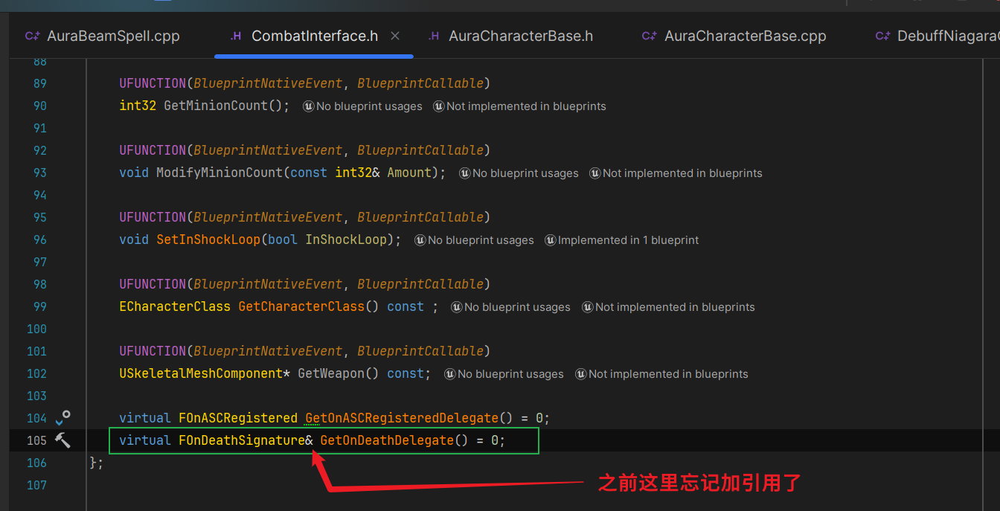
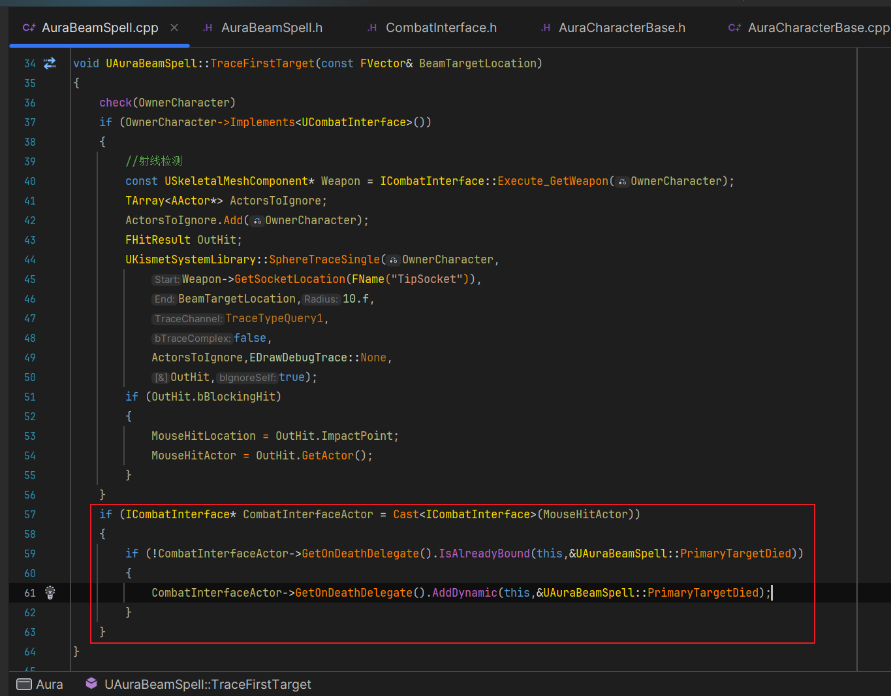

___________________________________________________________________________________________
###### [Go主菜单](../MainMenu.md)
___________________________________________________________________________________________

# GAS 172 使用监听处理闪电链技能释放期间首个目标和其他目标死亡的逻辑，添加判断闪电技能最短触发时间的逻辑

___________________________________________________________________________________________

# 目录


- [GAS 172 使用监听处理闪电链技能释放期间首个目标和其他目标死亡的逻辑，添加判断闪电技能最短触发时间的逻辑](#gas-172-使用监听处理闪电链技能释放期间首个目标和其他目标死亡的逻辑添加判断闪电技能最短触发时间的逻辑)
- [目录](#目录)
    - [Mermaid整体思路梳理](#mermaid整体思路梳理)
    - [主要敌人死亡时，结束技能，单个敌人失望时，需要从数组中移除，并取消CueLoop（这部分用委托来做）](#主要敌人死亡时结束技能单个敌人失望时需要从数组中移除并取消cueloop这部分用委托来做)
      - [`ICombatInterface` 中创建动态多播](#icombatinterface-中创建动态多播)
      - [`ICombatInterface` 中创建函数，外部可以获取委托（纯虚）](#icombatinterface-中创建函数外部可以获取委托纯虚)
      - [角色基类中重写纯虚函数，创建委托并返回](#角色基类中重写纯虚函数创建委托并返回)
      - [闪电技能中创建两个回调，分别为主要角色死亡和链接角色死亡用（蓝图实现）](#闪电技能中创建两个回调分别为主要角色死亡和链接角色死亡用蓝图实现)
      - [`TraceFirstTarget` 函数确定了目标，所以需要在这里对目标进行绑定回调](#tracefirsttarget-函数确定了目标所以需要在这里对目标进行绑定回调)
      - [`StoreAdditionalTargets` 函数查找目标数组，所以需要在这里对单个目标进行绑定回调](#storeadditionaltargets-函数查找目标数组所以需要在这里对单个目标进行绑定回调)
      - [上面绑定了回调，接着需要广播，需要在角色死亡时广播](#上面绑定了回调接着需要广播需要在角色死亡时广播)
      - [蓝图中实现两个回调函数](#蓝图中实现两个回调函数)
        - [主要目标死亡时，结束技能，移除特效，清空计时器相关参数](#主要目标死亡时结束技能移除特效清空计时器相关参数)
        - [次要目标死亡时，将目标从数组中移除](#次要目标死亡时将目标从数组中移除)
      - [计时器结束技能的逻辑中，直接调用提交CD](#计时器结束技能的逻辑中直接调用提交cd)
    - [这是运行有一个bug：当我们攻击导致一个主要目标死亡时，我们再次攻击地板，会导致之前的次要目标都受到伤害（也就是次要目标数组没有清空）](#这是运行有一个bug当我们攻击导致一个主要目标死亡时我们再次攻击地板会导致之前的次要目标都受到伤害也就是次要目标数组没有清空)
      - [同时还有报错](#同时还有报错)
        - [先解决需要清空数组的问题](#先解决需要清空数组的问题)
          - [运行测试gif，数组被清空了](#运行测试gif数组被清空了)
        - [解决报错的问题](#解决报错的问题)
          - [改为使用变量然后判空](#改为使用变量然后判空)
          - [在我们释放技能按键后，也需要执行结束技能的一系列逻辑](#在我们释放技能按键后也需要执行结束技能的一系列逻辑)
          - [运行测试gif：解决了报错问题](#运行测试gif解决了报错问题)
    - [但是没有显示冷却UI](#但是没有显示冷却ui)
      - [配置技能冷却Tag](#配置技能冷却tag)
    - [还有一个bug：当我们点击按键后立即松开，会导致进入CD状态，甚至没有播放完蒙太奇](#还有一个bug当我们点击按键后立即松开会导致进入cd状态甚至没有播放完蒙太奇)
      - [设置最短触发时间](#设置最短触发时间)
      - [当没有到最短按键时间时，Delay到最短时间然后结束技能](#当没有到最短按键时间时delay到最短时间然后结束技能)
        - [因为最短时间肯定能播放完蒙太奇，所以肯定可以看到光束](#因为最短时间肯定能播放完蒙太奇所以肯定可以看到光束)
    - [最后一步，根据我们的实际等级，确定 链接目标数量](#最后一步根据我们的实际等级确定-链接目标数量)


___________________________________________________________________________________________

<details>
<summary>视频链接</summary>

[18. Electrocute Polish_哔哩哔哩_bilibili](https://www.bilibili.com/video/BV1TH4y1L7NP?spm_id_from=333.788.player.switch&vd_source=9e1e64122d802b4f7ab37bd325a89e6c&p=131)

------

</details>

___________________________________________________________________________________________

### Mermaid整体思路梳理

Mermaid

___________________________________________________________________________________________

### 主要敌人死亡时，结束技能，单个敌人失望时，需要从数组中移除，并取消CueLoop（这部分用委托来做）

  - 为了解耦，可以在接口中创建动态多播，广播死亡的角色


------

#### `ICombatInterface` 中创建动态多播

  - `FOnDeathSignature`

>


------

#### `ICombatInterface` 中创建函数，外部可以获取委托（纯虚）

  - `GetOnDeathDelegate`

>


------

#### 角色基类中重写纯虚函数，创建委托并返回

  - `OnDeathDelegate`

>
>
>
>
>


------

#### 闪电技能中创建两个回调，分别为主要角色死亡和链接角色死亡用（蓝图实现）

  - `PrimaryTargetDied`

  - `AdditionalTargetDied`

>


------

#### `TraceFirstTarget` 函数确定了目标，所以需要在这里对目标进行绑定回调

>

  - 使用 `IsAlreadyBound` 检查该委托是否准备好了绑定（我觉得是有可能防止点击死了还没销毁的目标）

>
>
>```cpp
>if (ICombatInterface* CombatInterfaceActor = Cast<ICombatInterface>(MouseHitActor))
>{
>    if (!CombatInterfaceActor->GetOnDeathDelegate().IsAlreadyBound(this,&UAuraBeamSpell::PrimaryTargetDied))
>    {
>       CombatInterfaceActor->GetOnDeathDelegate().AddDynamic(this,&UAuraBeamSpell::PrimaryTargetDied);
>    }
>}
>```


------

#### `StoreAdditionalTargets` 函数查找目标数组，所以需要在这里对单个目标进行绑定回调

>
>
>```cpp
>//绑定死亡回调 蓝图中触发
>for (AActor* Target : OutAdditionalTargets)
>{
>    if (ICombatInterface* CombatInterfaceActor = Cast<ICombatInterface>(Target))
>    {
>       if (!CombatInterfaceActor->GetOnDeathDelegate().IsAlreadyBound(this,&UAuraBeamSpell::AdditionalTargetDied))
>       {
>          CombatInterfaceActor->GetOnDeathDelegate().AddDynamic(this,&UAuraBeamSpell::AdditionalTargetDied);
>       }
>    }
>}
>```


------

#### 上面绑定了回调，接着需要广播，需要在角色死亡时广播

>


------

#### 蓝图中实现两个回调函数

> 


------

##### 主要目标死亡时，结束技能，移除特效，清空计时器相关参数
>


------

##### 次要目标死亡时，将目标从数组中移除
>
>


------

#### 计时器结束技能的逻辑中，直接调用提交CD
>
>
>
>


------

### 这是运行有一个bug：当我们攻击导致一个主要目标死亡时，我们再次攻击地板，会导致之前的次要目标都受到伤害（也就是次要目标数组没有清空）
>


------

#### 同时还有报错
>


------

##### 先解决需要清空数组的问题
>
>


------

###### 运行测试gif，数组被清空了
>


------

##### 解决报错的问题

  - 看提示说，报错是因为，在遍历应用GE时，目标空指针
    - ASC也可能空指针

  - 所以需要判空


------

###### 改为使用变量然后判空
>


------

###### 在我们释放技能按键后，也需要执行结束技能的一系列逻辑
>


------

###### 运行测试gif：解决了报错问题
>


------

### 但是没有显示冷却UI

  - 因为技能结构体中没有配置 `CD Tag`


------

#### 配置技能冷却Tag
>


------

### 还有一个bug：当我们点击按键后立即松开，会导致进入CD状态，甚至没有播放完蒙太奇
>

- 所以需要一个最短触发时间


------

#### 设置最短触发时间

>`MinSpellTime`
>
>

  - 记录一下，这个异步节点返回的按键时长，记得结束技能时清空
>
>


------

#### 当没有到最短按键时间时，Delay到最短时间然后结束技能
>


------

##### 因为最短时间肯定能播放完蒙太奇，所以肯定可以看到光束
>


------

### 最后一步，根据我们的实际等级，确定 链接目标数量
>


___________________________________________________________________________________________

[返回最上面](#Go主菜单)

___________________________________________________________________________________________