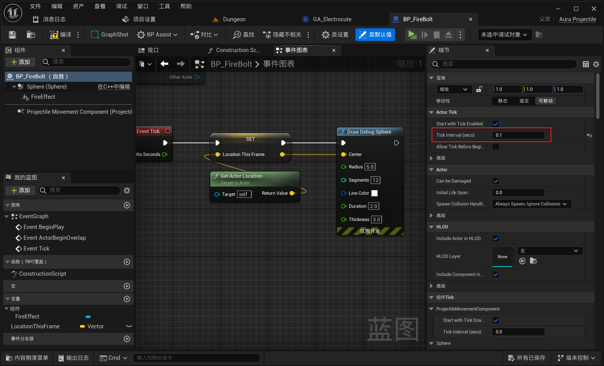

___________________________________________________________________________________________
###### [Go主菜单](../MainMenu.md)
___________________________________________________________________________________________

# GAS 173 修复火球击中死亡敌人时漂浮的bug

___________________________________________________________________________________________

## 处理关键点

1. 可以调整Tick频率降低开销

___________________________________________________________________________________________

# 目录

- [GAS 173 修复火球击中死亡敌人时漂浮的bug](#gas-173-修复火球击中死亡敌人时漂浮的bug)
  - [处理关键点](#处理关键点)
- [目录](#目录)
    - [Mermaid整体思路梳理](#mermaid整体思路梳理)
    - [现在有一个bug：就是当攻击一个死亡的敌人时，火球会停在敌人原来的位置上，不会爆炸，漂浮](#现在有一个bug就是当攻击一个死亡的敌人时火球会停在敌人原来的位置上不会爆炸漂浮)
    - [可以在Tick中修复(可以调整Tick频率降低开销)](#可以在tick中修复可以调整tick频率降低开销)
      - [如果正常在tick中生成debug路线是这样](#如果正常在tick中生成debug路线是这样)
      - [设为0.1](#设为01)
      - [设为0.2](#设为02)
    - [思路：记录i上一帧的位置，和这一帧进行对比，如果，运动距离小于最小值（配置的参数）就播放声音，生成NS然后销毁（NS可以使用黑色的爆炸特效）](#思路记录i上一帧的位置和这一帧进行对比如果运动距离小于最小值配置的参数就播放声音生成ns然后销毁ns可以使用黑色的爆炸特效)
      - [检测成功](#检测成功)
    - [折叠为一个函数](#折叠为一个函数)

___________________________________________________________________________________________

视频链接

[19. Explode Dem FireBoltz_哔哩哔哩_bilibili](https://www.bilibili.com/video/BV1TH4y1L7NP?spm_id_from=333.788.player.switch&vd_source=9e1e64122d802b4f7ab37bd325a89e6c&p=132)

------

___________________________________________________________________________________________

### Mermaid整体思路梳理

Mermaid

___________________________________________________________________________________________

### 现在有一个bug：就是当攻击一个死亡的敌人时，火球会停在敌人原来的位置上，不会爆炸，漂浮
>

------

### 可以在Tick中修复(可以调整Tick频率降低开销)

  - 0为不限制 即 等于 帧率
>

  - 0.1是比率（0.1 * 帧率）

------

#### 如果正常在tick中生成debug路线是这样
>

------

#### 设为0.1
>
>

------

#### 设为0.2
>

------

### 思路：记录i上一帧的位置，和这一帧进行对比，如果，运动距离小于最小值（配置的参数）就播放声音，生成NS然后销毁（NS可以使用黑色的爆炸特效）
>

------

#### 检测成功
>

------

### 折叠为一个函数

  - `MakeGoKaboom`

>

___________________________________________________________________________________________

[返回最上面](#Go主菜单)

___________________________________________________________________________________________