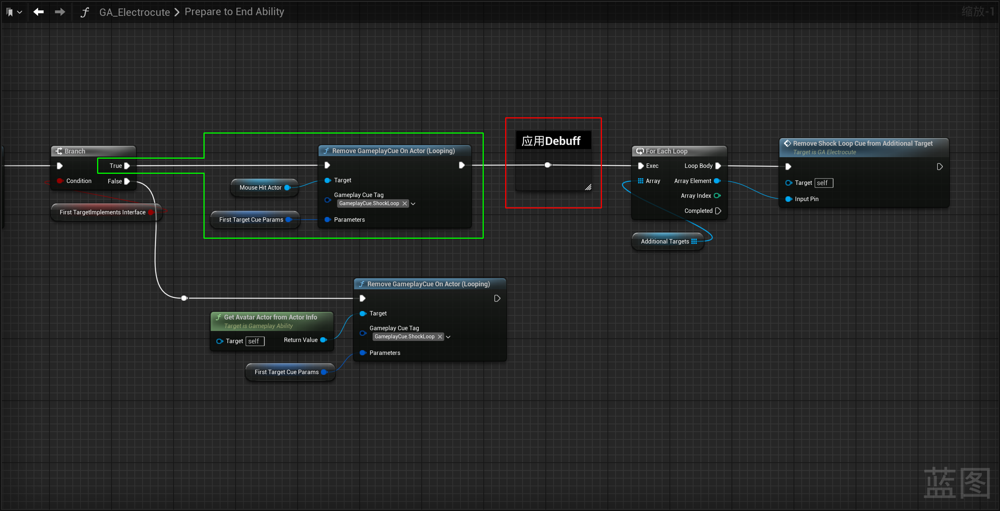
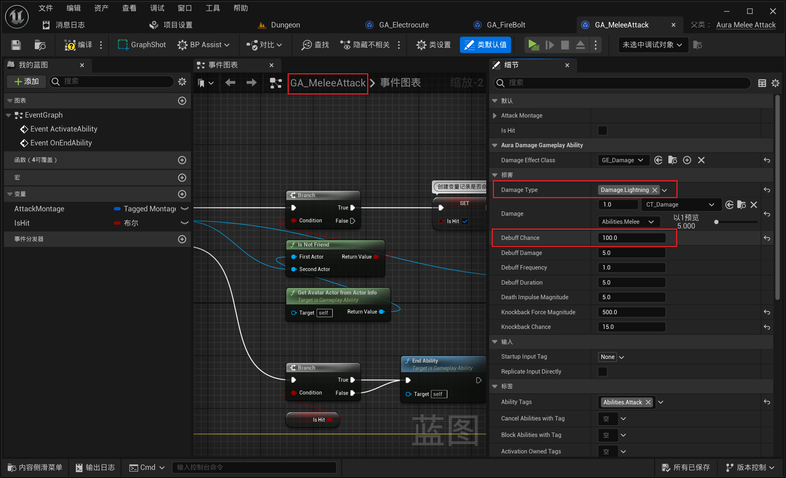

___________________________________________________________________________________________
###### [Go主菜单](../MainMenu.md)
___________________________________________________________________________________________

# GAS 174 制作眩晕debuff逻辑；处理技能之间的打断；处理DS模式下客户端的bug；需要注意tag不会复制！！！

___________________________________________________________________________________________

## 处理关键点

1. 角色动画模板中使用动画要使用 `SequencePlayer`
2. C++处理：GE中在持续时间内添加tag
3. 复习下：代码中设置黑板值
4. 复习下：属性复制和监听tag变化

___________________________________________________________________________________________

# 目录


- [GAS 174 制作眩晕debuff逻辑；处理技能之间的打断；处理DS模式下客户端的bug；需要注意tag不会复制！！！](#gas-174-制作眩晕debuff逻辑处理技能之间的打断处理ds模式下客户端的bug需要注意tag不会复制)
  - [处理关键点](#处理关键点)
- [目录](#目录)
    - [Mermaid整体思路梳理](#mermaid整体思路梳理)
    - [这一节我们来处理，闪电技能的Debuff —— 眩晕](#这一节我们来处理闪电技能的debuff--眩晕)
    - [先处理一个bug：如果再释放火球技能之后（很短时间内）释放闪电技能，会打断火球技能](#先处理一个bug如果再释放火球技能之后很短时间内释放闪电技能会打断火球技能)
      - [可以使用技能打断标签，阻止再释放火球技能时，受到别的技能的影响比如图1（当然这样的设置有些广泛，可以单独配置技能Tag比如图2）](#可以使用技能打断标签阻止再释放火球技能时受到别的技能的影响比如图1当然这样的设置有些广泛可以单独配置技能tag比如图2)
      - [也可以单独配置一个打断技能的标签，让释放的不想被打断的技能拥有这个Tag](#也可以单独配置一个打断技能的标签让释放的不想被打断的技能拥有这个tag)
    - [接下来我们来制作闪电技能Debuff](#接下来我们来制作闪电技能debuff)
      - [我们之前是在 `Debuff` 函数中创建GE然后应用了GE，并根据参数配置](#我们之前是在-debuff-函数中创建ge然后应用了ge并根据参数配置)
      - [可以在准备结束技能前，应用Debuff，先对主要目标造成Debuff伤害，然后遍历受到影响的目标，再对其应用Debuff伤害](#可以在准备结束技能前应用debuff先对主要目标造成debuff伤害然后遍历受到影响的目标再对其应用debuff伤害)
        - [将Debuff触发概率设为100，击飞概率0，然后测试](#将debuff触发概率设为100击飞概率0然后测试)
        - [运行游戏发现敌人还是被击飞了，需要看下哪里设置了击飞](#运行游戏发现敌人还是被击飞了需要看下哪里设置了击飞)
          - [之前我们在这里只是检查击退力的大小，并没有使用到概率，所以，需要设置击退力为0，才能生效](#之前我们在这里只是检查击退力的大小并没有使用到概率所以需要设置击退力为0才能生效)
        - [运行测试：攻击敌人后，敌人debuff状态会触发 `受击技能`](#运行测试攻击敌人后敌人debuff状态会触发-受击技能)
      - [想要在闪电技能debuff的持续期间内眩晕敌人，而不是受到伤害](#想要在闪电技能debuff的持续期间内眩晕敌人而不是受到伤害)
      - [除此之外，受到debuff影响的敌人还应该无法移动，且，显示动画](#除此之外受到debuff影响的敌人还应该无法移动且显示动画)
        - [眩晕打算使用状态机来做](#眩晕打算使用状态机来做)
          - [角色基类 `AuraCharacterBase` 上创建眩晕的变量（需要开启属性复制！）](#角色基类-auracharacterbase-上创建眩晕的变量需要开启属性复制)
        - [角色基类上还需要监听Tag标签的变化（创建回调函数）](#角色基类上还需要监听tag标签的变化创建回调函数)
          - [关于绑定的时机：可以在角色基类的函数中处理，这样子类只需要在初始化完成后调用 `Super` 即可](#关于绑定的时机可以在角色基类的函数中处理这样子类只需要在初始化完成后调用-super-即可)
          - [因为我们在子类上分别绑定了各自的函数，所以回调函数可以写成虚函数，这样可以让子类可以重写不同的逻辑](#因为我们在子类上分别绑定了各自的函数所以回调函数可以写成虚函数这样可以让子类可以重写不同的逻辑)
        - [根据Tag计数不同执行不同策略](#根据tag计数不同执行不同策略)
        - [敌人ABP初始化时记录指针，Tick中设置](#敌人abp初始化时记录指针tick中设置)
        - [状态机中，设置过度和动画](#状态机中设置过度和动画)
          - [敌人眩晕动画，因为要设置的是动画模板的动画，所以需要使用 `SequencePlayer`](#敌人眩晕动画因为要设置的是动画模板的动画所以需要使用-sequenceplayer)
          - [玩家眩晕动画也需要设置](#玩家眩晕动画也需要设置)
      - [运行测试gif：敌人先进入受击状态播放完蒙太奇后，才开始眩晕](#运行测试gif敌人先进入受击状态播放完蒙太奇后才开始眩晕)
      - [我们之前在行为树中处理了，受击打断的逻辑，也需要搞一个眩晕状态的黑板键](#我们之前在行为树中处理了受击打断的逻辑也需要搞一个眩晕状态的黑板键)
      - [现在敌人基类中，需要额外设置黑板键，所以需要重写回调函数](#现在敌人基类中需要额外设置黑板键所以需要重写回调函数)
      - [运行测试：敌人受到攻击进入眩晕状态5秒后，恢复](#运行测试敌人受到攻击进入眩晕状态5秒后恢复)
      - [因为，敌人萨满单独创建了行为树，也需要设置](#因为敌人萨满单独创建了行为树也需要设置)
    - [接下来，我们需要让敌人使用闪电类型的攻击，并让他百分百触发Debuff测试玩家眩晕状态](#接下来我们需要让敌人使用闪电类型的攻击并让他百分百触发debuff测试玩家眩晕状态)
      - [我们将敌人的伤害类型改为闪电伤害，在修改debuff触发概率](#我们将敌人的伤害类型改为闪电伤害在修改debuff触发概率)
      - [运行测试gif：让敌人攻击玩家](#运行测试gif让敌人攻击玩家)
        - [现在玩家眩晕期间可以施法](#现在玩家眩晕期间可以施法)
          - [在技能上添加被指定标签（比如眩晕）阻挡](#在技能上添加被指定标签比如眩晕阻挡)
        - [接下来处理眩晕期间禁止移动和旋转](#接下来处理眩晕期间禁止移动和旋转)
        - [我们现在需要在应用Debuff的GE 时，也让目标ASC携带Debuff的标签，在结束后移除](#我们现在需要在应用debuff的ge-时也让目标asc携带debuff的标签在结束后移除)
          - [之前是在GA中设置 技能激活期间 带有 `阻挡按键Tag`](#之前是在ga中设置-技能激活期间-带有-阻挡按键tag)
          - [我们也给GE添加过Tag](#我们也给ge添加过tag)
          - [需要让Debuff持续时间内也持有对应Debuff的Tag，并在眩晕期间（闪电Debuff期间）禁用所有按键输入（也就是持有所有按键阻挡Tag）](#需要让debuff持续时间内也持有对应debuff的tag并在眩晕期间闪电debuff期间禁用所有按键输入也就是持有所有按键阻挡tag)
          - [运行测试gif：现在眩晕后无法移动旋转了](#运行测试gif现在眩晕后无法移动旋转了)
    - [多人DS模式下测试](#多人ds模式下测试)
      - [服务器可以禁止移动，客户端没有禁止移动](#服务器可以禁止移动客户端没有禁止移动)
      - [可以使用之前创建的眩晕状态的bool，使用属性复制来制作逻辑](#可以使用之前创建的眩晕状态的bool使用属性复制来制作逻辑)
        - [修改为属性复制通知，添加回调](#修改为属性复制通知添加回调)
        - [在属性修改的回调中，添加tag；通过bool判断是添加还是移除tag](#在属性修改的回调中添加tag通过bool判断是添加还是移除tag)
    - [还有一个bug：DS模式下，当客户端使用闪电技能攻击敌人触发debuff后，再次攻击别的目标，不会取消之前的闪电技能链接NS，下一节处理](#还有一个bugds模式下当客户端使用闪电技能攻击敌人触发debuff后再次攻击别的目标不会取消之前的闪电技能链接ns下一节处理)


___________________________________________________________________________________________

<details>
<summary>视频链接</summary>

[20. Stun_哔哩哔哩_bilibili](https://www.bilibili.com/video/BV1TH4y1L7NP?spm_id_from=333.788.player.switch&vd_source=9e1e64122d802b4f7ab37bd325a89e6c&p=133)

------

</details>

___________________________________________________________________________________________

### Mermaid整体思路梳理

Mermaid

___________________________________________________________________________________________

### 这一节我们来处理，闪电技能的Debuff —— 眩晕


------

### 先处理一个bug：如果再释放火球技能之后（很短时间内）释放闪电技能，会打断火球技能


------

#### 可以使用技能打断标签，阻止再释放火球技能时，受到别的技能的影响比如图1（当然这样的设置有些广泛，可以单独配置技能Tag比如图2）
>
>


------

#### 也可以单独配置一个打断技能的标签，让释放的不想被打断的技能拥有这个Tag


------

### 接下来我们来制作闪电技能Debuff
  - 当我们应用伤害时，想要应用最后一个伤害量的时候才检测Debuff


------

#### 我们之前是在 `Debuff` 函数中创建GE然后应用了GE，并根据参数配置
>

>


------

#### 可以在准备结束技能前，应用Debuff，先对主要目标造成Debuff伤害，然后遍历受到影响的目标，再对其应用Debuff伤害
>
>


------

##### 将Debuff触发概率设为100，击飞概率0，然后测试
>


------

##### 运行游戏发现敌人还是被击飞了，需要看下哪里设置了击飞


------

###### 之前我们在这里只是检查击退力的大小，并没有使用到概率，所以，需要设置击退力为0，才能生效
>
>


------

##### 运行测试：攻击敌人后，敌人debuff状态会触发 `受击技能`
>


------

#### 想要在闪电技能debuff的持续期间内眩晕敌人，而不是受到伤害

- 所以需要把debuff伤害设置为0
>


------

#### 除此之外，受到debuff影响的敌人还应该无法移动，且，显示动画


------

##### 眩晕打算使用状态机来做
  - 需要在角色基类上创建一个变量，因为玩家和敌人都可以眩晕


------

###### 角色基类 `AuraCharacterBase` 上创建眩晕的变量（需要开启属性复制！）

  - `bIsStunned`

>```cpp
>public:
>    //是否为 眩晕状态
>    UPROPERTY(Replicated, BlueprintReadOnly)
>    bool bIsStunned = false;
>```

  - 配置属性复制
>```CPP
>public:
>    virtual void GetLifetimeReplicatedProps(TArray<FLifetimeProperty>& OutLifetimeProps) const override;
>```
>
>
>
>
>```CPP
>void AAuraCharacterBase::GetLifetimeReplicatedProps(TArray<FLifetimeProperty>& OutLifetimeProps) const
>{
>    Super::GetLifetimeReplicatedProps(OutLifetimeProps);
>    
>    DOREPLIFETIME(AAuraCharacterBase,bIsStunned);
>}
>```


------

##### 角色基类上还需要监听Tag标签的变化（创建回调函数）

  - `StunTagChanged`

  - protected：
>```cpp
>protected:
>    void StunTagChanged(const FGameplayTag CallbackTag,int32 NewCount);
>```
>
>


------

###### 关于绑定的时机：可以在角色基类的函数中处理，这样子类只需要在初始化完成后调用 `Super` 即可
>
>
>可以在这里调用Super就行了
>
>
>
># 下图函数指针前忘了加引用 `&` 了
>
>```CPP
>AbilitySystemComponent->RegisterGameplayTagEvent(FAuraGameplayTags::Get().Debuff_Stun,EGameplayTagEventType::NewOrRemoved).AddUObject(this,&AAuraCharacter::StunTagChanged);
>```
>
>```CPP
>AbilitySystemComponent->RegisterGameplayTagEvent(FAuraGameplayTags::Get().Debuff_Stun,EGameplayTagEventType::NewOrRemoved).AddUObject(this,&AAuraEnemy::StunTagChanged);
>```
>
>
>


------

###### 因为我们在子类上分别绑定了各自的函数，所以回调函数可以写成虚函数，这样可以让子类可以重写不同的逻辑
>


------

##### 根据Tag计数不同执行不同策略
>参考敌人的受击监听
>
>
>
>

- 但是这个变量我们之前是在敌人中创建的，需要挪到角色基类中
>
>

- 修改默认值为600.f，敌人的可以单独设置
>```cpp
>UPROPERTY(EditDefaultsOnly, BlueprintReadOnly, Category = "Combat")
>float BaseWalkSpeed = 600.f;
>```
>
>
>

- 然后就可以使用了
>
>
>```cpp
>void AAuraCharacterBase::StunTagChanged(const FGameplayTag CallbackTag, int32 NewCount)
>{
>    bIsStunned = NewCount > 0;
>    GetCharacterMovement()->MaxWalkSpeed = bIsStunned ? 0.f : BaseWalkSpeed;
>}
>```


------

##### 敌人ABP初始化时记录指针，Tick中设置
>
>


------

##### 状态机中，设置过度和动画
>


------

###### 敌人眩晕动画，因为要设置的是动画模板的动画，所以需要使用 `SequencePlayer`
>

- 配置动画
>
>
>
>
>


------

###### 玩家眩晕动画也需要设置
>
>


------

#### 运行测试gif：敌人先进入受击状态播放完蒙太奇后，才开始眩晕
>


------

#### 我们之前在行为树中处理了，受击打断的逻辑，也需要搞一个眩晕状态的黑板键
>
>
>`Stunned`
>
>
>


------

#### 现在敌人基类中，需要额外设置黑板键，所以需要重写回调函数
>

- 注意下黑板键不要写错了!
>```cpp
>void AAuraEnemy::StunTagChanged(const FGameplayTag CallbackTag, int32 NewCount)
>{
>    Super::StunTagChanged(CallbackTag, NewCount);
>    if (AIController && AIController->GetBlackboardComponent())
>    {
>       AIController->GetBlackboardComponent()->SetValueAsBool(FName("Stunned"),bIsStunned);
>    }
>}
>```


------

#### 运行测试：敌人受到攻击进入眩晕状态5秒后，恢复
>

- 5s是因为Debuff持续时间是5s


------

#### 因为，敌人萨满单独创建了行为树，也需要设置
>


------

### 接下来，我们需要让敌人使用闪电类型的攻击，并让他百分百触发Debuff测试玩家眩晕状态


------

#### 我们将敌人的伤害类型改为闪电伤害，在修改debuff触发概率
>
>
>


------

#### 运行测试gif：让敌人攻击玩家
>

- 可以旋转，但是玩家眩晕期间无法移动


------

##### 现在玩家眩晕期间可以施法


------

###### 在技能上添加被指定标签（比如眩晕）阻挡
>
>


------

##### 接下来处理眩晕期间禁止移动和旋转


------

##### 我们现在需要在应用Debuff的GE 时，也让目标ASC携带Debuff的标签，在结束后移除


------

###### 之前是在GA中设置 技能激活期间 带有 `阻挡按键Tag` 
>

- 然后触发按键时检查
>


------

###### 我们也给GE添加过Tag
>


------

###### 需要让Debuff持续时间内也持有对应Debuff的Tag，并在眩晕期间（闪电Debuff期间）禁用所有按键输入（也就是持有所有按键阻挡Tag）
>


------

###### 运行测试gif：现在眩晕后无法移动旋转了
>


------

### 多人DS模式下测试


------

#### 服务器可以禁止移动，客户端没有禁止移动
>

- 说明Tag并不会复制


------

#### 可以使用之前创建的眩晕状态的bool，使用属性复制来制作逻辑
>


------

##### 修改为属性复制通知，添加回调
>
>
>```cpp
>public:
>    //是否为 眩晕状态
>    UPROPERTY( ReplicatedUsing = "OnRep_Stunned", BlueprintReadOnly)
>    bool bIsStunned = false;
>protected:
>    UFUNCTION()
>    void OnRep_Stunned();
>```


------

##### 在属性修改的回调中，添加tag；通过bool判断是添加还是移除tag
>
>
>```cpp
>void AAuraCharacterBase::OnRep_Stunned()
>{
>    if (UAuraAbilitySystemComponent* AuraASC = Cast<UAuraAbilitySystemComponent>(AbilitySystemComponent))
>    {
>       const FAuraGameplayTags GameplayTags = FAuraGameplayTags::Get();
>       FGameplayTagContainer BlockedTags;
>       BlockedTags.AddTag(GameplayTags.Player_Block_CursorTrace);
>       BlockedTags.AddTag(GameplayTags.Player_Block_InputHeld);
>       BlockedTags.AddTag(GameplayTags.Player_Block_InputPressed);
>       BlockedTags.AddTag(GameplayTags.Player_Block_InputReleased);
>       if (bIsStunned)
>       {
>          AuraASC->AddLooseGameplayTags(BlockedTags);
>       }
>       else
>       {
>          AuraASC->RemoveLooseGameplayTags(BlockedTags);
>       }
>    }
>}
>```


------

### 还有一个bug：DS模式下，当客户端使用闪电技能攻击敌人触发debuff后，再次攻击别的目标，不会取消之前的闪电技能链接NS，下一节处理
>
>
>


___________________________________________________________________________________________

[返回最上面](#Go主菜单)

___________________________________________________________________________________________