___________________________________________________________________________________________
###### [Go主菜单](../MainMenu.md)
___________________________________________________________________________________________

# GAS 176 使用属性复制，为闪电技能添加敌人的响应动画逻辑；优化：避免频繁触发不必要的过渡蒙太奇和GA

___________________________________________________________________________________________

## 处理关键点

1. 属性复制的参数需要在服务器上同步

___________________________________________________________________________________________

# 目录


- [GAS 176 使用属性复制，为闪电技能添加敌人的响应动画逻辑；优化：避免频繁触发不必要的过渡蒙太奇和GA](#gas-176-使用属性复制为闪电技能添加敌人的响应动画逻辑优化避免频繁触发不必要的过渡蒙太奇和ga)
  - [处理关键点](#处理关键点)
- [目录](#目录)
    - [Mermaid整体思路梳理](#mermaid整体思路梳理)
    - [现在当我们对目标应用Debuff时，会每次都触发敌人的受击技能，因为是0.1s一次所以每秒触发十次伤害和十次受击技能](#现在当我们对目标应用debuff时会每次都触发敌人的受击技能因为是01s一次所以每秒触发十次伤害和十次受击技能)
    - [而且，敌人从受击蒙太奇切换到眩晕状态机时，会有一个卡顿](#而且敌人从受击蒙太奇切换到眩晕状态机时会有一个卡顿)
      - [可以设置受击蒙太奇的混出时间](#可以设置受击蒙太奇的混出时间)
    - [现在敌人在眩晕 debuff期间会一直循环播放眩晕动画，希望在攻击敌人时，比如对敌人使用闪电技能时，敌人也会播触电的动画](#现在敌人在眩晕-debuff期间会一直循环播放眩晕动画希望在攻击敌人时比如对敌人使用闪电技能时敌人也会播触电的动画)
      - [为敌人创建被闪电技能集中的bool变量](#为敌人创建被闪电技能集中的bool变量)
    - [打算使用接口来做所以创建对应 `Get` 和 `Set` 函数](#打算使用接口来做所以创建对应-get-和-set-函数)
      - [刚要创建，发现，玩家也有一个同名的变量](#刚要创建发现玩家也有一个同名的变量)
      - [给函数改个名字来区分](#给函数改个名字来区分)
      - [变量也改个名字](#变量也改个名字)
      - [角色基类中重写一下接口函数](#角色基类中重写一下接口函数)
      - [修改之前的触发敌人受击技能的逻辑（需要判断是否进入眩晕状态，眩晕就不是受击状态了）](#修改之前的触发敌人受击技能的逻辑需要判断是否进入眩晕状态眩晕就不是受击状态了)
    - [在敌人的动画蓝图模板中，添加状态和过渡](#在敌人的动画蓝图模板中添加状态和过渡)
    - [为敌人配置动画](#为敌人配置动画)
    - [现在还没有设置该bool，需要设置下](#现在还没有设置该bool需要设置下)
      - [在执行完第一个目标添加cue之后判断目标是实现了接口以后，在设置](#在执行完第一个目标添加cue之后判断目标是实现了接口以后在设置)
      - [然后设置链接的目标](#然后设置链接的目标)
      - [结束技能时，当目标实现了接口，就设为fasle](#结束技能时当目标实现了接口就设为fasle)
      - [然后设置连接目标](#然后设置连接目标)
        - [因为这个变量是 `Replicated` 所以如果设置需要在服务器设置（然后会同步到其他客户端），客户端的修改不会同步到服务器，只会修改本地数据](#因为这个变量是-replicated-所以如果设置需要在服务器设置然后会同步到其他客户端客户端的修改不会同步到服务器只会修改本地数据)
    - [运行测试gif](#运行测试gif)


___________________________________________________________________________________________

<details>
<summary>视频链接</summary>
[135-22. Shock Loop Animations-1080P 高清-AVC_哔哩哔哩_bilibili](https://www.bilibili.com/video/BV1jSAKeyEL4?spm_id_from=333.788.videopod.episodes&vd_source=9e1e64122d802b4f7ab37bd325a89e6c&p=35)

------

</details>

___________________________________________________________________________________________

### Mermaid整体思路梳理

Mermaid

___________________________________________________________________________________________

### 现在当我们对目标应用Debuff时，会每次都触发敌人的受击技能，因为是0.1s一次所以每秒触发十次伤害和十次受击技能
>


------

### 而且，敌人从受击蒙太奇切换到眩晕状态机时，会有一个卡顿


------

#### 可以设置受击蒙太奇的混出时间
>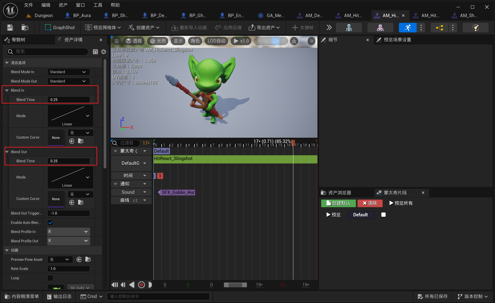
>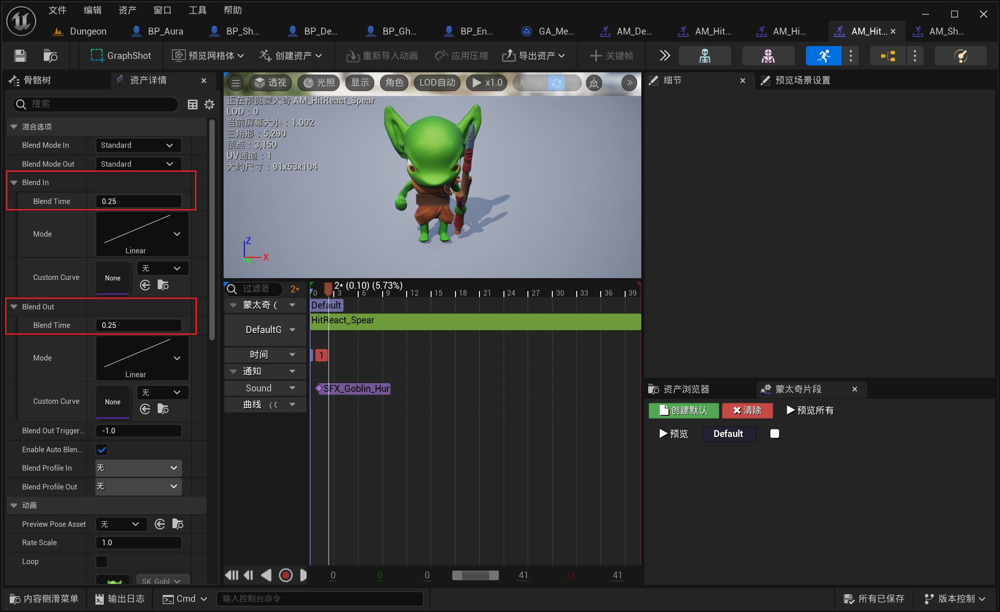


------

### 现在敌人在眩晕 debuff期间会一直循环播放眩晕动画，希望在攻击敌人时，比如对敌人使用闪电技能时，敌人也会播触电的动画

  - 需要使用属性复制来做


------

#### 为敌人创建被闪电技能集中的bool变量

  - `bInShockLoop`

  - 不用通知，直接复制即可

>```cpp
>public:
>    //是否为 被闪电技能击中的状态
>    UPROPERTY( Replicated, BlueprintReadOnly)
>    bool bInShockLoop = false;
>```
>
>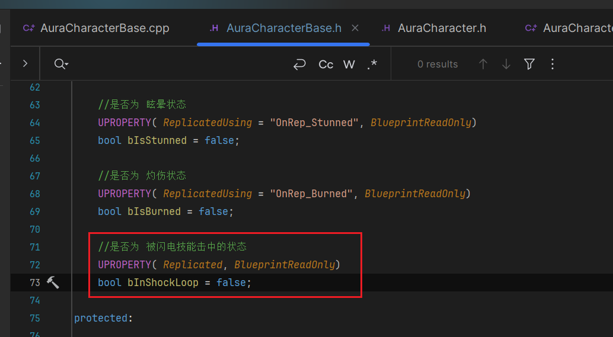
>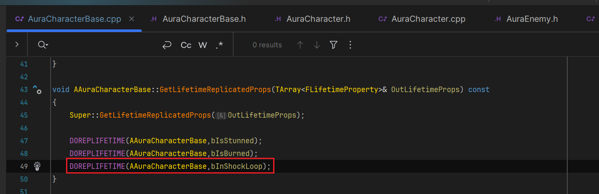
>
>```cpp
>void AAuraCharacterBase::GetLifetimeReplicatedProps(TArray<FLifetimeProperty>& OutLifetimeProps) const
>{
>    Super::GetLifetimeReplicatedProps(OutLifetimeProps);
>    
>    DOREPLIFETIME(AAuraCharacterBase,bIsStunned);
>    DOREPLIFETIME(AAuraCharacterBase,bIsBurned);
>    DOREPLIFETIME(AAuraCharacterBase,bInShockLoop);
>}
>```


------

### 打算使用接口来做所以创建对应 `Get` 和 `Set` 函数


------

#### 刚要创建，发现，玩家也有一个同名的变量
>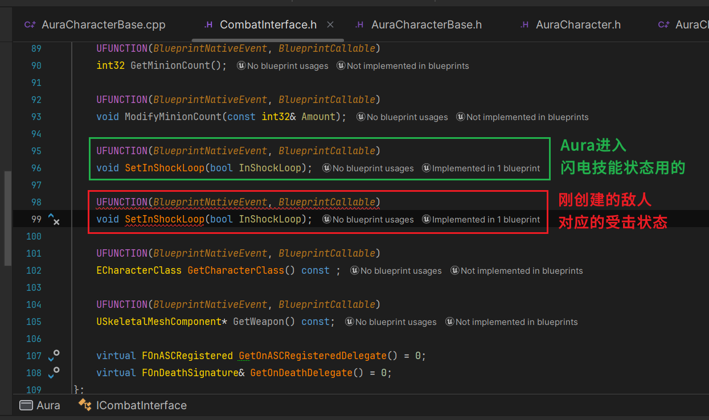


------

#### 给函数改个名字来区分

  - `IsBeingShocked`

  - `SetIsBeingShocked`

>


------

#### 变量也改个名字

  - `bIsBeingShocked`

>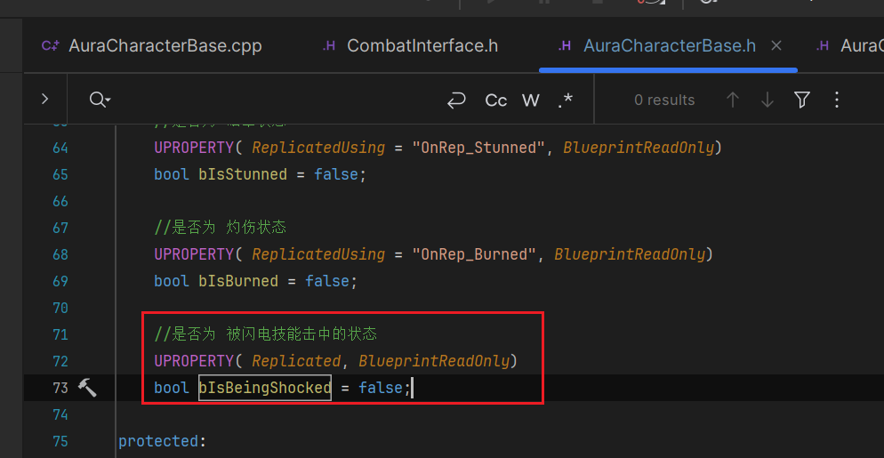


------

#### 角色基类中重写一下接口函数
>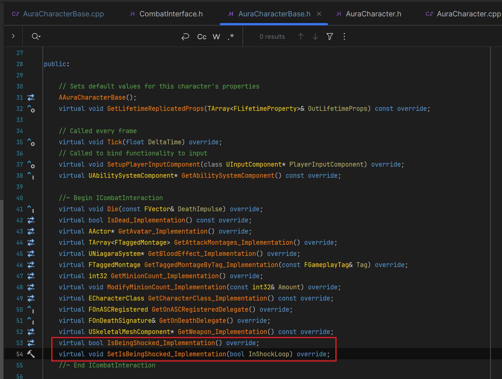
>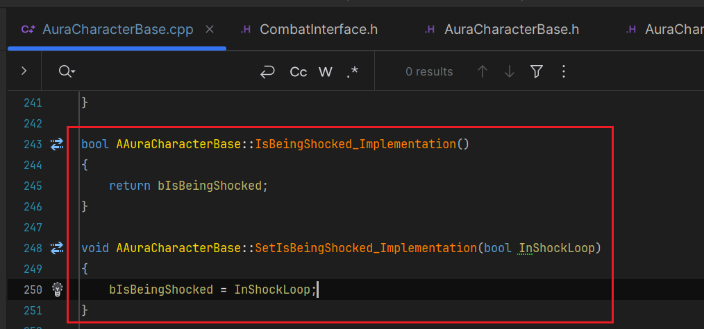
>
>```cpp
>bool AAuraCharacterBase::IsBeingShocked_Implementation()
>{
>    return bIsBeingShocked;
>}
>
>void AAuraCharacterBase::SetIsBeingShocked_Implementation(bool InShockLoop)
>{
>    bIsBeingShocked = InShockLoop;
>}
>```


------

#### 修改之前的触发敌人受击技能的逻辑（需要判断是否进入眩晕状态，眩晕就不是受击状态了）
>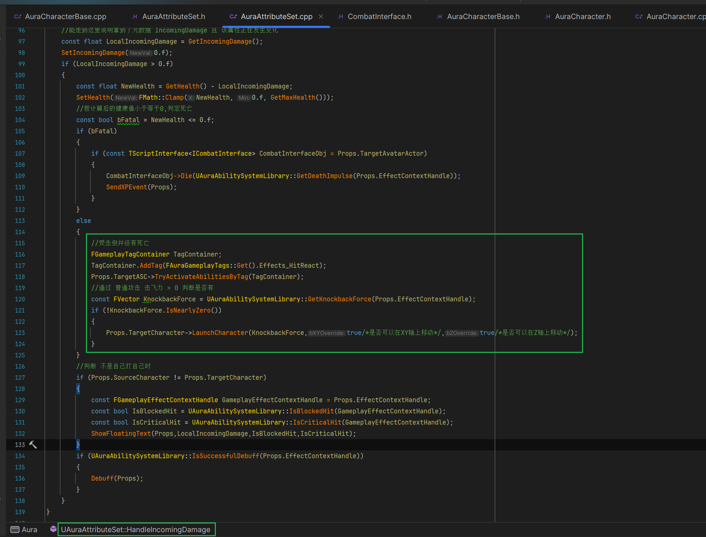
>
>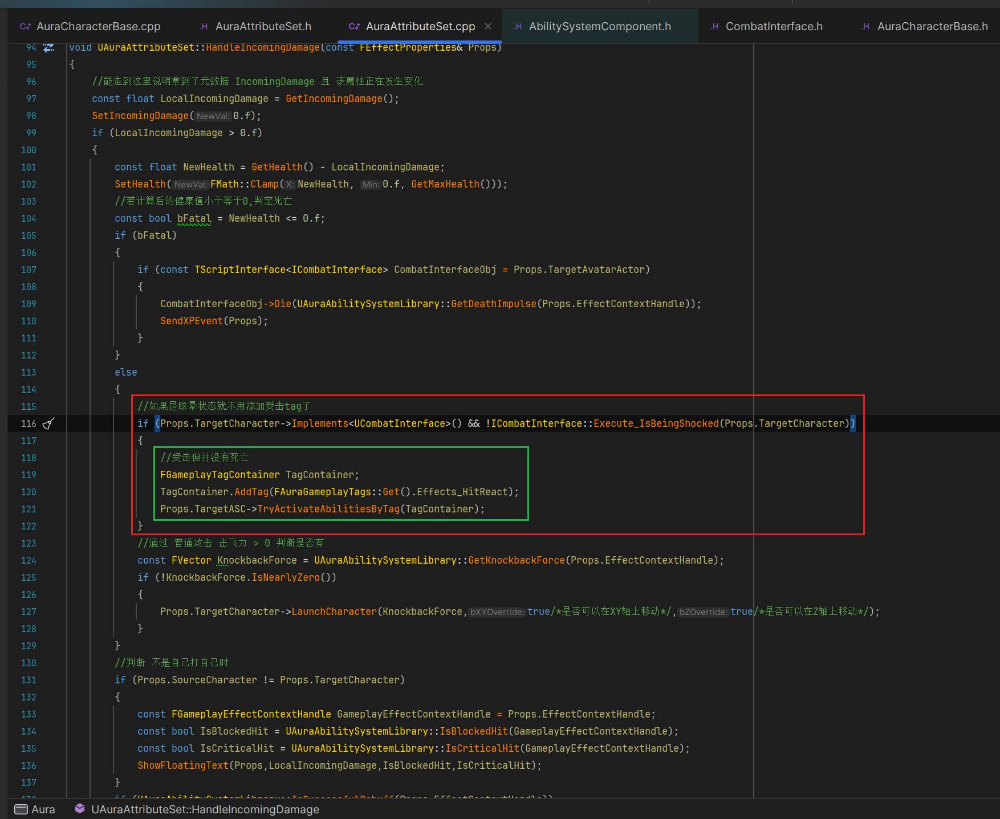
>
>## 函数为：
>
>```cpp
>void UAuraAttributeSet::HandleIncomingDamage(const FEffectProperties& Props)
>{
>    //能走到这里说明拿到了元数据 IncomingDamage 且 该属性正在发生变化
>    const float LocalIncomingDamage = GetIncomingDamage();
>    SetIncomingDamage(0.f);
>    if (LocalIncomingDamage > 0.f)
>    {
>       const float NewHealth = GetHealth() - LocalIncomingDamage;
>       SetHealth(FMath::Clamp(NewHealth, 0.f, GetMaxHealth()));
>       //若计算后的健康值小于等于0,判定死亡
>       const bool bFatal = NewHealth <= 0.f;
>       if (bFatal)
>       {
>          if (const TScriptInterface<ICombatInterface> CombatInterfaceObj = Props.TargetAvatarActor)
>          {
>             CombatInterfaceObj->Die(UAuraAbilitySystemLibrary::GetDeathImpulse(Props.EffectContextHandle));
>             SendXPEvent(Props);
>          }
>       }
>       else
>       {
>          //如果是眩晕状态就不用添加受击tag了
>          if (Props.TargetCharacter->Implements<UCombatInterface>() && !ICombatInterface::Execute_IsBeingShocked(Props.TargetCharacter))
>          {
>             //受击但并没有死亡
>             FGameplayTagContainer TagContainer;
>             TagContainer.AddTag(FAuraGameplayTags::Get().Effects_HitReact);
>             Props.TargetASC->TryActivateAbilitiesByTag(TagContainer);
>          }
>          //通过 普通攻击 击飞力 > 0 判断是否有
>          const FVector KnockbackForce = UAuraAbilitySystemLibrary::GetKnockbackForce(Props.EffectContextHandle);
>          if (!KnockbackForce.IsNearlyZero())
>          {
>             Props.TargetCharacter->LaunchCharacter(KnockbackForce,true/*是否可以在XY轴上移动*/,true/*是否可以在Z轴上移动*/);
>          }
>       }
>       //判断 不是自己打自己时
>       if (Props.SourceCharacter != Props.TargetCharacter)
>       {
>          const FGameplayEffectContextHandle GameplayEffectContextHandle = Props.EffectContextHandle;
>          const bool IsBlockedHit = UAuraAbilitySystemLibrary::IsBlockedHit(GameplayEffectContextHandle);
>          const bool IsCriticalHit = UAuraAbilitySystemLibrary::IsCriticalHit(GameplayEffectContextHandle);
>          ShowFloatingText(Props,LocalIncomingDamage,IsBlockedHit,IsCriticalHit);
>       }
>       if (UAuraAbilitySystemLibrary::IsSuccessfulDebuff(Props.EffectContextHandle))
>       {
>          Debuff(Props);
>       }
>    }
>}
>```


------

### 在敌人的动画蓝图模板中，添加状态和过渡
>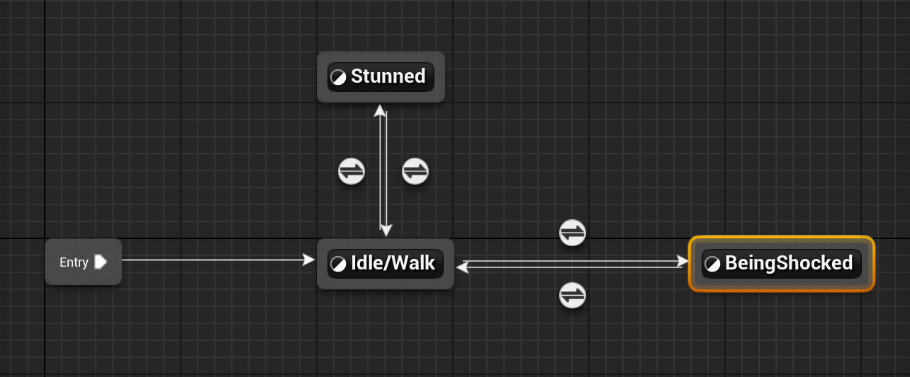
>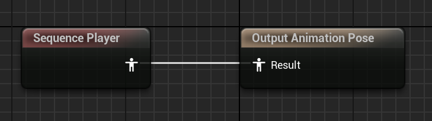
>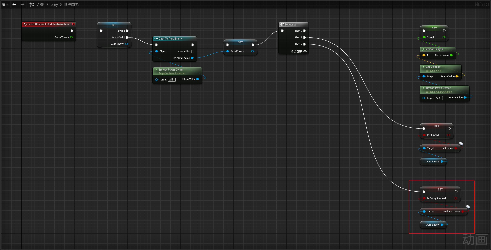


------

### 为敌人配置动画
>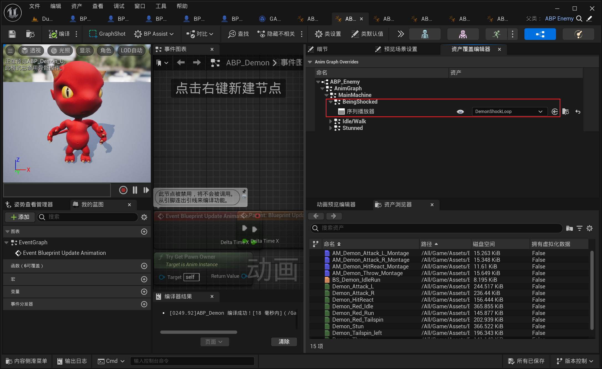
>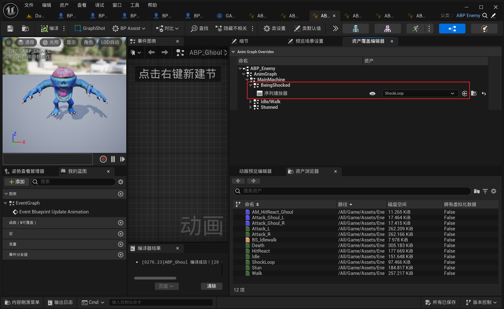
>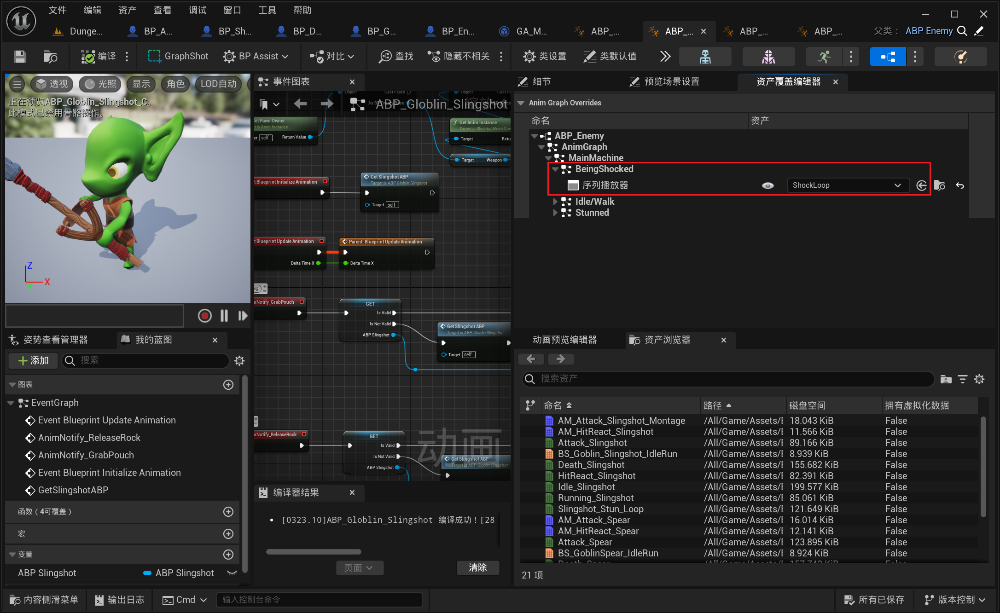
>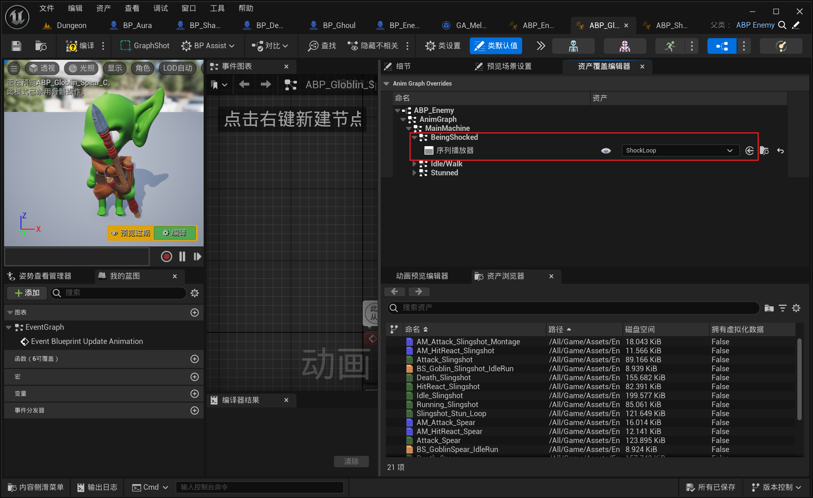
>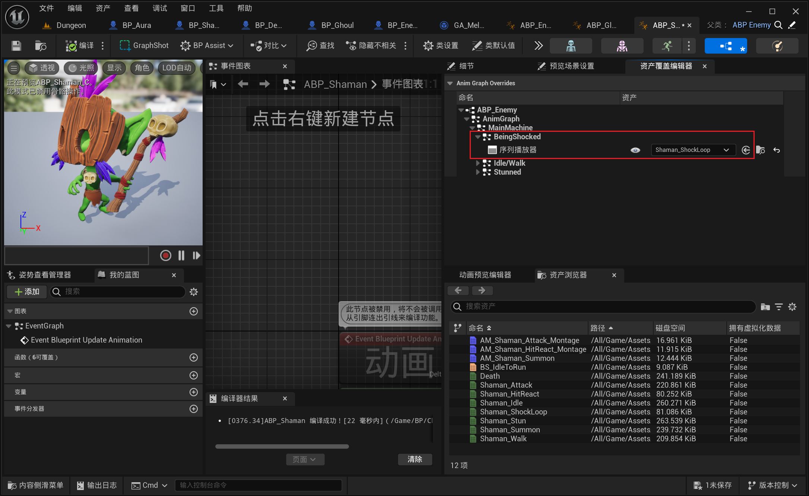


------

### 现在还没有设置该bool，需要设置下


------

#### 在执行完第一个目标添加cue之后判断目标是实现了接口以后，在设置
>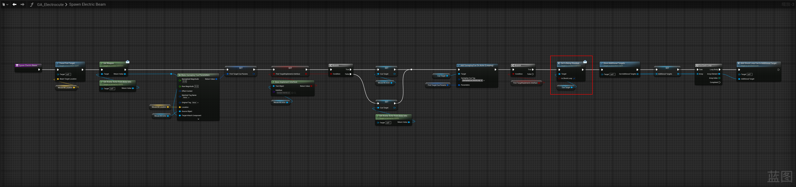

- 别掉用错函数名！


------

#### 然后设置链接的目标
>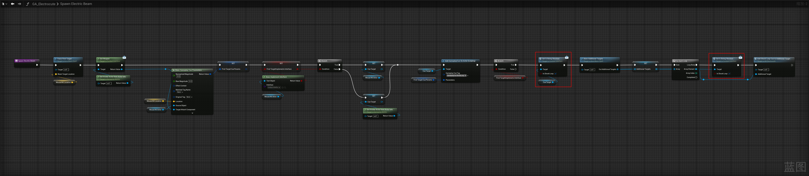

- 别掉用错函数名！


------

#### 结束技能时，当目标实现了接口，就设为fasle
#### 然后设置连接目标

>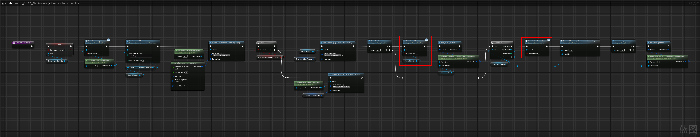

- 别掉用错函数名！


------

##### 因为这个变量是 `Replicated` 所以如果设置需要在服务器设置（然后会同步到其他客户端），客户端的修改不会同步到服务器，只会修改本地数据


------

### 运行测试gif
- LS模式下，客户端对所有敌人测试
>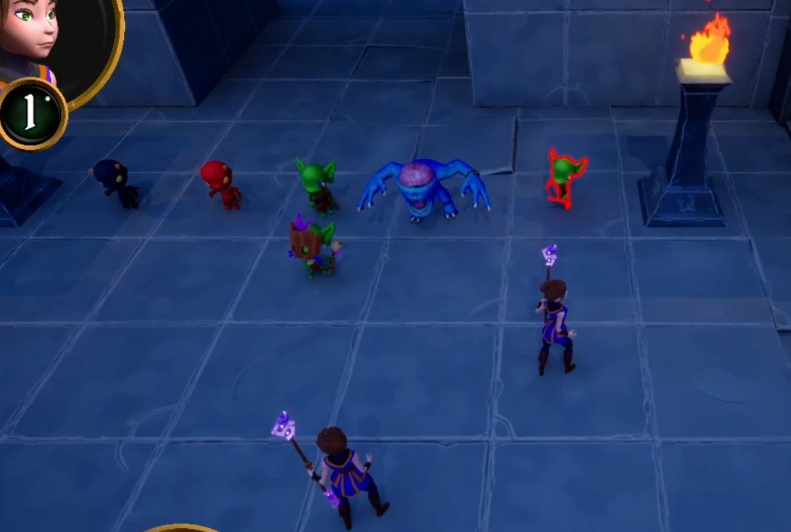
>
>


___________________________________________________________________________________________

[返回最上面](#Go主菜单)

___________________________________________________________________________________________