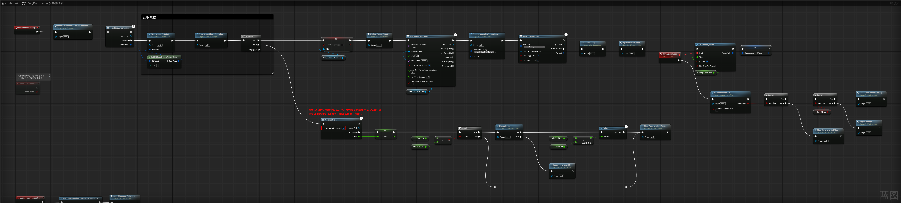
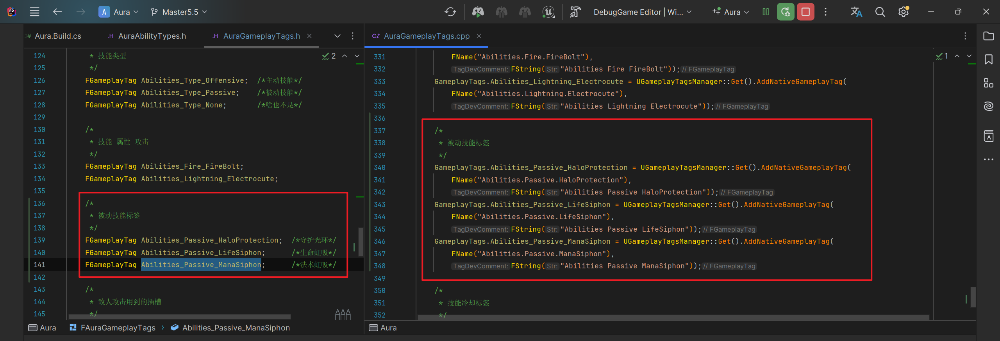

<details>
<summary>过程截图</summary>

>

------

</details>


+ `头文件`中：
```cpp
这里是头文件代码这里是头文件代码这里是头文件代码这里是头文件代码这里是头文件代码这里是头文件代码
```

+ `源文件`中：
```cpp
这里是源文件代码这里是源文件代码这里是源文件代码这里是源文件代码这里是源文件代码这里是源文件代码
```

[Mermaid格式参考](https://github.com/liyunlong618/LiYunLongKnowledgeLibrary/blob/main/Mermaid%E6%A0%BC%E5%BC%8F%E5%8F%82%E8%80%83.md)

[预览](https://github.com/liyunlong618/LiYunLongKnowledgeLibrary/tree/main/UECPP/Models/GAS/GAS_2_Aura)


___________________________________________________________________________________________
###### [Go主菜单](../MainMenu.md)
___________________________________________________________________________________________

# GAS 177 xxxxxxxxxxxxxxxx

___________________________________________________________________________________________

## 处理关键点

1. 111111111111111111111111111111

2. 222222222222222222222222222

3. 33333333333333333333333333

4. 4444444444444444444444444444

5. 555555555555555555555555555555

6. 666666666666666666666666666

7. 77777777777777777777777777777777

___________________________________________________________________________________________

# 目录


[TOC]


___________________________________________________________________________________________

<details>
<summary>视频链接</summary>

[136-1. Passive Spell tags-1080P 高清-AVC_哔哩哔哩_bilibili](https://www.bilibili.com/video/BV1jSAKeyEL4?spm_id_from=333.788.videopod.episodes&vd_source=9e1e64122d802b4f7ab37bd325a89e6c&p=36)

------

</details>

___________________________________________________________________________________________

### Mermaid整体思路梳理

Mermaid

___________________________________________________________________________________________

## 在我升级5.5以后，出现了一个问题，没法结束闪电链技能

> 暂时这样解决

------

## 创建被动技能标签

> ```CPP
> // AuraGameplayTags.h
> /*
>  * 被动技能标签
>  */
> FGameplayTag Abilities_Passive_HaloProtection;  /*守护光环*/
> FGameplayTag Abilities_Passive_LifeSiphon;     /*生命虹吸*/
> FGameplayTag Abilities_Passive_ManaSiphon;     /*法术虹吸*/
> 
> 
> // AuraGameplayTags.cpp
> //初始化本地游戏标签的函数
> void FAuraGameplayTags::InitializeNativeGameplayTags()
> {
>     //...
>     
> 	/*
> 	 * 被动技能标签
> 	 */
> 	GameplayTags.Abilities_Passive_HaloProtection = UGameplayTagsManager::Get().AddNativeGameplayTag(
> 		FName("Abilities.Passive.HaloProtection"),
> 		FString("Abilities Passive HaloProtection"));
> 	GameplayTags.Abilities_Passive_LifeSiphon = UGameplayTagsManager::Get().AddNativeGameplayTag(
> 		FName("Abilities.Passive.LifeSiphon"),
> 		FString("Abilities Passive LifeSiphon"));
> 	GameplayTags.Abilities_Passive_ManaSiphon = UGameplayTagsManager::Get().AddNativeGameplayTag(
> 		FName("Abilities.Passive.ManaSiphon"),
> 		FString("Abilities Passive ManaSiphon"));
> 	//...
> }
> 
> ```
>
> 


___________________________________________________________________________________________

[返回最上面](#Go主菜单)

___________________________________________________________________________________________