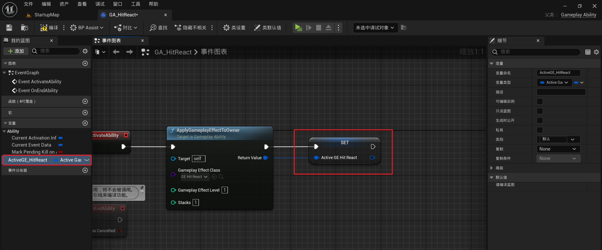

[Mermaid格式参考](https://github.com/liyunlong618/LiYunLongKnowledgeLibrary/blob/main/Mermaid%E6%A0%BC%E5%BC%8F%E5%8F%82%E8%80%83.md)

[预览](https://github.com/liyunlong618/LiYunLongKnowledgeLibrary/tree/main/UECPP/Models/GAS/GAS_2_Aura)


___________________________________________________________________________________________
###### [Go主菜单](../MainMenu.md)
___________________________________________________________________________________________

# GAS 057 敌人受击反应

___________________________________________________________________________________________

## 处理关键点

1. 111111111111111111111111111111

2. 222222222222222222222222222

3. 33333333333333333333333333

4. 4444444444444444444444444444

5. 555555555555555555555555555555

6. 666666666666666666666666666

7. 77777777777777777777777777777777

___________________________________________________________________________________________

# 目录


[TOC]


___________________________________________________________________________________________

<details>
<summary>视频链接</summary>

[5. Enemy Hit React_哔哩哔哩_bilibili](https://www.bilibili.com/video/BV1JD421E7yC?p=134&vd_source=9e1e64122d802b4f7ab37bd325a89e6c)

[6. Activating the Enemy Hit React Ability](https://www.bilibili.com/video/BV1JD421E7yC/?p=134&share_source=copy_web&vd_source=ccfefcf8d65f5d070c57cddf34c94047)

</details>

___________________________________________________________________________________________

### 整体思路梳理

> 1. 创建GA/GE/Tag并学习技能流程
>
>    ```mermaid
>    ---
>    title: 创建GA/GE/Tag并学习技能流程
>    ---
>    classDiagram
>    direction TB
>    	note"+ 表示 public(公共)\n- 表示 private(私有)\n# 表示 protected(受保护)\nVirtual_ 表示虚函数\nstatic_ 表示静态函数"
>    
>        class GE_HitReact{
>            /*无限持续时间的GE*/
>            /*触发时授予Tag*/
>            }
>    
>        class GA_HitReact{
>            /*蓝图中触发GE和蒙太奇*/
>            }
>    
>        class UCharacterClassInfo{
>            +要学习的技能数组
>            }
>    
>        class Tag{
>            Effects.HitReact
>            }
>    
>        class AAuraEnemy{
>            # BeginPlay()
>            }
>    
>        class UAuraAbilitySystemLibrary{
>            /*蓝图函数库*/
>            //初始化 给予技能的函数
>            +static_GiveStartupAttributes
>            }
>    
>            AAuraEnemy-->Tag:创建Tag
>            AAuraEnemy-->GA_HitReact:创建GA
>            AAuraEnemy-->GE_HitReact:创建GE
>            GE_HitReact-->Tag:应用GE时授予Tag
>            GA_HitReact-->GE_HitReact:GA激活应用GE
>            UCharacterClassInfo-->GA_HitReact:蓝图中配置GA
>            AAuraEnemy-->UAuraAbilitySystemLibrary:BeginPlay时调用GiveStartupAttributes
>            UAuraAbilitySystemLibrary-->UCharacterClassInfo:ASC->GiveAbility(使用技能数组元素)
>            note for Tag "单例类AuraGameplayTag中创建"
>    ```
>
> 2. 激活技能流程
>
>    ```mermaid
>    ---
>    title: 激活技能流程
>    ---
>    classDiagram
>    
>    	note"+ 表示 public(公共)\n- 表示 private(私有)\n# 表示 protected(受保护)\nVirtual_ 表示虚函数\nstatic_ 表示静态函数"
>        
>        class GE_HitReact{
>            /*无限持续时间的GE*/
>            /*触发时授予Tag*/
>            }
>    	
>        class GA_HitReact{
>            /*蓝图中触发GE和蒙太奇*/
>            /*蓝图中配置技能的Tag*/
>            }
>        class Tag{
>            Effects.HitReact
>            }
>    
>        class AAuraEnemy{
>            +bool bHitReacting/*是否播放受击动画*/
>            +float BaseWalkSpeed/*最大移动速度*/
>            #BeginPlay();
>            +监听Tag的回调函数();/*判断移除或添加Tag*/
>            }
>            
>        class AAuraCharacterBase{
>            +UAnimMontage* HitReactMontage/*每个角色受击动画的蒙太奇指针*/
>            }
>            
>        class AS{
>            /*UAuraAttributeSet*/
>            +PostGameplayEffectExecute/*后处理函数,若为受击状态,激活GA*/
>            }
>    
>            攻击-->AS:触发AS中PostGameplayEffectExecute
>            AS-->Tag:PostGameplayEffectExecute函数判定受击状态，使用Tag触发技能
>            单例类AuraGameplayTag-->Tag:获取
>            Tag-->GA_HitReact:Tag触发技能GA
>            GA_HitReact-->GE_HitReact:应用GE
>            GE_HitReact-->AAuraEnemy:应用Tag到敌人身上
>            AAuraEnemy--|>AAuraCharacterBase:继承蒙太奇指针
>            AAuraEnemy-->监听Tag的回调函数:触发
>            note for AAuraEnemy "创建回调监听Tag的更改,BeginPlay时绑定,API:ASC->RegisterGameplayTagEvent获取委托"
>            note for 监听Tag的回调函数 "受击状态,BaseWalkSpeed = 0.f\nbHitReacting = true"
>            note for GA_HitReact "注意GA实例化策略"
>            
>    ```


___________________________________________________________________________________________
>- 如果我们已经对敌人造成伤害但没有杀死他们，我们可以激活一个能力
>- 当敌人进入受击状态后
>  - 我们不希望敌人能够移动、攻击或做任何事情。
>  - 给这个敌人添加一个游戏标签，结束状态时移除
___________________________________________________________________________________________
### 小测试1

>**下面你需要完成**：
>1. 创建一个受击效果GE，命名为：*GE_HitReact*
>2. 创建一个Tag标签，命名为：`Effects.HitReact`
>3. 在 *GE_HitReact* 中授予Tag `Effects.HitReact`
>4.  *GE_HitReact* 是一个无限持续时间的游戏效果，这样我们可以在以后的某个时间点将其移除。
>
___________________________________________________________________________________________

<details>
<summary>自己尝试一下</summary>

> 小测试1步骤：
> 1. `Content/BP/GameplayEffects/AbilitySystem/`下创建GE
>
> 2. AuraGameplayTags.h中
>
>    ```CPP
>    public:
>    	FGameplayTag Effects_HitReact;
>    ```
>
>    AuraGameplayTags.cpp中`InitializeNativeGameplayTags`函数内
>
>    ```CPP
>    GameplayTags.Effects_HitReact = UGameplayTagsManager::Get().AddNativeGameplayTag(
>    		FName("Effects.HitReact"),
>    		FString("Effects.HitReact"));
>    ```
>
> 3. 在 *GE_HitReact* 中授予Tag

___________________________________________________________________________________________

</details>

___________________________________________________________________________________________

### 接下来我们需要监听敌人身上FGameplayTag的更改

如果添加或移除了一个游戏标签。我们可以对此做出响应。

- **`FGameplayTag变化的监听委托`需要使用`ASC组件`**
- 需要在`敌人`身上绑定该委托的`回调函数`

> **使用到的API**：
>
> ```CPP
> AbilitySystemComponent->RegisterGameplayTagEvent(要监听的Tag, 该Tag处于何种状态时才广播);
> ```
>
> 调用这个函数时会返回一个委托的引用 `FOnGameplayEffectTagCountChanged&` 参数分别为(要监听的Tag,当前Tag 新的标签计数[1^] )
>
> 每当我们的标签计数发生变化时，我们将收到新的标签计数。

### 第一步：在敌人`AAuraEnemy`身上创建`FGameplayTag的更改`的回调函数并在`BeginPlay`时绑定

函数命名为`HitReactTagChanged`

形参需要为 `const FGameplayTag` (要监听的Tag) 和 `int32` (当前Tag新的标签计数)

+ `头文件`中：

  ```cpp
  public:
  	void HitReactTagChanged(const FGameplayTag CallbackTag, int32 NewCount);
  ```


+ `源文件`中：`BeginPlay`时绑定`监听Tag变化的回调`

  ```cpp
  void AAuraEnemy::BeginPlay()
  {
  	Super::BeginPlay();
  	InitAbilityActorInfo();
  	if (UAuraUserWidget* AuraUserWidget = Cast<UAuraUserWidget>(HealthBar->GetUserWidgetObject()))
  	{
  		AuraUserWidget->SetWidgetController(this);
  	}
  	if (const UAuraAttributeSet* AuraAttributeSet = Cast<UAuraAttributeSet>(AttributeSet))
  	{
  		AbilitySystemComponent->GetGameplayAttributeValueChangeDelegate(AuraAttributeSet->GetHealthAttribute()).AddLambda(
  		[this](const FOnAttributeChangeData& Data)
  		{
  			OnHealthChanged.Broadcast(Data.NewValue);
  		});
  		AbilitySystemComponent->GetGameplayAttributeValueChangeDelegate(AuraAttributeSet->GetMaxHealthAttribute()).AddLambda(
  			[this](const FOnAttributeChangeData& Data)
  			{
  				OnMaxHealthChanged.Broadcast(Data.NewValue);
  			});
  		//在这里绑定监听Tag变化的回调
  		AbilitySystemComponent->RegisterGameplayTagEvent(FAuraGameplayTags::Get().Effects_HitReact,EGameplayTagEventType::NewOrRemoved).AddUObject(this,&AAuraEnemy::HitReactTagChanged);
  		
  		OnHealthChanged.Broadcast(AuraAttributeSet->GetHealth());
  		OnMaxHealthChanged.Broadcast(AuraAttributeSet->GetMaxHealth());
  	}
  }
  ```
  
  `EGameplayTagEventType` 有三种类型[2^] ：
  
  - | 类型           |      调用时机       |
    | -------------- | :-----------------: |
    | AnyCountChange | 任何标签计数变化时  |
    | NewOrRemoved   | 每次新增或移除Tag时 |
    | Type           |          -          |

___________________________________________________________________________________________

### 第二步：敌人`AAuraEnemy`身上创建是否播放受击动画的bool(方便角色动画蓝图获取状态)

```CPP
public:

	UPROPERTY(BlueprintReadOnly, Category = "Combat")
	bool bHitReacting;
```
___________________________________________________________________________________________

### 第三步：敌人`AAuraEnemy`身上创建最大移动速度(若为播放受击动画状态，最大速度应该为0.f)

设置敌人的最大移动速度，默认为`250.f`

```CPP
public:

	UPROPERTY(BlueprintReadOnly, Category = "Combat")
	float BaseWalkSpeed = 250.f;
```

还需要在`BeginPlay函数中`设置敌人的移动速度为`BaseWalkSpeed`

```CPP
GetCharacterMovement()->MaxWalkSpeed = BaseWalkSpeed;
```


___________________________________________________________________________________________


### 第四步：回调函数内判断：添加或者移除Tag

- |   状态判断    |    状态     |         要执行的逻辑         |
  | :-----------: | :---------: | :--------------------------: |
  | NewCount > 0  | 添加Tag状态 |      MaxWalkSpeed = 0.f      |
  | NewCount <= 0 | 移除Tag状态 | MaxWalkSpeed = BaseWalkSpeed |


回调函数中处理逻辑

```CPP
void AAuraEnemy::HitReactTagChanged(const FGameplayTag CallbackTag, int32 NewCount)
{
	bHitReacting = NewCount > 0;
	GetCharacterMovement()->MaxWalkSpeed = bHitReacting ? 0.f : BaseWalkSpeed;
}
```

___________________________________________________________________________________________

>这样就处理完了添加Tag时的逻辑，接下来需要处理移除Tag的逻

**接下来需要创建一个GA，来处理移除Tag的逻辑**

___________________________________________________________________________________________

### 小测试2

>**下面你需要完成**：
>1. 创建一个游戏能力GA，命名为：*GA_HitReact*
>2. 该GA内需要应用*GE_HitReact*，
>3. *GA_HitReact*被激活时，需要播放一个受击蒙太奇，并在播放完成后移除该蒙太奇，停止该技能
>     
___________________________________________________________________________________________

<details>
<summary>有些测试之外的操作</summary>

> 步骤：
> 1. 在`Content/BP/AbilitySystem/GameplayAbilities/`文件夹下，创建GA，命名为：*GA_HitReact*
>
> 2. 使用节点：`ApplyGameplayEffectToOwner` 应用GE到自身
>
>    ```C++
>    ApplyGameplayEffectToOwner
>    ```
>
>    
>
>
> 3. 保存`Handle`便于移除
>
> **因为蒙太奇每个对象都不一样，可以配置，所以最好做成每个对象都有的变量，使用接口调用获取**
>
> 4. 接口类`ICombatInterface`中
>
>    - 头文件
>
>      ```CPP
>      public:
>      	//蓝图可以重写，蓝图可叫
>      	UFUNCTION(BlueprintNativeEvent, BlueprintCallable)
>      	UAnimMontage* GetHitReactMontage();
>      ```
>
>
> 5. 角色基类`AAuraCharacterBase`中重写接口虚函数，创建持有蒙太奇指针，蓝图中可配置，虚函数返回蒙太奇指针
>
>    - 头文件
>
>      ```CPP
>      protected:
>
>      	//~ Begin ICombatInterface
>      	virtual UAnimMontage* GetHitReactMontage_Implementation() override;
>      	//~ End ICombatInterface
>
>      private:
>
>      	UPROPERTY(EditAnywhere,Category="Combat")
>      	TObjectPtr<UAnimMontage> HitReactMontage;
>      ```
>
>    - 源文件
>
>      ```CPP
>      UAnimMontage* AAuraCharacterBase::GetHitReactMontage_Implementation()
>      {
>      	return HitReactMontage;
>      }
>      ```
>
> 6. 蓝图中调用
>
> 7. 需要配置蒙太奇了，还没有，需要创建一下，敌人的角色动画蓝图中别忘了加插槽，为敌人创建蒙太奇并配置


___________________________________________________________________________________________

</details>

___________________________________________________________________________________________


### 注意的是，此时GA还没有被调用，需要在敌人受伤还没死时，激活这种能力

___________________________________________________________________________________________

下面为新的一节

___________________________________________________________________________________________

> **之前，在AS的属性后处理函数中我们处理了扣血的相关逻辑，接下来，当敌人还没有死时，触发受击的逻辑，激活受击的能力，我们需要确保敌人有这种能力。那么什么时候让敌人拥有这些能力呢？应该在哪里配置？**

___________________________________________________________________________________________


___________________________________________________________________________________________

我们现在有一个数据资产，里面有初始化敌人时的一些GE配置，下面我们可以加入GA数组，让敌人学习一些共有的能力

1. 数据资产中添加敌人间共享能力的数组
   - `UCharacterClassInfo`中
   ```CPP
   public:
		
		UPROPERTY(EditDefaultsOnly, Category = "Common Class Defaults")
		TArray<TSubclassOf<UGameplayAbility>> CommonAbilities;
   ```
___________________________________________________________________________________________

### 那么之前我们是如何赋予角色能力的？

<details>
<summary>那么之前我们是如何赋予角色能力的？</summary>

> 1. 何时学习GA?
>
>    1. 之前在`AAuraCharacterBase` 中创建了`AddCharacterAbilities`函数用来给角色赋予技能
>
>    2. 调用`UAuraAbilitySystemComponent`中`AddCharacterAbilities`函数
>
>       `有参构造`了一个`FGameplayAbilitySpec` ，并在应用前，添加了一个动态标签`DynamicAbilityTags`，因为敌人没有输入标签tag所以不需要添加动态标签，动态标签只适用于玩家。

___________________________________________________________________________________________

</details>

2. 何时初始化？

<details>
<summary>何时初始化？</summary>

>   1. 蓝图函数库类`UAuraAbilitySystemLibrary`中创建了函数`InitializeDefaultAttributes`来初始化
>   2. 我们可以参考上面这个函数创建一个静态函数，参数方面我们只需要WorldContext和ASC组件即可，不需要知道敌人类型，因为是共有技能

___________________________________________________________________________________________

</details>


### 蓝图函数库`UAuraAbilitySystemLibrary`中创建学习技能用的函数

命名为`GiveStartupAttributes`

+ `头文件`中：
```cpp
public:
	
		UFUNCTION(BlueprintCallable, Category = "AuraAbilitySystemLibrary|CharacterClassDefaults", meta=( WorldContextObject = "WorldContextObject"))
		static void GiveStartupAttributes(const UObject* WorldContextObject, UAbilitySystemComponent* ASC);
```

+ `源文件`中：需要一个`const FGameplayAbilitySpec&` 
```cpp
void UAuraAbilitySystemLibrary::GiveStartupAttributes(const UObject* WorldContextObject, UAbilitySystemComponent* ASC)
{
	const AAuraGameMode* GameMode = Cast<AAuraGameMode>(UGameplayStatics::GetGameMode(WorldContextObject));
	if (GameMode == nullptr)return;
	UCharacterClassInfo* CharacterClassInfo= GameMode->CharacterClassInfo;

	for (TSubclassOf<UGameplayAbility> CommonAbility : CharacterClassInfo->CommonAbilities)
	{
		ASC->GiveAbility(/* 这里需要一个const FGameplayAbilitySpec& */)
	}
}
```

如何获取`FGameplayAbilitySpec`？

<details>
<summary>如何获取 FGameplayAbilitySpec ？</summary>

>- 之前是这样做的
>
>  在`UAuraAbilitySystemComponent`的`AddCharacterAbilities`函数中
>
>  ```CPP
>  //使用配置好的GA Class 构造一个FGameplayAbilitySpec 技能规范
>  FGameplayAbilitySpec GA_Spec = FGameplayAbilitySpec(AbilityClass,1.0f/*这里默认等级给了1.f不过反正这个不是伤害GA所以无伤大雅*/);
>  ```

___________________________________________________________________________________________

</details>


所以`UAuraAbilitySystemLibrary`的`GiveStartupAttributes`函数体是这样实现的：

```CPP
void UAuraAbilitySystemLibrary::GiveStartupAttributes(const UObject* WorldContextObject, UAbilitySystemComponent* ASC)
{
	const AAuraGameMode* GameMode = Cast<AAuraGameMode>(UGameplayStatics::GetGameMode(WorldContextObject));
	if (GameMode == nullptr)return;
	UCharacterClassInfo* CharacterClassInfo= GameMode->CharacterClassInfo;

	for (const TSubclassOf<UGameplayAbility> CommonAbility : CharacterClassInfo->CommonAbilities)
	{
		//使用配置好的GA Class 构造一个FGameplayAbilitySpec 技能规范
		FGameplayAbilitySpec GA_Spec = FGameplayAbilitySpec(CommonAbility,1.0f);
		ASC->GiveAbility(GA_Spec);
	}
}
```

### 在敌人类`AAuraEnemy`中`BeginPlay`时，调用蓝图函数库`UAuraAbilitySystemLibrary`函数中的学习共有技能的函数`GiveStartupAttributes`

```cpp
UAuraAbilitySystemLibrary::GiveStartupAttributes(this,AbilitySystemComponent);
```


现在敌人已学会他们的共同能力，需要在AS的后处理函数`PostGameplayEffectExecute`中激活技能


___________________________________________________________________________________________

### 在AS中判定受伤未死亡时，使用Tag触发技能

<details>
<summary>如何在AS中激活技能 ？</summary>


> - 在这个后处理函数中`Props.TargetASC`是这个**AS的拥有者的ASC**
>
> - 可以使用Tag标签来激活拥有该Tag的能力，使用API:`Props.TargetASC->TryActivateAbilitiesByTag`
>
>   ```CPP
>      Props.TargetASC->TryActivateAbilitiesByTag(const FGameplayTagContainer& GameplayTagContainer, bool bAllowRemoteActivation = true)
>   ```
>   这里一共需要两个参数：
>
>   - |       参数类型        |                            干嘛的                            |
>     | :-------------------: | :----------------------------------------------------------: |
>     | FGameplayTagContainer |                   添加要用的Tag的**容器**                    |
>     |  bool(默认值为true)   | 意思是:允许远程激活，意味着我们可以从客户端调用此函数，并进行预测性激活，**而我们是在服务器上激活，所以这个值不重要** |

___________________________________________________________________________________________

</details>


```cpp
if (!bFatal)
{
    //受击但并没有死亡
    FGameplayTagContainer TagContainer;
    TagContainer.AddTag(FAuraGameplayTags::Get().Effects_HitReact);
    Props.TargetASC->TryActivateAbilitiesByTag(TagContainer);
}
```


___________________________________________________________________________________________


### 蓝图中配置数据资产


___________________________________________________________________________________________

### 必须确保GA拥有那个要激活的Tag


___________________________________________________________________________________________

### 测试结果gif


___________________________________________________________________________________________

### 在蒙太奇中缩短敌人受击动画混入混出时间


___________________________________________________________________________________________

### GA的实例化策略


<details>
<summary>GA的实例化策略介绍</summary>


> 在这里
>
> |     GA的实例化策略      |                        作用                        |
> | :---------------------: | :------------------------------------------------: |
> | Instanced Per Execution |        意味着每次释放技能时实例化了一个新的        |
> |   Instanced Per Actor   | 意味着首次激活只实例化一次，后续都将使用相同的实例 |
> |      Non Instanced      |                      不实例化                      |

___________________________________________________________________________________________

</details>

#### 实例化策略需要换成：**Instanced Per Actor**

___________________________________________________________________________________________

### 此时测试gif打击多次，只能播放一次受击动画，说明实例化策略设置正常

___________________________________________________________________________________________

### 当蒙太奇播放几种情况下，都该结束技能，移除该tag


[1^]:比如释放技能后,会触发这个回调,此时这个标签计数为1,当移除该Tag后,再次触发回调,此时这个标签计数为0
[2^]:比如,若技能的标签计数为3,当选择AnyCountChange后,每次被技能命中都会触发该回调;当选择NewOrRemoved时,敌人身上若没有该tag,敌人身上第一次拥有或者移除该tag时会触发该回调;第三种我也不太了解

___________________________________________________________________________________________

[返回最上面](#Go主菜单)

___________________________________________________________________________________________