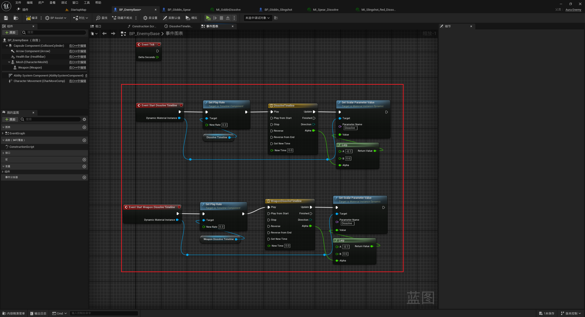

+ `头文件`中：
```cpp
这里是头文件代码这里是头文件代码这里是头文件代码这里是头文件代码这里是头文件代码这里是头文件代码
```

+ `源文件`中：
```cpp
这里是源文件代码这里是源文件代码这里是源文件代码这里是源文件代码这里是源文件代码这里是源文件代码
```

[Mermaid格式参考](https://github.com/liyunlong618/LiYunLongKnowledgeLibrary/blob/main/Mermaid%E6%A0%BC%E5%BC%8F%E5%8F%82%E8%80%83.md)

[预览](https://github.com/liyunlong618/LiYunLongKnowledgeLibrary/tree/main/UECPP/Models/GAS/GAS_2_Aura)


___________________________________________________________________________________________
###### [Go主菜单](../MainMenu.md)
___________________________________________________________________________________________

# GAS 059 使用敌人的溶解材质，C++设置DynamicMaterial在蓝图中使用Timeline

___________________________________________________________________________________________

## 处理关键点

1. 创建动态材质实例C++类型和API


___________________________________________________________________________________________

# 目录


[TOC]


___________________________________________________________________________________________

<details>
<summary>视频链接</summary>

[8. Dissolve Effect_哔哩哔哩_bilibili](https://www.bilibili.com/video/BV1JD421E7yC?p=137&vd_source=9e1e64122d802b4f7ab37bd325a89e6c)

</details>

___________________________________________________________________________________________

### 整体思路梳理

Mermaid

___________________________________________________________________________________________
>**希望在角色死亡时设置材质为新的动态材质，然后溶解**
---
### 角色基类中

- 头文件中
  - 持有角色溶解材质的指针，在蓝图中配置，命名为 `DissolveMaterialInstance`
  - 持有武器溶解材质的指针，在蓝图中配置，命名为 `WeaponDissolveMaterialInstance`
  - 创建溶解材质用的函数
  
  ```CPP
  protected:
  	/* Dissolve Effects */   
  	UPROPERTY(EditAnywhere,BlueprintReadOnly)  
  	TObjectPtr<UMaterialInstance> DissolveMaterialInstance;/*Mesh 溶解材质 实例*/
  	
  	UPROPERTY(EditAnywhere,BlueprintReadOnly)  
  	TObjectPtr<UMaterialInstance> WeaponDissolveMaterialInstance;/*武器 溶解材质 实例*/
  	  
  	void Dissolve();/*溶解材质用的函数*/
  
  	UFUNCTION(BlueprintImplementableEvent)  
  	void StartDissolveTimeline(UMaterialInstanceDynamic* DynamicMaterialInstance);/*蓝图中实现,使用TimeLine设置动态材质实例的参数*/
  ```


- 源文件中
  - 创建动态材质实例并传参到蓝图中给TimeLine
  
    ```CPP
    void AAuraCharacterBase::Dissolve()
    {
    	if (IsValid(DissolveMaterialInstance))
    	{
    		UMaterialInstanceDynamic* DynamicMatInst = UMaterialInstanceDynamic::Create(DissolveMaterialInstance,this);
    		GetMesh()->SetMaterial(0,DynamicMatInst);
    		StartDissolveTimeline(DynamicMatInst);
    	}
    	if (IsValid(WeaponDissolveMaterialInstance))
    	{
    		UMaterialInstanceDynamic* WeaponDynamicMatInst = UMaterialInstanceDynamic::Create(WeaponDissolveMaterialInstance,this);
    		Weapon->SetMaterial(0,WeaponDynamicMatInst);
    		StartDissolveTimeline(WeaponDynamicMatInst);
    	}
    }
    ```
  
  - 在死亡函数触发的多播中调用，溶解材质用的函数 `Dissolve` 
  
    

------

> 编译引擎

------

<details>
<summary>实现函数StartDissolveTimeline配置材质写逻辑</summary>


</details>

### 测试结果gif

当一个TimeLine在执行时，无法执行另一个TimeLine

------

### 在角色基类中创建另一个蓝图实现的武器的TimeLine函数

取名为 `StartWeaponDissolveTimeline`
+ `头文件`中：
```cpp
protected:
	/* Dissolve Effects */   
	UPROPERTY(EditAnywhere,BlueprintReadOnly)  
	TObjectPtr<UMaterialInstance> DissolveMaterialInstance;
	
	UPROPERTY(EditAnywhere,BlueprintReadOnly)  
	TObjectPtr<UMaterialInstance> WeaponDissolveMaterialInstance;

	void Dissolve();

	UFUNCTION(BlueprintImplementableEvent)
	void StartDissolveTimeline(UMaterialInstanceDynamic* DynamicMaterialInstance);
	
	UFUNCTION(BlueprintImplementableEvent)
	void StartWeaponDissolveTimeline(UMaterialInstanceDynamic* DynamicMaterialInstance);/*蓝图中实现,使用TimeLine设置武器动态材质实例的参数*/
```

+ `源文件`中：
```cpp
void AAuraCharacterBase::Dissolve()
{
	if (IsValid(DissolveMaterialInstance))
	{
		UMaterialInstanceDynamic* DynamicMatInst = UMaterialInstanceDynamic::Create(DissolveMaterialInstance,this);
		GetMesh()->SetMaterial(0,DynamicMatInst);
		StartDissolveTimeline(DynamicMatInst);
	}
	if (IsValid(WeaponDissolveMaterialInstance))
	{
		UMaterialInstanceDynamic* WeaponDynamicMatInst = UMaterialInstanceDynamic::Create(WeaponDissolveMaterialInstance,this);
		Weapon->SetMaterial(0,WeaponDynamicMatInst);
		StartWeaponDissolveTimeline(WeaponDynamicMatInst);
	}
}
```

------

> 编译引擎

------

蓝图中调用

### 测试结果gif


___________________________________________________________________________________________

[返回最上面](#Go主菜单)

___________________________________________________________________________________________