+ `头文件`中：
```cpp
这里是头文件代码这里是头文件代码这里是头文件代码这里是头文件代码这里是头文件代码这里是头文件代码
```

+ `源文件`中：
```cpp
这里是源文件代码这里是源文件代码这里是源文件代码这里是源文件代码这里是源文件代码这里是源文件代码
```

[Mermaid格式参考](https://github.com/liyunlong618/LiYunLongKnowledgeLibrary/blob/main/Mermaid%E6%A0%BC%E5%BC%8F%E5%8F%82%E8%80%83.md)

[预览](https://github.com/liyunlong618/LiYunLongKnowledgeLibrary/tree/main/UECPP/Models/GAS/GAS_2_Aura)


___________________________________________________________________________________________
###### [Go主菜单](../MainMenu.md)
___________________________________________________________________________________________

# GAS 060 显示伤害数字UI

___________________________________________________________________________________________

## 处理关键点

1. 动态生成组件

2. 222222222222222222222222222

3. 33333333333333333333333333

4. 4444444444444444444444444444

5. 555555555555555555555555555555

6. 666666666666666666666666666

7. 77777777777777777777777777777777

___________________________________________________________________________________________

# 目录


[TOC]


___________________________________________________________________________________________

<details>
<summary>视频链接</summary>

[9. Floating Text Widget_哔哩哔哩_bilibili](https://www.bilibili.com/video/BV1JD421E7yC?p=138&vd_source=9e1e64122d802b4f7ab37bd325a89e6c)

[10. Showing Damage Text_哔哩哔哩_bilibili](https://www.bilibili.com/video/BV1JD421E7yC?p=139&vd_source=9e1e64122d802b4f7ab37bd325a89e6c)

</details>

___________________________________________________________________________________________

### 整体思路梳理

Mermaid

___________________________________________________________________________________________

### 创建伤害数字UI文件夹

`Content/BP/UI/` 文件夹下创建 `FloatText` 文件夹
创建 `UserWidget` ，取名为 `WBP_DamageText` 
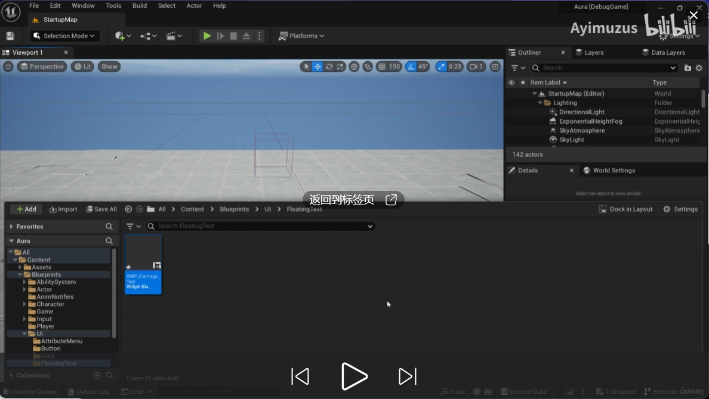

创建 `Overlay` 组件和 `TextBlock` 组件，TextBlock 命名为 `Text_Damage`

- 给TextBlock一个数字

- 在TextBlock上制作动画，取名 `DamageAnim`


### UI动画效果gif
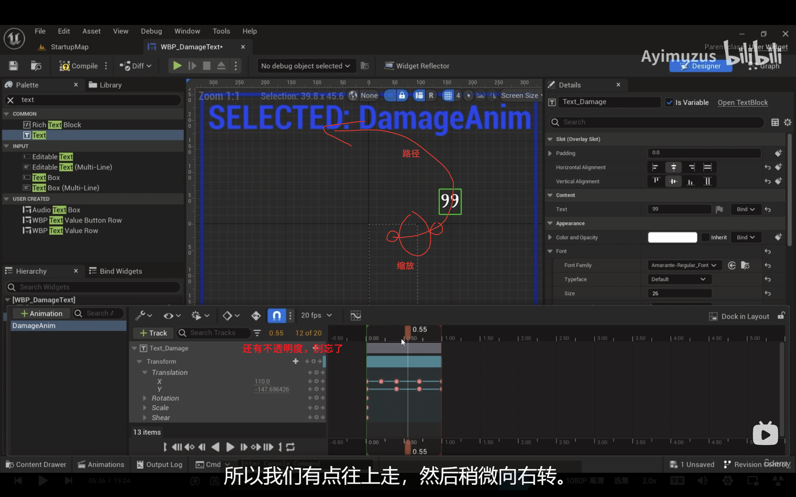
动画效果时间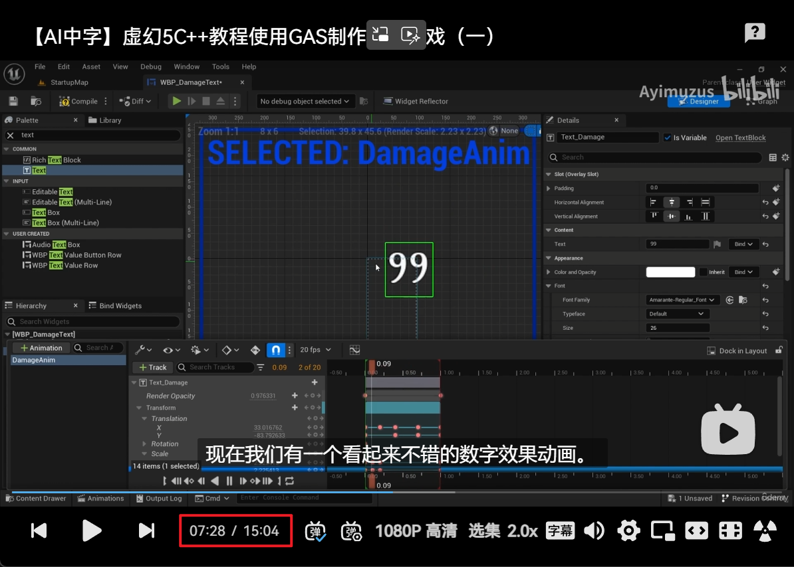

当 `Event Construct` 的时候调用 `PlayAnimation`
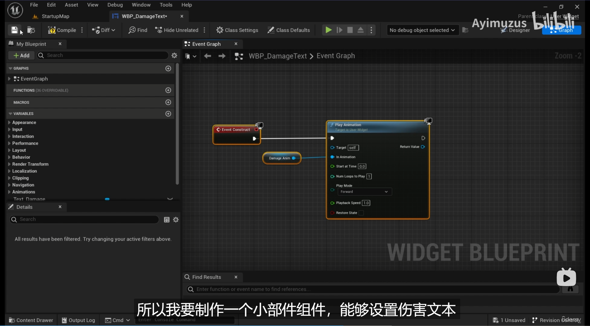

> 此时希望创建自己的 `WidgetComponent` C++ 类
___________________________________________________________________________________________

### 创建自己的 `WidgetComponent` C++ 类

在 `C++类/Aura/Public/UI/Widget/` 文件夹下创建 `WidgetComponent` `C++` 类，取名为 `DamageTextComponent`

> 这个组件存在的目的是希望创建一个函数完成蓝图对它的调用，直接设置Text的文字float

创建函数，取名 `SetDamageText`

```CPP
UFUNCTION(BlueprintImplementableEvent,BlueprintCallable)
void SetDamageText(float Damage);
```
___________________________________________________________________________________________

> 编译引擎
___________________________________________________________________________________________

### 创建蓝图继承类
`Content/BP/UI/FloatText/` 文件夹下创建 `DamageTextComponent` 的蓝图继承类，命名为 `BP_DamageTextComponent`

#### UI中创建设置文字的函数，取名为 `UpdateDamageText`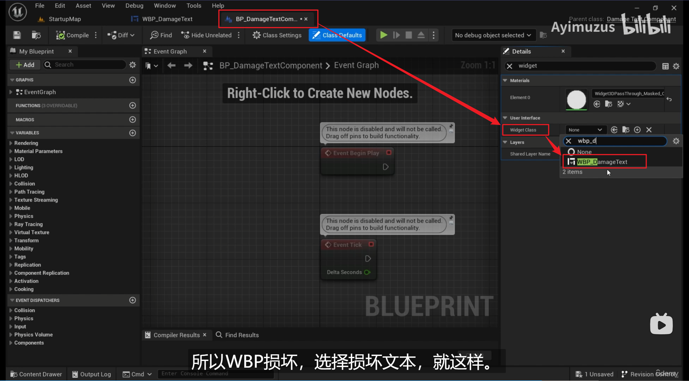

___________________________________________________________________________________________

####  `WidgetComponent` 的蓝图继承类配置UI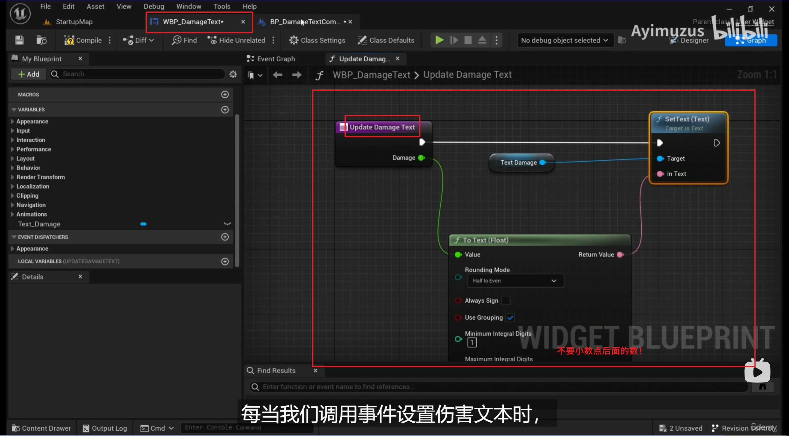

___________________________________________________________________________________________

####  `WidgetComponent` 的蓝图继承类 中 实现之前创建的蓝图实现函数 `SetDamageText`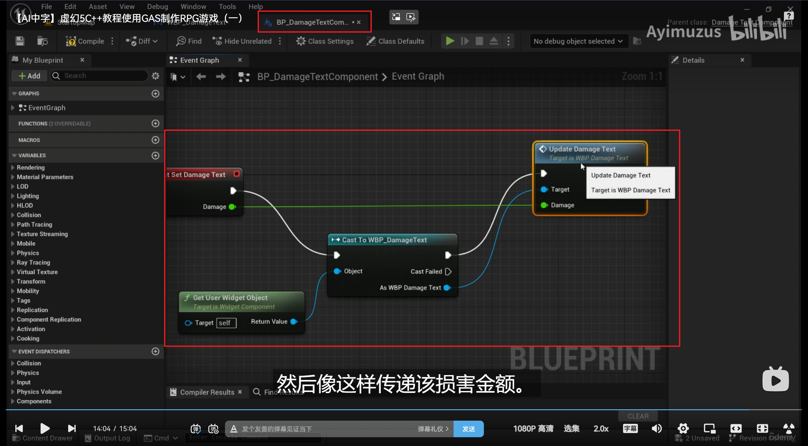

___________________________________________________________________________________________

### 以上就完成了伤害UI的制作

> 通过 自建的 `WidgetComponent` 类，调用设置 伤害数字的UI (当UI被创建出来时会自动播放动画，还没做销毁)
> 接下来需要通过 `WidgetComponent` 类组件来显示UI了

___________________________________________________________________________________________

### 通过元属性显示伤害数字

**首先需要注意的是：**
#### 元属性之前说了只存在于服务器端，若客户端也想使用，需要RPC的给指定客户端发消息也就是 `Client事件`
#### 也就是说AS的后处理函数Post是在服务器端进行计算的

因为：不仅仅是受伤的时候，当死亡的时候，我们也想要显示 伤害数字UI所以要在这里添加逻辑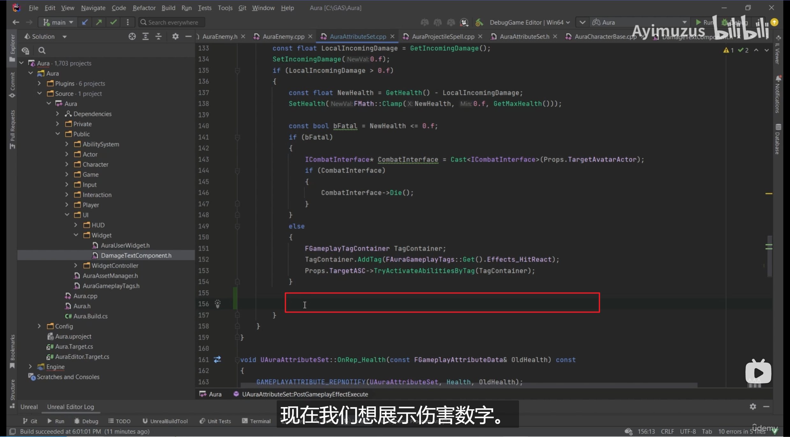

#### 希望把这部分生成的逻辑发放到 `PC` 上

### 在 `PC` 中创建 `RPC` `Client事件` 

#### 分为两种情况:
##### 如果我们在服务器上调用它，它将在服务器上执行。
#####  如果控制玩家是远程的，也就是客户端控制的角色，他将在服务器上被调用，客户端执行。

> 1. 创建函数，命名为 `ShowDamageNumber`
> 2. 创建蓝图中配置的 `WidgetComponent类` 变量


- 头文件中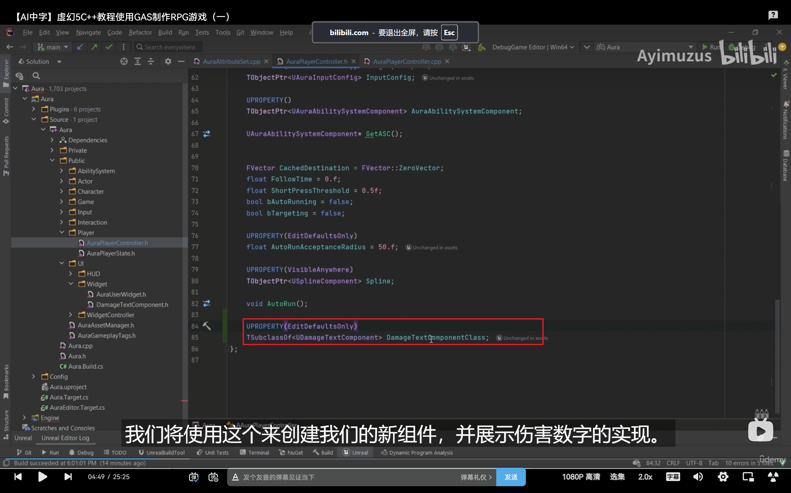

  ```CPP
  UFUNCTION(Client,Reliable)
  void ShowDamageNumber(float DamageAmount);
  
  ```

- 源文件中

  ```CPP
  void AAuraPlayerController::ShowDamageNumber_Implementation(float DamageAmount)
  {
      //这里出来以后就在客户端了
  }
  ```

> **在这里生成并不能在目标头上显示，如果想在目标头上显示，函数形参还需要加一个目标**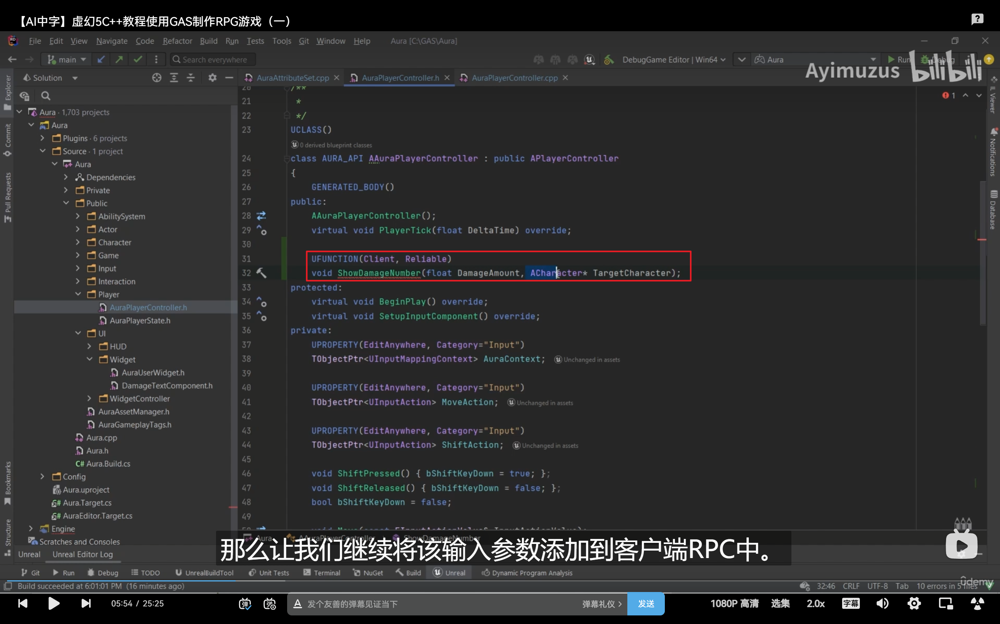

### 运行时态创建组件

运行时态创建组件步骤

1. NewObject
2. 注册组件

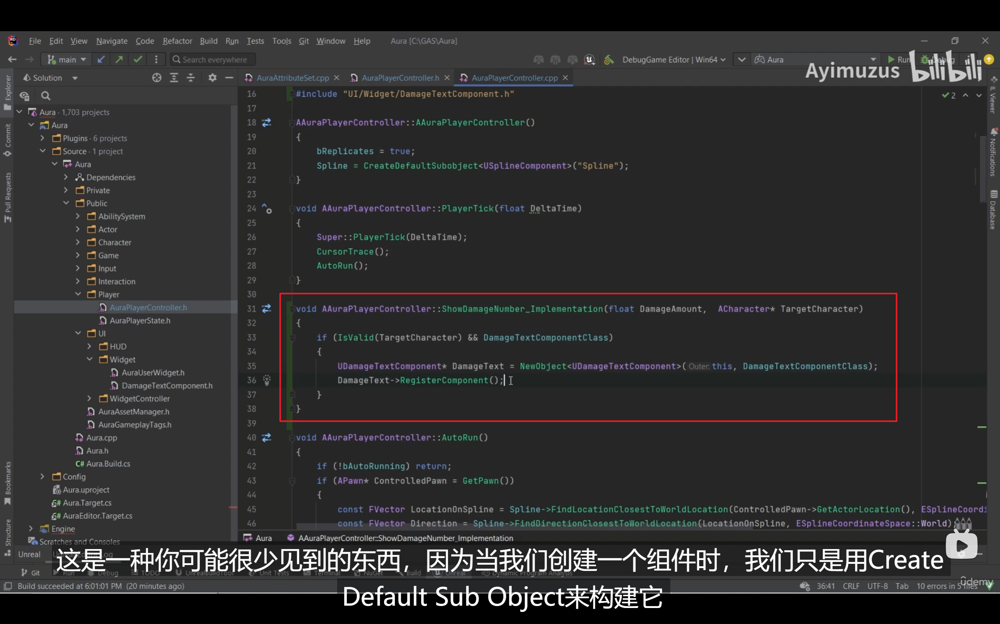

### 生成组件后希望绑定到目标根组件，随后解绑这样的目的是

1. 绑定到目标根组件 —— 对其位置到目标
2. 随后解绑 —— (当敌人移动时)为动画添加一些随机偏移

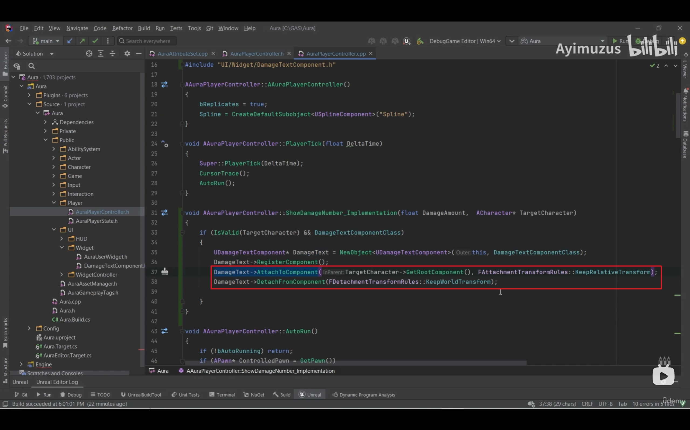

------

#### 接下来设置文字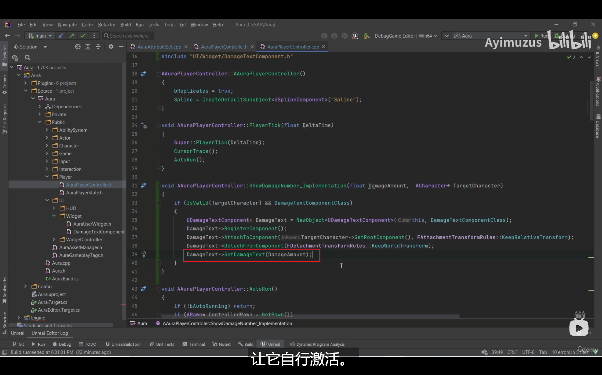

------


### 在AS中想要不是自己伤害自己的时候才使用这个UI

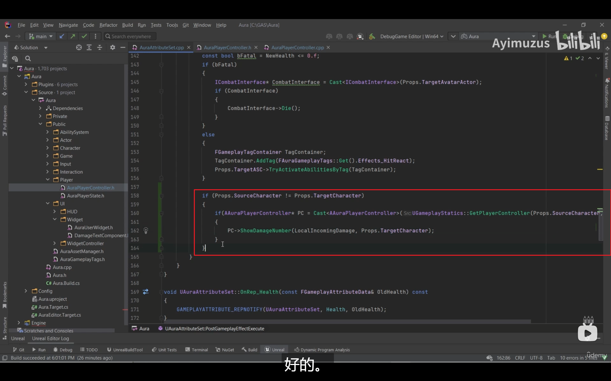

#### AS中创建内部处理的函数
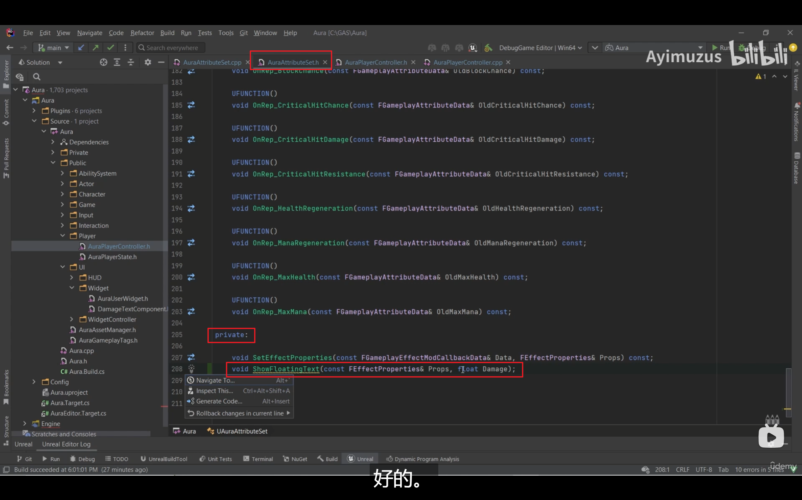


___________________________________________________________________________________________

### 此时整个调用流程

PC --> RPC_Client事件 -->客户端运行时态生成组件  --> 设置UI


___________________________________________________________________________________________

编译引擎
___________________________________________________________________________________________

### 蓝图PC中配置 `WidgetComponent` 类

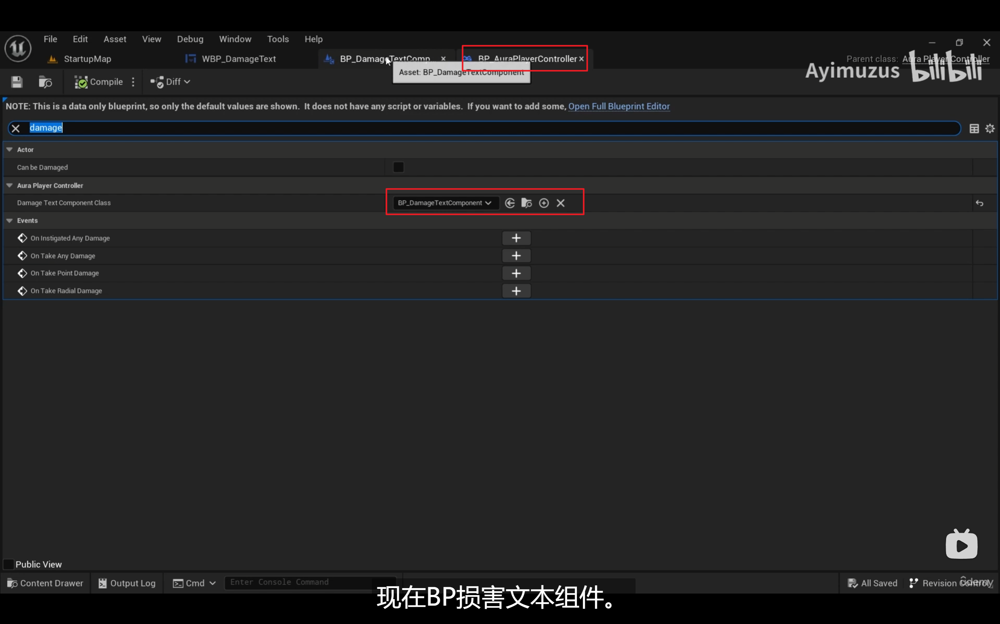

___________________________________________________________________________________________

### UI中播放完动画记得Delay销毁

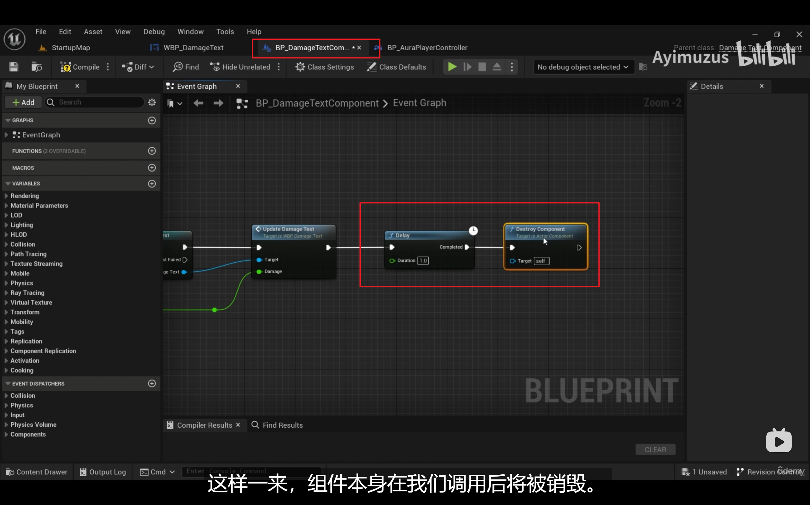

___________________________________________________________________________________________

### `WidgetComponent` 蓝图继承类中 设置显示类型为屏幕

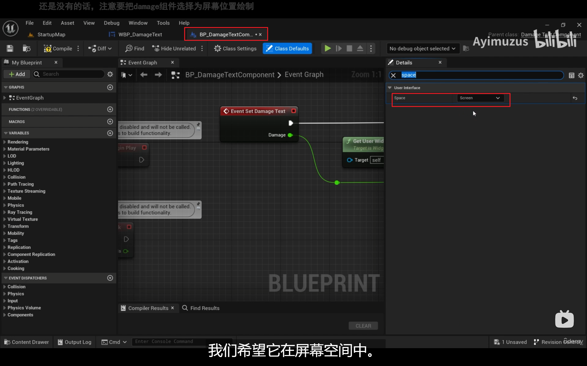

___________________________________________________________________________________________

### 之前的AS这里搞错了

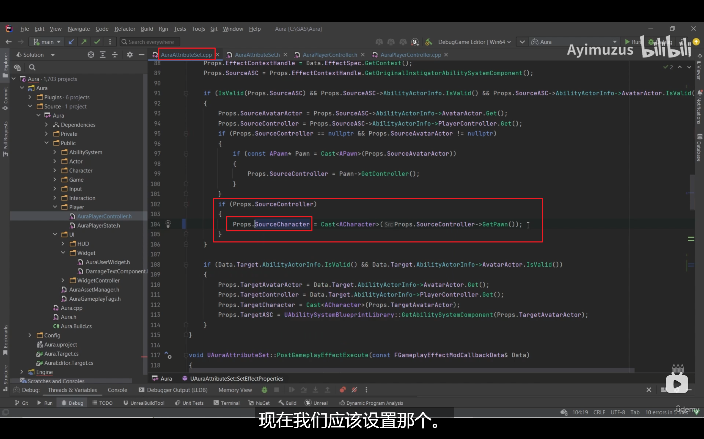

___________________________________________________________________________________________

### 这个时候的文字边缘有些模糊

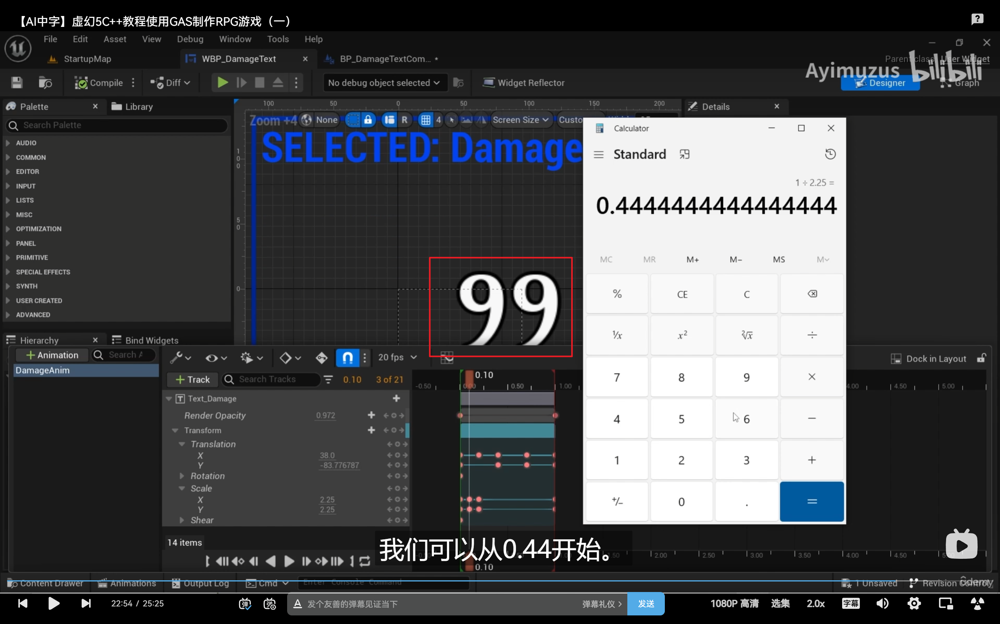

因为动画把目标从小变大的缘故，从大变小就能解决

___________________________________________________________________________________________

> 后续我们将处理：
> 1. 是否暴击
> 1. 格挡某次攻击
> 1. 任意数量的特殊战斗机制
> 1. 根据是否暴击显示不同文字颜色
___________________________________________________________________________________________

[返回最上面](#Go主菜单)

___________________________________________________________________________________________