___________________________________________________________________________________________
###### [Go主菜单](../MainMenu.md)
___________________________________________________________________________________________

# GAS 066 FGameplayEffectContext源码阅读

___________________________________________________________________________________________

## 处理关键点

1. 回顾创建和使用使用GE的标准流程

3. FGameplayEffectContext都可以携带哪些信息？哪些被配置了？哪些需要手动配？调用API?


___________________________________________________________________________________________

# 目录


- [GAS 066 FGameplayEffectContext源码阅读](#gas-066-fgameplayeffectcontext源码阅读)
  - [处理关键点](#处理关键点)
- [目录](#目录)
    - [Mermaid整体思路梳理](#mermaid整体思路梳理)
  - [使用GE的标准流程](#使用ge的标准流程)
    - [在 `GA火球` 中创建 `FGameplayEffectContext` 时断点查看携带数据](#在-ga火球-中创建-fgameplayeffectcontext-时断点查看携带数据)
      - [添加 `AbilityCDO` 和 `AbilityIstanceNotReplicated`](#添加-abilitycdo-和-abilityistancenotreplicated)
      - [添加 `Source`](#添加-source)
    - [添加 `AActors` 和 `HitResult`](#添加-aactors-和-hitresult)
  - [结论](#结论)
    - [局限](#局限)
    - [所以需要创建一个自己的 `FGameplayEffectContext` 类](#所以需要创建一个自己的-fgameplayeffectcontext-类)


___________________________________________________________________________________________

<details>
<summary>视频链接</summary>
[1. The Gameplay Effect Context_哔哩哔哩_bilibili](https://www.bilibili.com/video/BV1JD421E7yC/?p=147&spm_id_from=333.880.my_history.page.click&vd_source=9e1e64122d802b4f7ab37bd325a89e6c)

------

</details>

___________________________________________________________________________________________

### Mermaid整体思路梳理

Mermaid

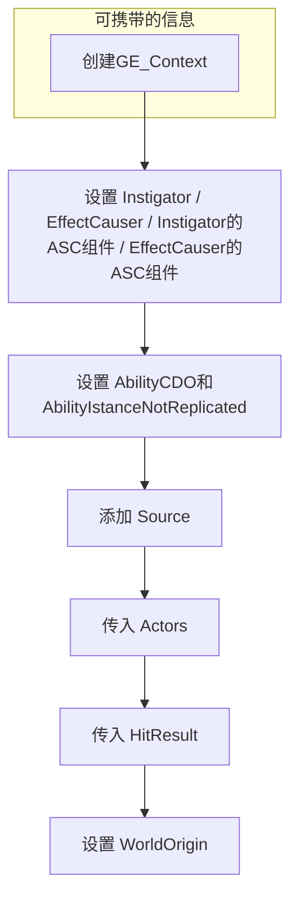
```mermaid
graph TD
    A[创建GE_Context] --> B[设置 Instigator / EffectCauser / Instigator的ASC组件 / EffectCauser的ASC组件]
    B --> C[设置 AbilityCDO和AbilityIstanceNotReplicated]
    C --> D[添加 Source]
    D --> E[传入 Actors]
    E --> F[传入 HitResult]
    F --> G[设置 WorldOrigin]
    subgraph "可携带的信息"
    A
    end
```


___________________________________________________________________________________________

> 本节看一下FGameplayEffectContext的源码部分，整理出可用和常用的部分，梳理一下结构

------

> ### 看看平时常用的`FGameplayEffectContext` `Data` 
>
> 1. 都有什么样的参数和功能，都能传递什么样的信息的同时；
> 2. 也试图发现FGameplayEffectContext的局限，上限在哪里

------

## 使用GE的标准流程

```cpp
//第一步:创建GE_Context
FGameplayEffectContextHandle GameplayEffectContextHandle = GetAbilitySystemComponent()->MakeEffectContext();
//第二步:添加SourceObject
GameplayEffectContextHandle.AddSourceObject(this);
//第三步:使用Context创建GE_SpecHandle
const FGameplayEffectSpecHandle GameplayEffectSpec = GetAbilitySystemComponent()->MakeOutgoingSpec(GameplayEffectClass, 1.0f, GameplayEffectContextHandle);
//第四步:使用GE_Spec应用技能
GetAbilitySystemComponent()->ApplyGameplayEffectSpecToSelf(*GameplayEffectSpec.Data.Get());
```

------


<details>
<summary>探索过程</summary>

>## 断点拿到 `FGameplayEffectContext` 信息
>
>我们在 `UAuraAttributeSet` 的后处理函数 **PostGameplayEffectExecute** 中可以拿到实参 `(const FGameplayEffectModCallbackData& Data)` ,传入自建函数 **SetEffectProperties** ，使用 `Data.EffectSpec` 拿到 `FGameplayEffectSpec` 通过 `FGameplayEffectSpec` 拿到了 `FGameplayEffectContext`
>
>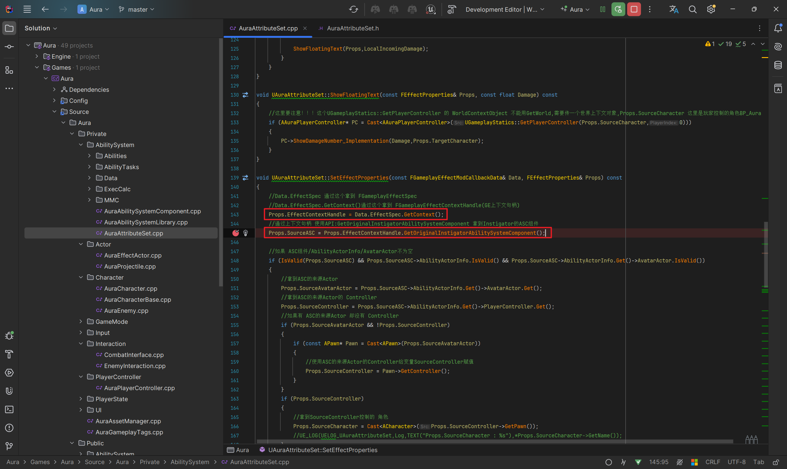
>
>
>
>## 可以看到这些黄色框内的内容被设置了，红色的没有被设置
>
>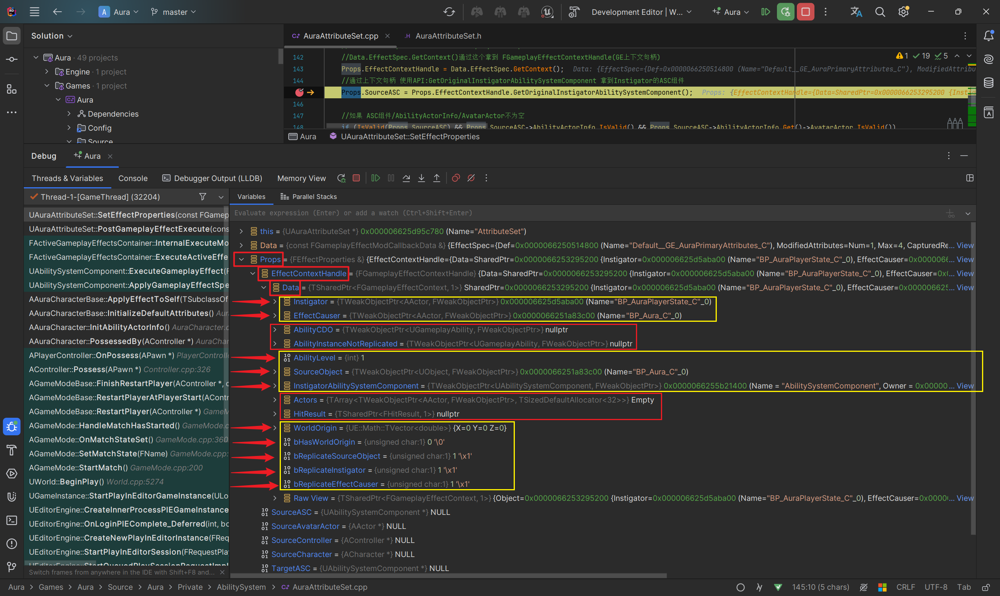
>
><details>
><summary>参数列表</summary>
>
>>### 下面是设置好和没设置好的参数列表：
>
>>| 被设置的参数                       | 作用                                            | 设置来源                                      |
>>| ---------------------------------- | ----------------------------------------------- | --------------------------------------------- |
>>| `Instigator`                       | 触发GE的角色或实体 `弱指针`                     | 调用 `MakeEffectContext` 函数时被设置         |
>>| `EffectCauser`                     | 导致`GameplayEffect`实际产生影响的实体 `弱指针` | 调用 `MakeEffectContext` 函数时被设置         |
>>| `SourceObject`                     | GameplayEffect 来源对象 `弱指针`                | 手动使用 `Context.AddSourceObject` 添加       |
>>| `InstigatorAbilitySystemComponent` | Instigator的ASC组件 `弱指针`                    |                                               |
>>| `WorldOrigin`                      | 应用时的世界坐标 `默认(0,0,0)`                  | 若不手动，设置则为(0,0,0)；手动则调用直接设置 |
>>| 下面是几个序列化文件：             | --------------                                  | --------------                                |
>>| `bHasWorldOrigin`                  | 布尔，指示GE是否有有效的`WorldOrigin`坐标       | 效果初始化时根据配置设置                      |
>>| `bReplicateSourceObject`           | 布尔，指示是否在网络同步时复制`SourceObject`    | 效果初始化时根据配置设置                      |
>>| `bReplicatelnstigator`             | 布尔，指示`Instigator`是否在网络同步时被复制    | 效果初始化时根据配置设置                      |
>>| `bReplicateEffectCauser`           | 布尔，指示`EffectCauser`是否在网络同步时被复制  | 效果初始化时根据配置设置                      |
>
>
>
>>| 没有被设置的参数               | 作用                                                       | 设置来源                                               |
>>| ------------------------------ | ---------------------------------------------------------- | ------------------------------------------------------ |
>>| `AbilityCDO`                   | 正在应用的GA                                               | Gameplay Ability系统内部在创建能力实例时设置           |
>>| `AbilityInstanceNotReplicated` | 不（replicate）的能力实例，避免不必要的网络负载            | 在能力实例化时设置，如果不需要网络同步能力实例。       |
>>| `AbilityLevel`                 | 能力的等级                                                 | 通常在能力激活时根据特定逻辑或角色的属性设置           |
>>| `Actors`                       | `Actors`存储与Gameplay Effect相关的Actors列表 `弱指针数组` | 手动，在应用效果时，相关的演员对象会被加入到此列表中。 |
>>| `HitResult`                    | `HitResult`存储命中检测的结果 `弱指针`                     | 手动，当效果通过命中事件触发时                         |
>
>>参数讲解：
>
>>- AbilityCDO ：
>
>> - `AbilityCDO` 是 `FGameplayEffectContext` 的一个成员变量。它的类型是 `UGameplayAbility*`，但实际上它存储的不是一个具体的 `GameplayAbility` 实例，而是该能力的默认类对象（CDO）
>
>> - **标识触发的能力**: `AbilityCDO` 用于标识哪个 `GameplayAbility` 触发了这个 `GameplayEffect`。由于它指向的是类的默认对象（CDO），因此它并不代表任何特定的实例，而是该类的通用代表。
>
>>   **条件检查**: 有时在执行特定的逻辑时，系统需要知道这个效果是由哪个能力触发的。通过 `AbilityCDO`，系统可以获取到该能力的相关信息，比如它的类型、分类，或者是否满足某些条件。
>
>>   **持久性和网络同步**: 在多人游戏中，`AbilityCDO` 有助于确保效果在网络环境中能够正确同步，特别是在能力触发和效果应用之间需要一致性时。
>
>>- EffectCauser：
>> - `EffectCauser` 是导致`GameplayEffect`实际产生影响的实体它可以与`Instigator`相同，但也可能是不同的对象。例如，某些情	况下，`EffectCauser`可能是一个陷阱或投掷物，而`Instigator`是放置或投掷该物体的角色。
>
>------
>
></details>
>
>## 首先第一个问题，为什么这些值是这样的？
>
>我们知道Source是之前自己手动调用API添加的
>
>```CPP
>GE_Context.AddSourceObject(要添加的源)
>```
>
>其他这些设定好的值比如：
>
>- Instigator
>- EffectCauser
>- InstigatorAbilitySystemComponent
>
>是在什么时候设置的呢？
>
>### 让我们看看源码
>
>首先来到我们创建的GA火球文件 `AuraProjectileSpell.cpp` 中，我们使用ASC组件创建了Context
>
>- 这个函数的注释为：**为此 AbilitySystemComponent 的所有者创建 EffectContext**
>
>```cpp
>SourceASC->MakeEffectContext()
>```
>
>`check` 是否有 `AbilityActorInfo`
>
>- 使用 `OwnerActor` 设置 `Instigator`
>
>- 使用 `AvatarActor` 设置 `EffectCauser`
>
>####  `Instigator` 和 `EffectCauser` 是在这里被设置的
>
>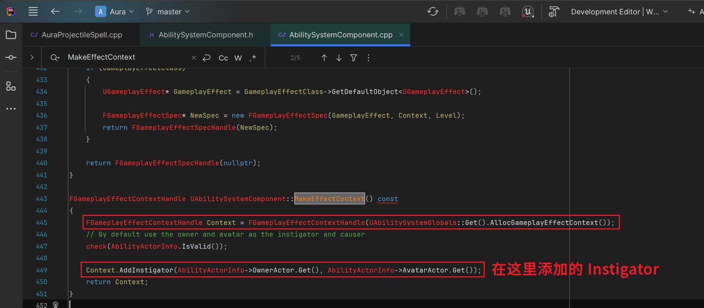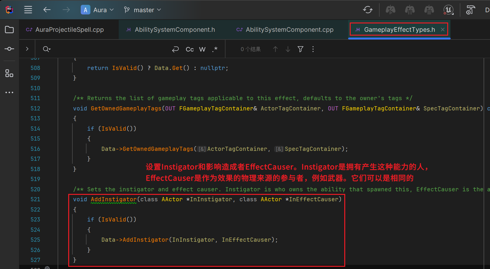
>
>#### Data调用的函数内
>
>1. 设置了 `Instigator`
>2. 设置了 bool **是否复制 Instigator**  `bReplicateInstigator`
>3. 设置了 `EffectCauser`
>4. 设置了 `Instigator 的 ASC组件`
>5. 设置了 bool **是否复制 EffectCauser**  `bReplicateEffectCauser`
>
>#### 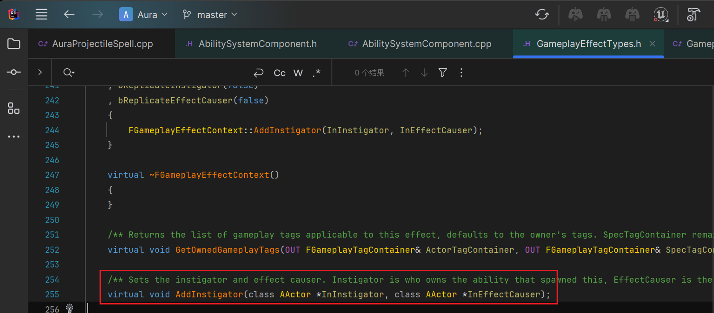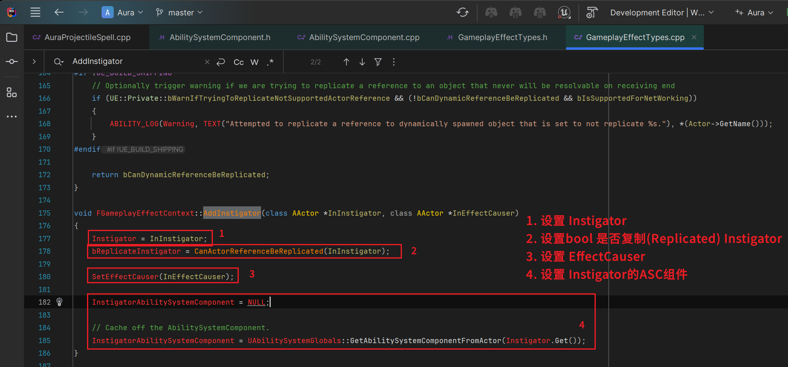
>
>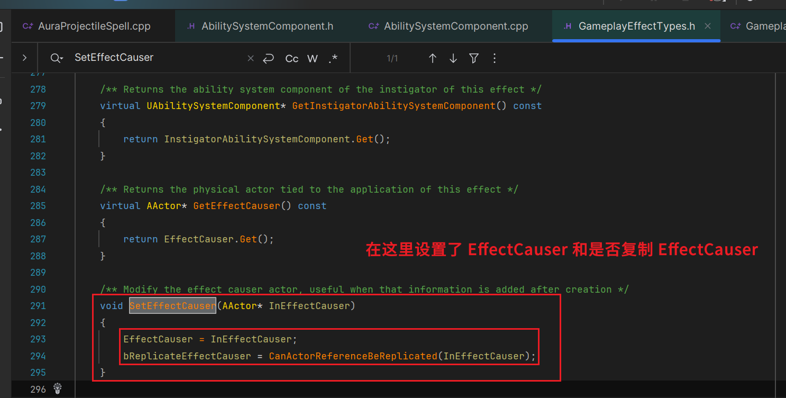
>
>#### 来到FGameplayEffectContext结构体中
>
>看到初始化了
>- AbilityLevel = 1;
>- WorldOrigin = (0,0,0);
>
>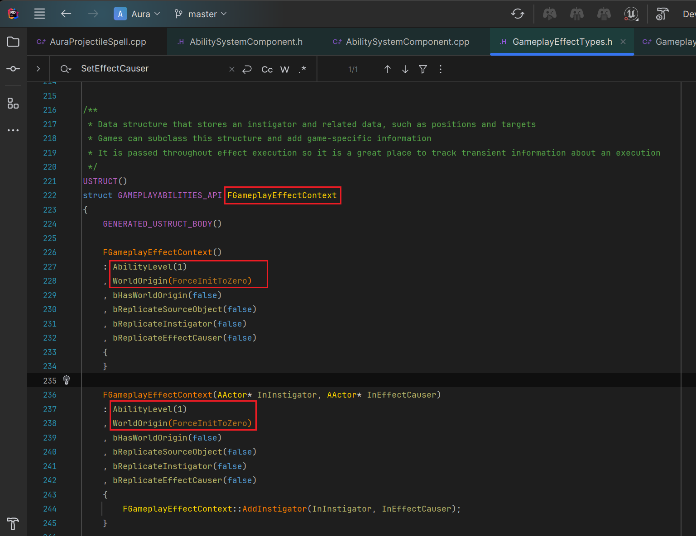
>
>------
>
>### 当调用GetOwnedGameplayTags函数时
>
>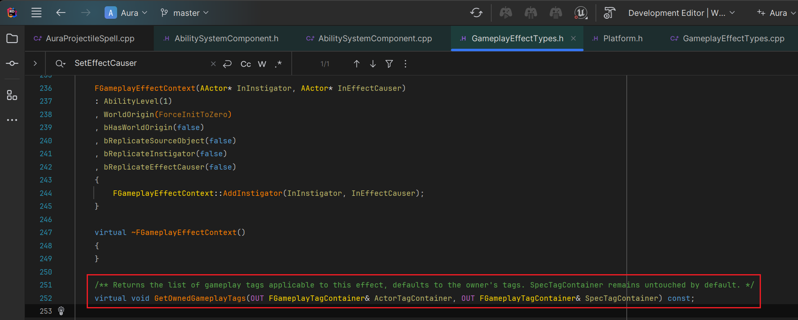
>
>#### 看目标是否实现了：游戏标签资产接口
>
>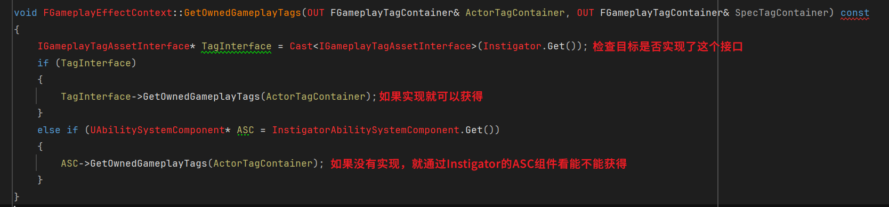
>
>------
>
>### 看一下GetAbility函数
>
>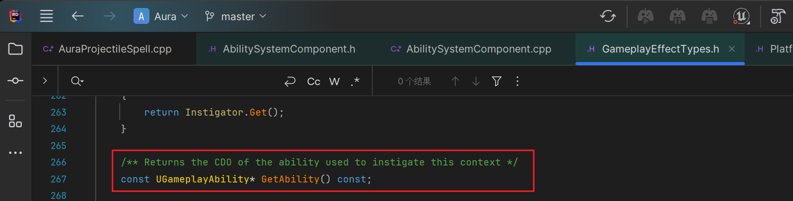
>
>返回的是 `AbilityCDO`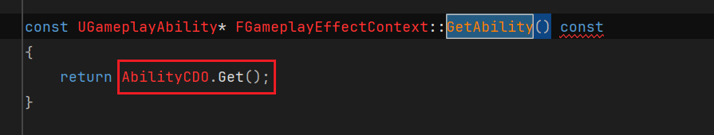
>
>------
>
>### 看一下SetAbility函数
>
>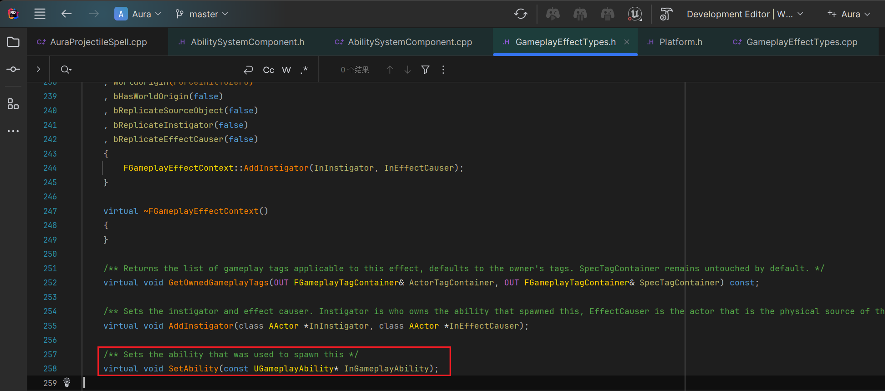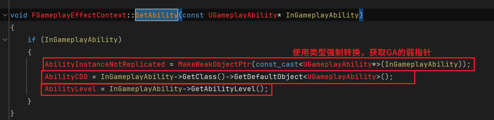
>
>------
>
>### 看一下 `GetAbilityInstance_NotReplicated`函数
>
>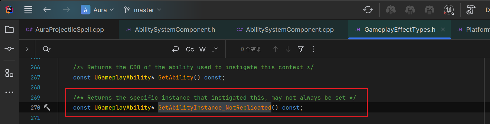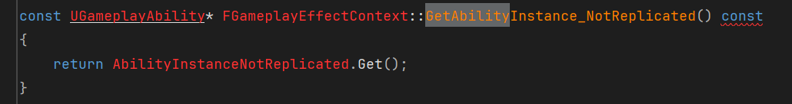
>
>------
>
>### 还有添加AActors和HitResult的函数
>
>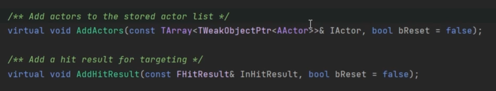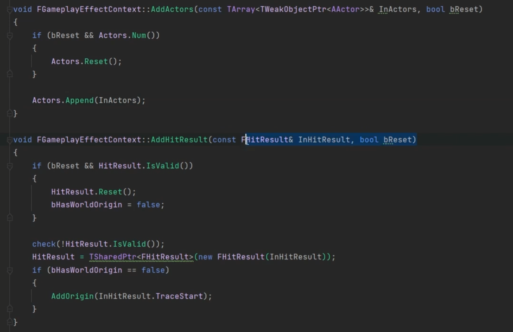
>
>------
>
>## 我们看到一个网络序列化函数 `NetSerialize`
>
>在后面我们需要自己创建这样一个 序列化/反序列化 函数
>
>#### 后面将创建自己 `FGameplayEffectContext` 类，设置结构序列化并通过网络发送
>
>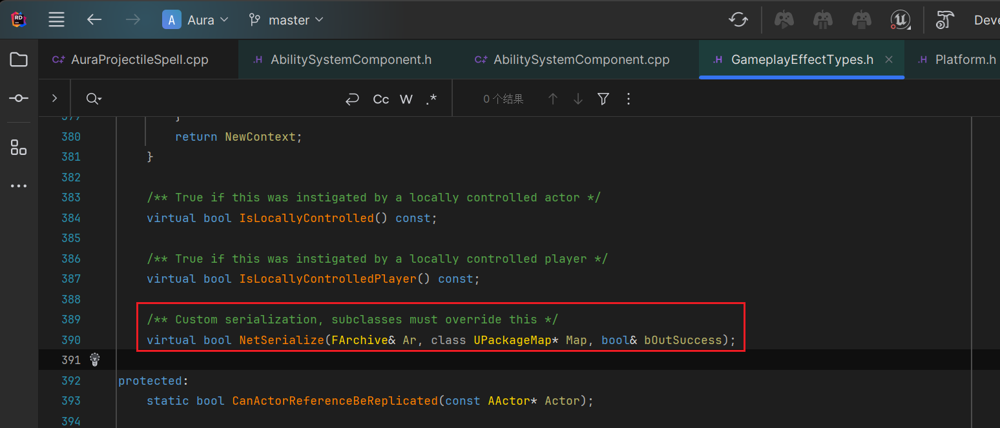
>
>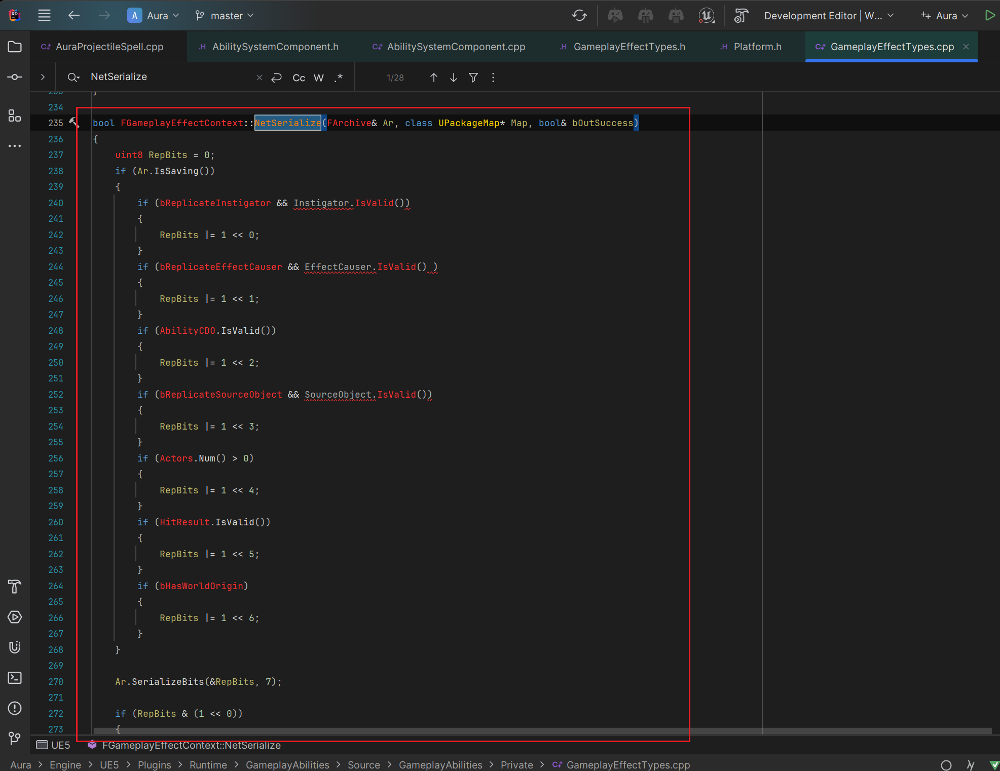
>
>------
>
>### 检查是否为本地玩家 `IsLocallyControlled` 函数
>
>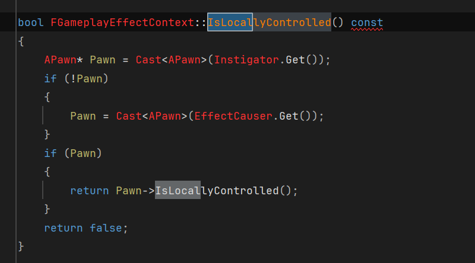
>
>------
>
>### 设置世界原点的函数 `AddOrigin`
>
>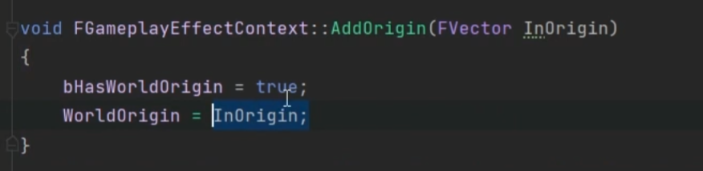
>
># 这样我们就可以在FGameplayEffectContext中传递更多数据

------

</details>

### 在 `GA火球` 中创建 `FGameplayEffectContext` 时断点查看携带数据

看到有些数据没有被设置，分别为：

- `AbilityCDO` —— GA实例
- `AbilityIstanceNotReplicated` —— GA不复制的实例
- `SourceObject` —— Source
- `Actors` —— 自己设置
- `HitResult` —— 自己设置
- `WorldOrigin` —— 自己设置

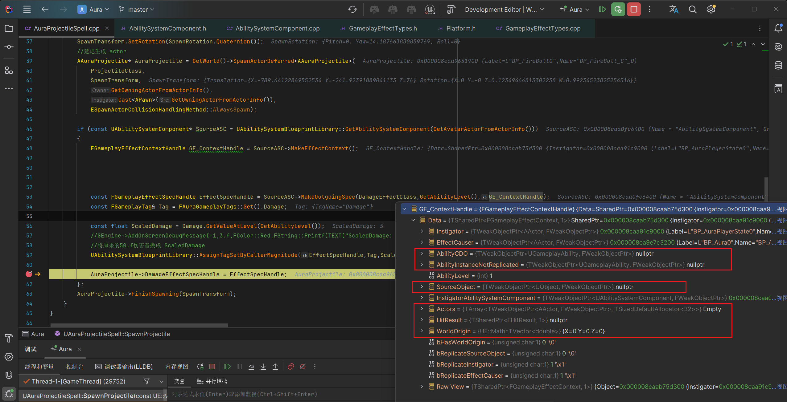

#### 添加 `AbilityCDO` 和 `AbilityIstanceNotReplicated`

```cpp
GE_ContextHandle.SetAbility(this);
```

看到就有了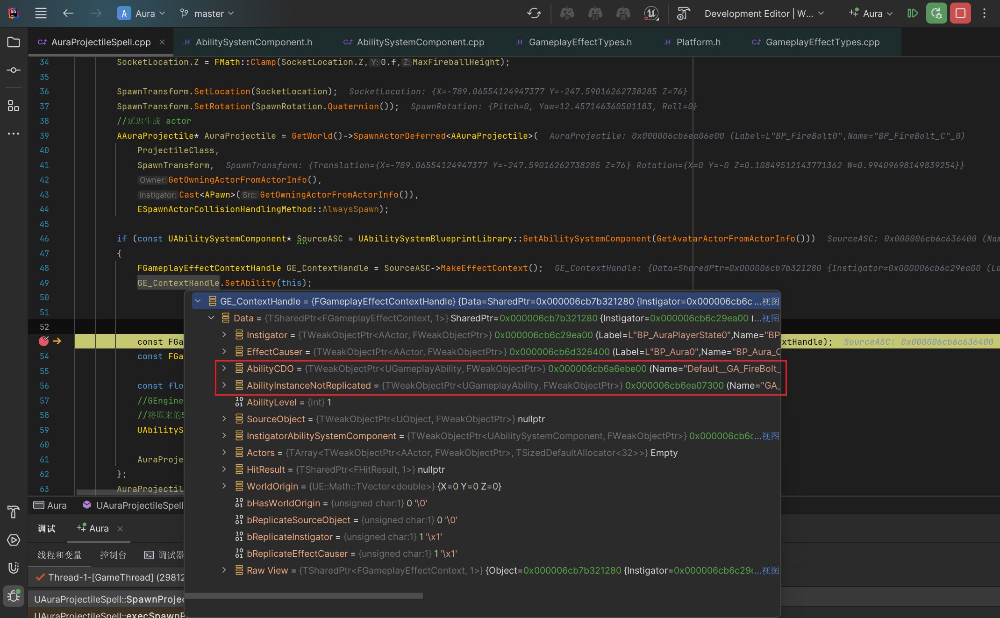

#### 添加 `Source` 

```cpp
GE_ContextHandle.AddSourceObject(SourceASC->GetAvatarActor());
```


### 添加 `AActors` 和 `HitResult` 

```CPP
TArray<TWeakObjectPtr<AActor>> Actors;
Actors.Add(MakeWeakObjectPtr(SourceASC->GetAvatarActor()));
GE_ContextHandle.AddActors(Actors);

FHitResult HitResult;
HitResult.ImpactPoint = FVector::ZeroVector;
GE_ContextHandle.AddHitResult(HitResult);
```

------

## 结论

调用 `MakeEffectContext()` 函数以后

会生成且自动配置的参数有：

- Instigator
- EffectCauser
- Instigator的ASC组件（如果有的话）

| 自动配置的参数                        | 值为                                                |
| ------------------------------------- | --------------------------------------------------- |
| `Instigator`                          | 释放技能时使用的ASC组件 的 `Owner`                  |
| `EffectCauser`                        | 释放技能时使用的ASC组件 的 `AvatarActor`            |
| `Instigator的ASC组件`（如果有的话）   | 释放技能时使用的ASC组件                             |
| `EffectCauser的ASC组件`（如果有的话） | 释放技能时使用的ASC组件的 `AvatarActor` 身上获取ASC |
| `WorldOrigin`                         | 0,0,0                                               |

| 手动可以配置的参数            | API                                                          |
| ----------------------------- | ------------------------------------------------------------ |
| `AbilityCDO`                  | `GE_ContextHandle.SetAbility()`                              |
| `AbilityIstanceNotReplicated` | 调用上面的`GE_ContextHandle.SetAbility()`后会根据是否复制设置 |
| `SourceObject`                | `GE_ContextHandle.AddSourceObject();`                        |
| `Actors`                      | `GE_ContextHandle.AddActors();`                              |
| `HitResult`                   | `GE_ContextHandle.AddHitResult();`                           |
| `WorldOrigin`                 | `GE_ContextHandle.AddOrigin();`                              |


<details>
<summary>使用参考代码</summary>

>```cpp
>//假设已经拿到了Source的ASC
>
>//这一步已经是设置 Instigator / EffectCauser / Instigator的ASC组件 / EffectCauser的ASC组件
>FGameplayEffectContextHandle GE_ContextHandle = SourceASC->MakeEffectContext();
>
>//设置 AbilityCDO和AbilityIstanceNotReplicated
>GE_ContextHandle.SetAbility(this);
>
>//添加 Source
>GE_ContextHandle.AddSourceObject(SourceASC->GetAvatarActor());
>
>//传入 Actors
>TArray<TWeakObjectPtr<AActor>> Actors;
>Actors.Add(MakeWeakObjectPtr(SourceASC->GetAvatarActor()));
>GE_ContextHandle.AddActors(Actors);
>
>//传入 HitResult
>FHitResult HitResult;
>HitResult.ImpactPoint = FVector::ZeroVector;
>GE_ContextHandle.AddHitResult(HitResult);
>
>//设置 WorldOrigin
>GE_ContextHandle.AddOrigin(FVector(1,1,1));
>
>//使用Context创建GE_SpecHandle
>const FGameplayEffectSpecHandle EffectSpecHandle = SourceASC->MakeOutgoingSpec(DamageEffectClass,GetAbilityLevel(),GE_ContextHandle);
>
>//使用GE_Spec应用技能
>SourceASC->ApplyGameplayEffectSpecToSelf(*EffectSpecHandle.Data.Get());
>```

------

</details>

### 局限

> #### 之前在 `ExecutionCalculations` 中计算了伤害，也就是说，释放技能时，就拿到了暴击/格挡之类的这些的概率，
> #### 如果我想要使用 `FGameplayEffectContext` 携带这些信息，我们看了一下源码，目前是没有办法携带的
### 所以需要创建一个自己的 `FGameplayEffectContext` 类

> 这将是我们下一阶段的目标
>
> 但是看看源码会发现，有一些网络序列化的内容需要重写，下一节来讲


___________________________________________________________________________________________

[返回最上面](#Go主菜单)

___________________________________________________________________________________________