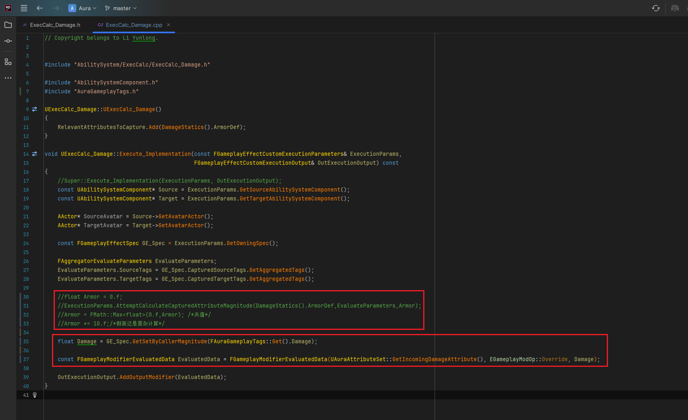
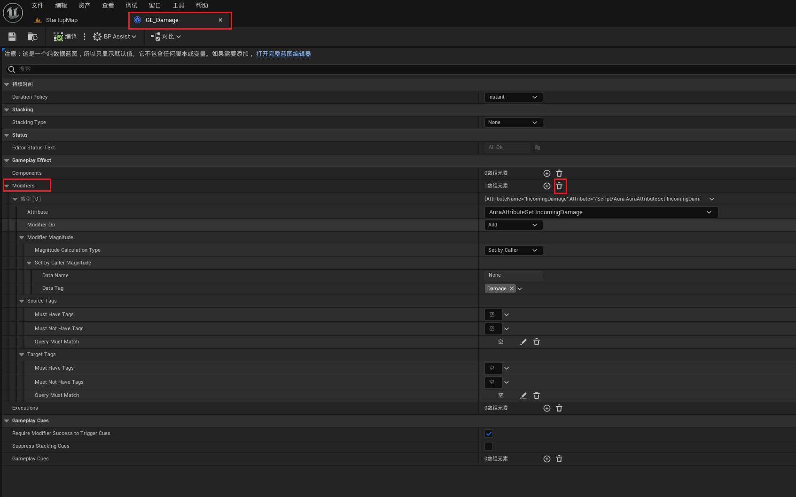
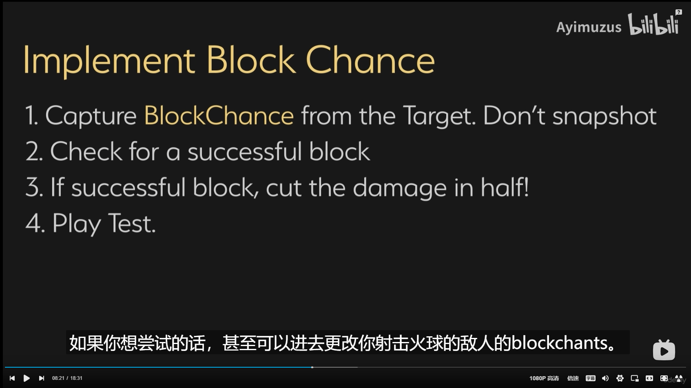
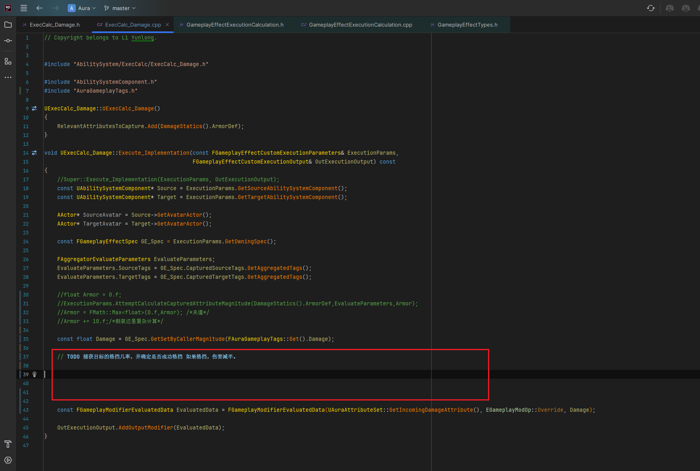

+ `头文件`中：
```cpp
这里是头文件代码这里是头文件代码这里是头文件代码这里是头文件代码这里是头文件代码这里是头文件代码
```

+ `源文件`中：
```cpp
这里是源文件代码这里是源文件代码这里是源文件代码这里是源文件代码这里是源文件代码这里是源文件代码
```

[Mermaid格式参考](https://github.com/liyunlong618/LiYunLongKnowledgeLibrary/blob/main/Mermaid%E6%A0%BC%E5%BC%8F%E5%8F%82%E8%80%83.md)

[预览](https://github.com/liyunlong618/LiYunLongKnowledgeLibrary/tree/main/UECPP/Models/GAS/GAS_2_Aura)


___________________________________________________________________________________________
###### [Go主菜单](../MainMenu.md)
___________________________________________________________________________________________

# GAS 063 实现格挡计算；在C++中使用SetByCaller

___________________________________________________________________________________________

## 处理关键点

1. 111111111111111111111111111111

2. 222222222222222222222222222

3. 33333333333333333333333333

4. 4444444444444444444444444444

5. 555555555555555555555555555555

6. 666666666666666666666666666

7. 77777777777777777777777777777777

___________________________________________________________________________________________

# 目录


[TOC]


___________________________________________________________________________________________

<details>
<summary>视频链接</summary>

[视频链接](ZHELISHISHIPINLIANJIE)

------

</details>

___________________________________________________________________________________________

### 整体思路梳理

Mermaid

___________________________________________________________________________________________

### 在C++中使用SetByCaller

<details>
<summary>删除旧的逻辑</summary>

之前是测试用护甲，把这部分临时逻辑移除

------

</details>

在 `UExecCalc_Damage` 的 `Execute_Implementation` 函数中
使用 `FGameplayEffectSpec` 获取 `SetByCallerMagnitude`

```CPP
float Damage = GE_Spec.GetSetByCallerMagnitude(FAuraGameplayTags::Get().Damage);
```

`FGameplayModifierEvaluatedData` 有参构造时，传入新的属性

```CPP
const FGameplayModifierEvaluatedData EvaluatedData = FGameplayModifierEvaluatedData(UAuraAttributeSet::GetIncomingDamageAttribute(), EGameplayModOp::Override, Damage);

OutExecutionOutput.AddOutputModifier(EvaluatedData);
```

此时 `UExecCalc_Damage` 的 `Execute_Implementation` 函数逻辑完整为：

```cpp
void UExecCalc_Damage::Execute_Implementation(const FGameplayEffectCustomExecutionParameters& ExecutionParams,
                                              FGameplayEffectCustomExecutionOutput& OutExecutionOutput) const
{
    //Super::Execute_Implementation(ExecutionParams, OutExecutionOutput);
    const UAbilitySystemComponent* Source = ExecutionParams.GetSourceAbilitySystemComponent();
    const UAbilitySystemComponent* Target = ExecutionParams.GetTargetAbilitySystemComponent();

    AActor* SourceAvatar = Source->GetAvatarActor();
    AActor* TargetAvatar = Target->GetAvatarActor();

    const FGameplayEffectSpec GE_Spec = ExecutionParams.GetOwningSpec();
    
    FAggregatorEvaluateParameters EvaluateParameters;
    EvaluateParameters.SourceTags = GE_Spec.CapturedSourceTags.GetAggregatedTags();
    EvaluateParameters.TargetTags = GE_Spec.CapturedTargetTags.GetAggregatedTags();

    //float Armor = 0.f;
    //ExecutionParams.AttemptCalculateCapturedAttributeMagnitude(DamageStatics().ArmorDef,EvaluateParameters,Armor);
    //Armor = FMath::Max<float>(0.f,Armor); /*夹值*/
    //Armor += 10.f;/*假装这是复杂计算*/
    
    float Damage = GE_Spec.GetSetByCallerMagnitude(FAuraGameplayTags::Get().Damage);
    
    const FGameplayModifierEvaluatedData EvaluatedData = FGameplayModifierEvaluatedData(UAuraAttributeSet::GetIncomingDamageAttribute(), EGameplayModOp::Override, Damage);
    
    OutExecutionOutput.AddOutputModifier(EvaluatedData);
}
```

------

> 编译引擎，运行发现 **和原来的在蓝图中设置 `Modifiers` 一样**
>
> **通过SetByCaller获取了一个 `键值对集合`**

------

### 小测试1


你要实现格挡几率。以下是你需要做的事情:

1. 你需要捕获格挡几率，从目标中捕获。

2. 不要使用快照，尽管你知道反正不会使用快照。

3. 然后检查是否成功格挡。

4. 如果格挡成功，将伤害减半。


接下来进行测试，看看你是否可以攻击敌人并成功被敌人格挡。

测试一下这个功能。你甚至可以尝试改变你正在对其发射火球的敌人的格挡几率，如果你想试试的话。现在暂停视频并实现格挡机制。




___________________________________________________________________________________________

[返回最上面](#Go主菜单)

___________________________________________________________________________________________