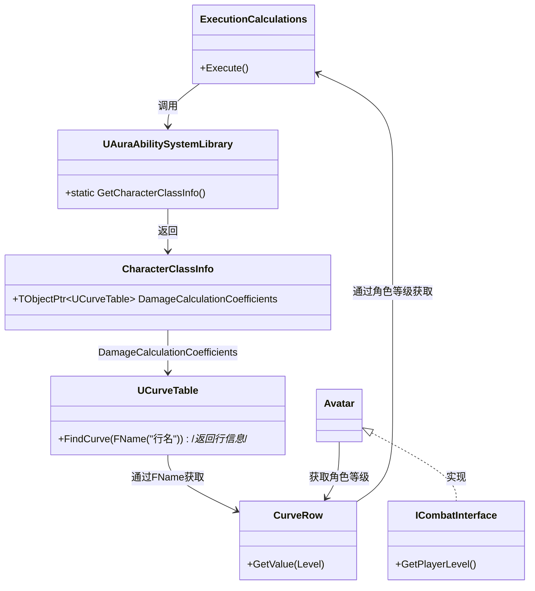

___________________________________________________________________________________________
###### [Go主菜单](../MainMenu.md)
___________________________________________________________________________________________

# GAS 064 计算护甲穿透

___________________________________________________________________________________________

## 处理关键点

1. 使用官方宏捕获和使用源属性

2. 在ExecutionCalculations中获取使用曲线表格


___________________________________________________________________________________________

# 目录


[TOC]


___________________________________________________________________________________________

<details>
<summary>视频链接</summary>

[15. Implementing Armor and Armor Penetration_哔哩哔哩_bilibili](https://www.bilibili.com/video/BV1JD421E7yC?p=144&vd_source=9e1e64122d802b4f7ab37bd325a89e6c)

[16. Damage Calculation Coefficients_哔哩哔哩_bilibili](https://www.bilibili.com/video/BV1JD421E7yC?p=145&vd_source=9e1e64122d802b4f7ab37bd325a89e6c)

------

</details>

___________________________________________________________________________________________

### Mermaid整体思路梳理：在ExecutionCalculations中获取使用曲线表格


```MERMAID
classDiagram
    class ExecutionCalculations {
        +Execute()
    }
    
    class UAuraAbilitySystemLibrary {
        +static GetCharacterClassInfo()
    }

    class CharacterClassInfo {
        +TObjectPtr&lt;UCurveTable&gt DamageCalculationCoefficients
    }

    class UCurveTable {
        +FindCurve(FName("行名"))/*返回行信息*/
    }

    class CurveRow {
        +GetValue(Level)
    }

    class ICombatInterface {
        +GetPlayerLevel()
    }

    class Avatar {
    }

    ExecutionCalculations --> UAuraAbilitySystemLibrary : 调用
    UAuraAbilitySystemLibrary --> CharacterClassInfo : 返回
    CharacterClassInfo --> UCurveTable : DamageCalculationCoefficients
    UCurveTable --> CurveRow : 通过FName获取
    CurveRow --> ExecutionCalculations : 通过角色等级获取
    Avatar <|.. ICombatInterface : 实现
    Avatar --> CurveRow : 获取角色等级
    

```


___________________________________________________________________________________________

接下来需要捕获护甲穿透

之前获得的都是Target(目标)的护甲、Target(目标)的伤害抗性

而护甲穿透要获得Source(源)的护甲穿透

**需要在使用宏时，更改枚举类型**

```CPP
struct AuraDamageStatics
{
    DECLARE_ATTRIBUTE_CAPTUREDEF(Armor);
    DECLARE_ATTRIBUTE_CAPTUREDEF(BlockChance);
    DECLARE_ATTRIBUTE_CAPTUREDEF(ArmorPenetration);
    AuraDamageStatics()
    {
       DEFINE_ATTRIBUTE_CAPTUREDEF(UAuraAttributeSet,Armor,Target,false);
       DEFINE_ATTRIBUTE_CAPTUREDEF(UAuraAttributeSet,BlockChance,Target,false);
       DEFINE_ATTRIBUTE_CAPTUREDEF(UAuraAttributeSet,ArmorPenetration,Source,false);
    }
};

static const AuraDamageStatics& DamageStatics()
{
    static AuraDamageStatics DStatics;
    return DStatics;
}
```


------

### 捕获 源 `Source` 的护甲穿透

1. 宏中声明，定义

2. 加入捕获属性数组

   ```CPP
   UExecCalc_Damage::UExecCalc_Damage()
   {
       RelevantAttributesToCapture.Add(DamageStatics().ArmorDef);
       RelevantAttributesToCapture.Add(DamageStatics().BlockChanceDef);
       RelevantAttributesToCapture.Add(DamageStatics().ArmorPenetrationDef);
   }
   ```

------

### 获取 捕获属性的 `float` 值，并进行 `夹值` 处理

```cpp
	float SourceArmorPenetration = 0.f;
	ExecutionParams.AttemptCalculateCapturedAttributeMagnitude(DamageStatics().ArmorPenetrationDef,EvaluateParameters,SourceArmorPenetration);
	SourceArmorPenetration = FMath::Max<float>(SourceArmorPenetration,0.f);

	float TargetArmor = 0.f;
	ExecutionParams.AttemptCalculateCapturedAttributeMagnitude(DamageStatics().ArmorDef,EvaluateParameters,TargetArmor);
	TargetArmor = FMath::Max<float>(TargetArmor,0.f);
```


------

### 计算护甲穿透

护甲穿透的原理是：忽略掉了目标一定百分比的护甲

> **这里的设计是：先计算格挡，格挡后的数值再进行护甲穿透的计算**

1. 创建一个临时变量，记录 `生效的护甲百分比` 

2. 再用： `百分比` * `目标护甲值`
<details>
<summary>(计算 可以参考)</summary>

> ```CPP
> 	//使用基数1,计算目标还剩的护甲值
> 	const float EffectiveArmor = TargetArmor *= (100 - SourceArmorPenetration * 0.25f ) / 100.f;
> 	//还剩的护甲乘以一个基数2,再计算伤害百分比
> 	Damage *= (100 - EffectiveArmor * 0.333f ) / 100.f;
> ```
>
> 

------

</details>

## 上面我们用硬编码(固定值)处理了护甲穿透的计算，下面是将硬编码换成曲线表格，使用动态数值计算

>  **因为如果使用固定值，那么越到后期，越趋近于100%。(越来越无敌)所以需要使用曲线表格设置动态的数值，在图中的位置，根据角色(Player或敌人)等级，获取并应用表格中的相应数值。**

------

### 创建配置的表格替换计算用到的硬编码(固定值)

打算把这个曲线表格的指针，放到 `CharacterClasslnfo` 这个 `DataAsset` 中

- 其实就是把数据统一管理，这个和敌人被打有关，所以放到敌人类被打的 `MVC` 的 `C` 中
- 曲线表的类型为：`UCurveTable`
- 命名为，`DamageCalculationCoefficients`

**在 `Content/Blueprints/AbilitySystem/Data/` 文件夹下创建 `曲线表格`**

创建一个常量的曲线表格，命名为 `CT_DamageCalculationCoefficients`意为 `CT_伤害计算系数`

| **曲线名**         |      | 1级     | 10级   | 20级    | 40级    |
| ------------------ | :--: | ------- | ------ | ------- | ------- |
| `ArmorPenetration` | 值： | `0.25`  | `0.15` | `0.085` | `0.035` |
| `EffectiveArmor`   | 值： | `0.333` | `0.25` | `0.15`  | `0.085` |

<details>
<summary>创建表格</summary>

>
>
>

------

</details>

蓝图中配置表格

-  *DA_CharacterClasslnfo* 

<details>
<summary>CharacterClasslnfo 中 持有 表格指针，并在蓝图中配置</summary>

>```CPP
>public:
>
>	UPROPERTY(EditDefaultsOnly, Category = "Common Class Defaults|Damage")
>	TObjectPtr<UCurveTable> DamageCalculationCoefficients;
>
>```
>
>

------

</details>


------

### 在ExecutionCalculations中获取CharacterClasslnfo

> 之前是把CharacterClasslnfo存在了GameMode中，又不能频繁的调用GM

所以想在蓝图函数库 `UAuraAbilitySystemLibrary` 中创建直接获取 `CharacterClasslnfo` 的函数

- 函数命名为：`GetCharacterClassInfo` 形参需要一个 `WorldContextObject`
- 替换蓝图函数库中别处调用 **CharacterClasslnfo** 的逻辑

+ `头文件`中：
```cpp
public:
		UFUNCTION(BlueprintCallable, Category = "AuraAbilitySystemLibrary|CharacterClassDefaults", meta = (WorldContextObject = "WorldContextObject"))
		static UCharacterClassInfo* GetCharacterClassInfo(const UObject* WorldContextObject);
```

+ `源文件`中：
```cpp
UCharacterClassInfo* UAuraAbilitySystemLibrary::GetCharacterClassInfo(const UObject* WorldContextObject)
{
	const AAuraGameMode* GameMode = Cast<AAuraGameMode>(UGameplayStatics::GetGameMode(WorldContextObject));
	if (GameMode == nullptr) return nullptr;;
	return GameMode->CharacterClassInfo;
}
```

<details>
<summary>这里放一下我的蓝图函数库的源码</summary>

>+ `头文件`中：
>```cpp
>// Copyright belongs to Li Yunlong.
>
>#pragma once
>
>#include "CoreMinimal.h"
>#include "AuraAbilitySystemComponent.h"
>#include "AuraAttributeSet.h"
>#include "Kismet/BlueprintFunctionLibrary.h"
>#include "Kismet/GameplayStatics.h"
>#include "PlayerState/AuraPlayerState.h"
>#include "UI/HUD/AuraHUD.h"
>#include "UI/WidgetController/UAuraWidgetController.h"
>#include "AuraAbilitySystemLibrary.generated.h"
>
>enum class ECharacterClass : uint8;
>class UOverlayWidgetController;
>/**
> * 
> */
>UCLASS()
>class AURA_API UAuraAbilitySystemLibrary : public UBlueprintFunctionLibrary
>{
>	GENERATED_BODY()
>
>public:
>	
>		//创建工具函数可以在 蓝图中获取数据		BlueprintPure表示该函数可以在蓝图中被调用并且是一个纯函数。
>		UFUNCTION(BlueprintPure,Category="AuraAbilitySystemLibrary|WidgetController",meta=(WorldContext="WorldContextObject"))
>		static UOverlayWidgetController* GetOverlayWidgetController(const UObject* WorldContextObject);
>		UFUNCTION(BlueprintPure,Category="AuraAbilitySystemLibrary|WidgetController",meta=(WorldContext="WorldContextObject"))
>		static UAttributeMenuWidgetController* GetAttributeMenuWidgetController(const UObject* WorldContextObject);
>
>		//抽象 Get WidgetController部分
>		template<typename T>
>		static T* GetWidgetController(const UObject* WorldContextObject);
>
>		UFUNCTION(BlueprintCallable, Category = "AuraAbilitySystemLibrary|CharacterClassDefaults", meta=( WorldContextObject = "WorldContextObject"))
>		static void InitializeDefaultAttributes(const UObject* WorldContextObject, ECharacterClass CharacterClass, float Level, UAbilitySystemComponent* ASC);
>
>		UFUNCTION(BlueprintCallable, Category = "AuraAbilitySystemLibrary|CharacterClassDefaults", meta=( WorldContextObject = "WorldContextObject"))
>		static void GiveStartupAttributes(const UObject* WorldContextObject, UAbilitySystemComponent* ASC);
>
>		UFUNCTION(BlueprintCallable, Category = "AuraAbilitySystemLibrary|CharacterClassDefaults", meta = (WorldContextObject = "WorldContextObject"))
>		static UCharacterClassInfo* GetCharacterClassInfo(const UObject* WorldContextObject);
>};
>
>//抽象 Get WidgetController部分
>template <typename T>
>T* UAuraAbilitySystemLibrary::GetWidgetController(const UObject* WorldContextObject)
>{
>	T* Ptr = nullptr;
>	if (APlayerController* PlayerController = UGameplayStatics::GetPlayerController(WorldContextObject, 0))
>	{
>		if (AAuraHUD* HUD = Cast<AAuraHUD>(PlayerController->GetHUD()))
>		{
>			AAuraPlayerState* AuraPlayerState = PlayerController->GetPlayerState<AAuraPlayerState>();
>			UAbilitySystemComponent* AuraAbilitySystemComponent = AuraPlayerState->GetAbilitySystemComponent();
>			UAttributeSet* AuraAttributeSet = AuraPlayerState->GetAttributeSet();
>			const FWidgetControllerParams Params = FWidgetControllerParams(PlayerController, AuraPlayerState, AuraAbilitySystemComponent, AuraAttributeSet);
>			/*这部分代码使用了 C++17 引入的 if constexpr 语句和 std::is_same_v 类型特征来在编译时进行类型检查和选择性地编译代码分支。
>			 * 
>			 * if constexpr 语句:
>			 * if constexpr 是一种条件编译语句，它允许在编译时进行条件检查，并且只有满足条件的分支代码会被编译。这与普通的 if 语句不同，普通的 if 语句是在运行时进行条件检查。
>			 * 
>			 * std::is_same_v<T, UOverlayWidgetController>:
>			 * std::is_same_v 是 std::is_same 的简化形式，用于比较两个类型是否相同。
>			 * std::is_same_v<T, UOverlayWidgetController> 在编译时会检查模板参数 T 是否等于 UOverlayWidgetController。如果相等，这个表达式的值为 true。
>			 *
>			 * 通过使用 if constexpr 和 std::is_same_v，你可以在编译时根据模板参数类型选择性地编译不同的代码分支。
>			 * 这在编写模板代码时非常有用，因为它允许你在编译时做出决定，从而避免了在运行时进行不必要的类型检查和分支判断，提高了代码的性能和类型安全性。
>			 * 
>			 * 具体来说，在这个例子中:
>			 * 如果 T 是 UOverlayWidgetController，编译器会编译 Ptr = HUD->GetOverlayWidgetController(Params);，并忽略 else 分支。
>			 * 如果 T 是 UAttributeMenuWidgetController，编译器会编译 Ptr = HUD->GetAttributeMenuWidgetController(Params);，并忽略 if 分支。
>			 * 这种方式确保了模板函数在不同的类型参数下具有正确的行为。
>			 */
>			if constexpr (std::is_same_v<T, UOverlayWidgetController>)
>			{
>				Ptr =  HUD->GetOverlayWidgetController(Params);
>			}
>			else if constexpr (std::is_same_v<T, UAttributeMenuWidgetController>)
>			{
>				Ptr =  HUD->GetAttributeMenuWidgetController(Params);
>			}
>		}
>	}
>	return Ptr;
>}
>
>```
>
>+ `源文件`中：
>```cpp
>// Copyright belongs to Li Yunlong.
>
>
>#include "AbilitySystem/AuraAbilitySystemLibrary.h"
>
>#include "AbilitySystem/Data/CharacterClassInfo.h"
>#include "GameMode/AuraGameMode.h"
>#include "UI/HUD/AuraHUD.h"
>
>UOverlayWidgetController* UAuraAbilitySystemLibrary::GetOverlayWidgetController(const UObject* WorldContextObject)
>{
>	return GetWidgetController<UOverlayWidgetController>(WorldContextObject);
>}
>
>UAttributeMenuWidgetController* UAuraAbilitySystemLibrary::GetAttributeMenuWidgetController(const UObject* WorldContextObject)
>{
>	return GetWidgetController<UAttributeMenuWidgetController>(WorldContextObject);
>}
>
>void UAuraAbilitySystemLibrary::InitializeDefaultAttributes(const UObject* WorldContextObject, ECharacterClass CharacterClass, float Level, UAbilitySystemComponent* ASC)
>{
>	UCharacterClassInfo* CharacterClassInfo= GetCharacterClassInfo(WorldContextObject);
>	const FCharacterClassDefaultInfo ClassDefaultInfo = CharacterClassInfo->GetClassDefaultInfo(CharacterClass);
>
>	const AActor* Actor = ASC->GetAvatarActor();
>	
>	FGameplayEffectContextHandle PrimaryAttributesContextHandle = ASC->MakeEffectContext();
>	PrimaryAttributesContextHandle.AddSourceObject(Actor);
>	const FGameplayEffectSpecHandle PrimaryAttributesSpecHandle = ASC->MakeOutgoingSpec(ClassDefaultInfo.PrimaryAttributes,Level,PrimaryAttributesContextHandle);
>	ASC->ApplyGameplayEffectSpecToSelf(*PrimaryAttributesSpecHandle.Data);
>    
>	FGameplayEffectContextHandle SecondaryAttributesContextHandle = ASC->MakeEffectContext();
>	SecondaryAttributesContextHandle.AddSourceObject(Actor);
>	const FGameplayEffectSpecHandle SecondaryAttributesSpecHandle = ASC->MakeOutgoingSpec(CharacterClassInfo->SecondaryAttributes,Level,SecondaryAttributesContextHandle);
>	ASC->ApplyGameplayEffectSpecToSelf(*SecondaryAttributesSpecHandle.Data);
>
>	FGameplayEffectContextHandle VitalAttributesContextHandle = ASC->MakeEffectContext();
>	VitalAttributesContextHandle.AddSourceObject(Actor);
>	const FGameplayEffectSpecHandle VitalAttributesSpecHandle = ASC->MakeOutgoingSpec(CharacterClassInfo->VitalAttributes,Level,VitalAttributesContextHandle);
>	ASC->ApplyGameplayEffectSpecToSelf(*VitalAttributesSpecHandle.Data);
>}
>
>void UAuraAbilitySystemLibrary::GiveStartupAttributes(const UObject* WorldContextObject, UAbilitySystemComponent* ASC)
>{
>	UCharacterClassInfo* CharacterClassInfo= GetCharacterClassInfo(WorldContextObject);
>
>	for (const TSubclassOf<UGameplayAbility> CommonAbility : CharacterClassInfo->CommonAbilities)
>	{
>		//使用配置好的GA Class 构造一个FGameplayAbilitySpec 技能规范
>		FGameplayAbilitySpec GA_Spec = FGameplayAbilitySpec(CommonAbility,1.0f);
>		ASC->GiveAbility(GA_Spec);
>	}
>}
>
>UCharacterClassInfo* UAuraAbilitySystemLibrary::GetCharacterClassInfo(const UObject* WorldContextObject)
>{
>	const AAuraGameMode* GameMode = Cast<AAuraGameMode>(UGameplayStatics::GetGameMode(WorldContextObject));
>	if (GameMode == nullptr) return nullptr;;
>	return GameMode->CharacterClassInfo;
>}
>
>```

------

</details>

接下来

1. **ExecutionCalculations的中通过蓝图函数库`UAuraAbilitySystemLibrary`中的静态函数`GetCharacterClassInfo`拿到保存在GameMode中的`CharacterClasslnfo`**

2. **通过 `CharacterClassInfo` 拿到 `UCurveTable`类型曲线指针**
3. **给曲线指针的函数 `FindCurve` 传入 `FName` 拿到行信息**
4. **给行信息传入角色等级获取动态数值**
5. **角色等级是使用ICombatInterface接口获取的，如果Avatar继承了ICombatInterface接口就可以调用获取角色等级函数**
6. **最后使用动态数值**




```CPP
	//先去蓝图函数库拿 UCharacterClassInfo*
	UCharacterClassInfo* CharacterClassInfo = UAuraAbilitySystemLibrary::GetCharacterClassInfo(Source);
	check(CharacterClassInfo);
	//拿到DataAsset上的曲线表格
	UCurveTable* Curve = CharacterClassInfo->DamageCalculationCoefficients;
	check(Curve);
	//拿到表格行ArmorPenetration
	FRealCurve* CurveRow_ArmorPenetration =  Curve->FindCurve(FName("ArmorPenetration"),TEXT("ArmorPenetration Is Not Find"));
	check(CurveRow_ArmorPenetration);
	float ArmorPenetrationCoefficient = CurveRow_ArmorPenetration->Eval(Source_ICombatInterface->GetPlayerLevel());
	//拿到表格行EffectiveArmor
	FRealCurve* CurveRow_EffectiveArmor =  Curve->FindCurve(FName("EffectiveArmor"),TEXT("ArmorPenetration Is Not Find"));
	check(CurveRow_EffectiveArmor);
	float EffectiveArmorCoefficient = CurveRow_EffectiveArmor->Eval(Source_ICombatInterface->GetPlayerLevel());

	/*
	 * 下面是计算
	 */
	
	//使用基数1,计算目标还剩的护甲值
	const float EffectiveArmor = TargetArmor *= (100 - SourceArmorPenetration * ArmorPenetrationCoefficient ) / 100.f;
	//还剩的护甲乘以一个基数2,再计算伤害百分比
	Damage *= (100 - EffectiveArmor * EffectiveArmorCoefficient ) / 100.f;
	
```

<details>
<summary>这里是我的 UExecCalc_Damage 源码</summary>

>```cpp
>// Copyright belongs to Li Yunlong.
>
>
>#include "AbilitySystem/ExecCalc/ExecCalc_Damage.h"
>
>#include "AbilitySystemComponent.h"
>#include "AuraGameplayTags.h"
>#include "AbilitySystem/AuraAbilitySystemLibrary.h"
>#include "AbilitySystem/Data/CharacterClassInfo.h"
>#include "Interaction/CombatInterface.h"
>
>UExecCalc_Damage::UExecCalc_Damage()
>{
>	RelevantAttributesToCapture.Add(DamageStatics().ArmorDef);
>	RelevantAttributesToCapture.Add(DamageStatics().BlockChanceDef);
>	RelevantAttributesToCapture.Add(DamageStatics().ArmorPenetrationDef);
>}
>
>void UExecCalc_Damage::Execute_Implementation(const FGameplayEffectCustomExecutionParameters& ExecutionParams,
>                                              FGameplayEffectCustomExecutionOutput& OutExecutionOutput) const
>{
>	//Super::Execute_Implementation(ExecutionParams, OutExecutionOutput);
>	const UAbilitySystemComponent* Source = ExecutionParams.GetSourceAbilitySystemComponent();
>	const UAbilitySystemComponent* Target = ExecutionParams.GetTargetAbilitySystemComponent();
>
>	AActor* SourceAvatar = Source->GetAvatarActor();
>	AActor* TargetAvatar = Target->GetAvatarActor();
>	TScriptInterface<ICombatInterface> Source_ICombatInterface = SourceAvatar;
>	TScriptInterface<ICombatInterface> Target_ICombatInterface = TargetAvatar;
>	
>
>	const FGameplayEffectSpec GE_Spec = ExecutionParams.GetOwningSpec();
>	
>	FAggregatorEvaluateParameters EvaluateParameters;
>	EvaluateParameters.SourceTags = GE_Spec.CapturedSourceTags.GetAggregatedTags();
>	EvaluateParameters.TargetTags = GE_Spec.CapturedTargetTags.GetAggregatedTags();
>	
>	float Damage = GE_Spec.GetSetByCallerMagnitude(FAuraGameplayTags::Get().Damage);
>
>	/*
>	 * 这里给原来的伤害抗性加了 目标类型
>	 */
>	float TargetBlockChance = 0.f;
>	ExecutionParams.AttemptCalculateCapturedAttributeMagnitude(DamageStatics().BlockChanceDef,EvaluateParameters,TargetBlockChance);
>	TargetBlockChance = FMath::Max<float>(0.f,TargetBlockChance);/*对属性进行夹值*/
>
>	const float Blocked = FMath::RandRange(1, 100);
>	Damage = Blocked < TargetBlockChance ? Damage *= 0.5f : Damage;
>
>	float SourceArmorPenetration = 0.f;
>	ExecutionParams.AttemptCalculateCapturedAttributeMagnitude(DamageStatics().ArmorPenetrationDef,EvaluateParameters,SourceArmorPenetration);
>	SourceArmorPenetration = FMath::Max<float>(SourceArmorPenetration,0.f);
>
>	float TargetArmor = 0.f;
>	ExecutionParams.AttemptCalculateCapturedAttributeMagnitude(DamageStatics().ArmorDef,EvaluateParameters,TargetArmor);
>	TargetArmor = FMath::Max<float>(TargetArmor,0.f);
>
>	//先去蓝图函数库拿 UCharacterClassInfo*
>	UCharacterClassInfo* CharacterClassInfo = UAuraAbilitySystemLibrary::GetCharacterClassInfo(Source);
>	check(CharacterClassInfo);
>	//拿到DataAsset上的曲线表格
>	UCurveTable* Curve = CharacterClassInfo->DamageCalculationCoefficients;
>	check(Curve);
>	//拿到表格行ArmorPenetration
>	FRealCurve* CurveRow_ArmorPenetration =  Curve->FindCurve(FName("ArmorPenetration"),TEXT("ArmorPenetration Is Not Find"));
>	check(CurveRow_ArmorPenetration);
>	float ArmorPenetrationCoefficient = CurveRow_ArmorPenetration->Eval(Source_ICombatInterface->GetPlayerLevel());
>	//拿到表格行EffectiveArmor
>	FRealCurve* CurveRow_EffectiveArmor =  Curve->FindCurve(FName("EffectiveArmor"),TEXT("ArmorPenetration Is Not Find"));
>	check(CurveRow_EffectiveArmor);
>	float EffectiveArmorCoefficient = CurveRow_EffectiveArmor->Eval(Source_ICombatInterface->GetPlayerLevel());
>
>	/*
>	 * 下面是计算
>	 */
>	
>	//使用基数1,计算目标还剩的护甲值
>	const float EffectiveArmor = TargetArmor *= (100 - SourceArmorPenetration * ArmorPenetrationCoefficient ) / 100.f;
>	//还剩的护甲乘以一个基数2,再计算伤害百分比
>	Damage *= (100 - EffectiveArmor * EffectiveArmorCoefficient ) / 100.f;
>	
>	const FGameplayModifierEvaluatedData EvaluatedData = FGameplayModifierEvaluatedData(UAuraAttributeSet::GetIncomingDamageAttribute(), EGameplayModOp::Override, Damage);
>	
>	OutExecutionOutput.AddOutputModifier(EvaluatedData);
>}
>
>```

------

</details>


------

### 断点调试，测试结果

<details>
<summary>断点调试</summary>

>
>
>
>
>
>
>

------

</details>


___________________________________________________________________________________________

[返回最上面](#Go主菜单)

___________________________________________________________________________________________