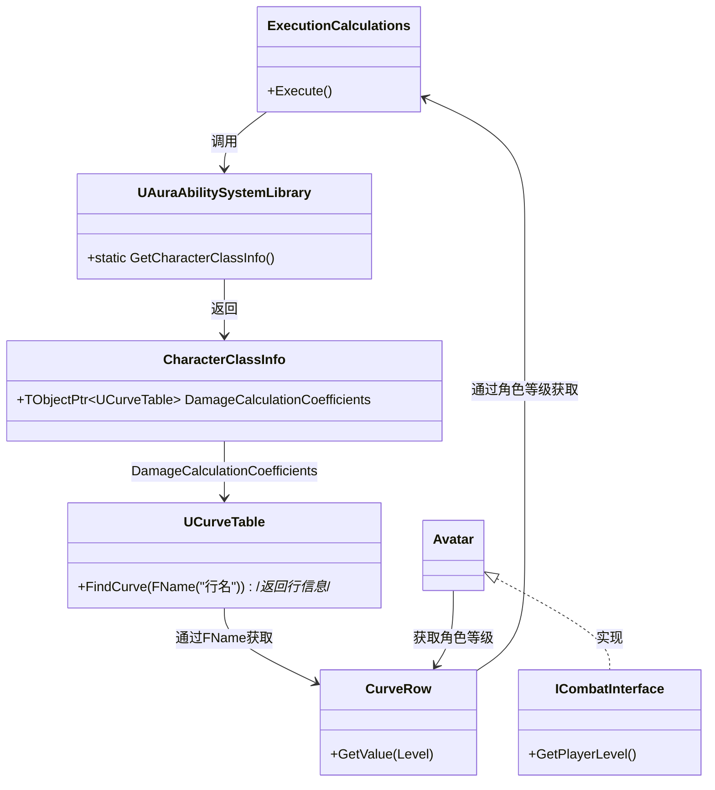

___________________________________________________________________________________________
###### [Go主菜单](../MainMenu.md)
___________________________________________________________________________________________

# GAS 064 计算护甲穿透

___________________________________________________________________________________________

## 处理关键点

1. 使用官方宏捕获和使用源属性

2. 在ExecutionCalculations中获取使用曲线表格


___________________________________________________________________________________________

# 目录


[TOC]


___________________________________________________________________________________________

<details>
<summary>视频链接</summary>
[15. Implementing Armor and Armor Penetration_哔哩哔哩_bilibili](https://www.bilibili.com/video/BV1JD421E7yC?p=144&vd_source=9e1e64122d802b4f7ab37bd325a89e6c)

[16. Damage Calculation Coefficients_哔哩哔哩_bilibili](https://www.bilibili.com/video/BV1JD421E7yC?p=145&vd_source=9e1e64122d802b4f7ab37bd325a89e6c)

------

</details>

___________________________________________________________________________________________

### Mermaid整体思路梳理：在ExecutionCalculations中获取使用曲线表格


```MERMAID
classDiagram
    class ExecutionCalculations {
        +Execute()
    }
    
    class UAuraAbilitySystemLibrary {
        +static GetCharacterClassInfo()
    }

    class CharacterClassInfo {
        +TObjectPtr&lt;UCurveTable&gt DamageCalculationCoefficients
    }

    class UCurveTable {
        +FindCurve(FName("行名"))/*返回行信息*/
    }

    class CurveRow {
        +GetValue(Level)
    }

    class ICombatInterface {
        +GetPlayerLevel()
    }

    class Avatar {
    }

    ExecutionCalculations --> UAuraAbilitySystemLibrary : 调用
    UAuraAbilitySystemLibrary --> CharacterClassInfo : 返回
    CharacterClassInfo --> UCurveTable : DamageCalculationCoefficients
    UCurveTable --> CurveRow : 通过FName获取
    CurveRow --> ExecutionCalculations : 通过角色等级获取
    Avatar <|.. ICombatInterface : 实现
    Avatar --> CurveRow : 获取角色等级
    

```


___________________________________________________________________________________________

接下来需要捕获护甲穿透

之前获得的都是Target(目标)的护甲、Target(目标)的伤害抗性

而护甲穿透要获得Source(源)的护甲穿透

**需要在使用宏时，更改枚举类型**//TODO_图

------

### 捕获 源 `Source` 的护甲穿透

1. 宏中声明，定义

2. 加入捕获属性数组

   //TODO_CPP

------

### 获取 捕获属性的 `float` 值，并进行 `夹值` 处理

//TODO_CPP

//TODO_图

------

### 计算护甲穿透

护甲穿透的原理是：忽略掉了目标一定百分比的护甲

> **这里的设计是：先计算格挡，格挡后的数值再进行护甲穿透的计算**

1. 创建一个临时变量，记录 `生效的护甲百分比` 

2. 再用： `百分比` * `目标护甲值`
<details>
<summary>(计算 可以参考)</summary>

> ```CPP
> const float EffectiveArmor = TargetArmor *= (100 - SourceArmorPenetration * 0.25f)/ 100.f;
> Damage *= (100-EffectiveArmor *0.333f) / 100.f;
> ```
>
> 

------

</details>

## 上面我们用硬编码(固定值)处理了护甲穿透的计算，下面是将硬编码换成曲线表格，使用动态数值计算

>  **因为如果使用固定值，那么越到后期，越趋近于100%。(越来越无敌)所以需要使用曲线表格设置动态的数值，在图中的位置，根据角色(Player或敌人)等级，获取并应用表格中的相应数值。**

------

### 创建配置的表格替换计算用到的硬编码(固定值)

打算把这个曲线表格的指针，放到 `CharacterClasslnfo` 这个 `DataAsset` 中

- 其实就是把数据统一管理，这个和敌人被打有关，所以放到敌人类被打的 `MVC` 的 `C` 中
- 曲线表的类型为：`UCurveTable`

**在 `Content/Blueprints/AbilitySystem/Data/` 文件夹下创建 `曲线表格`**

创建一个常量的曲线表格，命名为 `CT_DamageCalculationCoefficients`意为 `CT_伤害计算系数`

| **曲线名**         |      | 1级     | 10级   | 20级    | 40级    |
| ------------------ | :--: | ------- | ------ | ------- | ------- |
| `ArmorPenetration` | 值： | `0.25`  | `0.15` | `0.085` | `0.035` |
| `EffectiveArmor`   | 值： | `0.333` | `0.25` | `0.15`  | `0.085` |

蓝图中配置表格

-  *DA_CharacterClasslnfo* 

<details>
<summary>CharacterClasslnfo 中 持有 表格指针，并在蓝图中配置</summary>

>```CPP
>UPROPERTY(EditDefaultsOnly, Category = "Common Class Defaults|Damage")
>TObjectPtr<UCurveTable> DamageCalculationCoefficients;
>```
>
>

------

</details>

<details>
<summary>创建表格</summary>

>
>
>

------

</details>

------

### 在ExecutionCalculations中获取CharacterClasslnfo

> 之前是把CharacterClasslnfo存在了GameMode中，又不能频繁的调用GM

所以想在蓝图函数库 `UAuraAbilitySystemLibrary` 中创建直接获取 `CharacterClasslnfo` 的函数

- 函数命名为：`GetCharacterClassInfo` 形参需要一个 `WorldContextObject`
- 替换蓝图函数库中别处调用 **CharacterClasslnfo** 的逻辑

+ `头文件`中：
```cpp
这里是头文件代码这里是头文件代码这里是头文件代码这里是头文件代码这里是头文件代码这里是头文件代码&emsp;
```

+ `源文件`中：
```cpp
这里是源文件代码这里是源文件代码这里是源文件代码这里是源文件代码这里是源文件代码这里是源文件代码
```


接下来

1. **ExecutionCalculations的中通过蓝图函数库`UAuraAbilitySystemLibrary`中的静态函数`GetCharacterClassInfo`拿到保存在GameMode中的`CharacterClasslnfo`**

2. **通过 `CharacterClassInfo` 拿到 `UCurveTable`类型曲线指针**
3. **给曲线指针的函数 `FindCurve` 传入 `FName` 拿到行信息**
4. **给行信息传入角色等级获取动态数值**
5. **角色等级是使用ICombatInterface接口获取的，如果Avatar继承了ICombatInterface接口就可以调用获取角色等级函数**
6. **最后使用动态数值**




```CPP
//源文件代码
```

------

### 断点调试，测试结果

<details>
<summary>断点调试</summary>

>
>
>
>
>
>
>

------

</details>


___________________________________________________________________________________________

[返回最上面](#Go主菜单)

___________________________________________________________________________________________