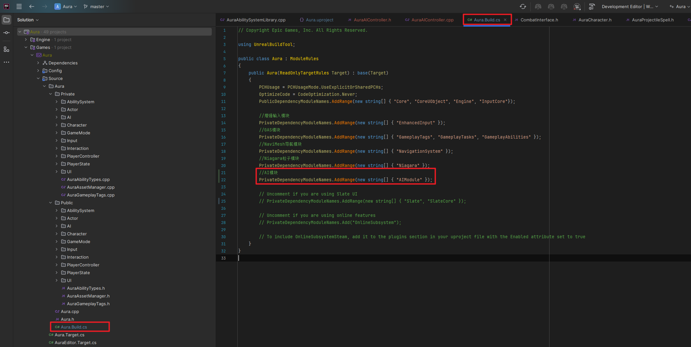

___________________________________________________________________________________________
###### [Go主菜单](../MainMenu.md)
___________________________________________________________________________________________

# GAS 076 创建AIController/行为树/黑板/自定义的行为树服务BTService

___________________________________________________________________________________________

## 处理关键点

1. 使用 `AI` 别忘了引入模块 `AIModule`

2. 可以在 `AIController` 源码中 找到黑板组件

3. `自定义的行为树服务BTService` C++类中 如果写了逻辑，且调用Super，蓝图中只要实现了该函数，哪怕没有执行任何蓝图逻辑也会调用C++中的逻辑。


___________________________________________________________________________________________

# 目录


- [GAS 076 创建AIController/行为树/黑板/自定义的行为树服务BTService](#gas-076-创建aicontroller行为树黑板自定义的行为树服务btservice)
  - [处理关键点](#处理关键点)
- [目录](#目录)
    - [Mermaid整体思路梳理](#mermaid整体思路梳理)
    - [结构梳理](#结构梳理)
    - [创建自己的 `AIController` 的C++类](#创建自己的-aicontroller-的c类)
  - [需要引入模块 `AIModule`](#需要引入模块-aimodule)
    - [自建的 `AuraAIController` 中创建行为树组件(不需要黑板组件)](#自建的-auraaicontroller-中创建行为树组件不需要黑板组件)
    - [`AuraEnemy` 上重写 `PossessedBy`](#auraenemy-上重写-possessedby)
    - [创建 AuraAlController 蓝图继承类，命名为 BP\_AuraAlController](#创建-auraalcontroller-蓝图继承类命名为-bp_auraalcontroller)
    - [蓝图中敌人基类 *BP\_EnemyBase* 中，配置默认的 `AIController类`](#蓝图中敌人基类-bp_enemybase-中配置默认的-aicontroller类)
    - [蓝图中创建黑板和行为树](#蓝图中创建黑板和行为树)
    - [敌人蓝图基类中配置黑板](#敌人蓝图基类中配置黑板)
  - [接下来需要运行行为树](#接下来需要运行行为树)
  - [需要注意的！！！只有服务器才能控制AI，客户看到的任何东西都是复制的结果](#需要注意的只有服务器才能控制ai客户看到的任何东西都是复制的结果)
    - [C++中运行行为树前，先初始化黑板数据](#c中运行行为树前先初始化黑板数据)
    - [接下来行为树上配置测试节点，测试一下](#接下来行为树上配置测试节点测试一下)
      - [下面是下一节](#下面是下一节)
    - [创建自定义的行为树任务节点服务 `UBTService_BlueprintBase` 类](#创建自定义的行为树任务节点服务-ubtservice_blueprintbase-类)
    - [自定义的行为树任务节点中重写 `TickNode` 虚函数](#自定义的行为树任务节点中重写-ticknode-虚函数)
    - [看一下 `UBTService_BlueprintBase` 类源码](#看一下-ubtservice_blueprintbase-类源码)
    - [`TickNode` 虚函数中添加 测试打印代码](#ticknode-虚函数中添加-测试打印代码)
    - [创建自建行为树任务节点服务的蓝图继承类，命名为 *BTS\_FindNearestPlayer*](#创建自建行为树任务节点服务的蓝图继承类命名为-bts_findnearestplayer)
    - [此时我们在行为树中使用呼出 自建行为树任务节点服务 可以看到 蓝图的 和 C++的 (这里使用的是蓝图版本)](#此时我们在行为树中使用呼出-自建行为树任务节点服务-可以看到-蓝图的-和-c的-这里使用的是蓝图版本)
    - [测试一下 自建行为树任务节点服务 的Tick](#测试一下-自建行为树任务节点服务-的tick)


___________________________________________________________________________________________

<details>
<summary>视频链接</summary>
[1. Enemy AI Setup_哔哩哔哩_bilibili](https://www.bilibili.com/video/BV1JD421E7yC?p=161&vd_source=9e1e64122d802b4f7ab37bd325a89e6c)

[2. AI Controller Blackboard and Behavior Tree_哔哩哔哩_bilibili](https://www.bilibili.com/video/BV1JD421E7yC?p=162&vd_source=9e1e64122d802b4f7ab37bd325a89e6c)


------

</details>

___________________________________________________________________________________________

### Mermaid整体思路梳理

Mermaid


___________________________________________________________________________________________

### 结构梳理


>- [x] 创建一个AI控制器类。
>
>- [x] 创建一个黑板（Blackboard）和行为树（Behavior Tree）。
>
>- [x] 绑定AI控制器到黑板和行为树。
>
>- [x] 将行为树添加到Aura Enemy（敌人）。
>
>- [x] 运行行为树。
>
>- [x] 添加一个黑板组件和行为树组件。

------

### 创建自己的 `AIController` 的C++类

>- ### 在 `Aura/Public/AI/` 文件夹下
>
>- ### 创建自己的 `AIController` 的C++类，命名为 `AuraAIController`
>
>


------

## 需要引入模块 `AIModule`

> ```CPP
> //AI模块
> PrivateDependencyModuleNames.AddRange(new string[] { "AIModule" });
> ```
>
> 

------

### 自建的 `AuraAIController` 中创建行为树组件(不需要黑板组件)

> - #### 还需要添加构造
>
> 可以在 `AIController` 源码中 找到黑板组件
>
> <details>
> <summary>AIController源码</summary>
>
> 
>
> ------
>
> </details>
>
> 
>
> 
>
> ```cpp
> public:
>     AAuraAIController();
> protected:
> 
>     UPROPERTY()
>     TObjectPtr<UBehaviorTreeComponent> BehaviorTreeComponent;
> ```
>
> ```cpp
> AAuraAIController::AAuraAIController()
> {
> 	BehaviorTreeComponent = CreateDefaultSubobject<UBehaviorTreeComponent>("BehaviorTreeComponent");
> 	check(BehaviorTreeComponent);
> 
> 	/*这个 在AIController源码 中*/
> 	Blackboard = CreateDefaultSubobject<UBlackboardComponent>("BlackboardComponent");
> 	check(Blackboard);
> }
> ```

------

### `AuraEnemy` 上重写 `PossessedBy`

> ### 创建配置 `行为树` 和 `AIController` 的指针
>
> ```cpp
> public:
> 
>     virtual void PossessedBy(AController* NewController) override;
> 
> protected:
> 	
> 	UPROPERTY(EditAnywhere, BlueprintReadOnly, Category="AI")
> 	TObjectPtr<UBehaviorTree> BehaviorTree;
> 	
> 	UPROPERTY()
> 	TObjectPtr<AAuraAIController> AIController;
> ```
>
> ### 
>
> ### 被控制的时候就设置 AIController的指针为新的Controller
>
> ```cpp
> void AAuraEnemy::PossessedBy(AController* NewController)
> {
>     Super::PossessedBy(NewController);
> 
>     AIController = Cast<AAuraAIController>(NewController);
> }
> ```

------

### 创建 AuraAlController 蓝图继承类，命名为 BP_AuraAlController

>- 在 `Content/BP/AI/` 文件夹下，创建 `AuraAlController` 蓝图继承类，命名为 ***BP_AuraAlController***
>
>
>
>

------

### 蓝图中敌人基类 *BP_EnemyBase* 中，配置默认的 `AIController类`

> 

------

### 蓝图中创建黑板和行为树

> ### 在 `Content/BP/AI/` 文件夹下
>
> ### 分别命名为：
>
> - #### 黑板 —— `BB_EnemyBlackboard`
>
> - #### 行为树 —— `BT_EnemyBehaviorTree`
>
> 

------

### 敌人蓝图基类中配置黑板

> 

------

## 接下来需要运行行为树

------

## 需要注意的！！！只有服务器才能控制AI，客户看到的任何东西都是复制的结果

> 
>
> ```CPP
> void AAuraEnemy::PossessedBy(AController* NewController)
> {
>     Super::PossessedBy(NewController);
>     
>     AIController = Cast<AAuraAIController>(NewController);
>     
>     if (!HasAuthority()) return;
>     AIController->RunBehaviorTree(BehaviorTree);
> }
> ```

------

### C++中运行行为树前，先初始化黑板数据

>- #### 需要传入黑板数据：通过API：`行为树->BlackboardAsset` 获取
>
>  - 如果报错需要引头文件
>
>    ```cpp
>    #include "BehaviorTree/BehaviorTree.h"
>    #include "BehaviorTree/BlackboardComponent.h"
>    ```
>
>
>
>
>```cpp
>void AAuraEnemy::PossessedBy(AController* NewController)
>{
>    Super::PossessedBy(NewController);
>
>    AIController = Cast<AAuraAIController>(NewController);
>    if (!HasAuthority()) return;
>    AIController->GetBlackboardComponent()->InitializeBlackboard(*BehaviorTree->BlackboardAsset);
>    AIController->RunBehaviorTree(BehaviorTree);
>}
>```

------

### 接下来行为树上配置测试节点，测试一下

> 
>
> 

------

#### 下面是下一节

------

>## 下面需要让AI寻找玩家，需要一个自定义的任务

------

### 创建自定义的行为树任务节点服务 `UBTService_BlueprintBase` 类

>- ### 在 `Aura/Public/AI/` 文件夹下
>
>- ### 创建 `UBTService_BlueprintBase` 类，命名为： `BTService_FindNearestPlayer`
>
>  

------

### 自定义的行为树任务节点中重写 `TickNode` 虚函数

> ```cpp
> public:
>     virtual void TickNode(UBehaviorTreeComponent& OwnerComp, uint8* NodeMemory, float DeltaSeconds) override;
> ```

### 看一下 `UBTService_BlueprintBase` 类源码

>- #### `AIOwner`
>
>- #### `ActorOwner`
>
>

------

###  `TickNode` 虚函数中添加 测试打印代码

> ```CPP
> void UBTService_FindNearestPlayer::TickNode(UBehaviorTreeComponent& OwnerComp, uint8* NodeMemory, float DeltaSeconds)
> {
>     Super::TickNode(OwnerComp, NodeMemory, DeltaSeconds);/*运行蓝图逻辑*/
> 
>     GEngine->AddOnScreenDebugMessage(1, 1.f, FColor::Red, *AIOwner.GetName());
>     GEngine->AddOnScreenDebugMessage(2, 1.f, FColor::Green, *ActorOwner->GetName());
> }
> ```

------

### 创建自建行为树任务节点服务的蓝图继承类，命名为 *BTS_FindNearestPlayer*

>- ### 在 `Aura/Public/AI/` 文件夹下
>
>
>
>- #### 节点名称可以修改为 **FindNearestPlayer**

------

### 此时我们在行为树中使用呼出 自建行为树任务节点服务 可以看到 蓝图的 和 C++的 (这里使用的是蓝图版本)

>#### 这里使用的是蓝图版本
>
>

------

### 测试一下 自建行为树任务节点服务 的Tick

>### 必须要蓝图中实现这个Tick函数，才会调用C++里面的逻辑
>
>#### 这样链接测试，蓝图和C++都会执行
>
>#### 断开蓝图里的链接，运行时也会执行C++里面的逻辑
>
>## 行为树的服务中，只要实现了Tick函数，就会执行C++里面的事件！！！！！


___________________________________________________________________________________________

[返回最上面](#Go主菜单)

___________________________________________________________________________________________