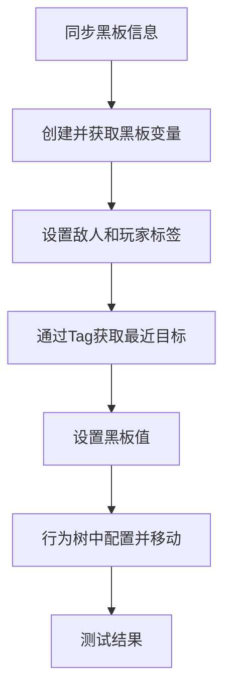

___________________________________________________________________________________________
###### [Go主菜单](../MainMenu.md)
___________________________________________________________________________________________

# GAS 077 通过服务获取黑板中的变量；设置黑板中的值
___________________________________________________________________________________________

## 处理关键点

1. 设置黑板中的值API：
   - `UBTFunctionLibrary::SetBlackboardValueAsObject`
2. Actor的源码有一个好用的直接获取距离的API：
   - `float GetDistanceTo(const AActor* OtherActor)`

___________________________________________________________________________________________

# 目录


- [GAS 077 通过服务获取黑板中的变量；设置黑板中的值](#gas-077-通过服务获取黑板中的变量设置黑板中的值)
  - [处理关键点](#处理关键点)
- [目录](#目录)
    - [Mermaid整体思路梳理](#mermaid整体思路梳理)
    - [Tip：信息在所有黑板之间同步](#tip信息在所有黑板之间同步)
    - [黑板中默认会有一个 `SelfActor` 的变量](#黑板中默认会有一个-selfactor-的变量)
    - [现在需要在黑板中 创建 `目标对象` 与 `目标的距离` 两个变量](#现在需要在黑板中-创建-目标对象-与-目标的距离-两个变量)
    - [C++中 获取 黑板值 (但是需要在行为树中配置)](#c中-获取-黑板值-但是需要在行为树中配置)
    - [现在我们需要判断玩家和敌人类](#现在我们需要判断玩家和敌人类)
    - [为敌人基类和角色设置标签](#为敌人基类和角色设置标签)
    - [BTService\_FindNearestPlayer 中 获取对立阵营的 Tag，然后通过 Tag 获取 Actors](#btservice_findnearestplayer-中-获取对立阵营的-tag然后通过-tag-获取-actors)
    - [行为树的服务中 配置黑板中的变量](#行为树的服务中-配置黑板中的变量)
    - [测试结果](#测试结果)
    - [我们需要让敌人在获取Actors的时候对比每个距离，然后获取最近距离的Actor](#我们需要让敌人在获取actors的时候对比每个距离然后获取最近距离的actor)
    - [最后设置黑板值，调用黑板函数库中的API：](#最后设置黑板值调用黑板函数库中的api)
    - [此时运行测试，可以看到黑板中的值](#此时运行测试可以看到黑板中的值)
    - [行为树添加MoveTo节点](#行为树添加moveto节点)
    - [测试结果gif](#测试结果gif)


___________________________________________________________________________________________

<details>
<summary>视频链接</summary>

[4. Blackboard Keys_哔哩哔哩_bilibili](https://www.bilibili.com/video/BV1JD421E7yC?p=164&vd_source=9e1e64122d802b4f7ab37bd325a89e6c)

[5. Finding the Nearest Player_哔哩哔哩_bilibili](https://www.bilibili.com/video/BV1JD421E7yC?p=165&vd_source=9e1e64122d802b4f7ab37bd325a89e6c)

------

</details>

___________________________________________________________________________________________

### Mermaid整体思路梳理

Mermaid


___________________________________________________________________________________________

### Tip：信息在所有黑板之间同步

> 

------

### 黑板中默认会有一个 `SelfActor` 的变量

> 
>
> - ### 如果想 `获取黑板变量` 需要创建一个 `BlackboardKeySelector`
>
> - ### 且需要 扣开眼睛
>
> 
>
> - ### 之后就可以在这里配置获取变量
>
> 
>
> - ### 测试获取变量
>
> 
>
> 
>
> 

------

### 现在需要在黑板中 创建 `目标对象` 与 `目标的距离` 两个变量

> #### 创建两个变量：
>
> - #### `TargetToFollow` 目标对象
>
> - #### `DistanceToTarget` 与目标的距离
>
>
> 

------

### C++中 获取 黑板值 (但是需要在行为树中配置)

> ### 创建两个获取黑板值的类型变量
>
> - #### `FBlackboardKeySelector` 类
>
>   - #### `TargetToFollowSelector` 目标对象
>
>   - #### `DistanceToTargetSelector`与目标对象的距离
>
> - #### 蓝图可读，编辑器可编辑
>
> 

------

### 现在我们需要判断玩家和敌人类

> - #### 后续可能会有随从或者别的不继承自敌人类的，敌人是否也可以攻击，或者敌人之间能不能相互攻击？
>
>- #### 解决方法是使用引擎中的 `FName` 的 `Tag`

------

### 为敌人基类和角色设置标签

> - #### `敌人基类` —— `Enemy`
>
> - #### `玩家角色` —— `Player`
>
> 

------

### BTService_FindNearestPlayer 中 获取对立阵营的 Tag，然后通过 Tag 获取 Actors

> - ### 如果目标有 `Tag`
>
>   - #### 用 三目运算符 获取 `Tag`
>
>   - #### 判断 `AIOwner->GetPawn()` 的 `Tag`
>
>     
>
> - #### 如果拿到 `Tag` 直接暴力获取使用API：`UGameplayStatics::GetAllActorsWithTag` ，然后打印
>
>   
>   
>   ```CPP
>   void UBTService_FindNearestPlayer::TickNode(UBehaviorTreeComponent& OwnerComp, uint8* NodeMemory, float DeltaSeconds)
>   {
>       Super::TickNode(OwnerComp, NodeMemory, DeltaSeconds); /*运行蓝图逻辑*/
>               
>       if (const APawn* OwnerPawn = AIOwner->GetPawn())
>       {
>          //拿到对立阵营的Tag
>          const FName Tag = OwnerPawn->ActorHasTag(FName("Player")) ? FName("Enemy") : FName("Player");
>          TArray<AActor*> OutActors;
>          UGameplayStatics::GetAllActorsWithTag(OwnerPawn, Tag, OutActors);
>          for (const AActor* ActorHasTag : OutActors)
>          {
>             GEngine->AddOnScreenDebugMessage(-1,0.5f,FColor::Red,FString::Printf(TEXT("ActorHasTag%s"),*ActorHasTag->GetName()));
>          }
>       }
>   }
>   ```
>

------

### 行为树的服务中 配置黑板中的变量

> 

------

### 测试结果

> 

------

### 我们需要让敌人在获取Actors的时候对比每个距离，然后获取最近距离的Actor

> 
>
> ```cpp
> void UBTService_FindNearestPlayer::TickNode(UBehaviorTreeComponent& OwnerComp, uint8* NodeMemory, float DeltaSeconds)
> {
>     Super::TickNode(OwnerComp, NodeMemory, DeltaSeconds); /*运行蓝图逻辑*/
> 
>     if (const APawn* OwnerPawn = AIOwner->GetPawn())
>     {
>        //拿到对立阵营的Tag
>        const FName Tag = OwnerPawn->ActorHasTag(FName("Player")) ? FName("Enemy") : FName("Player");
>        TArray<AActor*> OutActors;
>        UGameplayStatics::GetAllActorsWithTag(OwnerPawn, Tag, OutActors);
>        float Distance = TNumericLimits<float>::Max();/*等于最大值*/
>        AActor* ClosedActor = nullptr;
>        for (AActor* ActorHasTag : OutActors)
>        {
>           GEngine->AddOnScreenDebugMessage(-1,0.5f,FColor::Red,FString::Printf(TEXT("ActorHasTag%s"),*ActorHasTag->GetName()));
>           if (IsValid(ActorHasTag))
>           {
>              //获取最近的目标
>              if (Distance > OwnerPawn->GetDistanceTo(ActorHasTag))
>              {
>                 Distance = OwnerPawn->GetDistanceTo(ActorHasTag);
>                 ClosedActor = ActorHasTag;
>              }
>           }
>        }
>     }
> }
> ```

------

### 最后设置黑板值，调用黑板函数库中的API：

> - #### `UBTFunctionLibrary::SetBlackboardValueAsObject`
>
> - #### `UBTFunctionLibrary::SetBlackboardValueAsFloat`
>
> 

------

### 此时运行测试，可以看到黑板中的值

> 

------

### 行为树添加MoveTo节点

> 

------

### 测试结果gif

> ### 可以看到敌人在火中也会掉血
>
> 


___________________________________________________________________________________________

[返回最上面](#Go主菜单)

___________________________________________________________________________________________