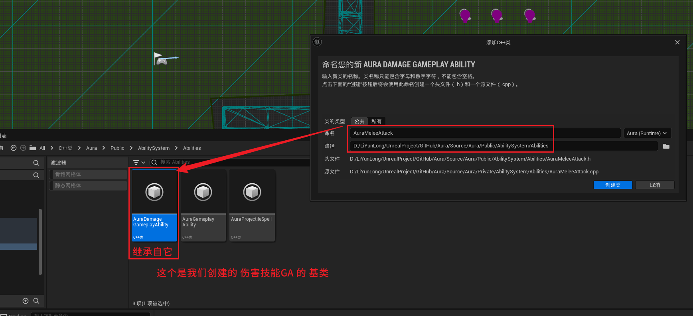
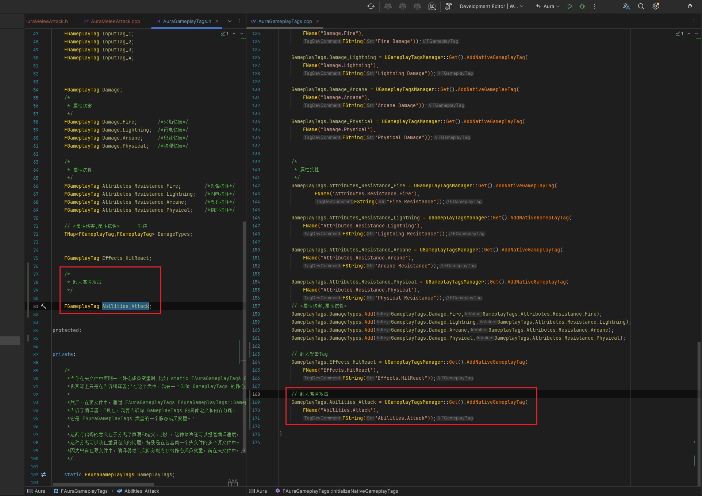
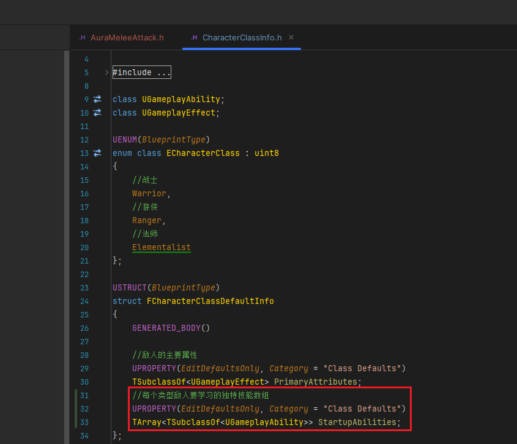
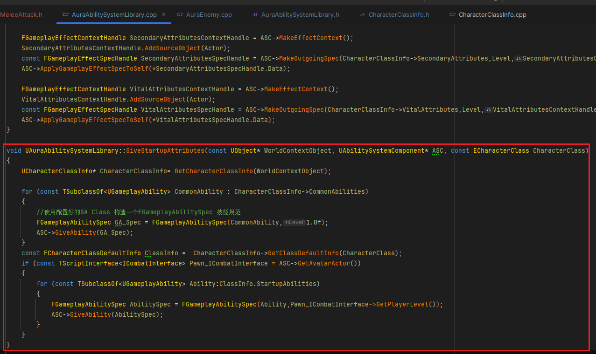
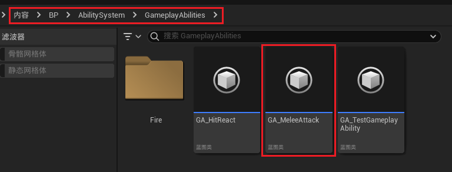
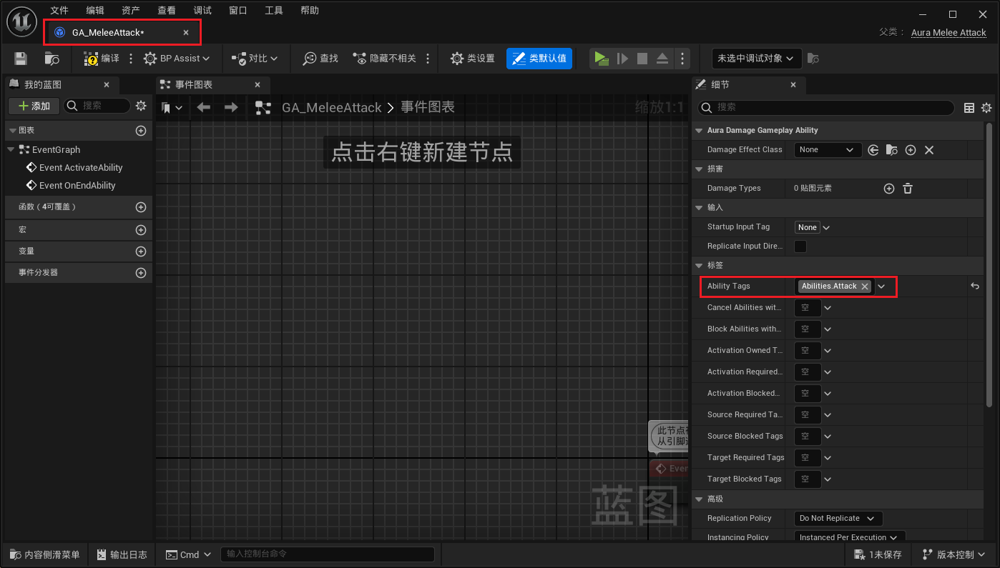
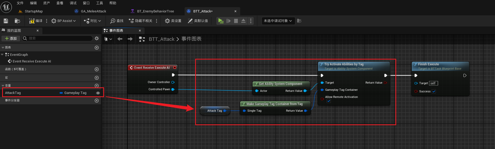
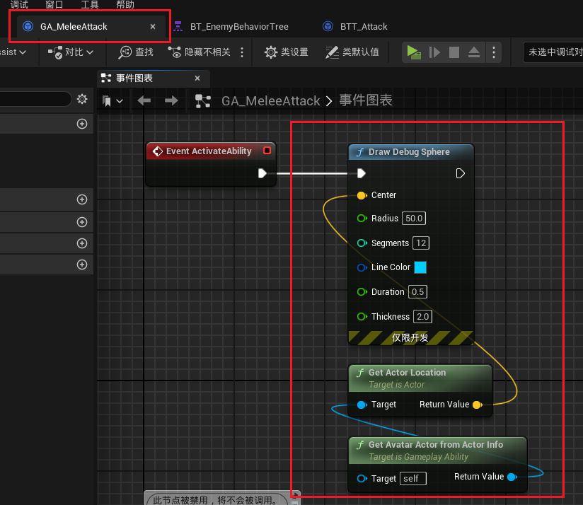
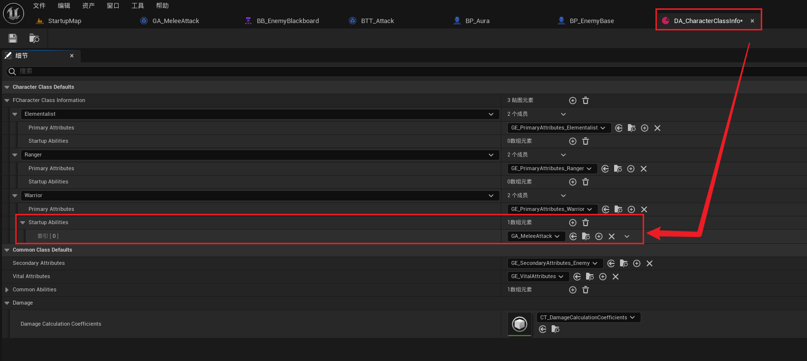

<details>
<summary>过程截图</summary>

>

------

</details>


+ `头文件`中：
```cpp
这里是头文件代码这里是头文件代码这里是头文件代码这里是头文件代码这里是头文件代码这里是头文件代码
```

+ `源文件`中：
```cpp
这里是源文件代码这里是源文件代码这里是源文件代码这里是源文件代码这里是源文件代码这里是源文件代码
```

[Mermaid格式参考](https://github.com/liyunlong618/LiYunLongKnowledgeLibrary/blob/main/Mermaid%E6%A0%BC%E5%BC%8F%E5%8F%82%E8%80%83.md)

[预览](https://github.com/liyunlong618/LiYunLongKnowledgeLibrary/tree/main/UECPP/Models/GAS/GAS_2_Aura)


___________________________________________________________________________________________
###### [Go主菜单](../MainMenu.md)
___________________________________________________________________________________________

# GAS 084 敌人行为树触发GA攻击

___________________________________________________________________________________________

## 处理关键点

1. 111111111111111111111111111111

2. 222222222222222222222222222

3. 33333333333333333333333333

4. 4444444444444444444444444444

5. 555555555555555555555555555555

6. 666666666666666666666666666

7. 77777777777777777777777777777777

___________________________________________________________________________________________

# 目录


[TOC]


___________________________________________________________________________________________

<details>
<summary>视频链接</summary>

[1. Melee Attack Ability_哔哩哔哩_bilibili](https://www.bilibili.com/video/BV1JD421E7yC?p=175&vd_source=9e1e64122d802b4f7ab37bd325a89e6c)

------

</details>

___________________________________________________________________________________________

### Mermaid整体思路梳理

Mermaid

___________________________________________________________________________________________

### 创建敌人普攻GA，文件夹下继承自 Damage

> - #### 在 `Aura/Public/AbilitySystem/Abilities/` 文件夹下创建 GA 
>
> - #### 继承自 `AuraDamageGameplayAbility`
>
> - #### 命名为 `AuraMeleeAttack`
>
> 
>

------

### 添加用于触发普攻的Tag

> - #### 命名为 `Abilities_Attack`
>
> 

------

### 在info中添加每个类型敌人要学习技能的数组

> 
>
> ```cpp
> //每个类型敌人要学习的独特技能数组
> UPROPERTY(EditDefaultsOnly, Category = "Class Defaults")
> TArray<TSubclassOf<UGameplayAbility>> StartupAbilities;
> ```

------

### 敌人学习技能时一并学习了

> 1. #### 首先需要获取 `UCharacterClassInfo` 中的 `FCharacterClassDefaultInfo` 结构体，就需要调用自建的 `GetClassDefaultInfo` 函数
>
> 2. #### 而 `GetClassDefaultInfo` 函数需要传入一个敌人类型，所以蓝图函数库中的这个静态函数，需要多传一个参数
>
> 3. #### 需要学习技能，使用敌人的等级，可以使用之前的接口 `ICombatInterface`
>
> 
>
> ```cpp
> void UAuraAbilitySystemLibrary::GiveStartupAttributes(const UObject* WorldContextObject, UAbilitySystemComponent* ASC, const ECharacterClass CharacterClass)
> {
>     UCharacterClassInfo* CharacterClassInfo= GetCharacterClassInfo(WorldContextObject);
> 
>     for (const TSubclassOf<UGameplayAbility> CommonAbility : CharacterClassInfo->CommonAbilities)
>     {
>        //使用配置好的GA Class 构造一个FGameplayAbilitySpec 技能规范
>        FGameplayAbilitySpec GA_Spec = FGameplayAbilitySpec(CommonAbility,1.0f);
>        ASC->GiveAbility(GA_Spec);
>     }
>     const FCharacterClassDefaultInfo ClassInfo =  CharacterClassInfo->GetClassDefaultInfo(CharacterClass);
>     if (const TScriptInterface<ICombatInterface> Pawn_ICombatInterface = ASC->GetAvatarActor())
>     {
>        for (const TSubclassOf<UGameplayAbility> Ability:ClassInfo.StartupAbilities)
>        {
>           FGameplayAbilitySpec AbilitySpec = FGameplayAbilitySpec(Ability,Pawn_ICombatInterface->GetPlayerLevel());
>           ASC->GiveAbility(AbilitySpec);
>        }
>     }
> }
> ```

------

### 创建 `GA蓝图继承类`  并配置 `Tag`

> - #### 在 `Content/BP/GameplayAbilities/AbilitySystem/` 文件夹下
>
> - #### 命名为 ***GA_MeleeAttack***
>
> - #### 配置 `Tag`
>
> 

------

### 行为树中调用 `根据Tag触发GA` ，GA中生成调试

> 
>
> ## 其实就相当于把原来行为树中的逻辑挪到ga中触发

### 在Info中配置要学的技能！！！不然东西学，放不了

> 


___________________________________________________________________________________________

[返回最上面](#Go主菜单)

___________________________________________________________________________________________