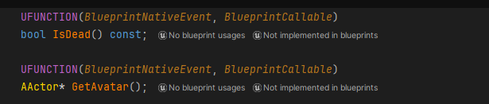
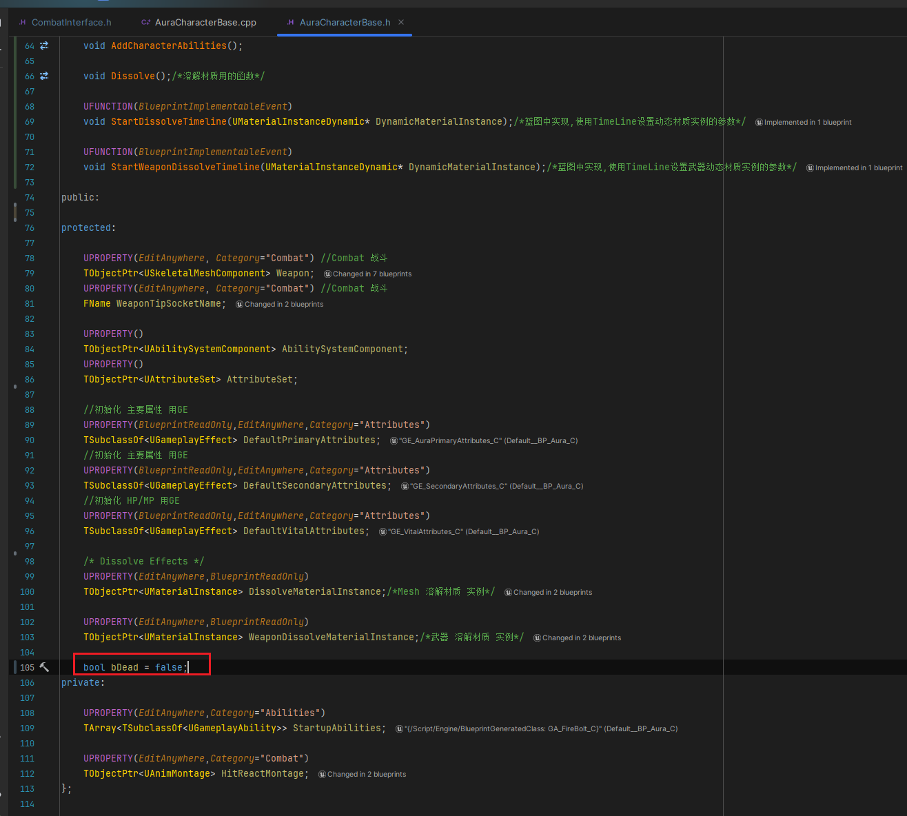
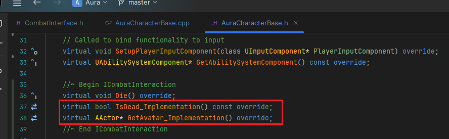
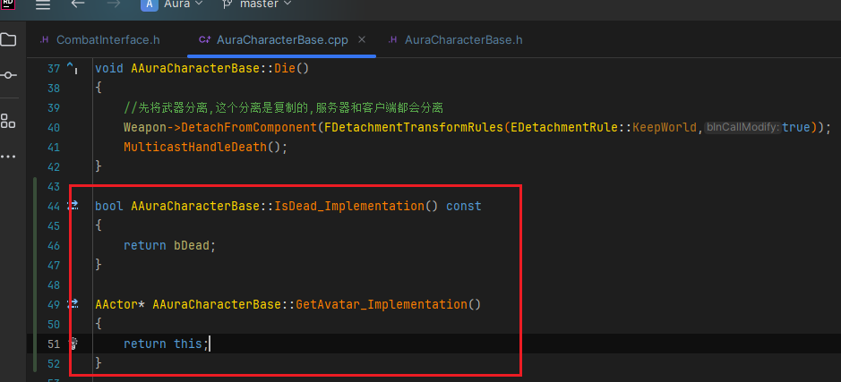
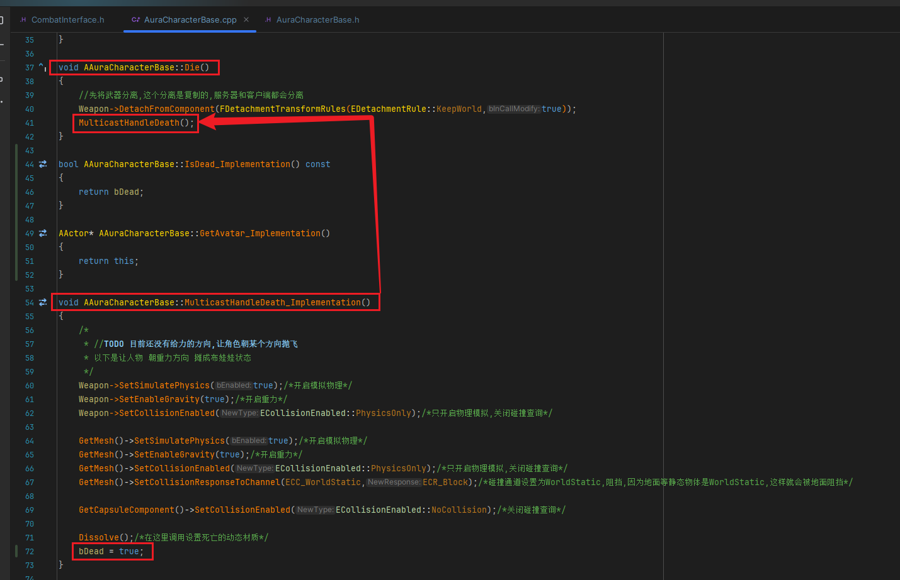
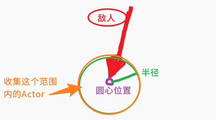

<details>
<summary>过程截图</summary>

>

------

</details>


+ `头文件`中：
```cpp
这里是头文件代码这里是头文件代码这里是头文件代码这里是头文件代码这里是头文件代码这里是头文件代码
```

+ `源文件`中：
```cpp
这里是源文件代码这里是源文件代码这里是源文件代码这里是源文件代码这里是源文件代码这里是源文件代码
```

[Mermaid格式参考](https://github.com/liyunlong618/LiYunLongKnowledgeLibrary/blob/main/Mermaid%E6%A0%BC%E5%BC%8F%E5%8F%82%E8%80%83.md)

[预览](https://github.com/liyunlong618/LiYunLongKnowledgeLibrary/tree/main/UECPP/Models/GAS/GAS_2_Aura)


___________________________________________________________________________________________
###### [Go主菜单](../MainMenu.md)
___________________________________________________________________________________________

# GAS 087在敌人攻击时，将目标地点半径内的Actors加入数组

___________________________________________________________________________________________

## 处理关键点

1. 111111111111111111111111111111

2. 222222222222222222222222222

3. 33333333333333333333333333

4. 4444444444444444444444444444

5. 555555555555555555555555555555

6. 666666666666666666666666666

7. 77777777777777777777777777777777

___________________________________________________________________________________________

# 目录


[TOC]


___________________________________________________________________________________________

<details>
<summary>视频链接</summary>

[5. Get Live Players Within Radius_哔哩哔哩_bilibili](https://www.bilibili.com/video/BV1JD421E7yC?p=179&vd_source=9e1e64122d802b4f7ab37bd325a89e6c)

------

</details>

___________________________________________________________________________________________

### Mermaid整体思路梳理

Mermaid

___________________________________________________________________________________________

### 下面我们需要在敌人攻击时，以目标地点为半径，获取Actors数组

> 这个比较常用，比如可以批量的应用某种GE，这个涉及到查询相关的知识
>
> - 需要忽略一部分 Actor，比如忽略自身；或者敌人使用时，忽略同一阵营时；或者忽略已经死了的 Pawn

### 打算写到蓝图函数库里，方便调用获取

## 先处理死亡

### 先在接口中创建查询死亡和返回自身的函数

> 
>
> ```cpp
> UFUNCTION(BlueprintNativeEvent, BlueprintCallable)
> bool IsDead() const;
> 	
> UFUNCTION(BlueprintNativeEvent, BlueprintCallable)
> AActor* GetAvatar();
> ```
>
> 下面这个不用const的原因是，角色不是AActor，会发生隐式类型转换

------

### 角色标记没有死亡的变量，创建一个bool

> 
>
> ```cpp
> protected:
>     
>     bool bDead = false;
> ```

------

### 角色基类中重写 ，接口函数打好备注

> 
>
> ```cpp
> public:
>     
>     //~ Begin ICombatInteraction
>     virtual bool IsDead_Implementation() const override;
>     virtual AActor* GetAvatar_Implementation() override;
>     //~ End ICombatInteraction
> ```
>
> ```cpp
> bool AAuraCharacterBase::IsDead_Implementation() const
> {
>     return bDead;
> }
> 
> AActor* AAuraCharacterBase::GetAvatar_Implementation()
> {
>     return this;
> }
> ```

------

### 死亡变量无需复制

> #### 死亡时调用 `RPC_Client`
>
> #### `RPC_Client` 调用时设置 `bDead = true;`
>
> 

------

### 蓝图函数库中创建要用的函数

> #### 示意图
>
> 
>
> ### 需要这样几个参数：
>
> - #### 一个世界上下文
>
> - #### 一个外部传入在函数内部修改之后返回的数组
>
> - #### 一个外部传参的数组
>
> - #### 一个半径
>
> - #### 一个中心
>
> #### 命名为 `GetLivePlayersWithinRadius`
>
> ```cpp
> UFUNCTION(BlueprintCallable, Category = "AuraAbilitySystemLibrary|GameplayMechanics")
> static void GetLivePlayersWithinRadius(const UObject* WorldContextObject,TArray<AActor*> & OverlapActors, const TArray<AActor*> & IgnoreActors,float Radius,FVector PointCenter);
> ```

------

<details>
<summary>实现需要参考引擎的函数 ApplyRadialDamageWithFalloff </summary>


>#### 需要参考的函数： `ApplyRadialDamageWithFalloff`
>
>
>
>
>
>参数解释
>
>- 结构体：FCollisionQueryParams
>  - 结构体添加忽略的Actors数组
>
>- 创建了一个TArray<FOverlapResult> Overlaps 保存重叠结果
>
>- 获取世界上下文，如果没有会报错
>
>- 然后使用UWorld调用了World->OverlapMultiByObjectType
>
>- Origin 球形的原点
>
>- 球体旋转
>
>- 碰撞对象查询：动态
>
>- 创建球体碰撞，需要传入半径
>
>- 最后 遍历 重叠的结果数组，通过 Overlap.GetActor() 拿到碰撞检测到的Actor
>- 使用函数，检查目标对象是否实现了接口

------

</details>

------

### 重叠检测步骤

> 1.创建 添加忽略 Actors 用 结构体：FCollisionQueryParams，
>
> 2.创建保存检测重叠结果 TArray<FOverlapResult> Overlaps 
>
> 3.获取 UWorld 调用了 World->OverlapMultiByObjectType
>
> 4.遍历重叠检测结果，如果符合要求就存入数组
>
> 函数实现

------

### 蓝图中调用

> 

------

### 此时站在火堆旁边，崩溃了

> ### 所以静态函数不允许我们检查任何未实现该接口的调用，就是下面的函数(需要问chatgpt)
>
> ### 此时有两种处理方案：
>
> - #### 一种是使用 cast 或者 if 
>
> - #### 因为 if 判断(如果有两个条件)是先判断前面的条件后判断后面的条件，如果前面的条件为 false ，则不执行后面的条件
>
>   所以可以先使用 `Implements` 判断，因为这个如果是空的会返回 `false` ，就 `不会执行到第二个条件` 的检查 `调用`
>
>   - 比如这样处理

------

### 此时可以站在敌人旁边进行测试gif

> - 不崩溃了OK
>
>   


___________________________________________________________________________________________

[返回最上面](#Go主菜单)

___________________________________________________________________________________________