<details>
<summary>过程截图</summary>

>

------

</details>


+ `头文件`中：
```cpp
这里是头文件代码这里是头文件代码这里是头文件代码这里是头文件代码这里是头文件代码这里是头文件代码
```

+ `源文件`中：
```cpp
这里是源文件代码这里是源文件代码这里是源文件代码这里是源文件代码这里是源文件代码这里是源文件代码
```

[Mermaid格式参考](https://github.com/liyunlong618/LiYunLongKnowledgeLibrary/blob/main/Mermaid%E6%A0%BC%E5%BC%8F%E5%8F%82%E8%80%83.md)

[预览](https://github.com/liyunlong618/LiYunLongKnowledgeLibrary/tree/main/UECPP/Models/GAS/GAS_2_Aura)


___________________________________________________________________________________________
###### [Go主菜单](../MainMenu.md)
___________________________________________________________________________________________

# GAS 092 为食尸鬼配置攻击；受击时打断自身别的Tag比如攻击；解决敌人之间会互相攻击的bug；为食尸鬼添加溶解材质；AI避障的相关配置

___________________________________________________________________________________________

## 处理关键点

1. 111111111111111111111111111111

2. 222222222222222222222222222

3. 33333333333333333333333333

4. 4444444444444444444444444444

5. 555555555555555555555555555555

6. 666666666666666666666666666

7. 77777777777777777777777777777777

___________________________________________________________________________________________

# 目录


[TOC]


___________________________________________________________________________________________

<details>
<summary>视频链接</summary>

[12. Ghoul Attack Montages_哔哩哔哩_bilibili](https://www.bilibili.com/video/BV1JD421E7yC?p=186&vd_source=9e1e64122d802b4f7ab37bd325a89e6c)

[13. Melee Polish_哔哩哔哩_bilibili](https://www.bilibili.com/video/BV1JD421E7yC/?p=187&spm_id_from=pageDriver&vd_source=9e1e64122d802b4f7ab37bd325a89e6c)

------

</details>

___________________________________________________________________________________________

### Mermaid整体思路梳理

Mermaid

___________________________________________________________________________________________

### 为食尸鬼创建攻击的蒙太奇，并在蓝图中配置与蒙太奇绑定的 `GameplayTag`

> 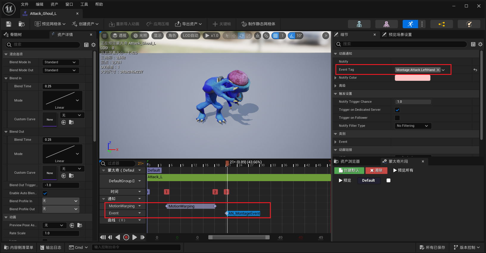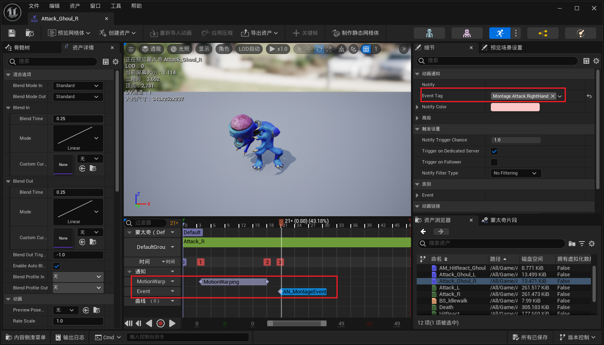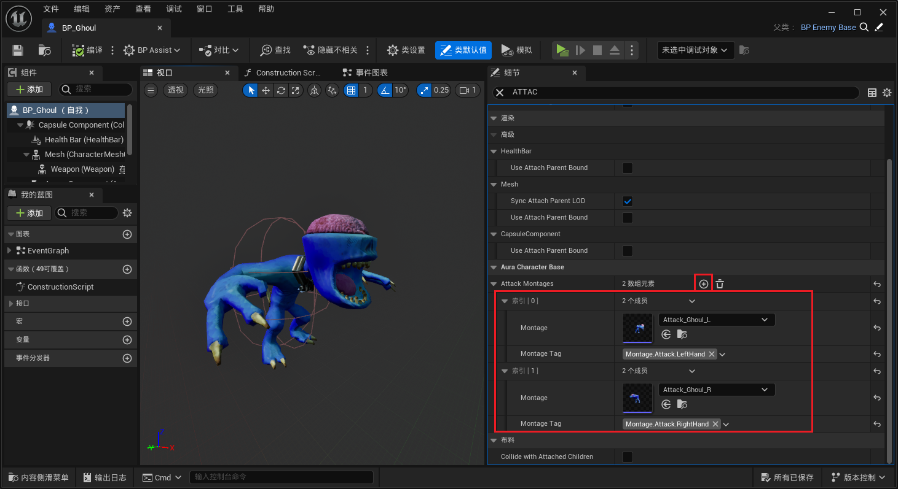

------

### 此时有个bug，食尸鬼的Motion Warping失效了好像，攻击时没有旋转，而且随机是，不能每次都调用随机，而是调用随机生成变量，然后后续使用这个变量；而且攻击一次之后就不攻击了

> - 检查发现是root运动没有打开
>
> - 需要在别的情况下也 `EndAbility`

------

### 解决bug：

> - 随机后保存变量
>
> 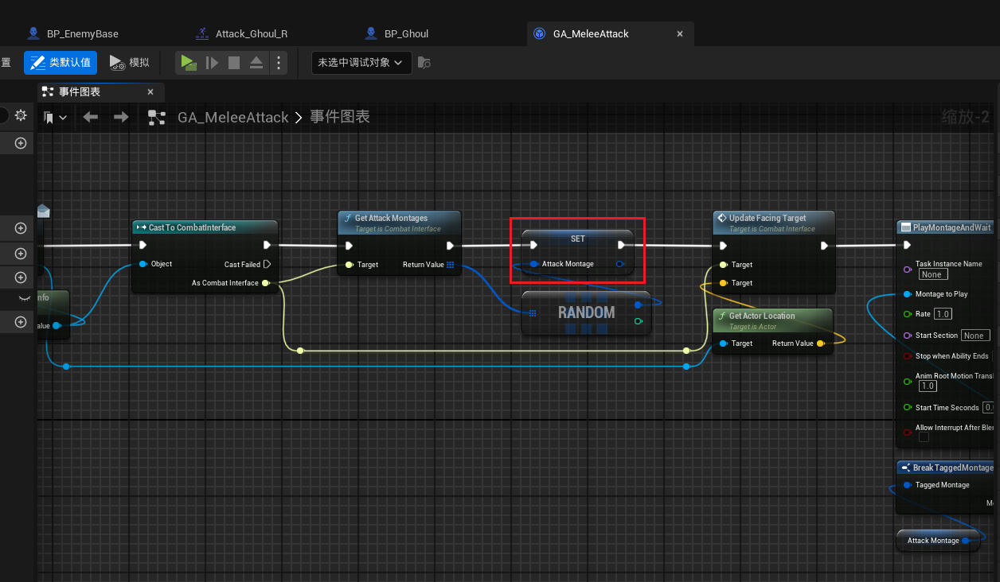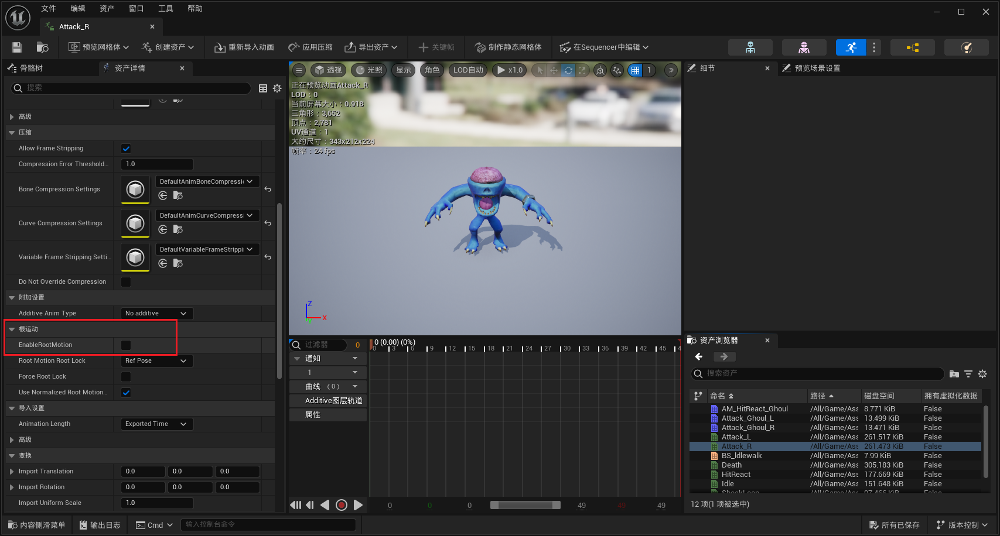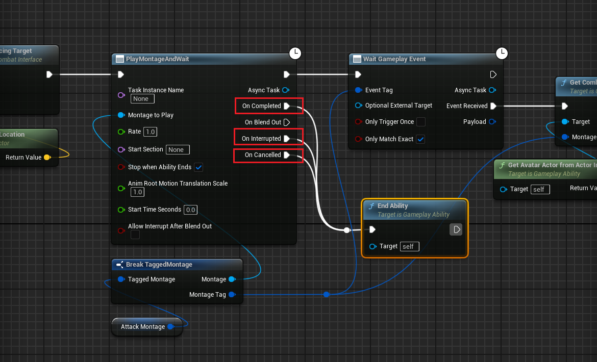

------

### 当敌人受到攻击时也需要打断自身的，比如攻击的Tag

> 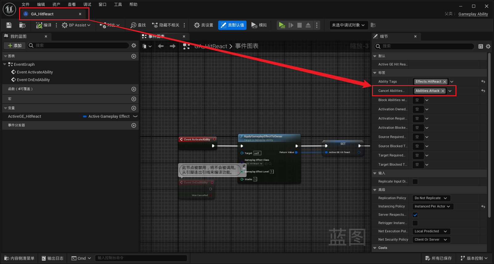

------

### 现在有一个bug是，敌人会互相攻击到彼此，还有就是需要调整一下大怪物的碰撞Capsule，让他大一些

> 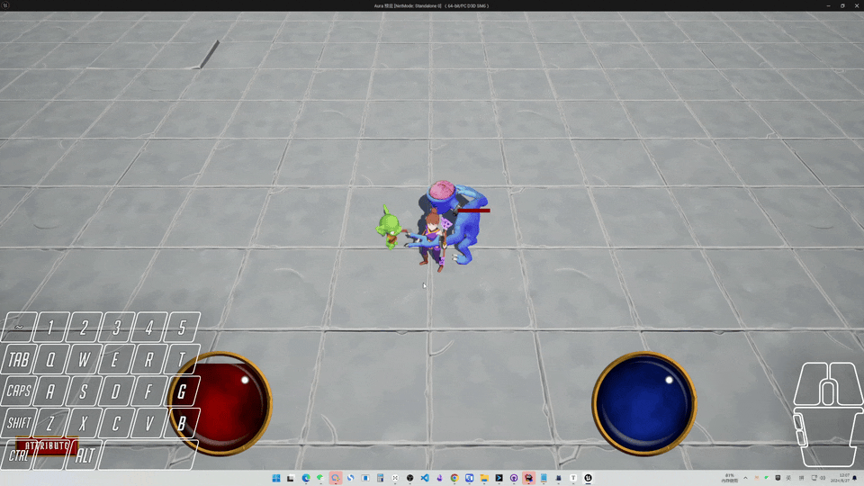

------

## 下面是下一节

------

### 先解决敌人之间会互相攻击的bug

> - #### 原因是敌人攻击时获得范围内的Actors没有检查是否为敌对阵营，直接就造成了伤害，应用了GE，所以需要判断类型。检查是否为敌对阵营，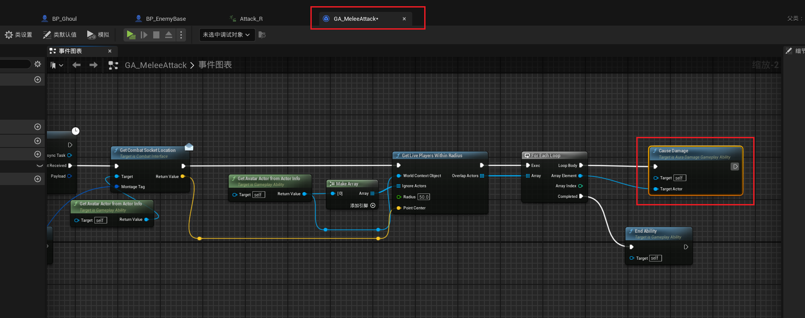
>
> - #### 需要进行类似这种的检查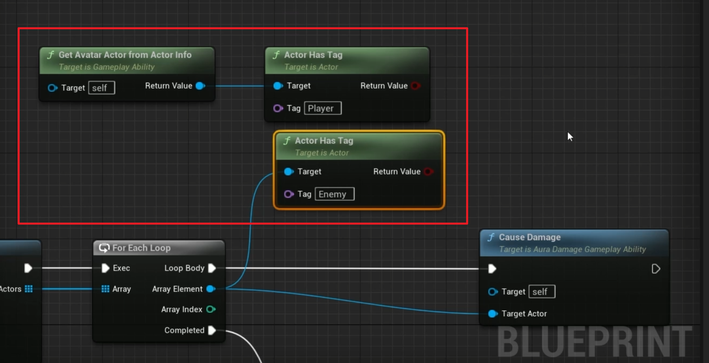

------

### 为了使用方便，就在蓝图函数库中创建判断是否为同一阵营的函数

> ```cpp
> UFUNCTION(BlueprintPure, Category = "AuraAbilitySystemLibrary|GameplayMechanics")
> static bool IsNotFriend(const AActor* FirstActor,const AActor* SecondActor);
> ```
>
> ```cpp
> bool UAuraAbilitySystemLibrary::IsNotFriend(const AActor* FirstActor, const AActor* SecondActor)
> {
> 	const bool bBothPlayer = FirstActor->ActorHasTag(FName("Player")) && SecondActor->ActorHasTag(FName("Player"));
> 	const bool bBothEnemy = FirstActor->ActorHasTag(FName("Enemy")) && SecondActor->ActorHasTag(FName("Enemy"));
> 	if (bBothPlayer || bBothEnemy)
> 	{
> 		return false;
> 	}
> 	return true;
> }
> ```
>
> 
>
> #### 刚开始这么写，我觉得还是有点怪，觉得可能是因为目前只有Player和Enemy但是，希望多一些情况所以才在这里写了这样的逻辑。
>
> 后来发现是因为没有办法获取Actor的Tag标签，hhh

------

### 蓝图中调用

> 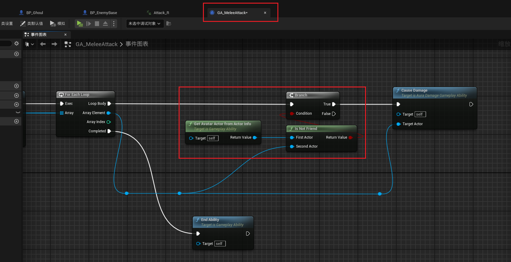

------

### 此时测试gif敌人之间不会互相攻击了

> 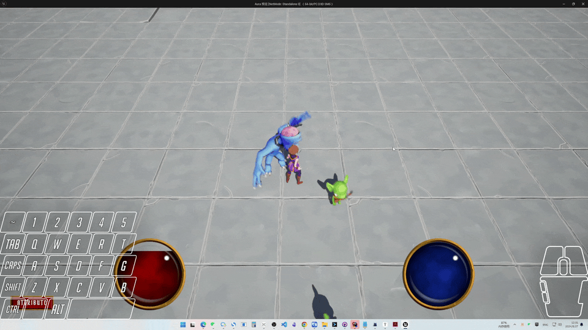

------

### 这个时候希望测试敌人的死亡，希望把敌人的血量调的少一些

> - #### 看下目前影响敌人HP的地方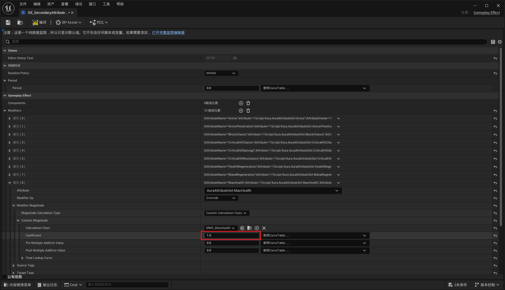
>
> - #### 把这里的 Coefficient设置为0.25就可以影响敌人了
>
>   - #### 前提是和玩家用的不是一个次要属性GE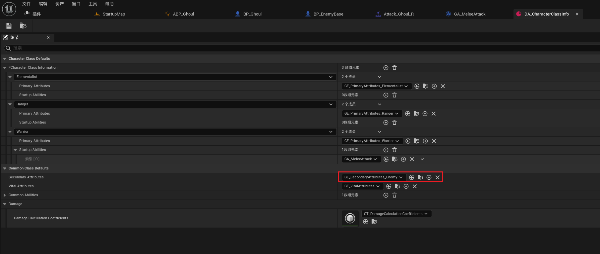

------

### 此时测试gif，敌人更容易Die了

> 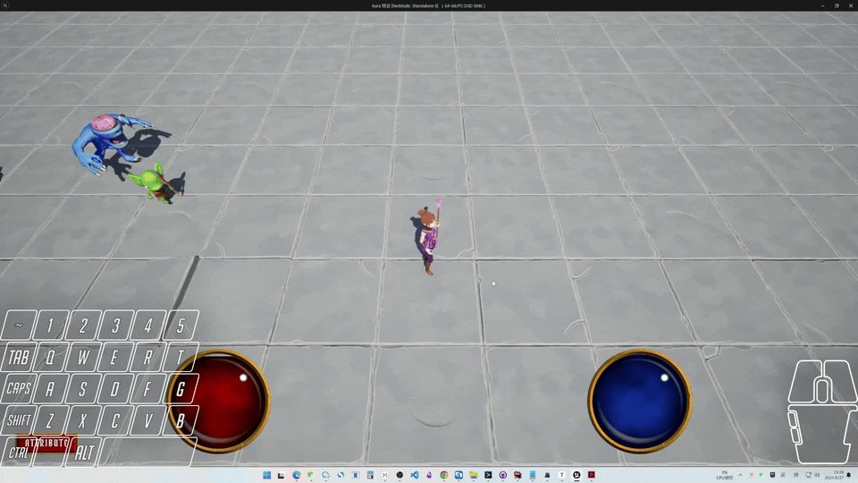
>
> ## 但是食尸鬼死亡后，没有溶解材质效果

------


<details>
<summary>为食尸鬼死亡时创建溶解效果</summary>

>- ### 食尸鬼身上配置动态材质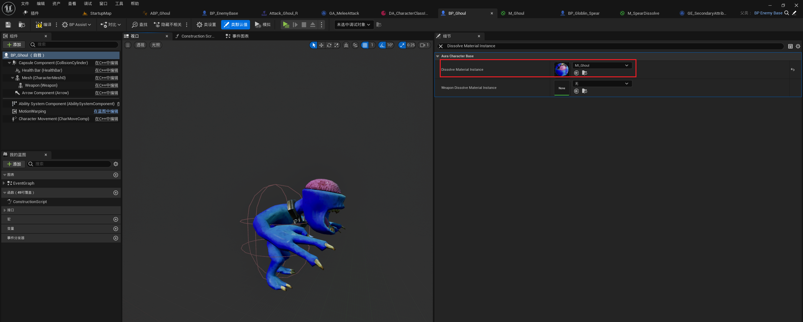

------

</details>

### 此时效果gif，食尸鬼溶解材质正常生效

> 

------

### AI用的避障(了解用)

> 下面 AI用的避障 只是了解用，项目中没有使用：
>
> - ### 此时如果在敌人基类中设置打开 `Use RVO Avoidance`
>
>   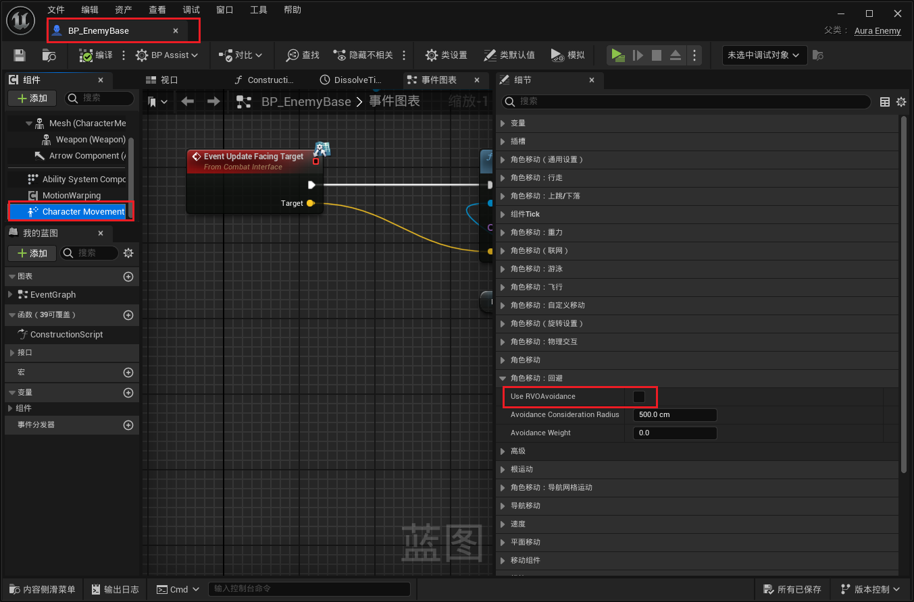
>
> - ### 如果开了这个还需要打开 `运动时转向目标方向`  `Orient Rotation to Movement`
>
>   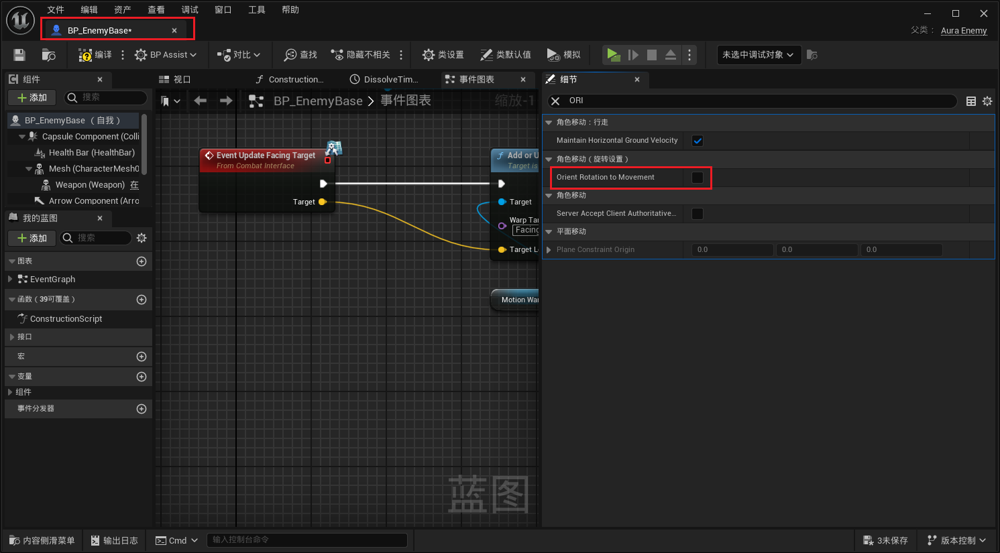
>   
>   - 这个选项是AI用的避障功能，可以用
>
>
>  - 比如把敌人数量调多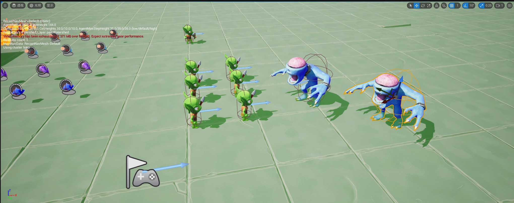
>
>
> - ### 测试gif，敌人之间会彼此绕开

------

> ### 接下来要处理远程武器攻击的武器变形，比如，敌人使用弹弓和弓箭攻击，涉及到需要变形，后面会处理这个


___________________________________________________________________________________________

[返回最上面](#Go主菜单)

___________________________________________________________________________________________