<details>
<summary>过程截图</summary>

>

------

</details>


+ `头文件`中：
```cpp
这里是头文件代码这里是头文件代码这里是头文件代码这里是头文件代码这里是头文件代码这里是头文件代码
```

+ `源文件`中：
```cpp
这里是源文件代码这里是源文件代码这里是源文件代码这里是源文件代码这里是源文件代码这里是源文件代码
```

[Mermaid格式参考](https://github.com/liyunlong618/LiYunLongKnowledgeLibrary/blob/main/Mermaid%E6%A0%BC%E5%BC%8F%E5%8F%82%E8%80%83.md)

[预览](https://github.com/liyunlong618/LiYunLongKnowledgeLibrary/tree/main/UECPP/Models/GAS/GAS_2_Aura)


___________________________________________________________________________________________
###### [Go主菜单](../MainMenu.md)
___________________________________________________________________________________________

# GAS 103 为萨满制作召唤技能(3)创建召唤技能GA并计算生成位置

___________________________________________________________________________________________

## 处理关键点

1. 111111111111111111111111111111

2. 222222222222222222222222222

3. 33333333333333333333333333

4. 4444444444444444444444444444

5. 555555555555555555555555555555

6. 666666666666666666666666666

7. 77777777777777777777777777777777

___________________________________________________________________________________________

# 目录


- [GAS 103 为萨满制作召唤技能(3)创建召唤技能GA并计算生成位置](#gas-103-为萨满制作召唤技能3创建召唤技能ga并计算生成位置)
  - [处理关键点](#处理关键点)
  - [目录](#目录)
    - [Mermaid整体思路梳理](#mermaid整体思路梳理)
    - [为萨满创建召唤技能](#为萨满创建召唤技能)
      - [在这个路径下创建新的技能，继承自 AuraGameplayAbility，命名为 `AuraSummonAbility`，这个是召唤技能的基类](#在这个路径下创建新的技能继承自-auragameplayability命名为-aurasummonability这个是召唤技能的基类)
      - [创建函数，外部获取释放技能后需要生成的小兵的位置，需要返回一个FVector数组](#创建函数外部获取释放技能后需要生成的小兵的位置需要返回一个fvector数组)
      - [创建一些需要配置的技能相关的变量](#创建一些需要配置的技能相关的变量)
      - [`GetSpawnLocations` 函数中](#getspawnlocations-函数中)
        - [先获取角色(萨满)向前的向量](#先获取角色萨满向前的向量)
        - [然后获取角色(萨满)位置](#然后获取角色萨满位置)
        - [使用API `RotateAngleAxis` 获取，左右旋转后的向量](#使用api-rotateangleaxis-获取左右旋转后的向量)
        - [然后使用Debug画箭头](#然后使用debug画箭头)
        - [先返回一个空的 FVector数组 测试](#先返回一个空的-fvector数组-测试)
        - [放一下完整函数体代码](#放一下完整函数体代码)
    - [创建蓝图子类](#创建蓝图子类)
      - [在 `BeginPlay` 时连上节点，暂时配置技能标签为Attack](#在-beginplay-时连上节点暂时配置技能标签为attack)
      - [在 `CharacterInfo` 数据资产中配置角色技能](#在-characterinfo-数据资产中配置角色技能)
    - [可以在这里配置技能参数](#可以在这里配置技能参数)
      - [场景中拖入萨满，测试一下](#场景中拖入萨满测试一下)
    - [接下来分别在技能的最大最小距离生成球体，像下图这样](#接下来分别在技能的最大最小距离生成球体像下图这样)
    - [接下来需要创建for循环，在每条分割线上生成 Debug箭头最近/最远点生成 DebugSphere](#接下来需要创建for循环在每条分割线上生成-debug箭头最近最远点生成-debugsphere)
    - [接下来需要生成随机位置，并添加到一个临时数组，并返回](#接下来需要生成随机位置并添加到一个临时数组并返回)
    - [这次换到蓝图Debug测试一下](#这次换到蓝图debug测试一下)
    - [修改参数后再测试](#修改参数后再测试)
    - [测试一下](#测试一下)
    - [测试完记得复原](#测试完记得复原)


___________________________________________________________________________________________

<details>
<summary>视频链接</summary>

[16. Shaman Summon Locations_哔哩哔哩_bilibili](https://www.bilibili.com/video/BV1TH4y1L7NP?p=17&vd_source=9e1e64122d802b4f7ab37bd325a89e6c)

------

</details>

___________________________________________________________________________________________

### Mermaid整体思路梳理

Mermaid

------

### 为萨满创建召唤技能


------

#### 在这个路径下创建新的技能，继承自 AuraGameplayAbility，命名为 `AuraSummonAbility`，这个是召唤技能的基类

>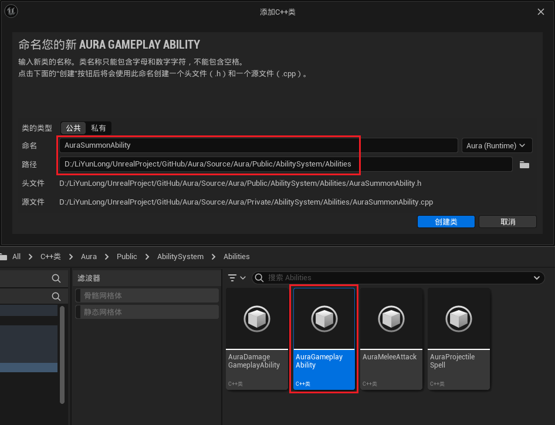
>
>- 为什么不是 AuraDamageGameplay ，因为 AuraDamageGameplay 是我们为伤害的技能制作的基类，所以我们此时需要为召唤的技能制作基类


------

#### 创建函数，外部获取释放技能后需要生成的小兵的位置，需要返回一个FVector数组
>```cpp
>public:
>
>    UFUNCTION(BlueprintCallable)
>    TArray<FVector> GetSpawnLocations();/* 外部获取释放技能后需要生成的小兵的位置 */
>
>```
>
>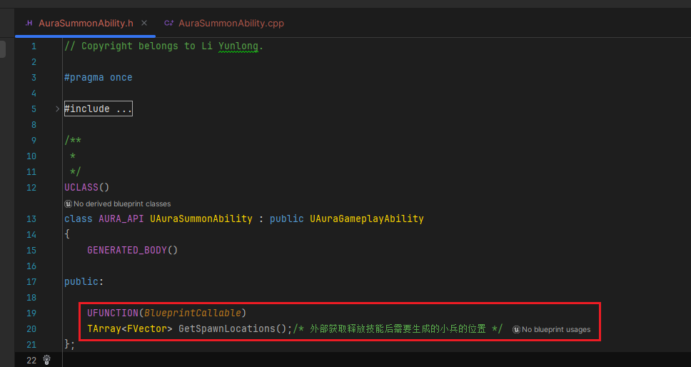


------

#### 创建一些需要配置的技能相关的变量

>| 变量名             | 作用               |
>| ------------------ | ------------------ |
>| `NumMinions`       | **生成小兵数量**   |
>| `MinionClasses`    | **生成的类型**     |
>| `MinSpawnDistance` | **最近生成的距离** |
>| `MaxSpawnDistance` | **最远生成的距离** |
>| `SpawnSpread`      | **生成角度**       |
>
>图示，变量作用
>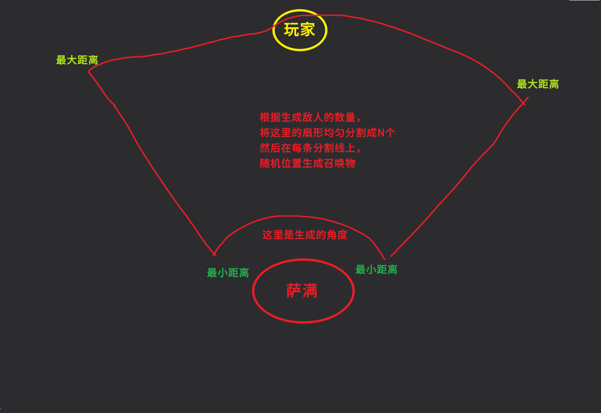
>
>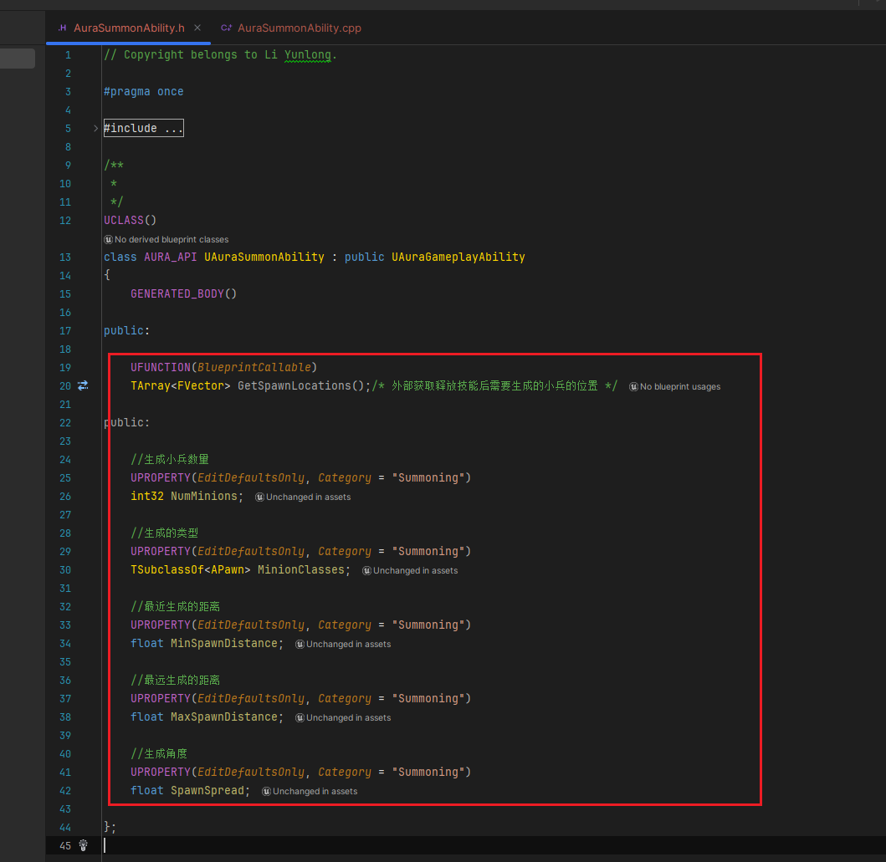
>
>```cpp
>public:
>
>    UFUNCTION(BlueprintCallable)
>    TArray<FVector> GetSpawnLocations();/* 外部获取释放技能后需要生成的小兵的位置 */
>    
>public:
>
>    //生成小兵数量
>    UPROPERTY(EditDefaultsOnly, Category = "Summoning")
>    int32 NumMinions;
>
>    //生成的类型
>    UPROPERTY(EditDefaultsOnly, Category = "Summoning")
>    TSubclassOf<APawn> MinionClasses;
>
>    //最近生成的距离
>    UPROPERTY(EditDefaultsOnly, Category = "Summoning")
>    float MinSpawnDistance;
>
>    //最远生成的距离
>    UPROPERTY(EditDefaultsOnly, Category = "Summoning")
>    float MaxSpawnDistance;
>
>    //生成角度
>    UPROPERTY(EditDefaultsOnly, Category = "Summoning")
>    float SpawnSpread;
>```
>
>```cpp
>TArray<FVector> UAuraSummonAbility::GetSpawnLocations()
>{
>    return TArray<FVector>();
>}
>```


------

#### `GetSpawnLocations` 函数中


------

##### 先获取角色(萨满)向前的向量
>```cpp
>FVector Forward = GetAvatarActorFromActorInfo()->GetActorForwardVector();
>```


------

##### 然后获取角色(萨满)位置
>```cpp
>FVector Loc = GetAvatarActorFromActorInfo()->GetActorLocation();
>```


------

##### 使用API `RotateAngleAxis` 获取，左右旋转后的向量
>```CPP
>FVector Forward = GetAvatarActorFromActorInfo()->GetActorForwardVector();
>//获取左右旋转后的向量
>const FVector LeftOfSpread = Forward.RotateAngleAxis(-SpawnSpread / 2.f, FVector::UpVector);
>const FVector RightOfSpread = Forward.RotateAngleAxis(SpawnSpread / 2.f, FVector::UpVector);
>```


------

##### 然后使用Debug画箭头

>- #### 使用API `DrawDebugArrow`
>
>```cpp
>UKismetSystemLibrary::DrawDebugArrow(GetAvatarActorFromActorInfo(), Loc, Loc + LeftOfSpread * MaxSpawnDistance, 4.f, FLinearColor::Gray, 1.f, 4.f);
>UKismetSystemLibrary::DrawDebugArrow(GetAvatarActorFromActorInfo(), Loc, Loc + RightOfSpread * MaxSpawnDistance, 4.f, FLinearColor::Red, 1.f, 4.f);
>```


------

##### 先返回一个空的 FVector数组 测试


------

##### 放一下完整函数体代码
>```cpp
>TArray<FVector> UAuraSummonAbility::GetSpawnLocations()
>{
>    	const FVector Forward = GetAvatarActorFromActorInfo()->GetActorForwardVector();
>    	const FVector Loc = GetAvatarActorFromActorInfo()->GetActorLocation();
>
>    	//获取左右旋转后的向量
>    	const FVector LeftOfSpread = Forward.RotateAngleAxis(-SpawnSpread / 2.f, FVector::UpVector);
>    	const FVector RightOfSpread = Forward.RotateAngleAxis(SpawnSpread / 2.f, FVector::UpVector);
>
>    	UKismetSystemLibrary::DrawDebugArrow(GetAvatarActorFromActorInfo(), Loc, Loc + LeftOfSpread * MaxSpawnDistance, 4.f, FLinearColor::Gray, 1.f, 4.f);
>    	UKismetSystemLibrary::DrawDebugArrow(GetAvatarActorFromActorInfo(), Loc, Loc + RightOfSpread * MaxSpawnDistance, 4.f, FLinearColor::Red, 1.f, 4.f);
>
>    	return TArray<FVector>();
>}
>```


------

### 创建蓝图子类

>- #### 命名为，`GA_SummonAbility`


------

#### 在 `BeginPlay` 时连上节点，暂时配置技能标签为Attack
>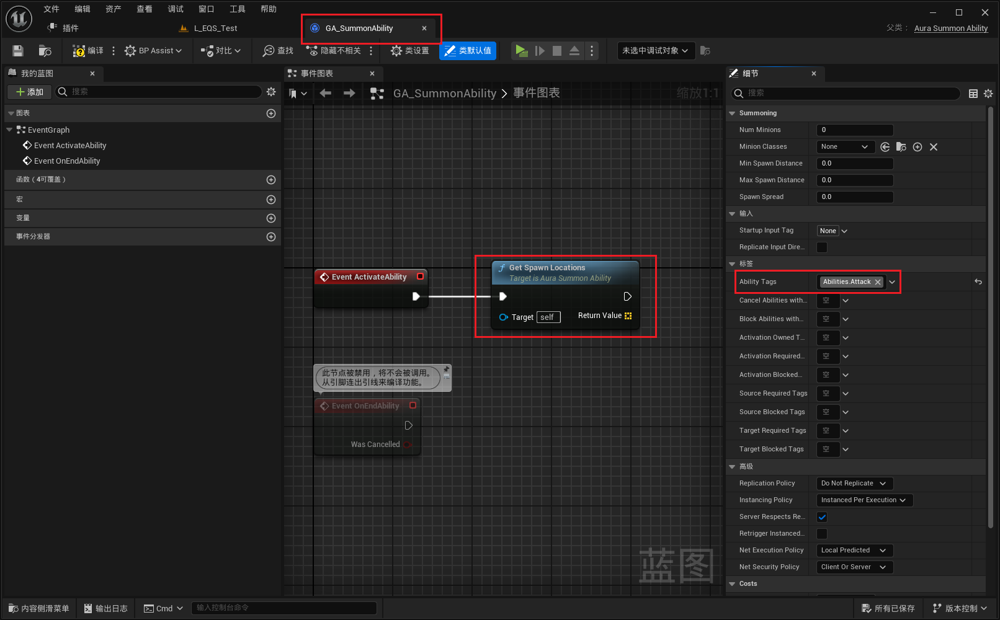


------

#### 在 `CharacterInfo` 数据资产中配置角色技能

>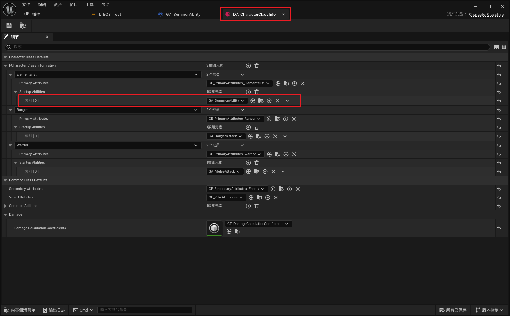
>
>- #### **去掉火球技能使用这个**


------

### 可以在这里配置技能参数
>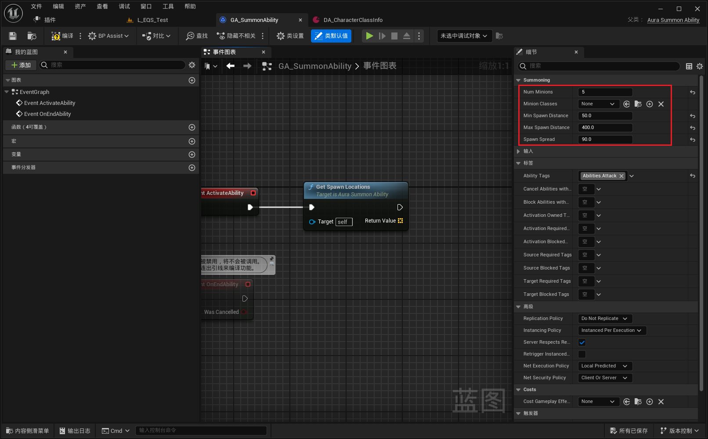


------

#### 场景中拖入萨满，测试一下
>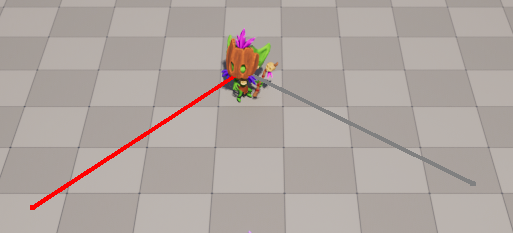


------


### 接下来分别在技能的最大最小距离生成球体，像下图这样

>
>
>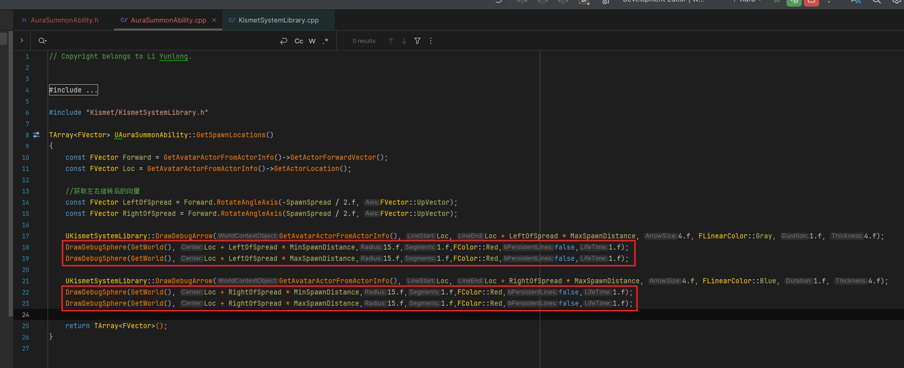
>
>```cpp
>TArray<FVector> UAuraSummonAbility::GetSpawnLocations()
>{
>    const FVector Forward = GetAvatarActorFromActorInfo()->GetActorForwardVector();
>    const FVector Loc = GetAvatarActorFromActorInfo()->GetActorLocation();
>
>    //获取左右旋转后的向量
>    const FVector LeftOfSpread = Forward.RotateAngleAxis(-SpawnSpread / 2.f, FVector::UpVector);
>    const FVector RightOfSpread = Forward.RotateAngleAxis(SpawnSpread / 2.f, FVector::UpVector);
>    
>    UKismetSystemLibrary::DrawDebugArrow(GetAvatarActorFromActorInfo(), Loc, Loc + LeftOfSpread * MaxSpawnDistance, 4.f, FLinearColor::Gray, 1.f, 4.f);
>    DrawDebugSphere(GetWorld(), Loc + LeftOfSpread * MinSpawnDistance,15.f,1.f,FColor::Red,false,1.f);
>    DrawDebugSphere(GetWorld(), Loc + LeftOfSpread * MaxSpawnDistance,15.f,1.f,FColor::Red,false,1.f);
>    
>    UKismetSystemLibrary::DrawDebugArrow(GetAvatarActorFromActorInfo(), Loc, Loc + RightOfSpread * MaxSpawnDistance, 4.f, FLinearColor::Red, 1.f, 4.f);
>    DrawDebugSphere(GetWorld(), Loc + RightOfSpread * MinSpawnDistance,15.f,1.f,FColor::Red,false,1.f);
>    DrawDebugSphere(GetWorld(), Loc + RightOfSpread * MaxSpawnDistance,15.f,1.f,FColor::Red,false,1.f);
>
>    return TArray<FVector>();
>}
>```


------

### 接下来需要创建for循环，在每条分割线上生成 Debug箭头最近/最远点生成 DebugSphere

>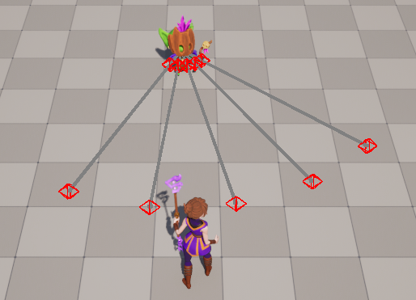
>
>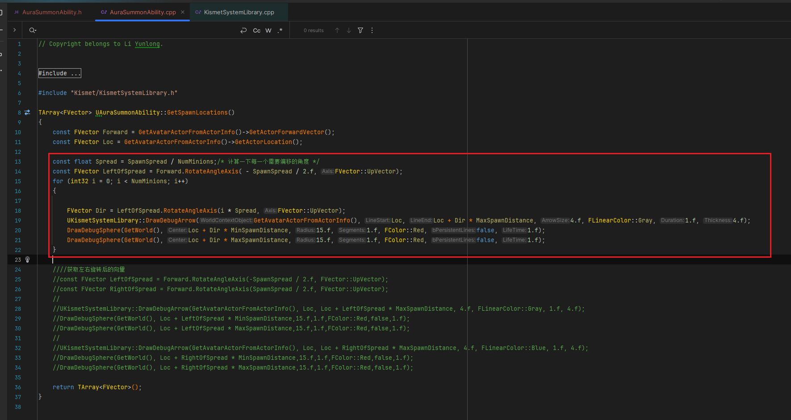
>
>```cpp
>TArray<FVector> UAuraSummonAbility::GetSpawnLocations()
>{
>    const FVector Forward = GetAvatarActorFromActorInfo()->GetActorForwardVector();
>    const FVector Loc = GetAvatarActorFromActorInfo()->GetActorLocation();
>
>    const float Spread = SpawnSpread / NumMinions;/* 计算一下每一个需要偏移的角度 */
>    const FVector LeftOfSpread = Forward.RotateAngleAxis( - SpawnSpread / 2.f, FVector::UpVector);
>    for (int32 i = 0; i < NumMinions; i++)
>    {
>       
>       FVector Dir = LeftOfSpread.RotateAngleAxis(i * Spread, FVector::UpVector);
>       UKismetSystemLibrary::DrawDebugArrow(GetAvatarActorFromActorInfo(), Loc, Loc + Dir * MaxSpawnDistance, 4.f, FLinearColor::Gray, 1.f, 4.f);
>       DrawDebugSphere(GetWorld(), Loc + Dir * MinSpawnDistance, 15.f, 1.f, FColor::Red, false, 1.f);
>       DrawDebugSphere(GetWorld(), Loc + Dir * MaxSpawnDistance, 15.f, 1.f, FColor::Red, false, 1.f);
>    }
>    
>    ////获取左右旋转后的向量
>    //const FVector LeftOfSpread = Forward.RotateAngleAxis(-SpawnSpread / 2.f, FVector::UpVector);
>    //const FVector RightOfSpread = Forward.RotateAngleAxis(SpawnSpread / 2.f, FVector::UpVector);
>    //
>    //UKismetSystemLibrary::DrawDebugArrow(GetAvatarActorFromActorInfo(), Loc, Loc + LeftOfSpread * MaxSpawnDistance, 4.f, FLinearColor::Gray, 1.f, 4.f);
>    //DrawDebugSphere(GetWorld(), Loc + LeftOfSpread * MinSpawnDistance,15.f,1.f,FColor::Red,false,1.f);
>    //DrawDebugSphere(GetWorld(), Loc + LeftOfSpread * MaxSpawnDistance,15.f,1.f,FColor::Red,false,1.f);
>    //
>    //UKismetSystemLibrary::DrawDebugArrow(GetAvatarActorFromActorInfo(), Loc, Loc + RightOfSpread * MaxSpawnDistance, 4.f, FLinearColor::Blue, 1.f, 4.f);
>    //DrawDebugSphere(GetWorld(), Loc + RightOfSpread * MinSpawnDistance,15.f,1.f,FColor::Red,false,1.f);
>    //DrawDebugSphere(GetWorld(), Loc + RightOfSpread * MaxSpawnDistance,15.f,1.f,FColor::Red,false,1.f);
>
>    return TArray<FVector>();
>}
>```


------

### 接下来需要生成随机位置，并添加到一个临时数组，并返回
>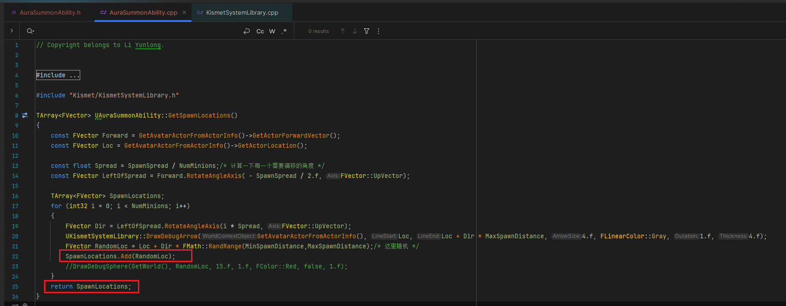
>
>```cpp
>TArray<FVector> UAuraSummonAbility::GetSpawnLocations()
>{
>	const FVector Forward = GetAvatarActorFromActorInfo()->GetActorForwardVector();
>	const FVector Loc = GetAvatarActorFromActorInfo()->GetActorLocation();
>
>	const float Spread = SpawnSpread / NumMinions;/* 计算一下每一个需要偏移的角度 */
>	const FVector LeftOfSpread = Forward.RotateAngleAxis( - SpawnSpread / 2.f, FVector::UpVector);
>
>	TArray<FVector> SpawnLocations;
>	for (int32 i = 0; i < NumMinions; i++)
>	{
>		FVector Dir = LeftOfSpread.RotateAngleAxis(i * Spread, FVector::UpVector);
>		UKismetSystemLibrary::DrawDebugArrow(GetAvatarActorFromActorInfo(), Loc, Loc + Dir * MaxSpawnDistance, 4.f, FLinearColor::Gray, 1.f, 4.f);
>		FVector RandomLoc = Loc + Dir * FMath::RandRange(MinSpawnDistance,MaxSpawnDistance);/* 这里随机 */
>		SpawnLocations.Add(RandomLoc);
>		//DrawDebugSphere(GetWorld(), RandomLoc, 15.f, 1.f, FColor::Red, false, 1.f);
>	}
>	return SpawnLocations;
>}
>```


------

### 这次换到蓝图Debug测试一下


>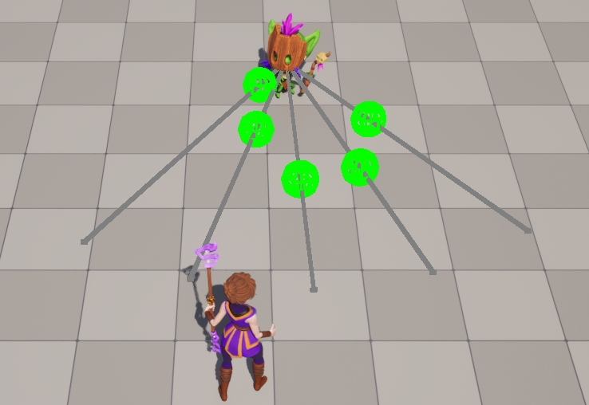


------

### 修改参数后再测试


>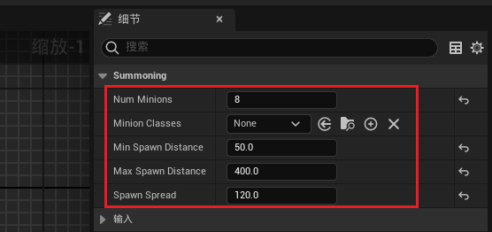

------


------

### 测试一下

>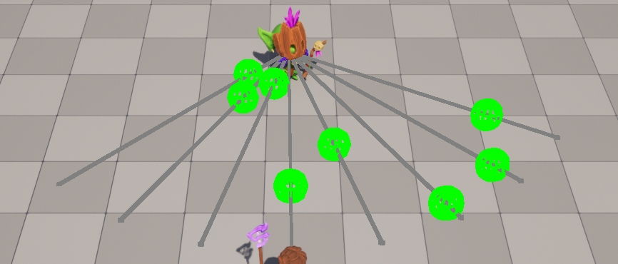


------

### 测试完记得复原

> #### **注意嗷：此时并没有结束技能的逻辑，但是每次都可以释放技能，是因为实例化策略选择了每次创建新的GA，这里需要注意下**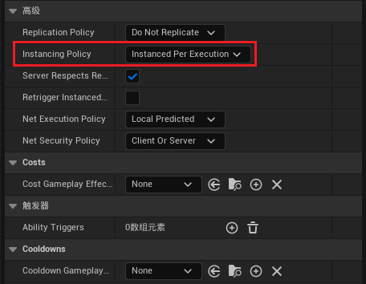
>
> 


___________________________________________________________________________________________

[返回最上面](#Go主菜单)

___________________________________________________________________________________________