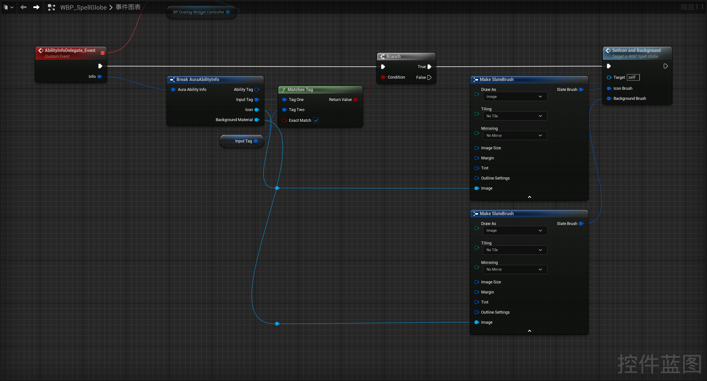
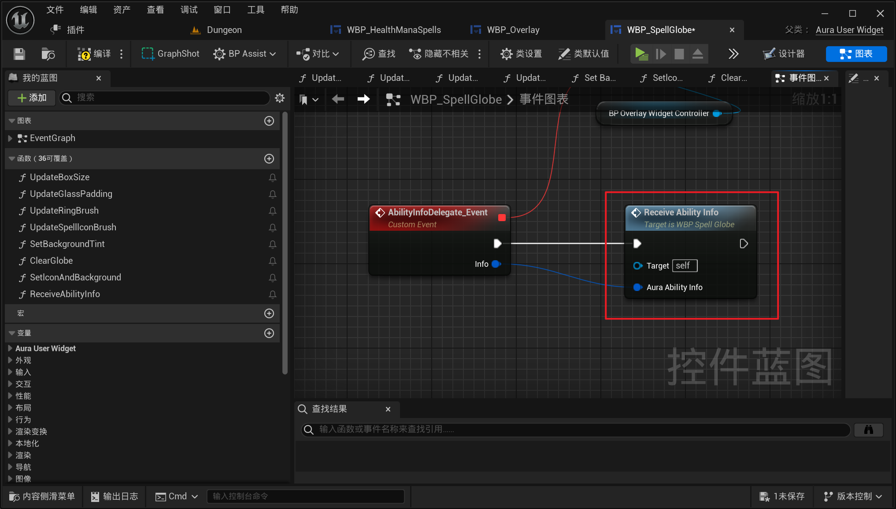
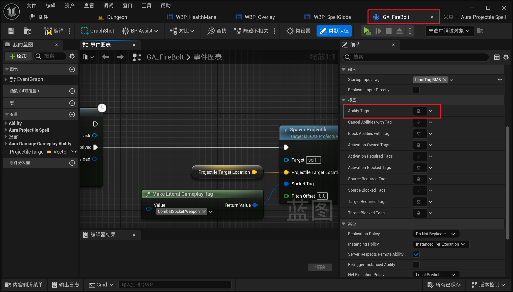
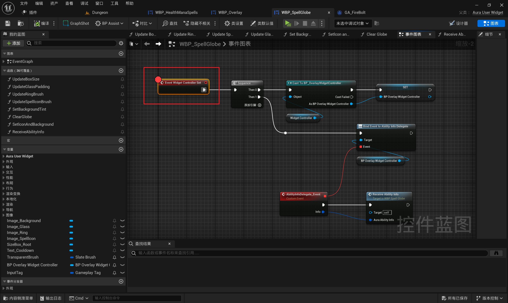
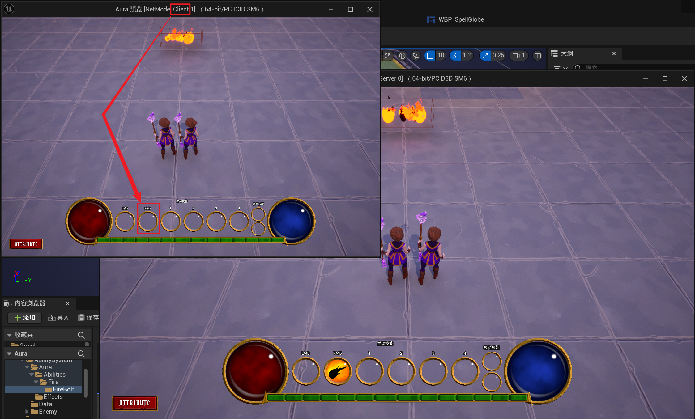

<details>
<summary>过程截图</summary>

>

------

</details>


+ `头文件`中：
```cpp
这里是头文件代码这里是头文件代码这里是头文件代码这里是头文件代码这里是头文件代码这里是头文件代码
```

+ `源文件`中：
```cpp
这里是源文件代码这里是源文件代码这里是源文件代码这里是源文件代码这里是源文件代码这里是源文件代码
```

[Mermaid格式参考](https://github.com/liyunlong618/LiYunLongKnowledgeLibrary/blob/main/Mermaid%E6%A0%BC%E5%BC%8F%E5%8F%82%E8%80%83.md)

[预览](https://github.com/liyunlong618/LiYunLongKnowledgeLibrary/tree/main/UECPP/Models/GAS/GAS_2_Aura)


___________________________________________________________________________________________
###### [Go主菜单](../MainMenu.md)
___________________________________________________________________________________________

# GAS 114 蓝图中判断Tag读取广播的结构体设置UI；客户端无法触发添加技能的回调，需要重写父类属性复制回调函数，初始化时广播

___________________________________________________________________________________________

## 处理关键点

1. 111111111111111111111111111111

2. 222222222222222222222222222

3. 33333333333333333333333333

4. 4444444444444444444444444444

5. 555555555555555555555555555555

6. 666666666666666666666666666

7. 77777777777777777777777777777777

___________________________________________________________________________________________

# 目录


[TOC]


___________________________________________________________________________________________

<details>
<summary>视频链接</summary>

[8. Binding Widget Events to the Ability Info Delegate_哔哩哔哩_bilibili](https://www.bilibili.com/video/BV1TH4y1L7NP?p=40&spm_id_from=pageDriver&vd_source=9e1e64122d802b4f7ab37bd325a89e6c)

------

</details>

___________________________________________________________________________________________

### Mermaid整体思路梳理

Mermaid

___________________________________________________________________________________________

### 接下来需要在蓝图中配置结构体和UI
>


------

### `技能UI` 触发蓝图中的 `WidgetControllerSet` 函数后，设置变量绑定代理

> #### **现在有几个技能就会广播给每个 `技能UI` 几次**
>
> 


------

### 接下来需要让 `技能UI` 识别保存自身数据的结构体，所以需要为每一个UI配置Tag


------

####  `技能UI` 上创建 `InputTag` 变量
>


------

#### 在之前创建的配置技能图标的UI中可以知道每个 `技能UI` 对应着什么输入按键，所以需要在这里创建函数配置
>
>
>### 依次改名


------

##### 创建函数配置，命名为，`SetSpellGlobeInputTags`
>


------

#### 初始化时调用
>


------

####  `技能UI` 中使用API：MachesTag检查两个Tag是否匹配
>


------

##### 如果匹配，调用之前创建的设置技能图标的函数
>


------

##### 将这一大段逻辑折叠为函数命名为，`ReceiveAbilityInfo`
>


------

### 运行测试发现我们还没有技能图标

>#### **因为技能中没有配置技能 `AbilityTag`**


------

### 修复问题，给技能添加 `AbilityTag`
>


------

### 运行发现还是没有技能图标


------

### 断点调试
>


------

#### 我们好像没有设置 `技能UI` 的 `WidgetController` ，所以不会触发 `WidgetControllerSet` 函数


------

### 创建函数设置 `技能UI` 的 `WidgetController`，命名为 `SetGlobeWidgetControllers` ，父层，调用设置 `WidgetController`
>


------

### 此时运行，就可以看到技能图标了
>


------

### 还有一个问题，多人LS模式下，客户端无法显示技能图标

> #### **因为这里的逻辑只在服务器上执行**
>
>   - 因此，我们也需要一种在客启端上广播它的方法，并且有一个很好的简单方法可以做到这一点，一旦我们给出了我们的能力，那么能力系统组件可激活的能力容器就会将其复制为一个复制变量


------

## GAS的核心设计是以网络安全性为优先的。`只有服务器端代码可以直接授予或修改能力!!!!!!!!!!!!`

## 这是为了防止客户端直接操纵能力，例如通过修改客户端代码进行作弊。


------

### 可以搜索源码 `GetActivatablAbilities`

>   - 可以看到这是一个虚函数，可以子类重写
>
> 


------

### 重写虚函数 `OnRep ActivateAbilities`
>
>
>#### **这样带来的后果就是每次复制都会广播数据，但我们只想在第一复制的时候也就是初始化时广播**
>
>


------

### 需要判断状态，限定一下，只有当没有被广播时，才可以广播，并在广播后设置 bool = false

> #### **因为这里的逻辑，在客户端。而且因为客户端不会走之前的逻辑，而是走这里的逻辑，且第一次走到这里时肯定为false，所以会按照设计执行初始化**
>
> 


------

### 运行测试客户端也可以看到技能图标
>


------

### 因为我们是动态配置的，所以修改GA的InputTag，也会触发UI上的变化


------

#### 改一下试试
>
___________________________________________________________________________________________

[返回最上面](#Go主菜单)

___________________________________________________________________________________________