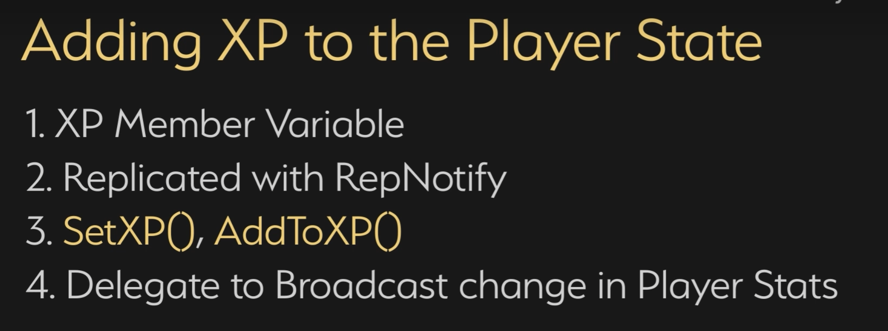

<details>
<summary>过程截图</summary>

>

------

</details>


+ `头文件`中：
```cpp
这里是头文件代码这里是头文件代码这里是头文件代码这里是头文件代码这里是头文件代码这里是头文件代码
```

+ `源文件`中：
```cpp
这里是源文件代码这里是源文件代码这里是源文件代码这里是源文件代码这里是源文件代码这里是源文件代码
```

[Mermaid格式参考](https://github.com/liyunlong618/LiYunLongKnowledgeLibrary/blob/main/Mermaid%E6%A0%BC%E5%BC%8F%E5%8F%82%E8%80%83.md)

[预览](https://github.com/liyunlong618/LiYunLongKnowledgeLibrary/tree/main/UECPP/Models/GAS/GAS_2_Aura)


___________________________________________________________________________________________
###### [Go主菜单](../MainMenu.md)
___________________________________________________________________________________________

# GAS 120 使用 `DataAsset` 保存升级的信息结构体，存在 `PS` 中；处理同步； `OverlayWidgetController` 中创建并绑定回调；回调中计算广播到蓝图

___________________________________________________________________________________________

## 处理关键点

1. 111111111111111111111111111111

2. 222222222222222222222222222

3. 33333333333333333333333333

4. 4444444444444444444444444444

5. 555555555555555555555555555555

6. 666666666666666666666666666

7. 77777777777777777777777777777777

___________________________________________________________________________________________

# 目录


[TOC]


___________________________________________________________________________________________

<details>
<summary>视频链接</summary>

[2. Level Up Info Data Asset_哔哩哔哩_bilibili](https://www.bilibili.com/video/BV1TH4y1L7NP?p=48&vd_source=9e1e64122d802b4f7ab37bd325a89e6c)

[3. Adding XP to the Player State_哔哩哔哩_bilibili](https://www.bilibili.com/video/BV1TH4y1L7NP?p=49&spm_id_from=pageDriver&vd_source=9e1e64122d802b4f7ab37bd325a89e6c)

[4. Listening for XP Changes_哔哩哔哩_bilibili](https://www.bilibili.com/video/BV1TH4y1L7NP?p=50&spm_id_from=pageDriver&vd_source=9e1e64122d802b4f7ab37bd325a89e6c)

------

</details>

___________________________________________________________________________________________

### Mermaid整体思路梳理

Mermaid

___________________________________________________________________________________________

## 这里有个知识点：只有const函数，返回值才能使用const 变量 接

------

### 创建 `DataAsset`，命名为，`LevelUpInfo`
>

------

### 创建结构体，命名为，`FAuraLevelUpInfo`，需要包含：

  - 升到下一级所需的经验 `LevelUpRequirement`

  - 每升1级给与多少个属性点 `AttributePointAward`

  - 每升1级给与多少个技能点 `SpellPointAward`

  - 蓝图配置即可，不需要在蓝图中读取

------

### 创建结构体数组 `TArray`，用来映射等级和结构体，这里的等级将使用下标来替代，命名为，`LevelUpInformation`
>

------

### 创建函数，根据传入的经验，计算应该到达什么等级的函数，`FindLevelForXP(float XP)`
>

------

#### 使用 `While` 写的，但是我认为，没必要用 `While` ，可能是个人习惯，我决定用 `fori` 循环写
>

------

### 创建数据资产的蓝图子类
>

------

### 配置结构体信息

------

#### `Index 0` 是占位用的
>

------

### 下一节

- 

------

### 小测试1

  - 需要将XP添加到PS中，成员变量

  - XP需要开启 `属性复制`

  - 添加 `SetXP` 和 `AddToXP` 函数

  - 需要监听，XP的变化
    - 可以向客户端广播

  - 

------

### 自己尝试一下

------

#### 需要将XP添加到PS中，成员变量；XP需要开启 `属性复制`

>

------

#### 添加 `SetXP` 和 `AddToXP` 函数
>

------

#### 需要监听，XP的变化，可以向客户端广播

------

##### 不用在蓝图中实现，所以不用动态多播，多播即可
>

------

##### 需要在 `C` 中绑定所以需要公开委托
>

------

##### 接下来在客户端和服务器进行广播
>

------

### 接下来等级Level也需要添加 `Set` 和 `Add` 函数
>

------

### 需要 `监听Level变化`

------

#### 可以用刚才创建的广播
>

------

#### 变化时，广播 Level
>

------

### 下一节

- 

------

### 小测试1

  - 在 `OverlayWidgetController` 上绑定 `OnXPChangedDelegate` 委托

  - 算出 XP 条的百分比是多少

  - `LevelUplnfo` 数据资产应该放在哪里

  - 请记住，我们可能需要在客户端和服务器上的小部件控制器中提供升级信息。

  - 提示： `OverlayWidgetController` 中是否需要 `LevelUplnfo`

  - 

------

### 自己尝试一下

------

#### 在 `OverlayWidgetController` 中创建回调，并在  `BindCallbacksToDependencies` 函数中绑定回调
>

------

#### 关于之前说的问题：`LevelUplnfo` 数据资产应该放在哪里？

  - 应该放在PS中，因为PS会复制到客户端，所以升级的信息，每个客户端都能拿到

------

##### 在PS中创建智能指针，持有`LevelUplnfo` DataAsset指针
>

------

#### 我们之前用这个动态多播，广播了float，现在也可以继续用这个，声明一个委托，保存在 `OverlayWidgetController` 中
>

------

#### 下面需要在回调中向蓝图中广播，但是需要计算百分比之后再广播

------

##### 先拿到PS这样就拿到了数据资产，然后存为局部变量，计算百分比
>

------

##### 计算百分比
>


___________________________________________________________________________________________

[返回最上面](#Go主菜单)

___________________________________________________________________________________________