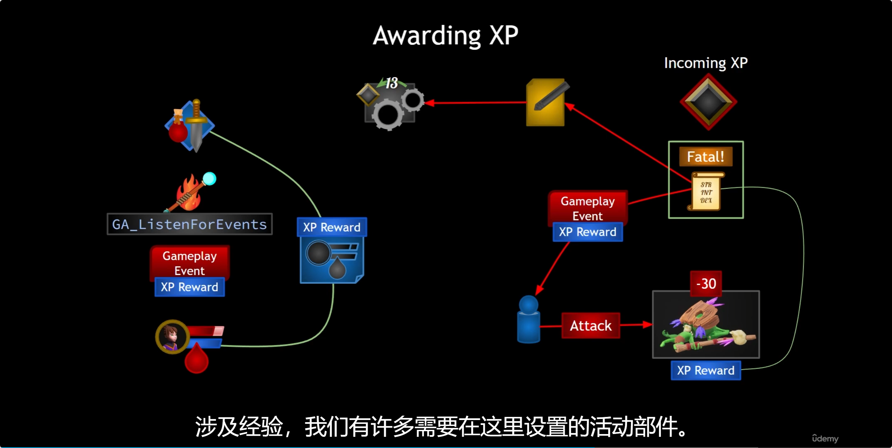

<details>
<summary>过程截图</summary>

>

------

</details>


+ `头文件`中：
```cpp
这里是头文件代码这里是头文件代码这里是头文件代码这里是头文件代码这里是头文件代码这里是头文件代码
```

+ `源文件`中：
```cpp
这里是源文件代码这里是源文件代码这里是源文件代码这里是源文件代码这里是源文件代码这里是源文件代码
```

[Mermaid格式参考](https://github.com/liyunlong618/LiYunLongKnowledgeLibrary/blob/main/Mermaid%E6%A0%BC%E5%BC%8F%E5%8F%82%E8%80%83.md)

[预览](https://github.com/liyunlong618/LiYunLongKnowledgeLibrary/tree/main/UECPP/Models/GAS/GAS_2_Aura)


___________________________________________________________________________________________
###### [Go主菜单](../MainMenu.md)
___________________________________________________________________________________________

# GAS 121 梳理整个增加经验的逻辑；为不同敌人使用曲线，配置经验值奖励

___________________________________________________________________________________________

## 处理关键点

1. 111111111111111111111111111111

2. 222222222222222222222222222

3. 33333333333333333333333333

4. 4444444444444444444444444444

5. 555555555555555555555555555555

6. 666666666666666666666666666

7. 77777777777777777777777777777777

___________________________________________________________________________________________

# 目录


[TOC]


___________________________________________________________________________________________

<details>
<summary>视频链接</summary>

[5. Awarding XP Game Plan_哔哩哔哩_bilibili](https://www.bilibili.com/video/BV1TH4y1L7NP/?p=51&spm_id_from=pageDriver&vd_source=9e1e64122d802b4f7ab37bd325a89e6c)

[6. XP Reward for Enemies_哔哩哔哩_bilibili](https://www.bilibili.com/video/BV1TH4y1L7NP/?p=52&spm_id_from=pageDriver&vd_source=9e1e64122d802b4f7ab37bd325a89e6c)

------

</details>

___________________________________________________________________________________________

### Mermaid整体思路梳理

Mermaid

___________________________________________________________________________________________

### 流程解释
>
>
>- #### **当玩家攻击敌人时，敌人身上需要有对应的 `XP Reward(经验值奖励)` ，当玩家击杀敌人时，我们之前是在计算时拿到的敌人死亡状态，如果敌人死亡，一方面通过 `GameplayEvent` 发送给 `Player` ，但是计算时我们使用到了元属性，也就是只存在于服务器的属性 `AS` ，所以也需要相应的为即将应用的XP创建 `元属性` ；另一方面，需要广播XP到 `WidgetController` 中，使用 `MVC` 完成对UI的更新。关于Player获取经验方面，`GameplayEvent` 发送给 `Player` 敌人死亡的信息后，需要传递 `要增加的XP值` ，这里需要创建一个` GA(也就是图中的GA_ListenForEvents)` 用来 `监听GameplayEvent发送的Tag` ，并根据传递的值，完成对 Player->PS->XP 的修改**

------

### 接下来要处理的流程步骤

>

------

### 下一节

------

### 接下来我们需要的是让敌人拥有一定数量的经验值，攻击者杀死敌人时获得的。

------

#### 创建曲线
>
>
>经验值奖励，表格：
>
>| 职业 | 1级经验奖励 | 40级经验奖励 |
>| ---- | ----------- | ------------ |
>| 战士 | 20          | 1000         |
>| 游侠 | 25          | 1500         |
>| 法师 | 35          | 2500         |

------

#### 在 `CharacterClassinfo.h` 中，添加配置经验值奖励的曲线变量 `FScalableFloat`
>

------

#### 在蓝图函数库中创建静态函数根据敌人种类，和等级返回相应的奖励经验值(也就是表格中对应的float) ，函数命名为`GetXPRewardForClassAndLevel`

>   - #### **因为是静态函数需要一个 `WorldContextObject`**
>   - #### **需要一个角色种类**
>   - #### **需要一个角色等级**
>   - 

------

##### 先从GM上拿到角色信息的数据资产指针，然后获取结构体，拿到表格，传入等级获取对应的浮点数

>   - #### 因为用到的经验值是整型，所以需要把 **返回值强制类型转换**
>
>
> 

------

### 接下来需要在敌人的接口中创建获取奖励经验的函数
>

------

### 因为是角色类型，而Aura，也可以是AI，所以想把角色类型枚举的设置挪到角色基类中

#### 也就是将这里的逻辑
>

#### 挪到角色基类中
>

------

### 基类重写接口函数
>

------

### 玩家基类的构造中，设置角色类型为元素使
>

------

### ***DA_CharacterInfo*** 中设置敌人经验值奖励曲线
>


___________________________________________________________________________________________

[返回最上面](#Go主菜单)

___________________________________________________________________________________________