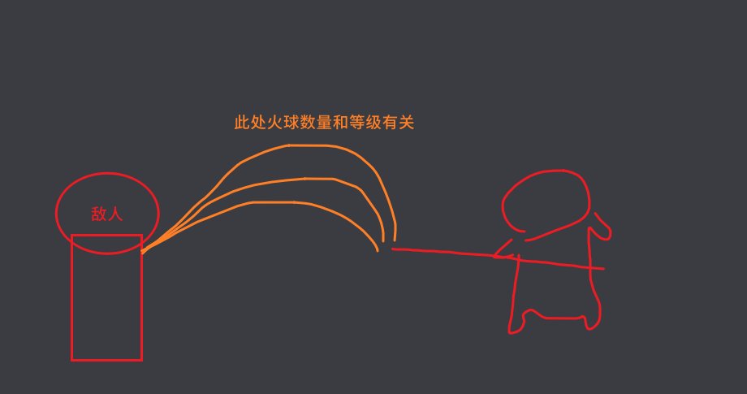
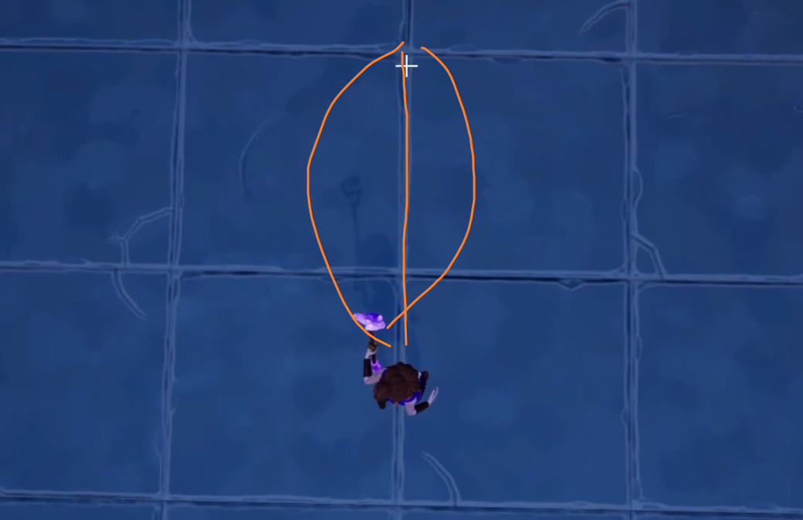

___________________________________________________________________________________________
###### [Go主菜单](../MainMenu.md)
___________________________________________________________________________________________

# GAS 158 在火球子类上重构生成火球逻辑；设计根据技能范围和火球数量计算生成角度

___________________________________________________________________________________________

# 目录

[TOC]

___________________________________________________________________________________________

视频链接

[1. FireBolt Projectile Spread_哔哩哔哩_bilibili](https://www.bilibili.com/video/BV1TH4y1L7NP?p=114&vd_source=9e1e64122d802b4f7ab37bd325a89e6c)

------

___________________________________________________________________________________________

### Mermaid整体思路梳理

Mermaid

___________________________________________________________________________________________

### 这一节，我们需要修改火球技能，在子类上重构，适配更多的技能扩展（比如升级技能后，出现更多的火球攻击敌人，火球可以简单追踪敌人，并且有重力下坠效果）
>
>

------

### 首先需要计算火球发射时的角度

- 之前在 `AuraProjectileSpell` 中为创建火球制作了函数，有三个参数分别是：

  - 1.目标位置（终点）

  - 2.插槽Tag（起点）

  - 3.Pitch角度偏移

- 这一点我和视频中的不太一样，视频中是四个
>
>

- 因为我们新增的火球术，需要在后半段追踪敌人，所以需要增加一个 `敌人指针` 的参数 `HomingTarget`

------

### 在火球中创建函数 `SpawnProiectiles`

  - 不用继承的原因是：参数变多了，没法用继承

>

------

#### 逻辑方面，先看一下，之前的生成火球函数中有哪些可以复用的部分
>

------

#### 拷贝过来可复用的逻辑后，生成Debug箭头
>

------

#### 蓝图逻辑中使用新创建的节点
>

------

#### 运行可以看到箭头
>

------

### 因为我们要制作，基于等级生成更多的火球，需要一个可扩散的角度和火球数量（这个可以配置）

  - 可扩散的角度
    - `ProjectileSpread`

  - 火球数量
    - `MaxNumProjectiles`

- 创建变量
>

------

### 所以释放技能的角度应该是，左右分别 +- （ProjectileSpread可扩散的角度 / 2）
>

- 对应代码为：
>
>
>
>

- 生成测试
>

------

### 现在生成火球角度还有一些问题

  - 现在想象一下，如果每一个的旋转角度为DeltaSpread，假设有两个火球，ProjectileSpread可扩散角度为90，那DeltaSpread = 45，第一个和正前方的重合，另一个和右侧角度重合，最左侧没有火球生成

------

### 生成火球角度部分，分成两种情况处理：

  - 数量大于1时
    - 从最左侧开始：角度 = 最左侧角度 + i * DeltaSpread

  - 小于等于1时
    - 朝正前方正常射出火球

  - 火球数量  = 要生成的火球数量 - 1（因为要使用fori循环，所以使用最大数量 - 1）
>
>
>

------

### 通过设置蓝图中的参数，校验生成角度的结果时否正确
>

------

#### 测试结果
>
>
>
>

___________________________________________________________________________________________

[返回最上面](#Go主菜单)

___________________________________________________________________________________________