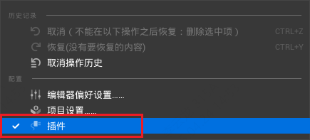
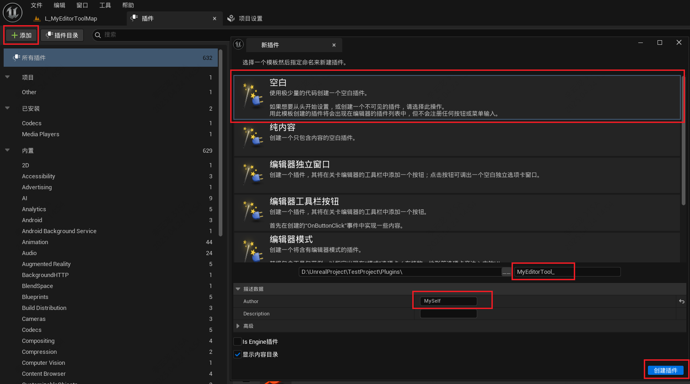
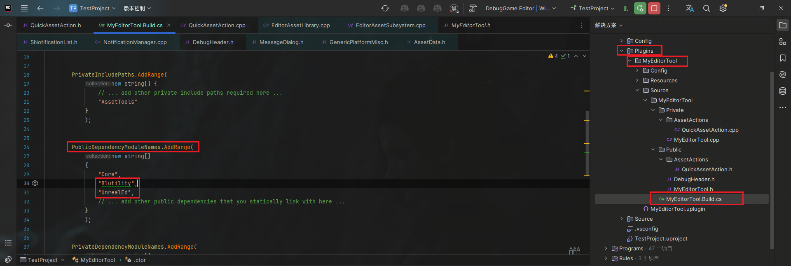
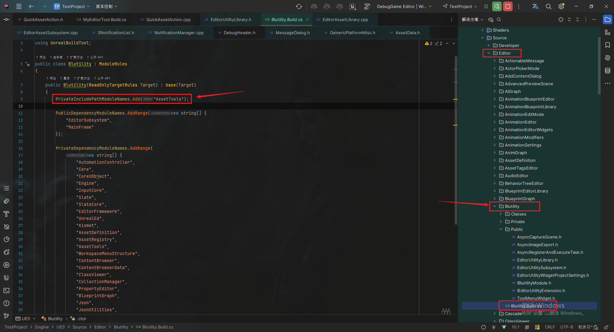
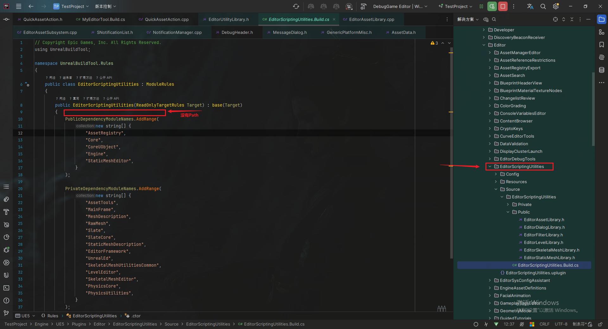
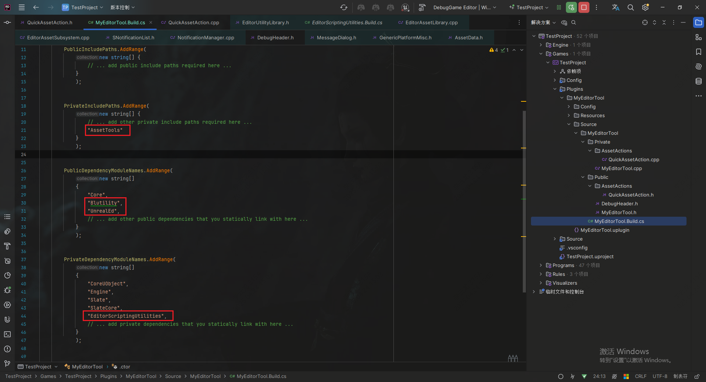
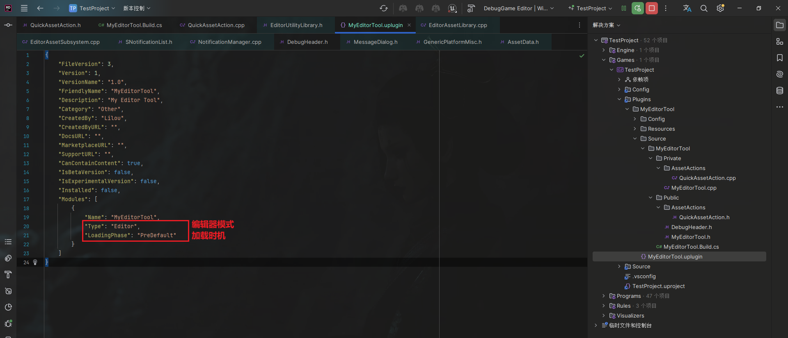
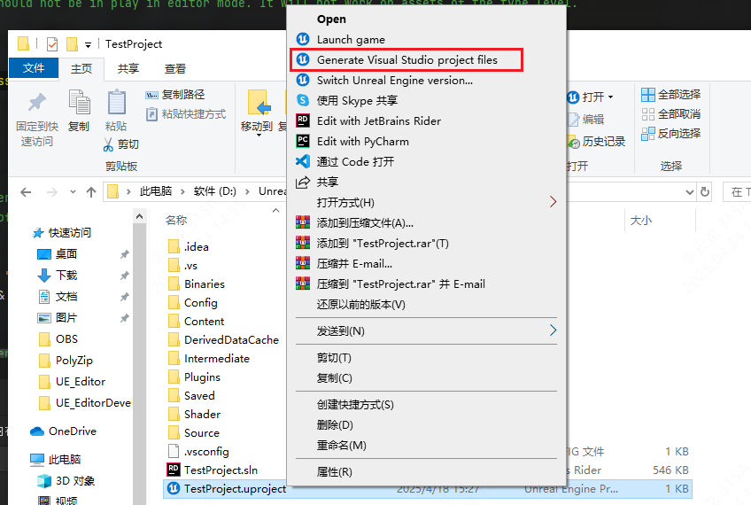

___________________________________________________________________________________________
###### [GoMenu](../UE_EditorMenu.md)
___________________________________________________________________________________________
# 001 创建插件和引入模块
___________________________________________________________________________________________


## 目录

[TOC]

_____

## 创建插件

> 

_____

## 引入模块，为了使用`UEditorUtilityLibrary`和`UEditorAssetLibrary`

详细可以参考这个[CSDN链接：UE4模块系统详解](https://blog.csdn.net/pp1191375192/article/details/103139304/)

> ```c#
> "Blutility",
> "UnrealEd",
> ```
>
> 

_____

## 引入模块时，需要看下目标文件属于哪个模块和依赖关系

> 目标依赖
>
> 在模块中添加

------

## 修改插件中的`.uplugin`文件

> 
>
> ```json
> {
>     "FileVersion": 3,
>     "Version": 1,
>     "VersionName": "1.0",
>     "FriendlyName": "MyEditorTool",
>     "Description": "My Editor Tool",
>     "Category": "Other",
>     "CreatedBy": "Lilou",
>     "CreatedByURL": "",
>     "DocsURL": "",
>     "MarketplaceURL": "",
>     "SupportURL": "",
>     "CanContainContent": true,
>     "IsBetaVersion": false,
>     "IsExperimentalVersion": false,
>     "Installed": false,
>     "Modules": [
>        {
>           "Name": "MyEditorTool",
>           "Type": "Editor",
>           "LoadingPhase": "PreDefault"
>        }
>     ]
> }
> ```
>
> 

------

## Generate编译

> 
>
> 

_____
