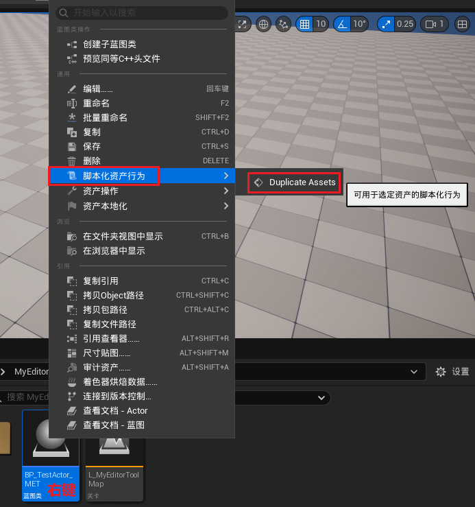
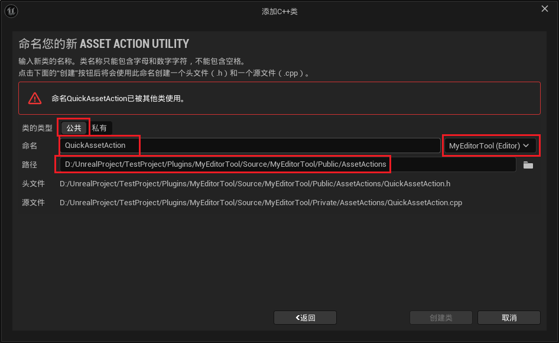
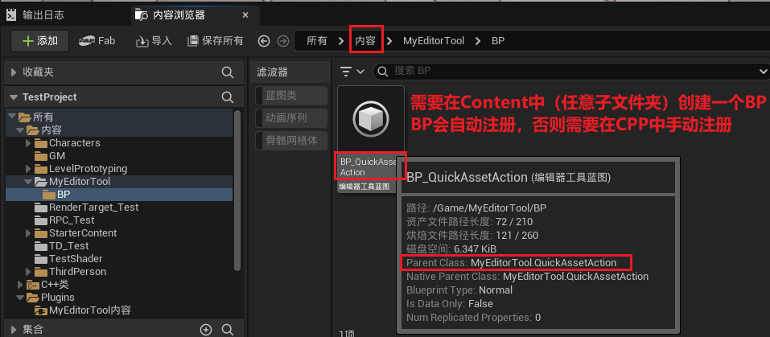
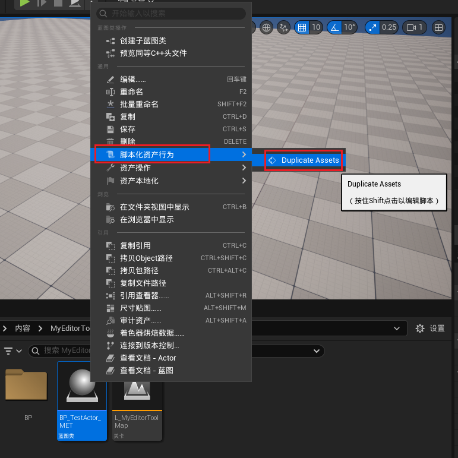
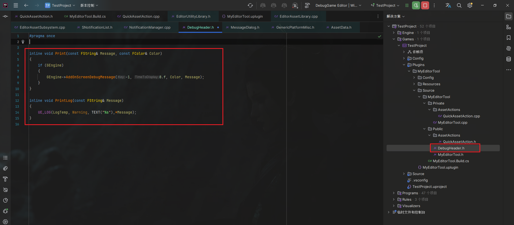

___________________________________________________________________________________________
###### [GoMenu](../UE_EditorMenu.md)
___________________________________________________________________________________________
# 002 右键`脚本化资产行为`中添加脚本



___________________________________________________________________________________________


## 目录

[TOC]

_____

#### 创建CPP类`QuickAssetAction`继承自`UAssetActionUtility`

> 

_____

#### `QuickAssetAction`中创建`UFUNCTION(CallInEditor)`方法测试打印

> ```CPP
> public:
>     UFUNCTION(CallInEditor)
>     static void DuplicateAssets();
> ```
>
> ```cpp
> void UQuickAssetAction::DuplicateAssets()
> {
>     if (GEngine)
> 	{
> 		GEngine->AddOnScreenDebugMessage(-1, 8.f, Color, TEXT("测试"));
> 	}
> }
> ```

_____

#### 注册分为两种：蓝图子类自动注册和CPP手动注册

> 这里我使用蓝图子类自动注册的方式，偷个懒
>
> 

_____

#### 然后就可以在右键菜单的脚本化资产行为中看到创建的方法

> 

_____

## 创建`DebugHeader.h`用来封装方法方便别处调用

> 插件文件夹下创建即可
>
> 
>
> ```CPP
> #pragma once
> 
> inline void Print(const FString& Message, const FColor& Color)
> {
>     if (GEngine)
>     {
>        GEngine->AddOnScreenDebugMessage(-1, 8.f, Color, Message);
>     }
> }
> 
> inline void PrintLog(const FString& Message)
> {
>     UE_LOG(LogTemp, Warning, TEXT("%s"),*Message);
> }
> ```
