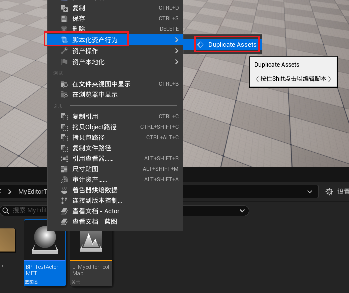
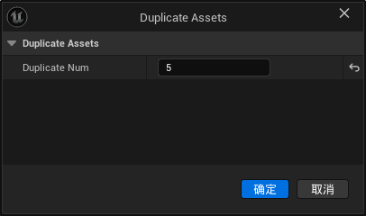
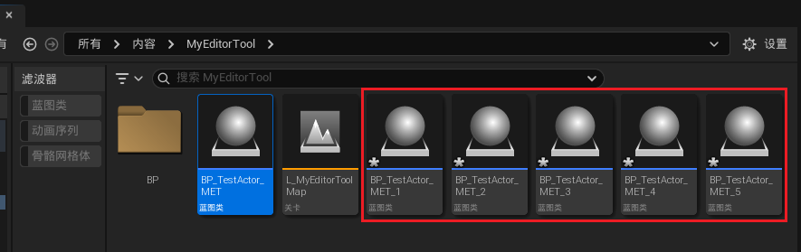

___________________________________________________________________________________________
#### [GoMenu](../UE_EditorMenu.md)
___________________________________________________________________________________________
# 003 获取选中的资产批量复制
___________________________________________________________________________________________


## 目录

[TOC]

_____

## 使用`UEditorUtilityLibrary`和`UEditorAssetLibrary`中的方法获取`Asset`：

>- **`UEditorUtilityLibrary`**
>```CPP
>// 获取选中的资产
>UEditorUtilityLibrary::GetSelectedAsset
>    
>// 获取选中的资产Data
>UEditorUtilityLibrary::GetSelectedAssetData
>```
>
>- **`UEditorAssetLibrary`**
>
>```CPP
>// 获取选中的资产Data
>UFUNCTION(BlueprintCallable, Category = "Editor Scripting | Asset")
>static TArray<FString> ListAssets(const FString& DirectoryPath, bool bRecursive = true, bool bIncludeFolder = false);
>```
>
>- **`UEditorAssetSubsystem`**
>
>```cpp
>// 复制资产
>UFUNCTION(BlueprintCallable, Category = "Editor Scripting | Asset")
>UNREALED_API UObject* DuplicateAsset(const FString& SourceAssetPath, const FString& DestinationAssetPath);
>```

_____

## 获取选中资产的`AssetData`

> ```cpp
> TArray<FAssetData> SelectedAssetData = UEditorUtilityLibrary::GetSelectedAssetData();
> ```

_____

## `FAssetData`中包含的常用数据

比如我获取`Content\MyEditorTool\BP_TestActor_MET.uasset`这个路径下的文件`FAssetData`

> | 类型     | 变量           | 获取的                                                 |                    |
> | -------- | -------------- | ------------------------------------------------------ | ------------------ |
> | `FName`  | `ObjectPath`   | `/Game/MyEditorTool/BP_TestActor_MET.BP_TestActor_MET` | 文件引用           |
> | `FName`  | `PackageName`  | `/Game/MyEditorTool/BP_TestActor_MET`                  | 相对路径到文件     |
> | `FName`  | `PackagePath`  | `/Game/MyEditorTool`                                   | 相对路径到父文件夹 |
> | `FName`  | `AssetName`    | `BP_TestActor_MET`                                     | 文件名             |
> | `FName`  | `AssetClass`   | `None`                                                 |                    |
> | `uint32` | `PackageFlags` | `262144`                                               | 应该是包名         |
>

_____

## `UEditorAssetLibrary::DuplicateAsset`需要使用`源文件路径`和`新文件路径`

### 使用`FPaths::Combine`帮助拼合路径

> ```cpp
> // 获取的 ObjectPath 应该是 "/Game/MyEditorTool/BP_TestActor_MET.BP_TestActor_MET"
> const FString SourceAssetPath = Data.GetSoftObjectPath().ToString();
> // 新文件名 应该是 "源文件名_1"
> const FString NewDuplicateName = Data.AssetName.ToString() + TEXT("_") + FString::FromInt(i + 1);
> // 新的文件路径 应该是 "/Game/MyEditorTool" + "源文件名_1" = "/Game/MyEditorTool/源文件名_1"
> // 也就是"/Game/MyEditorTool/BP_TestActor_MET_1"
> const FString NewPathName = FPaths::Combine(Data.PackagePath.ToString(), NewDuplicateName);
> // 复制资产
> UEditorAssetLibrary::DuplicateAsset(SourceAssetPath, NewPathName)
> ```

_____

## 遍历选中的资产，复制

> ```cpp
> // QuickAssetAction.h
> public:
> 	UFUNCTION(CallInEditor)
> 	static void DuplicateAssets(int32 DuplicateNum);
> 
> // QuickAssetAction.cpp
> void UQuickAssetAction::DuplicateAssets(int32 DuplicateNum)
> {
>     if (DuplicateNum <= 0)
>     {
>        SendMsgDiaLog(EAppMsgType::Ok, TEXT("数量必须大于0"), false);
>        return;
>     }
>     TArray<FAssetData> SelectedAssetData = UEditorUtilityLibrary::GetSelectedAssetData();
>     uint32 Counter = 0;
>     for (const FAssetData& Data : SelectedAssetData)
>     {
>        for (int i = 0; i < DuplicateNum; ++i)
>        {
>           const FString SourceAssetPath = Data.GetSoftObjectPath().ToString();
>           const FString NewDuplicateName = Data.AssetName.ToString() + TEXT("_") + FString::FromInt(i + 1);
>           const FString NewPathName = FPaths::Combine(Data.PackagePath.ToString(), NewDuplicateName);
> 
>           if (UEditorAssetLibrary::DuplicateAsset(SourceAssetPath, NewPathName))
>           {
>              PrintLog(TEXT("成功创建对象[ ") + NewDuplicateName + TEXT(" ]"));
>              ++Counter;
>           }
>           else
>           {
>              PrintLog(TEXT("创建对象[ ") + NewDuplicateName + TEXT(" ] 失败"));
>           }
>        }
>     }
>     if (Counter > 0)
>     {
>        Print(TEXT("成功创建对象[ ") + FString::FromInt(Counter) + TEXT(" ]个"), FColor::Green);
>        PrintLog(TEXT("成功创建对象[ ") + FString::FromInt(Counter) + TEXT(" ]个"));
>     }
> }
> ```

_____

## 测试一下

> 

_____
