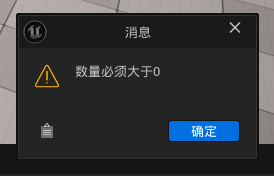
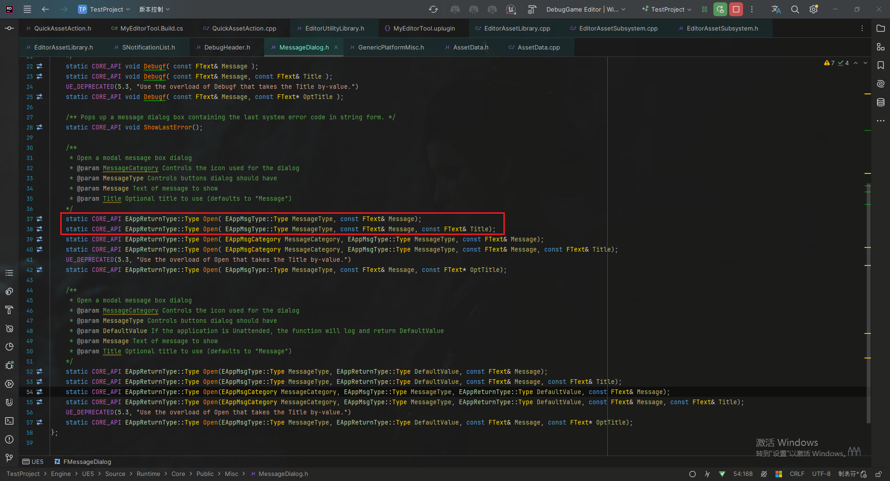
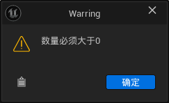
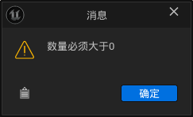
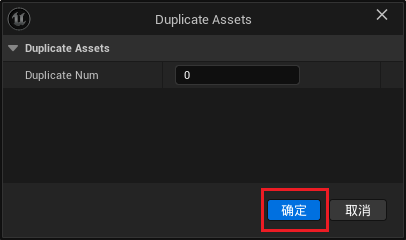

___________________________________________________________________________________________
#### [GoMenu](../UE_EditorMenu.md)
___________________________________________________________________________________________
# 004 使用消息提示框`FMessageDialog`



___________________________________________________________________________________________


## 目录

[TOC]

_____

## `FMessageDialog`官方文档链接

[`FMessageDialog`官方文档链接]([FMessageDialog | Unreal Engine 5.5 Documentation | Epic Developer Community](https://dev.epicgames.com/documentation/zh-cn/unreal-engine/API/Runtime/Core/Misc/FMessageDialog?application_version=5.5#syntax))

_____

## 引入头文件

> ```CPP
> #include "Misc/MessageDialog.h"
> ```

_____

## `MessageDialog.h`源码

> ```cpp
> // MessageDialog.h
> /**
>  * Open a modal message box dialog
>  * @param MessageCategory Controls the icon used for the dialog
>  * @param MessageType Controls buttons dialog should have
>  * @param Message Text of message to show
>  * @param Title Optional title to use (defaults to "Message")
> */
> static CORE_API EAppReturnType::Type Open( EAppMsgType::Type MessageType, const FText& Message);
> static CORE_API EAppReturnType::Type Open( EAppMsgType::Type MessageType, const FText& Message, const FText& Title);
> static CORE_API EAppReturnType::Type Open( EAppMsgCategory MessageCategory, EAppMsgType::Type MessageType, const FText& Message);
> static CORE_API EAppReturnType::Type Open( EAppMsgCategory MessageCategory, EAppMsgType::Type MessageType, const FText& Message, const FText& Title);
> UE_DEPRECATED(5.3, "Use the overload of Open that takes the Title by-value.")
> static CORE_API EAppReturnType::Type Open( EAppMsgType::Type MessageType, const FText& Message, const FText* OptTitle);
> 
> namespace EAppReturnType
> {
> 	/**
> 	 * Enumerates message dialog return types.
> 	 */
> 	enum Type
> 	{
> 		No,
> 		Yes,
> 		YesAll,
> 		NoAll,
> 		Cancel,
> 		Ok,
> 		Retry,
> 		Continue,
> 	};
> }
> 
> namespace EAppMsgType
> {
> 	/**
> 	 * Enumerates supported message dialog button types.
> 	 */
> 	enum Type
> 	{
> 		Ok,
> 		YesNo,
> 		OkCancel,
> 		YesNoCancel,
> 		CancelRetryContinue,
> 		YesNoYesAllNoAll,
> 		YesNoYesAllNoAllCancel,
> 		YesNoYesAll,
> 	};
> }
> ```

### 常用的是这两个重载

> 

_____

## `DebugHeader.h`中封装一下`FMessageDialog::Open`

> ```cpp
> // DebugHeader.h
> inline EAppReturnType::Type SendMsgDiaLog( EAppMsgType::Type MessageType, const FString& Message, bool bShowMsgAsWarring = true)
> {
>  if (bShowMsgAsWarring)
>  {
>     const FText Title = NSLOCTEXT("QuickAssetAction", "-1", "Warring");
>     return FMessageDialog::Open(MessageType, FText::FromString(Message), Title);
>  }
>  else
>  {
>     return FMessageDialog::Open(MessageType, FText::FromString(Message));
>  }
> }
> ```
>
> 需要的地方调用
>
> ```cpp
> SendNotification(TEXT("提示"));
> ```
>
> | bShowMsgAsWarring的区别 |                                                              |
> | :---------------------: | :----------------------------------------------------------: |
> |         `true`          |  |
> |         `false`         |  |

_____

## 复制时当数量小于等于0时，调用封装方法`SendMsgDiaLog`

> ```cpp
> void UQuickAssetAction::DuplicateAssets(int32 DuplicateNum)
> {
>     if (DuplicateNum <= 0)
>     {
>        SendMsgDiaLog(EAppMsgType::Ok, TEXT("数量必须大于0"));
>        return;
>     }
>     //...
> }
> ```

_____

## 当输入复制数量小于0时，会看到提示框

> 

_____
