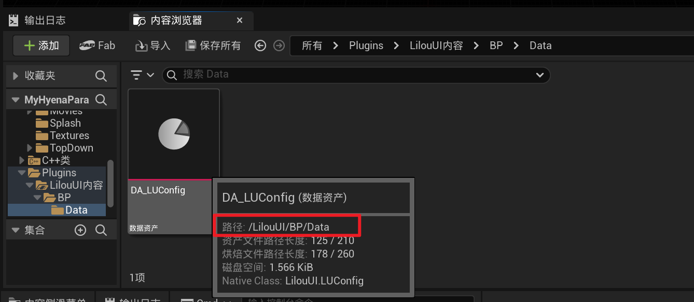

___________________________________________________________________________________________
###### [GoLibraryMainMenu](../_LibraryMainMenu_.md)
___________________________________________________________________________________________
# UE中创建插件
___________________________________________________________________________________________


## 目录
- [UE中的常用宏](#ue中的常用宏)
  - [目录](#目录)
  - [UE\_LOG](#ue_log)
    - [UE\_LOG打印函数名](#ue_log打印函数名)
  - [UEC++中使用 `GEngine` 将消息打印到屏幕](#uec中使用-gengine-将消息打印到屏幕)
  - [宏的创建和使用](#宏的创建和使用)
    - [内联函数宏](#内联函数宏)
    - [`UFUNCTION` 相关：UE5标识符详解 | 史上最全 - 知乎 (zhihu.com)](#ufunction-相关ue5标识符详解--史上最全---知乎-zhihucom)
    - [只有当bool在编辑器中勾选true时才会显示其他选项](#只有当bool在编辑器中勾选true时才会显示其他选项)


___________________________________________________________________________________________

## 创建空插件

> 

------

> 创建完后需要关闭引擎重新编译

------

## 监听 世界初始化完成

### 方法一：直接 `模块.cpp` 文件中 监听

> ```cpp
> //	模块.cpp文件中
> 
> #include "Engine/World.h"
> 
> void FLilouUIModule::StartupModule()
> {
>     // This code will execute after your module is loaded into memory; the exact timing is specified in the .uplugin file per-module
>     
>     // 监听世界初始化完成的广播	我这里回调使用Lambda
>     FWorldDelegates::OnPostWorldInitialization.AddLambda([](UWorld* World, const UWorld::InitializationValues IVS)
>     {
>        UE_LOG(LU_LOG,Log,TEXT("已加载插件 UE Insights Statistics"))
>     });
> }
> ```

### 方法二：创建 GameInstanceSubsystem 类，重写初始化函数

> ```CPP
> #pragma once
> 
> #include "Subsystems/GameInstanceSubsystem.h"
> #include "LUSubsystem.Generated.h"
> 
> UCLASS()
> class UMySubsystem : public UGameInstanceSubsystem
> {
>     GENERATED_BODY()
>     
> public:
>     
>     virtual void Initialize(FSubsystemCollectionBase& Collection) override;
> };
> ```

------

## 创建单例维护插件内数据

单例类维护 插件 内部数据

> 头文件：
> ```CPP
> #pragma once
> 
> #include "Logging/LogMacros.h"
> 
> DECLARE_LOG_CATEGORY_CLASS(My_LOG, Log, All)
> /*
>  * 维护内部单例类
>  */
> class MyManager
> {
> public:
>     //外部调用
>     static MyManager& Get()
>     {
>        return Manager;
>     }
> 
> private:
>     LUManager(){}
>     ~LUManager(){};
>     LUManager(const LUManager&) = delete;
>     LUManager& operator = (const LUManager&) = delete;
>     
>     //这里在头文件声明自身
>     static MyManager Manager;
> };
> ```
>
> 源文件：
> ```CPP
> #include "MyManager.h"
> 
> //源文件定义
> MyManager MyManager::Manager;
> ```

------

## 创建工具类 继承自 `UBlueprintFunctionLibrary`

> ```CPP
> #pragma once
> 
> #include "Kismet/BlueprintFunctionLibrary.h"
> #include "MyFunctionLibrary.generated.h"
> 
> UCLASS()
> class UMyFunctionLibrary : public UBlueprintFunctionLibrary
> {
>     GENERATED_BODY()
>     
> public:
>     
> };
> ```

------

## （可选）如果有蓝图需要配置的资产，可以创建 `DataAsset` 统一管理

> ```cpp
> #pragma once
> 
> #include "Engine/DataAsset.h"
> #include "MyConfig.Generated.h"
> 
> UCLASS(Blueprintable)
> class UMyConfig : public UDataAsset
> {
>     GENERATED_BODY()
> public:
> 
>     // 假设这里有一个类
>     UPROPERTY(EditDefaultsOnly, BlueprintReadOnly, Category = "My")
>     TSubclassOf<AActor> MyActorClass;
> };
> ```

### 如果在插件里创建了BP，如果使用LoadPObject加载：

> 比如资产在这个路径下：
>
> 
>
> ```cpp
> //需要参考这种格式
> Config = LoadObject<ULUConfig>(nullptr, TEXT("/LilouUI/BP/Data/DA_LUConfig.DA_LUConfig"));
> ```


------