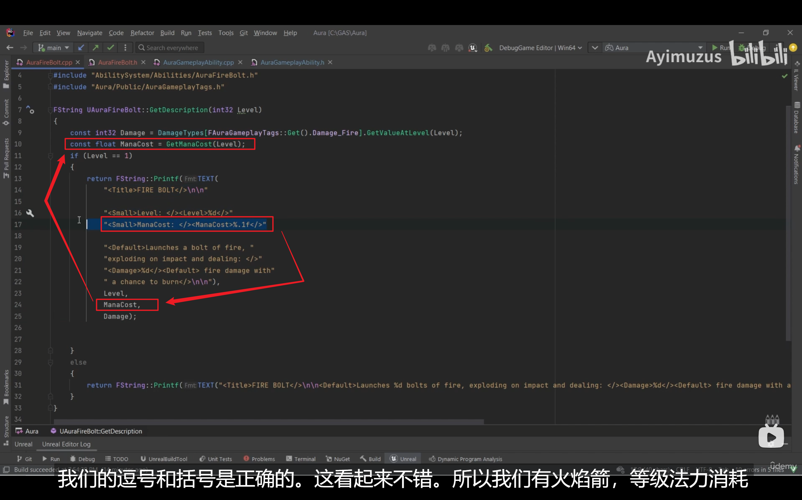
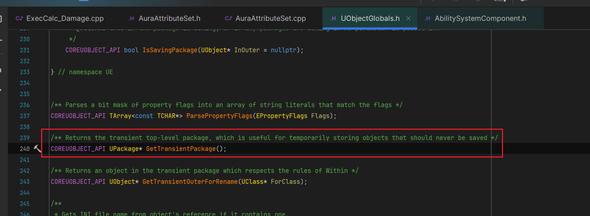
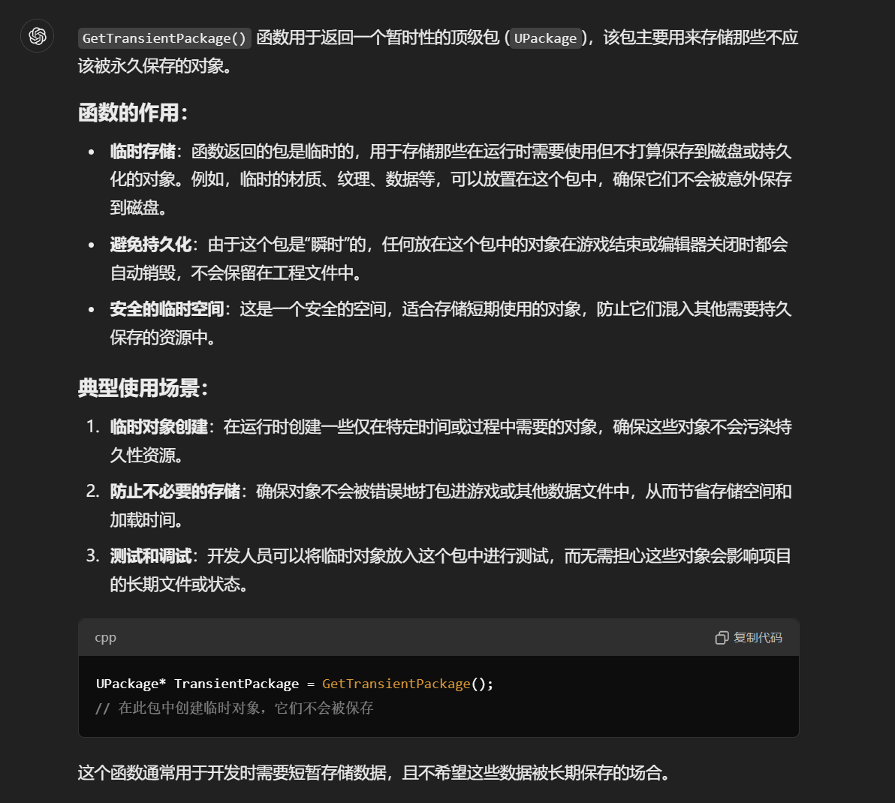

___________________________________________________________________________________________
##### [GoLibraryMainMenu](../_LibraryMainMenu_.md)
___________________________________________________________________________________________
# UE小知识点
___________________________________________________________________________________________


## 目录

- [UE小知识点](#ue小知识点)
  - [目录](#目录)
    - [`GitHub` 拉取虚幻引擎源码](#github-拉取虚幻引擎源码)
    - [代码优化](#代码优化)
    - [检查目标对象是否实现了接口,使用 `Implements` 函数](#检查目标对象是否实现了接口使用-implements-函数)
    - [接口的全局静态函数](#接口的全局静态函数)
    - [使用 `懒加载单例模式`（Lazy Initialization Singleton Pattern）的两种方法](#使用-懒加载单例模式lazy-initialization-singleton-pattern的两种方法)


___________________________________________________________________________________________

## `GitHub` 拉取虚幻引擎源码

[拉虚幻引擎源码链接参考](https://www.bilibili.com/video/BV1ACt9eHE7J/?spm_id_from=333.999.0.0&vd_source=9e1e64122d802b4f7ab37bd325a89e6c)

[（1）下载和编译Unreal5源码 - 知乎 (zhihu.com)](https://zhuanlan.zhihu.com/p/543310246)

------

## 代码优化

- 如果断点断不到想要的函数里面可能是开启了代码优化，下面是关闭代码优化的代码

  ```
  OptimizeCode = CodeOptimization.Never;
  ```

需要设置在项目的build.cs文件里面，如果是插件中的代码断不到，需要写在插件的build.cs文件里面

<details>
<summary>示例</summary>

> ```c#
> // Copyright Epic Games, Inc. All Rights Reserved.
> 
> using UnrealBuildTool;
> 
> public class Aura : ModuleRules
> {
>     public Aura(ReadOnlyTargetRules Target) : base(Target)
>     {
>        PCHUsage = PCHUsageMode.UseExplicitOrSharedPCHs;
>        OptimizeCode = CodeOptimization.Never;/*关闭代码优化,防止断点断不到*/
>        PublicDependencyModuleNames.AddRange(new string[] { "Core", "CoreUObject", "Engine", "InputCore"});
>        //增强输入模块
>        PrivateDependencyModuleNames.AddRange(new string[] { "EnhancedInput" });
>        //GAS模块
>        PrivateDependencyModuleNames.AddRange(new string[] { "GameplayTags", "GameplayTasks", "GameplayAbilities" });
>        //NaviMesh导航模块
>        PrivateDependencyModuleNames.AddRange(new string[] { "NavigationSystem" });
>        //Niagara粒子模块
>        PrivateDependencyModuleNames.AddRange(new string[] { "Niagara" });
>        // Uncomment if you are using Slate UI
>         PrivateDependencyModuleNames.AddRange(new string[] { "Slate", "SlateCore" });
>        
>        // Uncomment if you are using online features
>        // PrivateDependencyModuleNames.Add("OnlineSubsystem");
> 
>        // To include OnlineSubsystemSteam, add it to the plugins section in your uproject file with the Enabled attribute set to true
>     }
> }
> ```

</details>

------

## 检查目标对象是否实现了接口,使用 `Implements` 函数

> ```CPP
> const bool 布尔变量 = 对象Actor->Implements<U开头的接口名>();
> ```
>
> **举例：**`bool ImplementsCombatInfenface = Actor()->Implements<UCombatInterface>();`

------

## 接口的全局静态函数

> ```CPP
> bool 布尔变量 = I开头的接口名::Execute_函数名(对象Actor);
> ```
>
> **举例：**`bool A = ICombatInterface::Execute_IsDead(Overlap.GetActor());`

------

## 使用 `懒加载单例模式`（Lazy Initialization Singleton Pattern）的两种方法

比如在A中申请结构体，在A源文件中，声明和定义一个结构体。在别的类中需要使用时，引用这个A的头文件即可

比如：

在A.cpp中

- 这里有两种方式

  - 一种是 `类内` 定义静态获取函数

    > ```CPP
    > struct AAA
    > {
    >  AAA()
    >  {
    >  }
    >  bool b = false;
    >  static const AAA& Get_AAA()/*创建一个外部获取的静态函数*/
    > 	{
    >  		static AAA a;/*该结构体的静态变量并返回*/
    > 	 	return a;
    > 	}
    > };
    > ```
    >
    > 调用时使用API：`AAA::Get_AAA().b`  即可拿到参数
    >
  
  - 另一种是 `类外` 定义静态获取函数
  
    > ```CPP
    > struct AAA
    > {
    >     AAA()
    >     {
    >     }
    >     bool b = false;
    > };
    > static const AAA& Get_AAA()/*创建一个外部获取的静态函数*/
    > {
    >     static AAA a;/*该结构体的静态变量并返回*/
    >     return a;
    > }
    > 
    > ```
    >
    > 调用时使用API：`Get_AAA().b`  即可拿到参数

------

## `UWorld`判定是否为PIE或者`Editor`

|       **方法**       | **返回 true 的条件（EWorldType 枚举值）** | **主要使用场景**                                   | **典型特征**                                                 |
| :------------------: | :---------------------------------------- | :------------------------------------------------- | :----------------------------------------------------------- |
|  **IsGameWorld()**   | Game, PIE, GamePreview, GameRPC           | 游戏运行时环境（包括独立运行、PIE 模式、游戏预览） | - 包含完整游戏逻辑（如 GameMode） - 支持网络同步（NetDriver 激活） - 可接受玩家输入 |
| **IsEditorWorld()**  | Editor, EditorPreview, PIE                | 编辑器环境（场景编辑、资源预览、PIE 调试）         | - 无 GameMode - 物理模拟受限（如编辑器物理） - 支持编辑器工具（如 Foliage 笔刷） |
| **IsPreviewWorld()** | EditorPreview, GamePreview                | 预览类环境（材质/动画预览窗口、关卡蓝图预览）      | - 无持久化状态 - 不触发 BeginPlay - 资源临时加载（随预览结束销毁） |

1. **PIE (Play In Editor) 的特殊性**
   - 同时被 IsGameWorld() 和 IsEditorWorld() 识别，因其兼具游戏运行和编辑器调试的双重属性。
   - 典型行为：
     - 使用编辑器资源但运行游戏逻辑（如 GameMode 生效）。
     - 支持 **Ctrl+C 复制** 编辑器中的对象到 PIE 世界。
2. **预览类型（Preview）的细分**
   - **EditorPreview**：
     - 用于编辑器内资源预览（如材质球、粒子特效），无游戏逻辑。
   - **GamePreview**：
     - 游戏逻辑的轻量级预览（如 UI 动画预览），但无网络功能。
3. **GameRPC 的用途**
   - 专用于 **远程过程调用（RPC）测试**，模拟网络环境下的游戏行为，仅 IsGameWorld() 包含此类型。

------

### ⚠️ **使用注意事项**

- **代码兼容性**：
  在编辑器工具开发中，若需区分 **“纯编辑器”** 和 **“PIE”**，应优先使用 GEditor->IsPlaySessionInProgress() 而非 IsEditorWorld()。
- **资源生命周期**：
  Preview 世界中的对象可能随时销毁，**避免持有其引用**（如使用 WeakPtr 替代裸指针）。
- **网络行为**：
  GamePreview 虽属游戏世界，但 **无 NetDriver**，不可用于网络同步测试。

> ```CPP
> /** Returns true if this world is any kind of game world (including PIE worlds) */
> 	bool IsGameWorld() const;
> 
> 	/** Returns true if this world is any kind of editor world (including editor preview worlds) */
> 	bool IsEditorWorld() const;
> 
> 	/** Returns true if this world is a preview game world (editor or game) */
> 	bool IsPreviewWorld() const;
> 
> bool UWorld::IsGameWorld() const
> {
> 	return WorldType == EWorldType::Game || WorldType == EWorldType::PIE || WorldType == EWorldType::GamePreview || WorldType == EWorldType::GameRPC;
> }
> 
> bool UWorld::IsEditorWorld() const
> {
> 	return WorldType == EWorldType::Editor || WorldType == EWorldType::EditorPreview || WorldType == EWorldType::PIE;
> }
> 
> bool UWorld::IsPreviewWorld() const
> {
> 	return WorldType == EWorldType::EditorPreview || WorldType == EWorldType::GamePreview;
> }
> ```

------

## 判定两个FRotator几乎相等

> ```CPP
> FRotator1.Equals(FRotator2, SCENECOMPONENT_ROTATOR_TOLERANCE)
> ```
>
> `SCENECOMPONENT_ROTATOR_TOLERANCE`宏(用于判定相等的比较容差)

------

## **UE组件的注册**

###  **1. 什么是组件的注册（Register）？**

> 组件的注册指组件被添加到引擎的**场景管理**和**物理系统**中的过程。注册后，组件：
>
> - 获得世界变换（World Transform）计算能力
> - 参与碰撞检测、渲染、物理模拟等
> - 开始接收事件（如 Tick、BeginPlay）
>   未注册的组件仅作为数据存在，不参与任何运行时逻辑。IsRegistered() 函数用于检查组件当前是否已注册。

------

### **2. 注册发生的时机**

> 组件的注册通常由所属的 AActor 控制，主要发生在以下阶段：
>
> 1. **Actor 生成（Spawn）时**
>    - 当 AActor 通过 UWorld::SpawnActor() 生成时，其包含的组件会依次注册。
>    - 注册顺序：根组件（RootComponent）→ 子组件（递归注册）。
> 2. **动态添加组件时**
>    - 通过 AddComponent() 或 CreateDefaultSubobject() 动态添加的组件，需手动调用 RegisterComponent()。
> 3. **关卡加载时**
>    - 持久化在关卡中的组件，在关卡加载时自动注册。
> 4. **特殊逻辑触发时**
>    - 例如在 OnComponentCreated() 或 InitializeComponent() 中手动注册。

#### 源码：

在 `UWorld::SpawnActor()` 中调用`AActor::PostSpawnInitialize()`负责初始化 Actor 及其组件。核心步骤包括：

- **根组件设置**：若未显式设置根组件，系统会自动选择非 Native 组件作为根组件（Native 组件指 C++ 构造函数中添加的组件）
- **组件创建事件**：对每个组件调用 OnComponentCreated()，标记组件已创建但未加载
- **组件注册**：调用 RegisterComponentWithWorld() 将组件注册到世界场景中。

------

## 指针常量和常量指针最典型的例子

> **常量指针：**
>
> ```CPP
> AActor* const Actor = NewObject<AActor>();
> ```
>
> **指针常量：**
>
> ```CPP
> AActor* const Actor = NewObject<AActor>();
> ```
>
> **区别：**
>
> ```cpp
> AActor* const Actor = GetWorld()->SpawnActor(...);
> Actor->SetActorLocation(...);  // ✅ 合法：修改对象内容
> Actor = nullptr;               // ❌ 编译错误：指针本身不可修改
> 
> const AActor* Actor = FindActorById(123);
> FVector Location = Actor->GetActorLocation();  // ✅ 合法：读取对象内容
> Actor->Destroy();                              // ❌ 编译错误：对象内容不可修改
> Actor = OtherActor;                            // ✅ 合法：指针可重新赋值
> ```

------


------

# 待整理：

在 `Printf` 中使用 `%.1f` ，可以保留float小数点右边一位小数



## 拿CSV表格数据

1. ### **创建CSV结构体**

   ```CPP
   USTRUCT(BlueprintType)
   struct FCSVCSV : public FTableRowBase
   {
       GENERATED_BODY()
   
       UPROPERTY(EditDefaultsOnly)
       float float1 = 0.f;
   
       UPROPERTY(EditDefaultsOnly)
       int32 num1 = 0.f;
   
       UPROPERTY(EditDefaultsOnly)
       FString name = FString();
   };
   ```

2. ### **蓝图继承该结构体，创建表格**

3. ### **保存表格数据（蓝图中配置）**

   ```CPP
   public:
       
       UPROPERTY(EditDefaultsOnly,BlueprintReadOnly)
       TObjectPtr<UDataTable> Infos;
   ```

4. ### **保存表格数据**

   ```CPP
   for (const FName& Name : Info->GetRowNames())
   {
   	const FCSVCSV* Csvcsv = Info->FindRow<FCSVCSV>(Name,FString());
   }
   ```

   

#### 临时对象的Outer可以使用UObject底层的API获取瞬态包

> ```CPP
> GetTransientPackage();
> ```
>
> 通常用于开发时需要短暂存储数据，且不希望这些数据被长期保存的场合。
>
> 下面是源码截图
>
> 
>
> 
