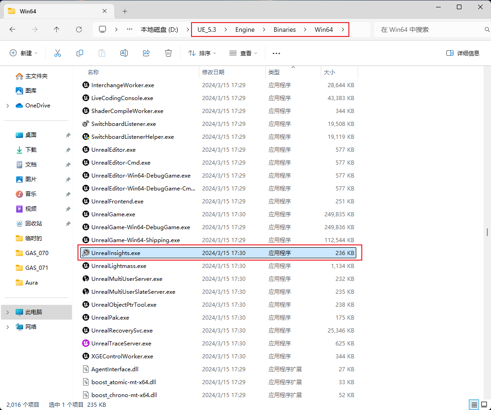
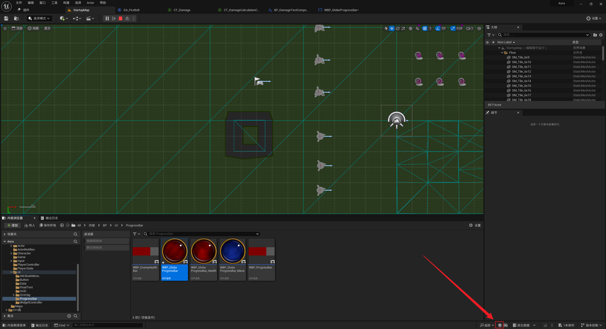
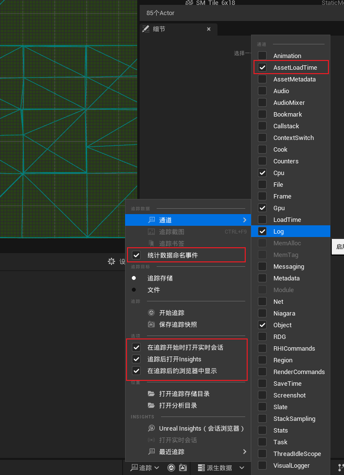
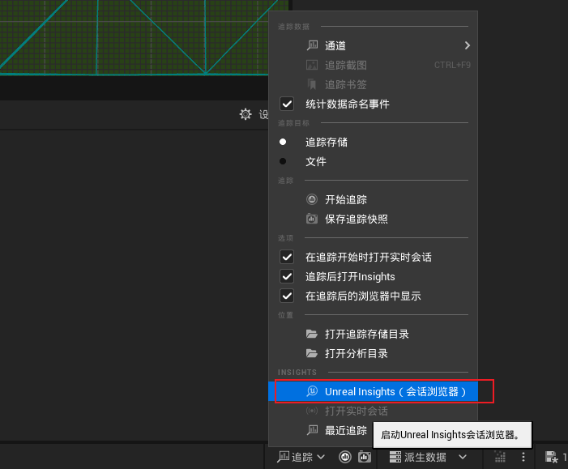
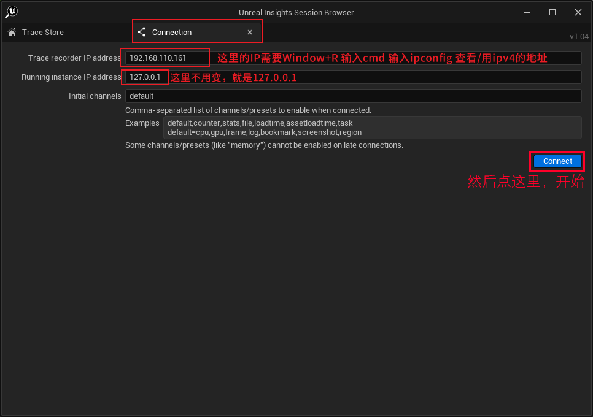
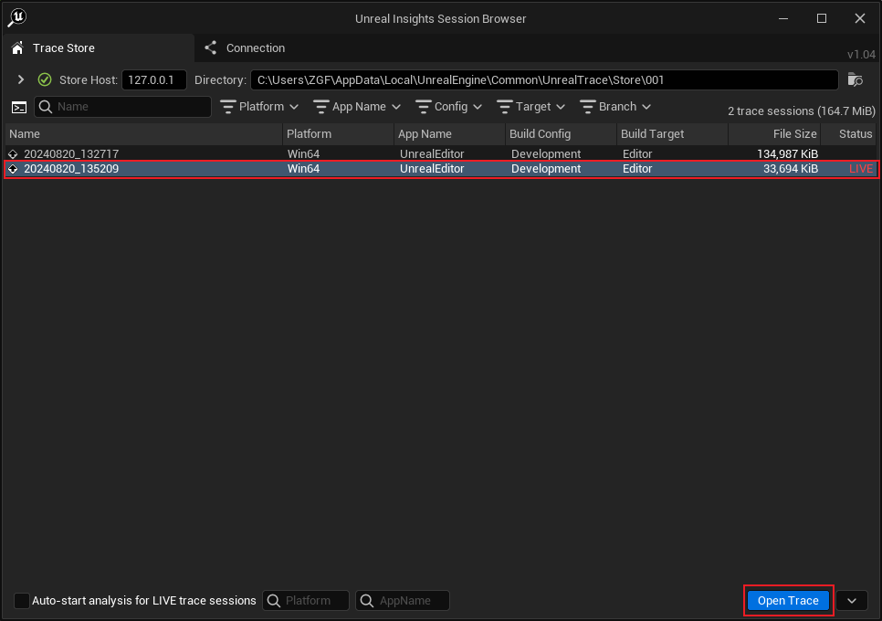
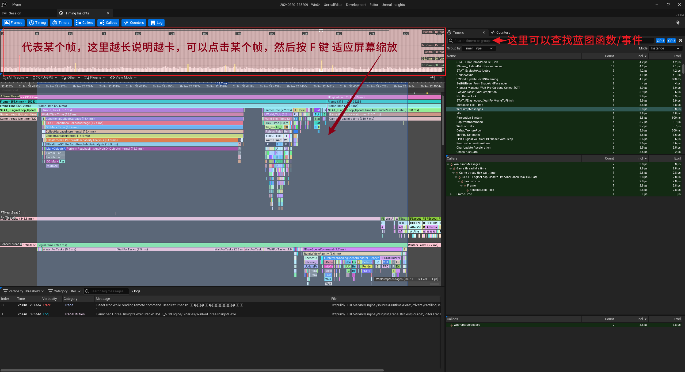

___________________________________________________________________________________________
###### [GoLibraryMainMenu](_LibraryMainMenu_.md)
___________________________________________________________________________________________
# UE性能分析工具 Unreal Insights

___________________________________________________________________________________________

## 目录

[TOC]

___________________________________________________________________________________________

## 介绍：

Unreal Insights介绍

>Unreal Insights 是 Unreal Engine 提供的一款功能强大的性能分析工具，专门用于分析、调试和优化 Unreal Engine 4 和 Unreal Engine 5 项目中的各种性能问题。它为开发者提供了详细的性能数据，从而帮助他们识别和解决影响游戏体验的性能瓶颈。
>
>### 功能介绍
>
>1. **多线程分析**：
>   - Unreal Insights 能够记录和显示多线程执行的详细时间线，包括主线程（GameThread）、渲染线程（RenderThread）、RHI 线程（Render Hardware Interface），以及其他自定义线程的活动情况。它能帮助开发者分析每个线程的工作负载，找出性能瓶颈。
>2. **事件时间线**：
>   - 通过时间线视图，开发者可以查看整个应用程序在各个时间点上的活动，包括函数调用、任务执行、蓝图事件等。时间线可以按帧显示，并精确到微秒级别，便于深入分析特定的性能问题。
>3. **统计分析**：
>   - Unreal Insights 允许用户追踪和分析各种统计数据，包括 CPU 使用率、GPU 使用率、帧时间、内存消耗、网络流量等。这些统计数据可以帮助开发者监控游戏的整体性能，并找出可能需要优化的部分。
>4. **自定义事件和标记**：
>   - 开发者可以在代码中添加自定义事件和标记，通过 Unreal Insights 进行详细的性能跟踪。这有助于对特定功能或模块进行深入分析，例如加载时间、动画播放、物理计算等。
>5. **资源加载分析**：
>   - Unreal Insights 可以分析资源的加载情况，帮助开发者识别和优化资源加载时间。这对于减少加载时间和提高游戏启动速度尤其重要。
>6. **调用栈追踪**：
>   - 工具能够显示各个函数的调用栈信息，帮助开发者了解性能瓶颈是由哪些具体函数或模块导致的。通过展开调用栈，开发者可以看到每个函数的执行时间和调用次数。
>7. **内存使用分析**：
>   - Unreal Insights 提供详细的内存使用情况分析，帮助开发者理解内存分配模式和识别内存泄漏问题。
>8. **网络分析**：
>   - 对于网络游戏开发，Unreal Insights 还提供了网络流量分析功能，帮助开发者优化网络代码并降低带宽消耗。
>
>### 使用场景
>
>- **优化帧率**：开发者可以通过 Unreal Insights 分析帧时间，并识别出在一帧中耗时较长的任务，从而优化游戏的帧率表现。
>- **多线程调优**：了解各线程的工作负载和调度情况，帮助开发者更好地利用多核 CPU 资源，平衡各线程的负载。
>- **分析蓝图性能**：开发者可以通过工具追踪和分析蓝图事件的性能，识别和优化高消耗的蓝图节点。
>- **资源加载优化**：通过分析资源的加载时间和模式，开发者可以优化游戏的启动时间和关卡切换速度。
>
>### 总结
>
>Unreal Insights 是一款非常全面的性能分析工具，能够帮助 Unreal Engine 开发者深入了解游戏的运行情况，并识别出影响性能的瓶颈。通过它的多线程分析、事件时间线、统计数据追踪等功能，开发者可以精确定位问题所在，并采取针对性的优化措施，提高游戏的整体表现。

------

[UE性能分析找内鬼啦_链接](https://nvue.dev/article/25)

## 两种使用方法：

### 第一种：从路径找

在 `UE_5.3/Engine/Binaries/Win64/` 文件夹下找到

> ### `UnrealInsights.exe` 文件

### 第二种：从项目内打开

> 项目内打开

------

### 如果要查看蓝图函数(事件)

> ### 需要勾选 `AssetLoadTime` 和 `统计命名事件`
>
> 

------

### 快捷键

- `左键` 拖拽/点击
- `F` 键 自适应缩放，填充屏幕
- `右键` 函数可以跳转去代码或者 `高亮`