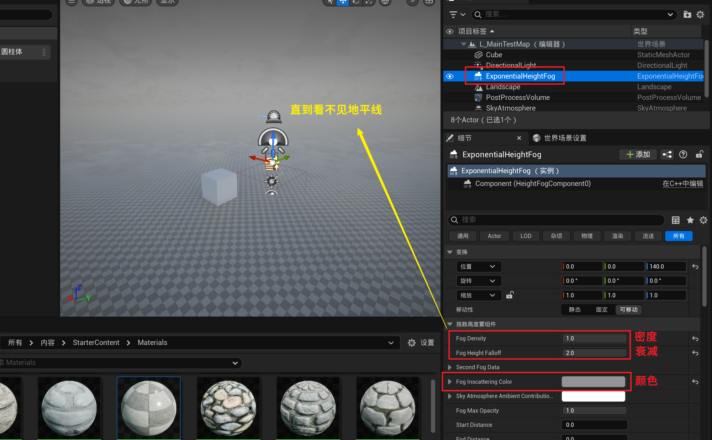

___________________________________________________________________________________________
###### [GoMenu](../UE_Effect_Menu.md)
___________________________________________________________________________________________
# 001_调整太阳角度、调亮场景的三种方法、调整体积雾、点光源设置

___________________________________________________________________________________________

## 目录

[TOC]

------

## UE4的项目和新建项目

> 1. 项目浏览：通过项目浏览器可以打开之前的工程文件夹。 
> 2. 新建项目：选择新建项目，默认设置为蓝图类空白项目。 
> 3. 项目设置：选择主机为PC电脑，包含初学者内容。
> 4. 项目路径：将项目文件保存在D盘或其他磁盘的专门文件夹中。 
> 5. 项目命名：使用拼音或英文，不要包含空格或特殊字符。
>
> 

------

## UE4的面板介绍（我用UE5.5）

> 1. 面板布局：包括模式、菜单栏、视图、列表、细节和资源。 
> 2. 模式：用于创建场景中的基础元素，如光灯和物体。 
> 3. 菜单栏：包含编辑和窗口显示等选项。
> 4. 视图：类似于Unity的Scene视图，用于查看和操作场景中的物体。 
> 5. 列表：显示场景中的物体列表，可以选择和查看物体的属性。 
> 6. 细节：显示选定物体的详细属性，如位置、旋转和缩放。 
> 7. 资源：用于管理和组织场景中的资源和文件夹。
>
> 

------

## 世界坐标和本地坐标

> 1. 世界坐标永远是Z轴向上，X轴和Y轴固定。 
> 2. 本地坐标根据对象自身调整。 
> 3. 通过快捷键切换坐标系。
>
> 

------

## 创建场景地形的基本操作

> 1. 创建场景的快捷键是Ctrl+N，点击后选择空白关卡。 
> 2. 选择不保存当前场景，因为我们使用的是虚幻自带的样板场景。 
> 3. 创建场景后，点击地形选项，选择材质并赋予给地形。 
> 4. 创建地形后，通过调整材质和灯光来完善场景。
>
> 

------

## 创建地面的详细步骤

> 1. 选择地形选项，点击创建地面。 
> 2. 调整地形的材质和分段数，确保地面看起来自然。
> 3. 退出地形编辑模式，查看地面效果。
>
> 

------

## 添加定向光源`DirectionalLight`

> 1. 选择光源选项，点击定向光源。 
> 2. 将定向光源拉到场景中，调整位置和亮度。 
> 3. 保存关卡，确保灯光效果生效。
>
> ### 位置需要高于地面
>
> 

------

## 创建指数级高级雾

> 1. 在视觉效果中创建指数级高级雾，用于添加雾气和云彩。 
> 2. 将指数级高级物放置在合适的位置，为其添加渐变和云彩效果。
>
> 

------

## 使用后处理盒子勾选无限边界

> 1. 无边界选项必须勾选，以使后期盒子影响整个世界的光晕范围。 
> 2. 曝光参数调整会影响整个世界的光感效果。
>
> 

------

## 重要！！！使用后处理盒子调整曝光补偿

### 比如爆炸炸亮场景时可以给这个K帧！！！！

> 

------

## 调整太阳角度黄昏和正午

> 

------

## 投射阴影

> 

------

## 调整高光

> 

------

## 后处理体积中限定最大最小曝光

> 两个值为一样时，不会**自动曝光**
>
> 两个一起调整，越大场景越暗，越小场景越亮
>
> 

------

## 调亮场景的三种方法

### 1. 调亮天光

> [上面讲过的这里](#调整太阳角度黄昏和正午)

### 2.后处理体积中调亮曝光补偿

> [上面讲过的这里](#比如爆炸炸亮场景时可以给这个K帧！！！！)

### 3.后处理体积中限定最大最小曝光

> [上面讲过的这里](#后处理体积中限定最大最小曝光)

------

## 调整体积雾

### 浓度

> ### 对比：
>
> 

### 衰减

> 

### 颜色

> 

------

## 隐藏标识性物品`G`

> 这个功能用于隐藏场景中的临时标识物，使场景更加清晰。

------

## 复制场景`Ctrl+W`

> 

------

## 更换地面材质

> 

------

## 点光源设置高光反射为漫反射

### 前后对比

> 

------
