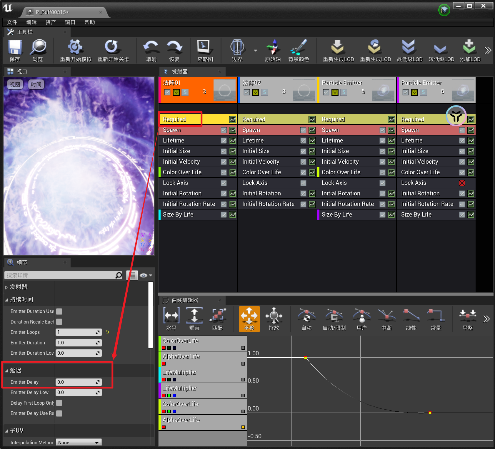
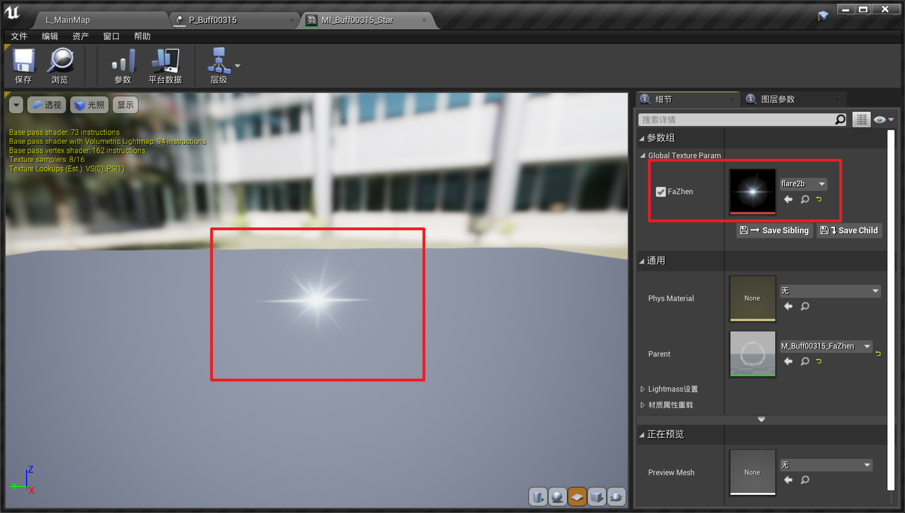
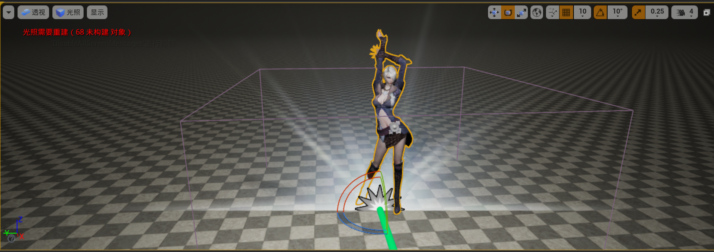
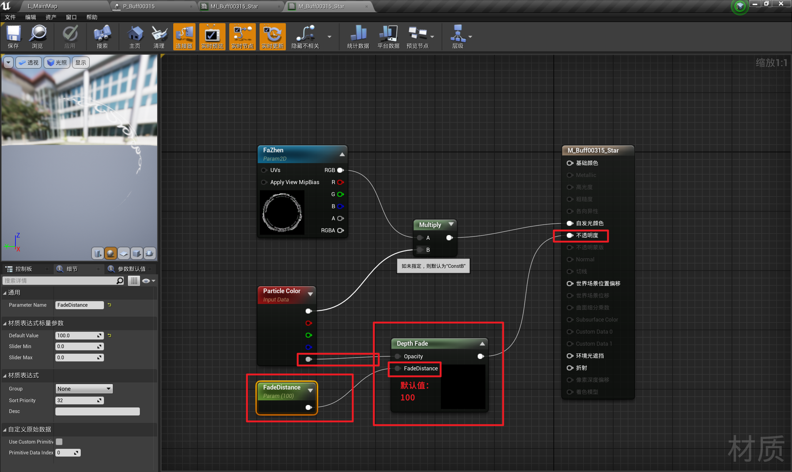
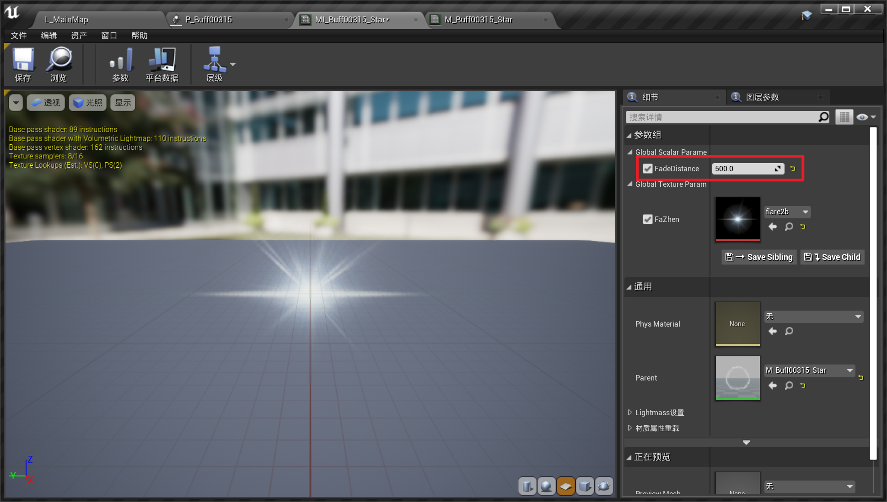
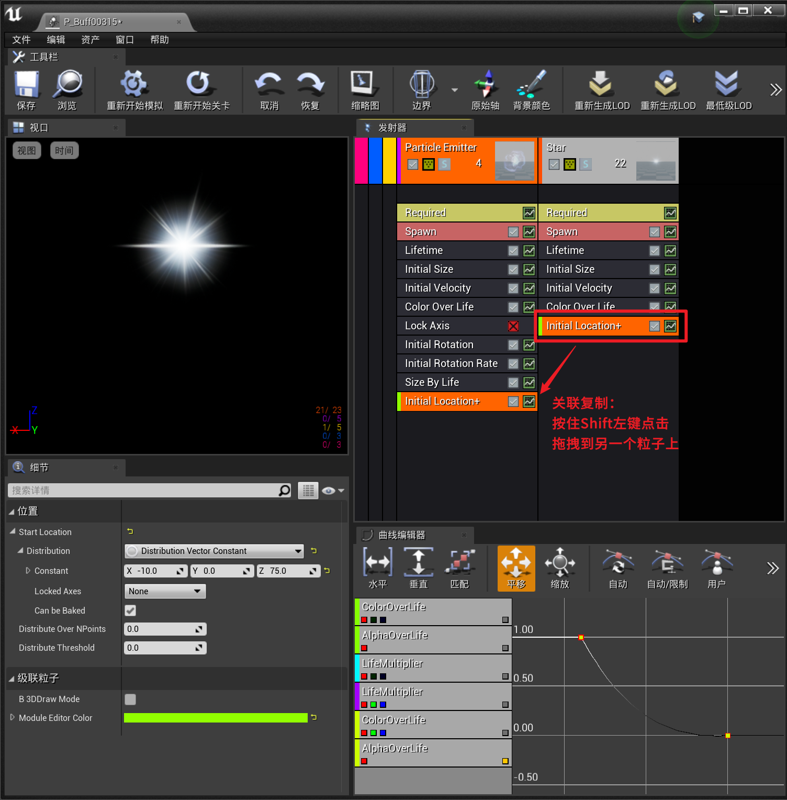

___________________________________________________________________________________________
###### [GoMenu](../UE_Effect_Menu.md)
___________________________________________________________________________________________
# 005_`Delay`、星星闪光材质和特效、关联复制

___________________________________________________________________________________________

## 目录

[TOC]

------

## 为粒子发射器添加`Delay`

> 使用Delay之后，[触发点](./UE_EffectBaseV003.md#使用`Trigger`触发)也要相应的进行调整
>
> 

------

## 制作星星闪光材质

> 使用和法阵一样的材质，可以创建父材质，然后参数化贴图，修改子类材质实例类的贴图

------

## 添加星星特效

> 1. 创建新粒子，使用星星材质
> 2. 设置大小

------

## 处理特效与地面之间的穿插

> 现在有穿插问题

### 需要使用新材质的**羽化**功能使用节点`DepthFade`（尽可能不要用，比较费开销）

> 

------

## 可以使用关联复制（修改一个两个同时生效）

> 
>
> 可以参考下下面的gif调整数值，不要抄参数！

------

## GIF最终效果

> _x264.gif)

------
