___________________________________________________________________________________________
###### [GoMenu](../UE_Effect_Menu.md)
___________________________________________________________________________________________
# 006_制作爆破粒子特效、为粒子添加`Light`、速度、阻力、重力

___________________________________________________________________________________________

## 目录

[TOC]

------

## 制作粒子特效

一共分为两种：

- 一种从空中爆破出来的粒子（带有速度），慢慢消失，有些受重力影响
- 一种从空中渐渐出现，渐渐变小消失，不受重力影响

------

### 设置速度的两种方法

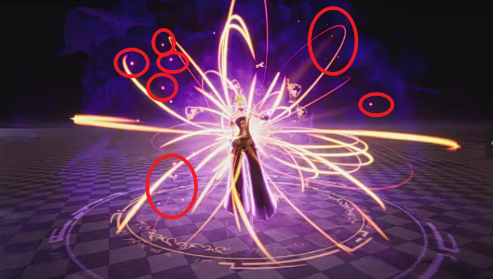

#### 1.使用初始速度`Initial Velocity`

> 调整初始化速度的XYZ
>
> `Distribution Vector Uniform` 区间随机
>
> 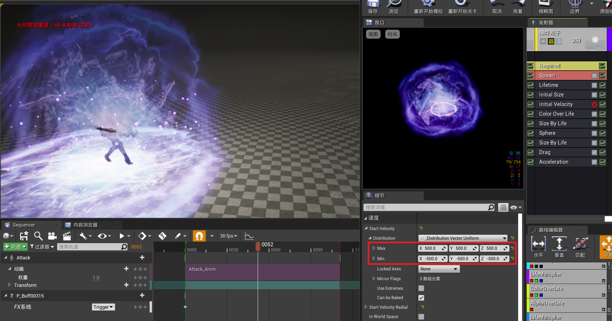
>
> | 方向 |  正  |  负  |
> | :--: | :--: | :--: |
> |  X   |  前  |  后  |
> |  Y   |  右  |  左  |
> |  Z   |  上  |  下  |

#### 2.使用球体速度

> 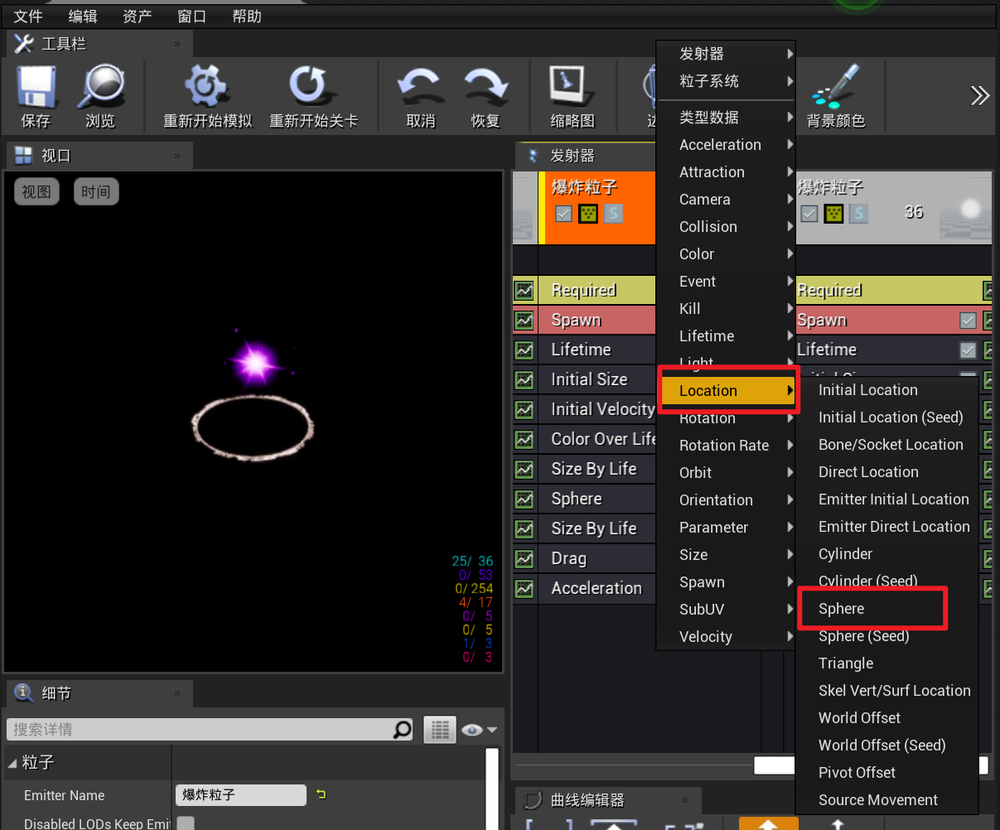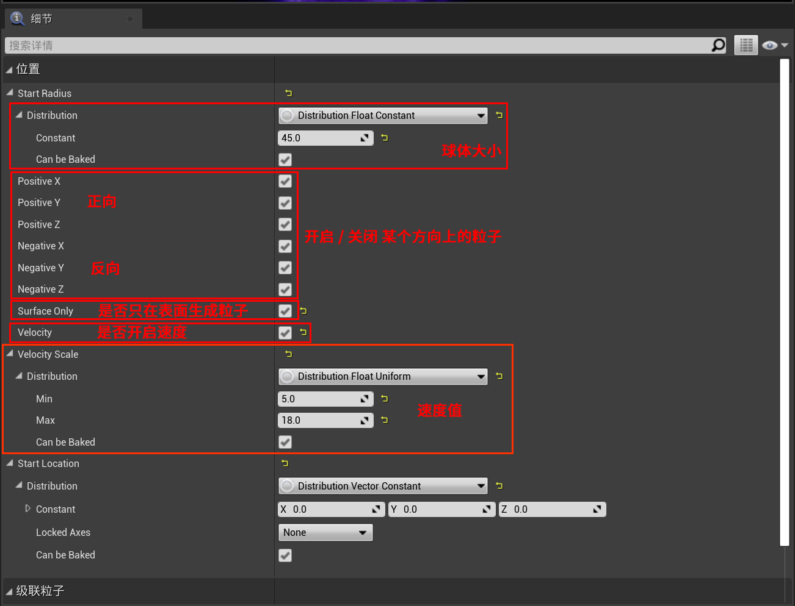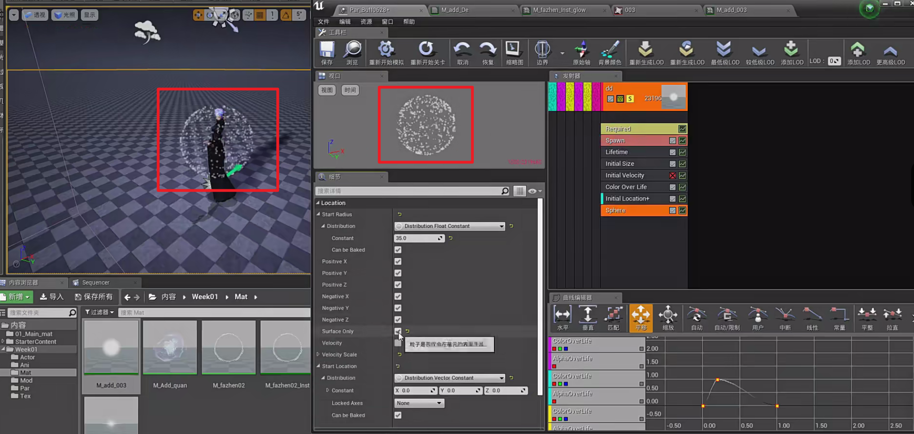

### 设置粒子参数

爆破的稍微给些速度，不爆破的可以速度再低些

> | 参数      |                                |                                                              |
> | --------- | ------------------------------ | ------------------------------------------------------------ |
> | 大小/尺寸 | 从小到大到小                   | 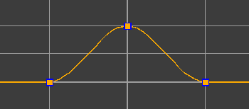 |
> | 生命周期  | 从0~1                          | 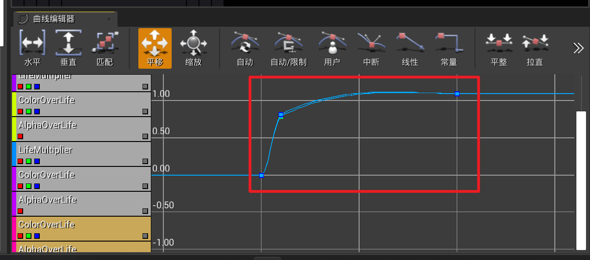 |
> | 颜色渐变  | 自己看着搞                     |                                                              |
> | 速度      | 禁用了初始速度，使用球体的速度 | 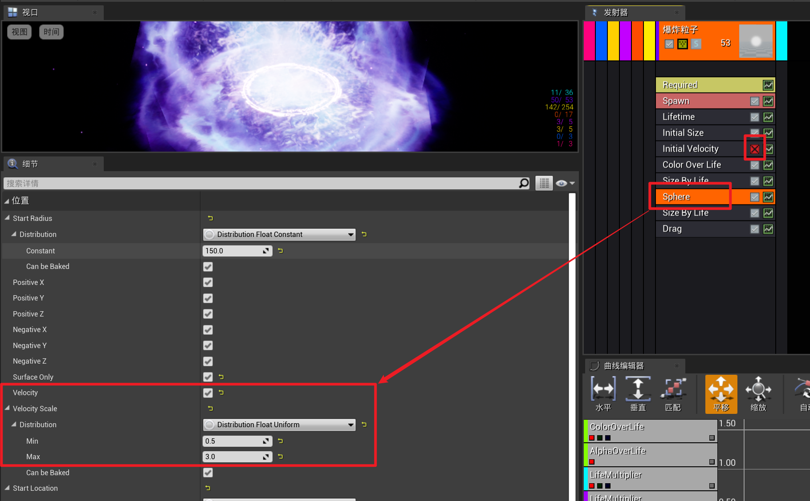 |
> | 类型      | 爆破                           | 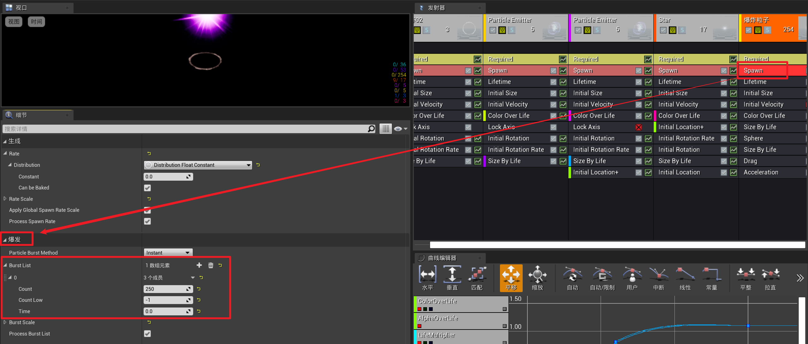 |

------

### 为粒子添加阻力

> 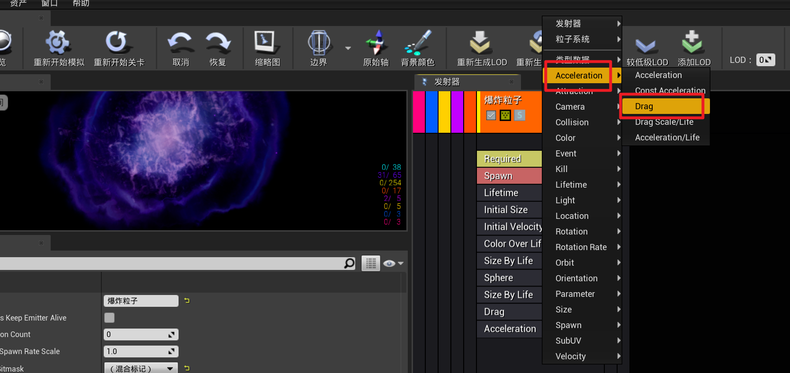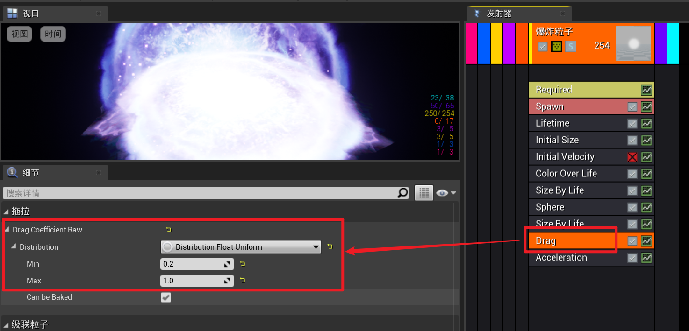

------

### 为粒子添加重力

> 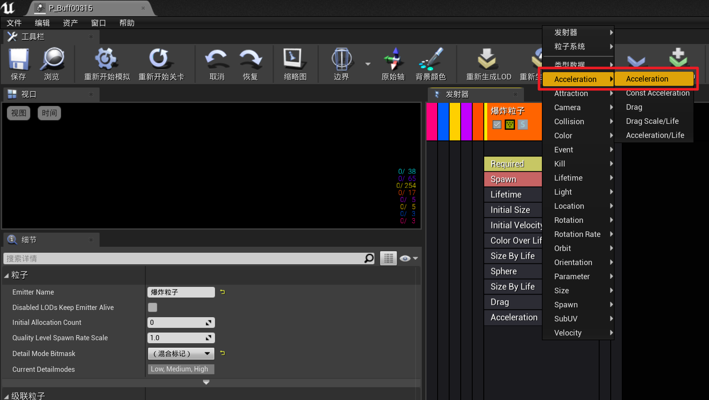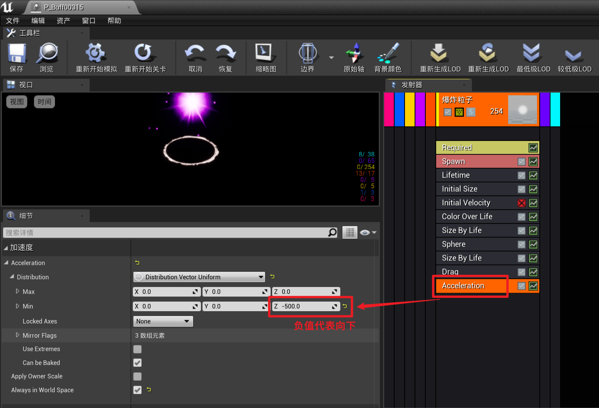

------

## 为粒子添加灯光照明`Light`（比较费开销，项目中少用！）

添加以后会有间接照明其他物体的效果

> 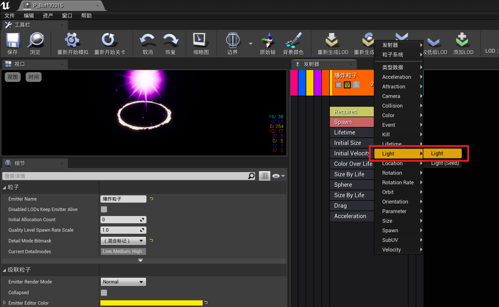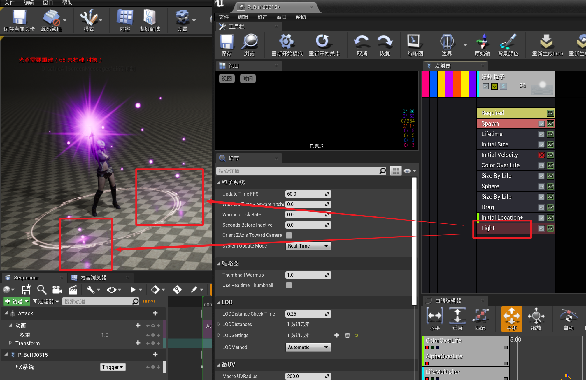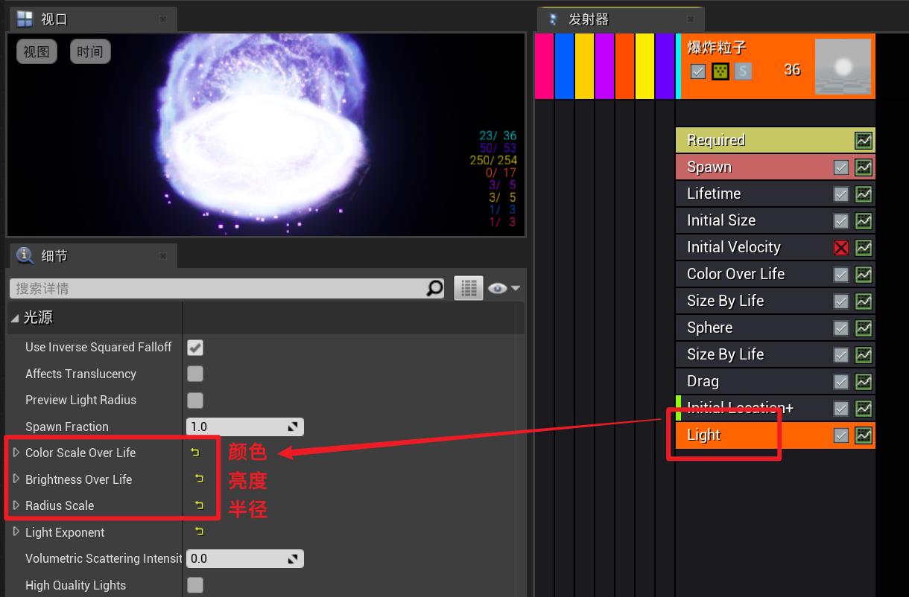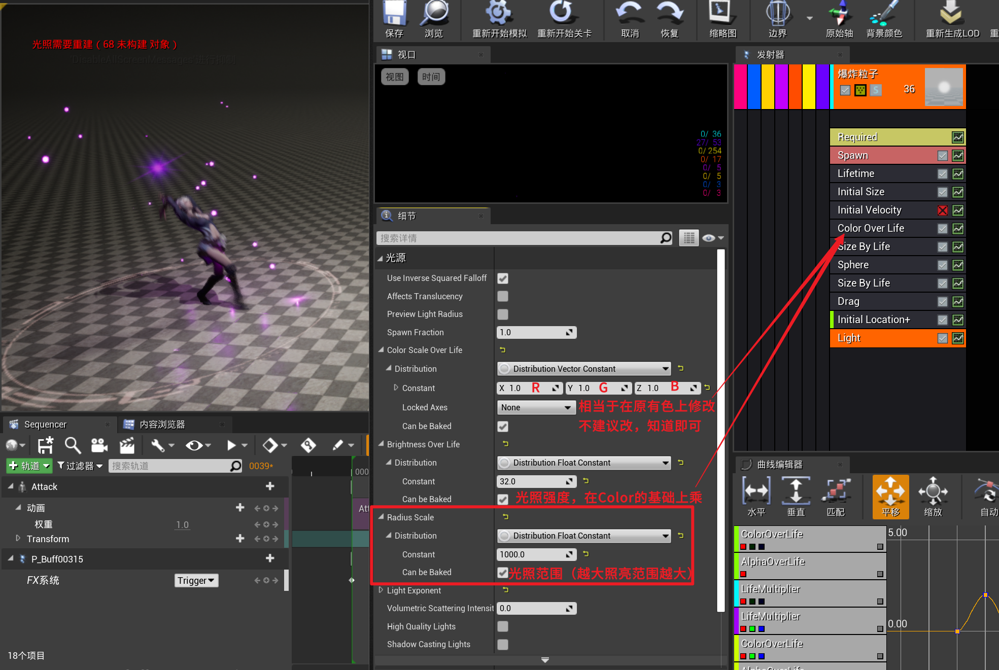

------
